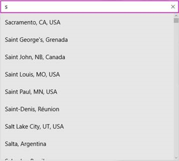
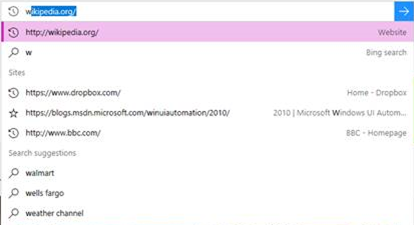

# Accessible text requirements  


This topic describes best practices for accessibility of text in an app, by assuring that colors and backgrounds satisfy the necessary contrast ratio. This topic also discusses the Microsoft UI Automation roles that text elements in a Universal Windows Platform (UWP) app can have, and best practices for text in graphics.

<span id="contrast_rations"></span>
<span id="CONTRAST_RATIONS"></span>

## Contrast ratios  
Although users always have the option to switch to a high-contrast mode, your app design for text should regard that option as a last resort. A much better practice is to make sure that your app text meets certain established guidelines for the level of contrast between text and its background. Evaluation of the level of contrast is based on deterministic techniques that do not consider color hue. For example, if you have red text on a green background, that text might not be readable to someone with a color blindness impairment. Checking and correcting the contrast ratio can prevent these types of accessibility issues.

The recommendations for text contrast documented here are based on a web accessibility standard, [G18: Ensuring that a contrast ratio of at least 4.5:1 exists between text (and images of text) and background behind the text](https://www.w3.org/TR/WCAG20-TECHS/G18.html). This guidance exists in the *W3C Techniques for WCAG 2.0* specification.

To be considered accessible, visible text must have a minimum luminosity contrast ratio of 4.5:1 against the background. Exceptions include logos and incidental text, such as text that is part of an inactive UI component.

Text that is decorative and conveys no information is excluded. For example, if random words are used to create a background, and the words can be rearranged or substituted without changing meaning, the words are considered to be decorative and do not need to meet this criterion.

Use color contrast tools to verify that the visible text contrast ratio is acceptable. See [Techniques for WCAG 2.0 G18 (Resources section)](https://www.w3.org/TR/WCAG20-TECHS/G18.html#G18-resources) for tools that can test contrast ratios.

> [!NOTE]
> Some of the tools listed by Techniques for WCAG 2.0 G18 can't be used interactively with a UWP app. You may need to enter foreground and background color values manually in the tool, or make screen captures of app UI and then run the contrast ratio tool over the screen capture image.

<span id="Text_element_roles"></span>
<span id="text_element_roles"></span>
<span id="TEXT_ELEMENT_ROLES"></span>

## Text element roles  
A UWP app can use these default elements (commonly called *text elements* or *textedit controls*):

* [**TextBlock**](/uwp/api/Windows.UI.Xaml.Controls.TextBlock): role is [**Text**](/uwp/api/Windows.UI.Xaml.Automation.Peers.AutomationControlType)
* [**TextBox**](/uwp/api/Windows.UI.Xaml.Controls.TextBox): role is [**Edit**](/uwp/api/Windows.UI.Xaml.Automation.Peers.AutomationControlType)
* [**RichTextBlock**](/uwp/api/Windows.UI.Xaml.Controls.RichTextBlock) (and overflow class [**RichTextBlockOverflow**](/uwp/api/windows.ui.xaml.controls.richtextblockoverflow)): role is [**Text**](/uwp/api/Windows.UI.Xaml.Automation.Peers.AutomationControlType)
* [**RichEditBox**](/uwp/api/Windows.UI.Xaml.Controls.RichEditBox): role is [**Edit**](/uwp/api/Windows.UI.Xaml.Automation.Peers.AutomationControlType)

When a control reports that is has a role of [**Edit**](/uwp/api/Windows.UI.Xaml.Automation.Peers.AutomationControlType), assistive technologies assume that there are ways for users to change the values. So if you put static text in a [**TextBox**](/uwp/api/Windows.UI.Xaml.Controls.TextBox), you are misreporting the role and thus misreporting the structure of your app to the accessibility user.

In the text models for XAML, there are two elements that are primarily used for static text, [**TextBlock**](/uwp/api/Windows.UI.Xaml.Controls.TextBlock) and [**RichTextBlock**](/uwp/api/Windows.UI.Xaml.Controls.RichTextBlock). Neither of these are a [**Control**](/uwp/api/Windows.UI.Xaml.Controls.Control) subclass, and as such neither of them are keyboard-focusable or can appear in the tab order. But that does not mean that assistive technologies can't or won't read them. Screen readers are typically designed to support multiple modes of reading the content in an app, including a dedicated reading mode or navigation patterns that go beyond focus and the tab order, like a "virtual cursor". So don't put your static text into focusable containers just so that tab order gets the user there. Assistive technology users expect that anything in the tab order is interactive, and if they encounter static text there, that is more confusing than helpful. You should test this out yourself with Narrator to get a sense of the user experience with your app when using a screen reader to examine your app's static text.

<span id="Auto-suggest_accessibility"></span>
<span id="auto-suggest_accessibility"></span>
<span id="AUTO-SUGGEST_ACCESSIBILITY"></span>

## Auto-suggest accessibility  
When a user types into an entry field and a list of potential suggestions appears, this type of scenario is called auto-suggest. This is common in the **To:** line of a mail field, the Cortana search box in Windows, the URL entry field in Microsoft Edge, the location entry field in the Weather app, and so on. If you are using a XAML [**AutosuggestBox**](/uwp/api/windows.ui.xaml.controls.autosuggestbox) or the HTML intrinsic controls, then this experience is already hooked up for you by default. To make this experience accessible the entry field and the list must be associated. This is explained in the [Implementing auto-suggest](#implementing_auto-suggest) section.

Narrator has been updated to make this type of experience accessible with a special suggestions mode. At a high level, when the edit field and list are connected properly the end user will:

* Know the list is present and when the list closes
* Know how many suggestions are available
* Know the selected item, if any
* Be able to move Narrator focus to the list
* Be able to navigate through a suggestion with all other reading modes

<br/>
_Example of a suggestion list_

<span id="Implementing_auto-suggest"></span>
<span id="implementing_auto-suggest"></span>
<span id="IMPLEMENTING_AUTO-SUGGEST"></span>

### Implementing auto-suggest  
To make this experience accessible the entry field and the list must be associated in the UIA tree. This association is done with the [UIA_ControllerForPropertyId](/windows/win32/winauto/uiauto-automation-element-propids) property in desktop apps or the [ControlledPeers](/uwp/api/windows.ui.xaml.automation.automationproperties.getcontrolledpeers) property in UWP apps.

At a high level there are 2 types of auto-suggest experiences.

**Default selection**  
If a default selection is made in the list, Narrator looks for a  [**UIA_SelectionItem_ElementSelectedEventId**](/windows/desktop/WinAuto/uiauto-event-ids) event in a desktop app, or the [**AutomationEvents.SelectionItemPatternOnElementSelected**](/uwp/api/windows.ui.xaml.automation.peers.automationevents) event to be fired in a UWP app. Every time the selection changes, when the user types another letter and the suggestions have been updated or when a user navigates through the list, the **ElementSelected** event should be fired.

<br/>
_Example where there is a default selection_

**No default selection**  
If there is no default selection, such as in the Weather app’s location box, then Narrator looks for the desktop [**UIA_LayoutInvalidatedEventId**](/windows/desktop/WinAuto/uiauto-event-ids) event or the UWP [**LayoutInvalidated**](/uwp/api/windows.ui.xaml.automation.peers.automationevents) event to be fired on the list every time the list is updated.

<br/>
_Example where there is no default selection_

### XAML implementation  
If you are using the default XAML [**AutosuggestBox**](/uwp/api/windows.ui.xaml.controls.autosuggestbox), then everything is already hooked up for you. If you are making your own auto-suggest experience using a [**TextBox**](/uwp/api/windows.ui.xaml.controls.textbox) and a list then you will need to set the list as [**AutomationProperties.ControlledPeers**](/uwp/api/windows.ui.xaml.automation.automationproperties.getcontrolledpeers) on the **TextBox**. You must fire the **AutomationPropertyChanged** event for the [**ControlledPeers**](/uwp/api/windows.ui.xaml.automation.automationproperties.getcontrolledpeers) property every time you add or remove this property and also fire your own [**SelectionItemPatternOnElementSelected**](/uwp/api/windows.ui.xaml.automation.peers.automationevents) events or [**LayoutInvalidated**](/uwp/api/windows.ui.xaml.automation.peers.automationevents) events depending on your type of scenario, which was explained previously in this article.

### HTML implementation  
If you are using the intrinsic controls in HTML, then the UIA implementation has already been mapped for you. Below is an example of an implementation that is already hooked up for you:

``` HTML
<label>Sites <input id="input1" type="text" list="datalist1" /></label>
<datalist id="datalist1">
        <option value="http://www.google.com/" label="Google"></option>
        <option value="http://www.reddit.com/" label="Reddit"></option>
</datalist>
```

 If you are creating your own controls, you must set up your own ARIA controls, which are explained in the W3C standards.

<span id="Text_in_graphics"></span>
<span id="text_in_graphics"></span>
<span id="TEXT_IN_GRAPHICS"></span>

## Text in graphics

Whenever possible, avoid including text in a graphic. For example, any text that you include in the image source file that is displayed in the app as an [**Image**](/uwp/api/Windows.UI.Xaml.Controls.Image) element is not automatically accessible or readable by assistive technologies. If you must use text in graphics, make sure that the [**AutomationProperties.Name**](/dotnet/api/system.windows.automation.automationproperties.name) value that you provide as the equivalent of "alt text" includes that text or a summary of the text's meaning. Similar considerations apply if you are creating text characters from vectors as part of a [**Path**](/uwp/api/Windows.UI.Xaml.Shapes.Path), or by using [**Glyphs**](/uwp/api/Windows.UI.Xaml.Documents.Glyphs).

<span id="Text_font_size"></span>
<span id="text_font_size"></span>
<span id="TEXT_FONT_SIZE"></span>

## Text font size and scale

Users can have difficulty reading text in an app when the fonts uses are simply too small, so make sure any text in your application is a reasonable size in the first place.

Once you've done the obvious, Windows includes various accessibility tools and settings that users can take advantage of and adjust to their own needs and preferences for reading text. These include:

* The Magnifier tool, which enlarges a selected area of the UI. You should ensure the layout of text in your app doesn't make it difficult to use Magnifier for reading.
* Global scale and resolution settings in **Settings->System->Display->Scale and layout**. Exactly which sizing options are available can vary as this depends on the capabilities of the display device.
* Text size settings in **Settings->Ease of access->Display**. Adjust the **Make text bigger** setting to specify only the size of text in supporting controls across all applications and screens (all UWP text controls support the text scaling experience without any customization or templating). 
> [!NOTE]
> The **Make everything bigger** setting lets a user specify their preferred size for text and apps in general on their primary screen only.

Various text elements and controls have an [**IsTextScaleFactorEnabled**](/uwp/api/windows.ui.xaml.controls.textblock.istextscalefactorenabled) property. This property has the value **true** by default. When **true**, the size of text in that element can be scaled. The scaling affects text that has a small **FontSize** to a greater degree than it affects text that has a large **FontSize**. You can disable automatic resizing by setting an element's **IsTextScaleFactorEnabled** property to **false**. 

See [Text scaling](../input/text-scaling.md) for more details.

Add the following markup to an app and run it. Adjust the **Text size** setting, and see what happens to each **TextBlock**.

XAML
```xml
<TextBlock Text="In this case, IsTextScaleFactorEnabled has been left set to its default value of true."
    Style="{StaticResource BodyTextBlockStyle}"/>

<TextBlock Text="In this case, IsTextScaleFactorEnabled has been set to false."
    Style="{StaticResource BodyTextBlockStyle}" IsTextScaleFactorEnabled="False"/>
```  

We don't recommend that you disable text scaling as scaling UI text universally across all apps is an important accessibility experience for users.

You can also use the [**TextScaleFactorChanged**](/uwp/api/windows.ui.viewmanagement.uisettings.textscalefactorchanged) event and the [**TextScaleFactor**](/uwp/api/windows.ui.viewmanagement.uisettings.textscalefactor) property to find out about changes to the **Text size** setting on the phone. Here’s how:

C#
```csharp
{
    ...
    var uiSettings = new Windows.UI.ViewManagement.UISettings();
    uiSettings.TextScaleFactorChanged += UISettings_TextScaleFactorChanged;
    ...
}

private async void UISettings_TextScaleFactorChanged(Windows.UI.ViewManagement.UISettings sender, object args)
{
    var messageDialog = new Windows.UI.Popups.MessageDialog(string.Format("It's now {0}", sender.TextScaleFactor), "The text scale factor has changed");
    await messageDialog.ShowAsync();
}
```

The value of **TextScaleFactor** is a double in the range \[1,2.25\]. The smallest text is scaled up by this amount. You might be able to use the value to, say, scale graphics to match the text. But remember that not all text is scaled by the same factor. Generally speaking, the larger text is to begin with, the less it’s affected by scaling.

These types have an **IsTextScaleFactorEnabled** property:  
* [**ContentPresenter**](/uwp/api/Windows.UI.Xaml.Controls.ContentPresenter)
* [**Control**](/uwp/api/Windows.UI.Xaml.Controls.Control) and derived classes
* [**FontIcon**](/uwp/api/Windows.UI.Xaml.Controls.FontIcon)
* [**RichTextBlock**](/uwp/api/Windows.UI.Xaml.Controls.RichTextBlock)
* [**TextBlock**](/uwp/api/Windows.UI.Xaml.Controls.TextBlock)
* [**TextElement**](/uwp/api/Windows.UI.Xaml.Documents.TextElement) and derived classes

<span id="related_topics"></span>

## Related topics  

* [Text scaling](../input/text-scaling.md)
* [Accessibility](accessibility.md)
* [Basic accessibility information](basic-accessibility-information.md)
* [XAML text display sample](https://github.com/microsoftarchive/msdn-code-gallery-microsoft/tree/411c271e537727d737a53fa2cbe99eaecac00cc0/Official%20Windows%20Platform%20Sample/Windows%208%20app%20samples/%5BC%23%5D-Windows%208%20app%20samples/C%23/Windows%208%20app%20samples/XAML%20text%20display%20sample%20(Windows%208))
* [XAML text editing sample](https://github.com/microsoftarchive/msdn-code-gallery-microsoft/tree/411c271e537727d737a53fa2cbe99eaecac00cc0/Official%20Windows%20Platform%20Sample/Windows%208%20app%20samples/%5BC%23%5D-Windows%208%20app%20samples/C%23/Windows%208%20app%20samples/XAML%20text%20editing%20sample%20(Windows%208))
* [XAML accessibility sample](https://github.com/microsoftarchive/msdn-code-gallery-microsoft/tree/411c271e537727d737a53fa2cbe99eaecac00cc0/Official%20Windows%20Platform%20Sample/XAML%20accessibility%20sample)
