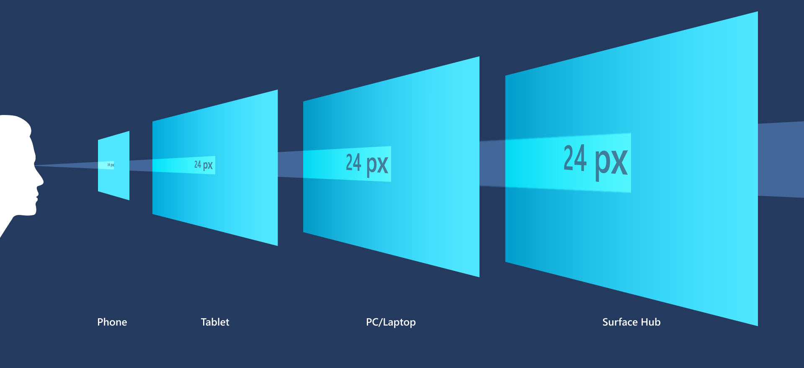
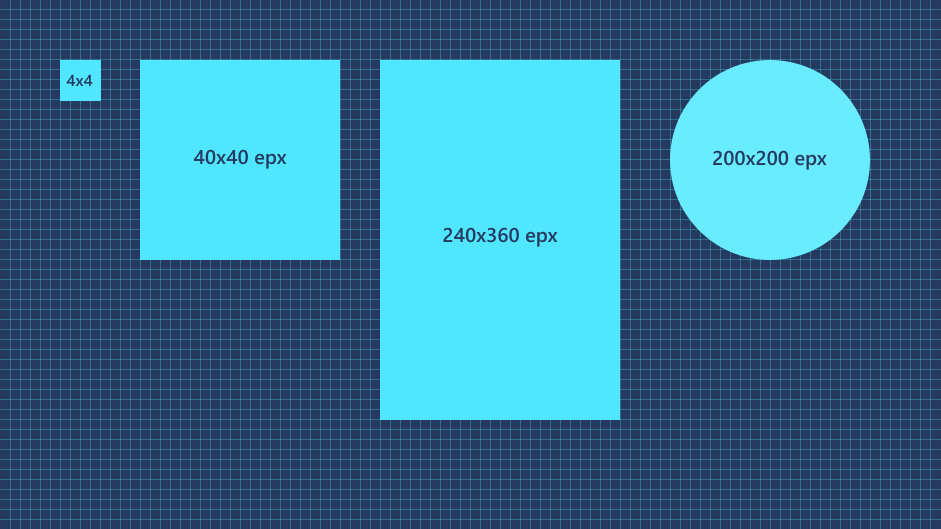
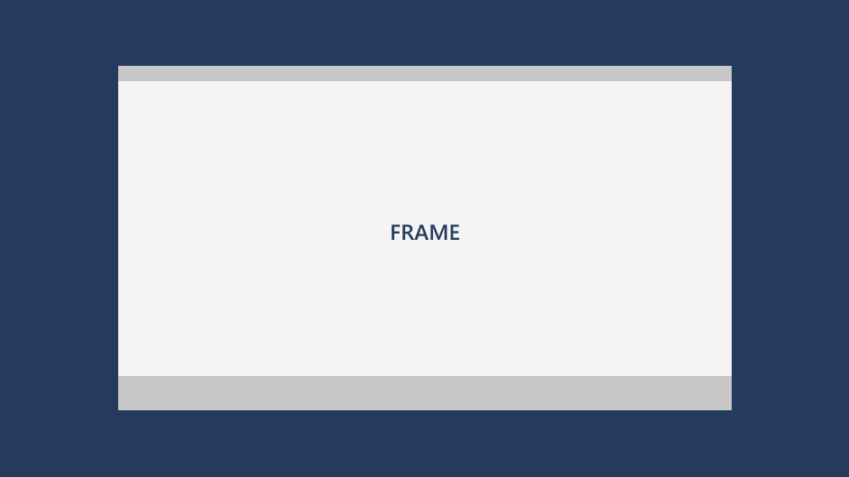
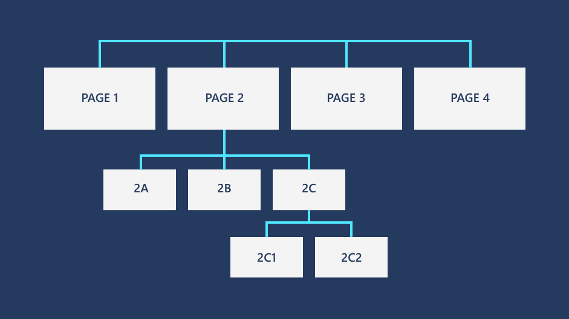
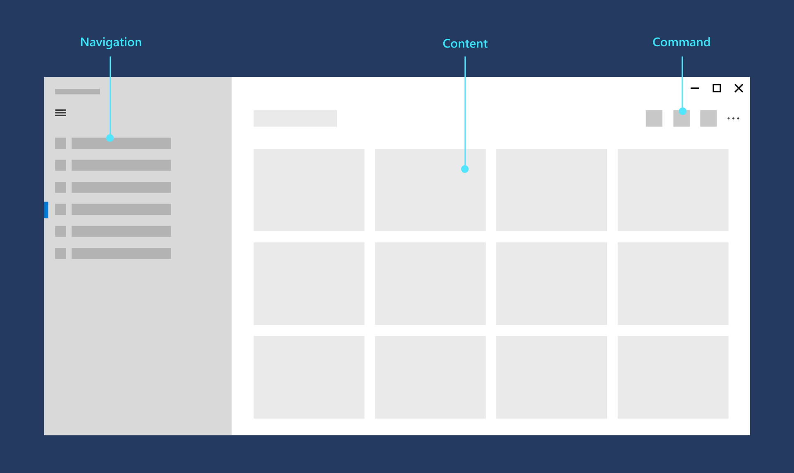
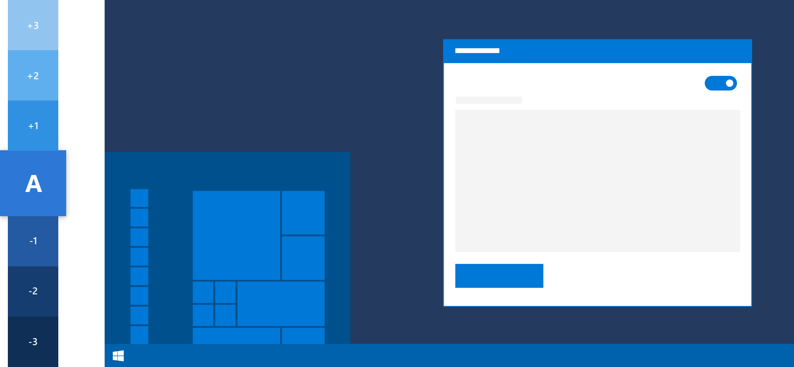
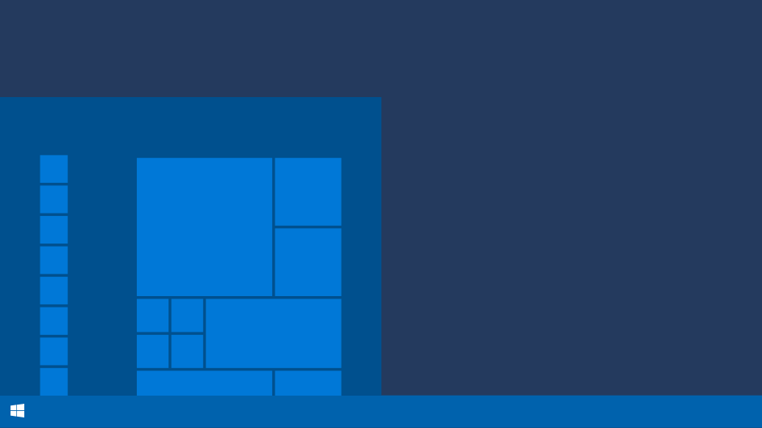
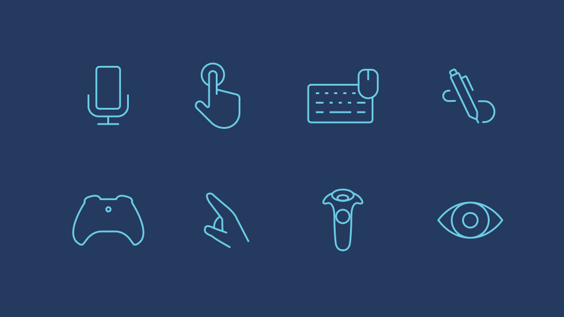

# Introduction to Windows app design

The Windows app design guidance is a resource to help you design and build beautiful, polished apps.

It's not a list of prescriptive rules - it's a living document, designed to adapt to our evolving [Fluent Design System](/windows/apps/fluent-design-system) as well as the needs of our app-building community.

This introduction provides an overview of the universal design features that are included in every UWP app, helping you build user interfaces (UI) that scale beautifully across a range of devices.

## Effective pixels and scaling

UWP apps run on all [Windows 10 devices](../devices/index.md), from your TV to your tablet or PC. So how do you design a UI that looks good on a wide variety of devices and screen sizes?

UWP helps by automatically adjusting UI elements so that they're legible and easy to interact with on all devices and screen sizes.

When your app runs on a device, the system uses an algorithm to normalize the way UI elements display on the screen. This scaling algorithm takes into account viewing distance and screen density (pixels per inch) to optimize for perceived size (rather than physical size). The scaling algorithm ensures that a 24 px font on Surface Hub 10 feet away is just as legible to the user as a 24 px font on 5" phone that's a few inches away.

Because of how the scaling system works, when you design your UWP app, you're designing in effective pixels, not actual physical pixels. Effective pixels (epx) are a virtual unit of measurement, and they're used to express layout dimensions and spacing, independent of screen density. (In our guidelines, epx, ep, and px are used interchangeably.)

You can ignore the pixel density and the actual screen resolution when designing. Instead, design for the effective resolution (the resolution in effective pixels) for a size class (for details, see the [Screen sizes and breakpoints article](../layout/screen-sizes-and-breakpoints-for-responsive-design.md)).

> [!TIP]
> When creating screen mockups in image editing programs, set the DPI to 72 and set the image dimensions to the effective resolution for the size class you're targeting. For a list of size classes and effective resolutions, see the [Screen sizes and breakpoints article](../layout/screen-sizes-and-breakpoints-for-responsive-design.md).

### Multiples of four

:::row:::
    :::column span:::
The sizes, margins, and positions of UI elements should always be in **multiples of 4 epx** in your UWP apps.

UWP scales across a range of devices with scaling plateaus of 100%, 125%, 150%, 175%, 200%, 225%, 250%, 300%, 350%, and 400%. The base unit is 4 because it can be scaled to these plateaus as a whole number (for example; 4 x 125% = 5, 4 x 150% = 6). Using multiples of four aligns all UI elements with whole pixels and ensures UI elements have crisp, sharp edges. (Note that text doesn't have this requirement; text can have any size and position.)
    :::column-end:::
    :::column:::

    :::column-end:::
:::row-end:::

## Layout

Since UWP apps automatically scale to all devices, designing a UWP app for any device follows the same structure. Let's start from the very beginning of your UWP app's UI.

### Windows, Frames, and Pages

:::row:::
    :::column:::
When a UWP app is launched on any Windows 10 device, it launches in a [Window](/uwp/api/windows.ui.xaml.window) with a [Frame](/uwp/api/windows.ui.xaml.controls.frame), which can navigate between [Page](/uwp/api/windows.ui.xaml.controls.page) instances.
    :::column-end:::
    :::column:::

    :::column-end:::
:::row-end:::

:::row:::
    :::column:::
You can think of your app's UI as a collection of pages. It's up to you to decide what should go on each page, and the relationships between pages.

To learn how you can organize your pages, see [Navigation basics](navigation-basics.md).
    :::column-end:::
    :::column:::

    :::column-end:::
:::row-end:::

### Page layout

What should those pages look like? Well, most pages follow a common structure to provide consistency, so users can easily navigate between and within pages of your app. Pages typically contain three types of UI elements:

- [Navigation](navigation-basics.md) elements help users choose the content they want to display.
- [Command](commanding-basics.md) elements initiate actions, such as manipulating, saving, or sharing content.
- [Content](content-basics.md) elements display the app's content.

To learn more about how to implement common UWP app patterns, see the [Page layout](../layout/page-layout.md) article.

You can also use the [Windows Template Studio](https://github.com/Microsoft/WindowsTemplateStudio) in Visual Studio to get started with a layout for your app.

## Controls

UWP's design platform provides a set of common controls that are guaranteed to work well on all Windows-powered devices, and they adhere to our [Fluent Design System](/windows/apps/fluent-design-system) principles. These controls include everything from simple controls, like buttons and text elements, to sophisticated controls that can generate lists from a set of data and a template.

For a complete list of UWP controls and the patterns you can make from them, see the [controls and patterns section](../controls-and-patterns/index.md).

## Style

Common controls automatically reflect the system theme and accent color, work with all input types, and scale to all devices. In that way, they reflect the Fluent Design System - they're adaptive, empathetic, and beautiful. Common controls use light, motion, and depth in their default styles, so by using them, you're incorporating our Fluent Design System in your app.

Common controls are highly customizable, too--you can change the foreground color of a control or completely customize it's appearance. To override the default styles in controls, use [lightweight styling](../style/xaml-styles.md#lightweight-styling) or create [custom controls](../style/xaml-control-templates.md) in XAML.

## Shell

:::row:::
    :::column:::
Your UWP app will interact with the broader Windows experience with tiles and notifications in the Windows [Shell](../shell/tiles-and-notifications/creating-tiles.md).

Tiles are displayed in the Start menu and when your app launches, and they provide a glimpse of what's going on in your app. Their power comes from the content behind them, and the intelligence and craft with which they're offered up.

UWP apps have four tile sizes (small, medium, wide, and large) that can be customized with the app's icon and identity. For guidance on designing tiles for your UWP app, see [Guidelines for tile and icon assets](../style/app-icons-and-logos.md).
    :::column-end:::
    :::column:::

    :::column-end:::
:::row-end:::

## Inputs

:::row:::
    :::column:::
UWP apps rely on smart interactions. You can design around a click interaction without having to know or define whether the click comes from a mouse, a stylus, or a tap of a finger. However, you can also design your apps for [specific input modes](../input/input-primer.md).
    :::column-end:::
    :::column:::

    :::column-end:::
:::row-end:::

## Devices

Similarly, while UWP automatically scales your app to different devices, you can also [optimize your UWP app for specific devices](../devices/index.md).

## Usability

:::image type="content" source="https://img-prod-cms-rt-microsoft-com.akamaized.net/cms/api/am/imageFileData/REYaAb" alt-text="A short video of stick figure cartoons depicting people of differing abilities.":::

Last but not least, usability is about making your app's experience open to all users. Everyone can benefit from truly inclusive user experiences - see [usability for UWP apps](../usability/index.md) to see how to make your app easy to use for everyone.

If you're designing for international audiences, you might want to check out [Globalization and localization](../globalizing/globalizing-portal.md).

You might also want to consider [accessibility features](../accessibility/accessibility-overview.md) for users with limited sight, hearing, and mobility. If accessibility is built into your design from the start, then [making your app accessible](../accessibility/accessibility-in-the-store.md) should take very little extra time and effort.

## Tools and design toolkits

Now that you know about the basic design features, how about getting started with designing your UWP app?

We provide a variety of tools to help your design process:

- See our [Design toolkits page](../downloads/index.md) for XD, Illustrator, Photoshop, Framer, and Sketch toolkits, as well as additional design tools and font downloads.

- To get your machine set up to write code for UWP apps, see our [Get started &gt; Get set up](/windows/apps/get-started/get-set-up) article.

- For inspiration on how to implement UI for UWP, take a look at our end-to-end [sample UWP apps](https://developer.microsoft.com/windows/samples).

## Video summary

> [!VIDEO https://channel9.msdn.com/Blogs/One-Dev-Minute/Designing-Universal-Windows-Platform-apps/player]

## Next: Fluent Design System

If you'd like to learn about the principles behind Fluent Design (Microsoft's design system) and see more features you can incorporate into your UWP app, continue on to [Fluent Design System](/windows/apps/fluent-design-system).

## Related articles

- [What's a UWP app?](/windows/uwp/get-started/universal-application-platform-guide)
- [Fluent Design System](/windows/apps/design)
- [XAML platform overview](/windows/uwp/xaml-platform/index)
