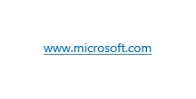
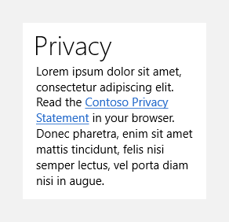
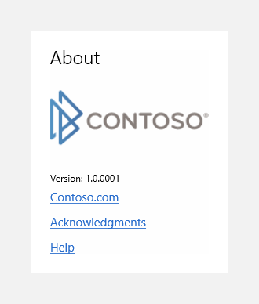

# Hyperlinks

Hyperlinks navigate the user to another part of the app, to another app, or launch a specific uniform resource identifier (URI) using a separate browser app. There are two ways that you can add a hyperlink to a XAML app: the **Hyperlink** text element and **HyperlinkButton** control.



## Is this the right control?

Use a hyperlink when you need text that responds when pressed and navigates the user to more information about the text that was pressed.

Choose the right type of hyperlink based on your needs:

- Use an inline **Hyperlink** text element inside of a text control. A Hyperlink element flows with other text elements and you can use it in any InlineCollection. Use a text hyperlink if you want automatic text wrapping and don't necessarily need a large hit target. Hyperlink text can be small and difficult to target, especially for touch.
- Use a **HyperlinkButton** for stand-alone hyperlinks. A HyperlinkButton is a specialized Button control that you can use anywhere that you would use a Button.
- Use a **HyperlinkButton** with an [Image](/windows/winui/api/microsoft.ui.xaml.controls.image) as its content to make a clickable image.

## Recommendations

- Only use hyperlinks for navigation; don't use them for other actions.
- Use the Body style from the type ramp for text-based hyperlinks. Read about [fonts and the Windows type ramp](../style/typography.md).
- Keep discrete hyperlinks far enough apart so that the user can differentiate between them and has an easy time selecting each one.
- Add tooltips to hyperlinks that indicate to where the user will be directed. If the user will be directed to an external site, include the top-level domain name inside the tooltip, and style the text with a secondary font color.

## UWP and WinUI 2

[!INCLUDE [uwp-winui2-note](../../../includes/uwp-winui-2-note.md)]

APIs for this control exist in the [Windows.UI.Xaml.Controls](/uwp/api/Windows.UI.Xaml.Controls) namespace.

> [!div class="checklist"]
>
> - **UWP APIs:** [Hyperlink text element](/uwp/api/Windows.UI.Xaml.Documents.Hyperlink), [HyperlinkButton control](/uwp/api/Windows.UI.Xaml.Controls.HyperlinkButton)
> - [Open the WinUI 2 Gallery app and see Hyperlinks in action](winui2gallery:/item/HyperlinkButton). [!INCLUDE [winui-2-gallery](../../../includes/winui-2-gallery.md)]

## Create a Hyperlink text element

> [!div class="checklist"]
>
> - **Important APIs**: [Hyperlink text element](/windows/winui/api/microsoft.UI.Xaml.Documents.Hyperlink)

This example shows how to use a Hyperlink text element inside of a [TextBlock](/windows/winui/api/microsoft.ui.xaml.controls.textblock).

```xaml
<StackPanel Width="200">
    <TextBlock Text="Privacy" Style="{StaticResource SubheaderTextBlockStyle}"/>
    <TextBlock TextWrapping="WrapWholeWords">
        <Span xml:space="preserve"><Run>Lorem ipsum dolor sit amet, consectetur adipiscing elit. Read the </Run><Hyperlink NavigateUri="http://www.contoso.com">Contoso Privacy Statement</Hyperlink><Run> in your browser.</Run> Donec pharetra, enim sit amet mattis tincidunt, felis nisi semper lectus, vel porta diam nisi in augue.</Span>
    </TextBlock>
</StackPanel>
```

The hyperlink appears inline and flows with the surrounding text:



> [!TIP]
> When you use a Hyperlink in a text control with other text elements in XAML, place the content in a [Span](/windows/winui/api/microsoft.ui.xaml.documents.span) container and apply the `xml:space="preserve"` attribute to the Span to keep the white space between the Hyperlink and other elements.

## Create a HyperlinkButton

> [!div class="checklist"]
>
> - **Important APIs**: [HyperlinkButton control](/windows/winui/api/microsoft.UI.Xaml.Controls.HyperlinkButton)

> [!div class="nextstepaction"]
> [Open the WinUI 3 Gallery app and see the Hyperlinks in action](winui3gallery:/item/HyperlinkButton).

[!INCLUDE [winui-3-gallery](../../../includes/winui-3-gallery.md)]

Here's how to use a HyperlinkButton, both with text and with an image.

```xaml
<StackPanel>
    <TextBlock Text="About" Style="{StaticResource TitleTextBlockStyle}"/>
    <HyperlinkButton NavigateUri="http://www.contoso.com">
        <Image Source="Assets/ContosoLogo.png"/>
    </HyperlinkButton>
    <TextBlock Text="Version: 1.0.0001" Style="{StaticResource CaptionTextBlockStyle}"/>
    <HyperlinkButton Content="Contoso.com" NavigateUri="http://www.contoso.com"/>
    <HyperlinkButton Content="Acknowledgments" NavigateUri="http://www.contoso.com"/>
    <HyperlinkButton Content="Help" NavigateUri="http://www.contoso.com"/>
</StackPanel>

```

The hyperlink buttons with text content appear as marked-up text. The Contoso logo image is also a clickable hyperlink:



This example shows how to create a HyperlinkButton in code.

```csharp
HyperlinkButton helpLinkButton = new HyperlinkButton();
helpLinkButton.Content = "Help";
helpLinkButton.NavigateUri = new Uri("http://www.contoso.com");
```

## Handle navigation

For both kinds of hyperlinks, you handle navigation the same way; you can set the **NavigateUri** property, or handle the **Click** event.

### Navigate to a URI

To use the hyperlink to navigate to a URI, set the NavigateUri property. When a user clicks or taps the hyperlink, the specified URI opens in the default browser. The default browser runs in a separate process from your app.

> [!NOTE]
> A URI is represented by the [Windows.Foundation.Uri](/uwp/api/windows.foundation.uri) class. When programming with .NET, this class is hidden and you should use the [System.Uri](/dotnet/api/system.uri) class. For more info, see the reference pages for these classes.

You don't have to use **http:** or **https:** schemes. You can use schemes such as **ms-appx:**, **ms-appdata:**, or **ms-resources:**, if there's resource content at these locations that's appropriate to load in a browser. However, the **file:** scheme is specifically blocked. For more info, see [URI schemes](/windows/uwp/app-resources/uri-schemes).

When a user clicks the hyperlink, the value of the NavigateUri property is passed to a system handler for URI types and schemes. The system then launches the app that is registered for the scheme of the URI provided for NavigateUri.

If you don't want the hyperlink to load content in a default Web browser (and don't want a browser to appear), then don't set a value for NavigateUri. Instead, handle the Click event, and write code that does what you want.

## Handle the Click event

Use the Click event for actions other than launching a URI in a browser, such as navigation within the app. For example, if you want to load a new app page rather than opening a browser, call a [Frame.Navigate](/windows/winui/api/microsoft.ui.xaml.controls.frame.navigate) method within your Click event handler to navigate to the new app page. If you want an external, absolute URI to load within a [WebView](/windows/winui/api/microsoft.ui.xaml.controls.webview2) control that also exists in your app, call [WebView.Navigate](/windows/winui/api/microsoft.ui.xaml.controls.webview2.navigate) as part of your Click handler logic.

You don't typically handle the Click event as well as specifying a NavigateUri value, as these represent two different ways of using the hyperlink element. If your intent is to open the URI in the default browser, and you have specified a value for NavigateUri, don't handle the Click event. Conversely, if you handle the Click event, don't specify a NavigateUri.

There's nothing you can do within the Click event handler to prevent the default browser from loading any valid target specified for NavigateUri; that action takes place automatically (asynchronously) when the hyperlink is activated and can't be canceled from within the Click event handler.

## Hyperlink underlines

By default, hyperlinks are underlined. This underline is important because it helps meet accessibility requirements. Color-blind users use the underline to distinguish between hyperlinks and other text. If you disable underlines, you should consider adding some other type of formatting difference to distinguish hyperlinks from other text, such as FontWeight or FontStyle.

### Hyperlink text elements

You can set the [UnderlineStyle](/windows/winui/api/microsoft.ui.xaml.documents.hyperlink.underlinestyle) property to disable the underline. If you do, consider using [FontWeight](/windows/winui/api/microsoft.ui.xaml.documents.textelement.fontweight) or [FontStyle](/windows/winui/api/microsoft.ui.xaml.documents.textelement.fontstyle) to differentiate your link text.

### HyperlinkButton

By default, the HyperlinkButton appears as underlined text when you set a string as the value for the [Content](/windows/winui/api/microsoft.ui.xaml.controls.contentcontrol.content) property.

The text does not appear underlined in the following cases:

- You set a [TextBlock](/windows/winui/api/microsoft.ui.xaml.controls.textblock) as the value for the Content property, and set the [Text](/windows/winui/api/microsoft.ui.xaml.controls.textblock.text) property on the TextBlock.
- You re-template the HyperlinkButton and change the name of the [ContentPresenter](/windows/winui/api/microsoft.ui.xaml.controls.contentpresenter) template part.

If you need a button that appears as non-underlined text, consider using a standard Button control and applying the built-in `TextBlockButtonStyle` system resource to its Style property.

## Notes for Hyperlink text element

This section applies only to the Hyperlink text element, not to the HyperlinkButton control.

### Input events

Because a Hyperlink is not a [UIElement](/windows/winui/api/microsoft.ui.xaml.uielement), it does not have the set of UI element input events such as Tapped, PointerPressed, and so on. Instead, a Hyperlink has its own Click event, plus the implicit behavior of the system loading any URI specified as the NavigateUri. The system handles all input actions that should invoke the Hyperlink actions and raises the Click event in response.

### Content

Hyperlink has restrictions on the content that can exist in its [Inlines](/windows/winui/api/microsoft.ui.xaml.documents.span.inlines) collection. Specifically, a Hyperlink only permits [Run](/windows/winui/api/microsoft.ui.xaml.documents.run) and other [Span](/windows/winui/api/microsoft.ui.xaml.documents.span) types that aren't another Hyperlink. [InlineUIContainer](/windows/winui/api/microsoft.ui.xaml.documents.inlineuicontainer) can't be in the Inlines collection of a Hyperlink. Attempting to add restricted content throws an invalid argument exception or XAML parse exception.

### Hyperlink and theme/style behavior

Hyperlink doesn't inherit from [Control](/windows/winui/api/microsoft.ui.xaml.controls.control), so it doesn't have a [Style](/windows/winui/api/microsoft.ui.xaml.frameworkelement.style) property or a [Template](/windows/winui/api/microsoft.ui.xaml.controls.control.template). You can edit the properties that are inherited from [TextElement](/windows/winui/api/microsoft.ui.xaml.documents.textelement), such as Foreground or FontFamily, to change the appearance of a Hyperlink, but you can't use a common style or template to apply changes. Instead of using a template, consider using common resources for values of Hyperlink properties to provide consistency. Some properties of Hyperlink use defaults from a {ThemeResource} markup extension value provided by the system. This enables the Hyperlink appearance to switch in appropriate ways when the user changes the system theme at run-time.

The default color of the hyperlink is the accent color of the system. You can set the [Foreground](/windows/winui/api/microsoft.ui.xaml.documents.textelement.foreground) property to override this.

## Get the sample code

- [WinUI Gallery sample](https://github.com/Microsoft/WinUI-Gallery) - See all the XAML controls in an interactive format.

## Related articles

- [Text controls](text-controls.md)
- [Guidelines for tooltips](tooltips.md)
- [Hyperlink class](/windows/winui/api/microsoft.UI.Xaml.Documents.Hyperlink)
- [HyperlinkButton class](/windows/winui/api/microsoft.UI.Xaml.Controls.HyperlinkButton)
