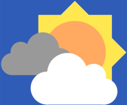
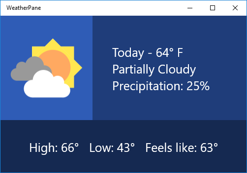

# Tutorial: Use Grid and StackPanel to create a simple weather app

Use XAML to create the layout for a simple weather app using the **Grid** and **StackPanel** elements. With these tools you can make great looking apps that work on any device running Windows 10. This tutorial takes 10-20 minutes.

> **Important APIs**: [Grid class](/uwp/api/windows.ui.xaml.controls.grid), [StackPanel class](/uwp/api/windows.ui.xaml.controls.stackpanel)

## Prerequisites
- Windows 10 and Microsoft Visual Studio 2015 or later. (Newest Visual Studio recommended for current development and security updates) [Click here to learn how to get set up with Visual Studio](../../windows-app-sdk/set-up-your-development-environment.md).
- Knowledge of how to create a basic "Hello World" app by using XAML and C#. If you don't have that yet, [click here to learn how to create a "Hello World" app](/windows/uwp/get-started/create-a-hello-world-app-xaml-universal).

## Step 1: Create a blank app
1. In Visual Studio menu, select **File** > **New Project**.
2. In the left pane of the **New Project** dialog box, select **Visual C#** > **Windows** > **Universal** or **Visual C++** > **Windows** > **Universal**.
3. In the center pane, select **Blank App**.
4. In the **Name** box, enter **WeatherPanel**, and select **OK**.
5. To run the program, select **Debug** > **Start Debugging** from the menu, or select F5.

## Step 2: Define a Grid
In XAML a **Grid** is made up of a series of rows and columns. By specifying the row and column of an element within a **Grid**, you can place and space other elements within a user interface. Rows and columns are defined with the **RowDefinition** and **ColumnDefinition** elements.

To start creating a layout, open **MainPage.xaml** by using the **Solution Explorer**, and replace the automatically generated **Grid** element with this code.

```xml
<Grid>
    <Grid.ColumnDefinitions>
        <ColumnDefinition Width="3*"/>
        <ColumnDefinition Width="5*"/>
    </Grid.ColumnDefinitions>
    <Grid.RowDefinitions>
        <RowDefinition Height="2*"/>
        <RowDefinition Height="*"/>
    </Grid.RowDefinitions>
</Grid>
```

The new **Grid** creates a set of two rows and columns, which defines the layout of the app interface. The first column has a **Width** of "3\*", while the second has "5\*", dividing the horizontal space between the two columns at a ratio of 3:5. In the same way, the two rows have a **Height** of "2\*" and "\*" respectively, so the **Grid** allocates two times as much space for the first row as for the second ("\*" is the same as "1\*"). These ratios are maintained even if the window is resized or the device is changed.

To learn about other methods of sizing rows and columns, see [Define layouts with XAML](./layouts-with-xaml.md).

If you run the application now you won't see anything except a blank page, because none of the **Grid** areas have any content. To show the **Grid** let's give it some color.

## Step 3: Color the Grid
To color the **Grid** we add three **Border** elements, each with a different background color. Each is also assigned to a row and column in the parent **Grid** by using the **Grid.Row** and **Grid.Column** attributes. The values of these attributes default to 0, so you don't need to assign them to the first **Border**. Add the following code to the **Grid** element after the row and column definitions.

```xml
<Border Background="#2f5cb6"/>
<Border Grid.Column ="1" Background="#1f3d7a"/>
<Border Grid.Row="1" Grid.ColumnSpan="2" Background="#152951"/>
```

Notice that for the third **Border** we use an extra attribute, **Grid.ColumnSpan**, which causes this **Border** to span both columns in the lower row. You can use **Grid.RowSpan** in the same way, and together these attributes let you span an element over any number of rows and columns. The upper-left corner of such a span is always the **Grid.Column** and **Grid.Row** specified in the element attributes.

If you run the app, the result looks something like this.


## Step 4: Organize content by using StackPanel elements
**StackPanel** is the second UI element we'll use to create our weather app. The **StackPanel** is a fundamental part of many basic app layouts, allowing you to stack elements vertically or horizontally.

In the following code, we create two **StackPanel** elements and fill each with three **TextBlocks**. Add these **StackPanel** elements to the **Grid** below the **Border** elements from Step 3. This causes the **TextBlock** elements to render on top of the colored **Grid** we created earlier.

```xml
<StackPanel Grid.Column="1" Margin="40,0,0,0" VerticalAlignment="Center">
    <TextBlock Foreground="White" FontSize="25" Text="Today - 64° F"/>
    <TextBlock Foreground="White" FontSize="25" Text="Partially Cloudy"/>
    <TextBlock Foreground="White" FontSize="25" Text="Precipitation: 25%"/>
</StackPanel>
<StackPanel Grid.Row="1" Grid.ColumnSpan="2" Orientation="Horizontal"
            HorizontalAlignment="Center" VerticalAlignment="Center">
    <TextBlock Foreground="White" FontSize="25" Text="High: 66°" Margin="0,0,20,0"/>
    <TextBlock Foreground="White" FontSize="25" Text="Low: 43°" Margin="0,0,20,0"/>
    <TextBlock Foreground="White" FontSize="25" Text="Feels like: 63°"/>
</StackPanel>
```

In the first **Stackpanel**, each **TextBlock** stacks vertically below the next. This is the default behavior of a StackPanel, so we don't need to set the **Orientation** attribute. In the second StackPanel, we want the child elements to stack horizontally from left to right, so we set the **Orientation** attribute to "Horizontal". We must also set the **Grid.ColumnSpan** attribute to "2", so that the text is centered over the lower **Border**.

If you run the app now, you'll see something like this.


## Step 5: Add an image icon

Finally, let's fill the empty section in our **Grid** with an image that represents today's weather—something that says "partially cloudy."

Download the image below and save it as a PNG named "partially-cloudy".



In the **Solution Explorer**, right click the **Assets** folder, and select **Add** -> **Existing Item...** Find partially-cloudy.png in the browser that pops up, select it, and click **Add**.

Next, in **MainPage.xaml**, add the following **Image** element below the StackPanels from Step 4.

```xml
<Image Margin="20" Source="Assets/partially-cloudy.png"/>
```

Because we want the Image in the first row and column, we don't need to set its **Grid.Row** or **Grid.Column** attributes, allowing them to default to "0".

And that's it! You've successfully created the layout for a simple weather application. If you run the application by pressing **F5**, you should see something like this:



If you like, try experimenting with the layout above, and explore different ways you might represent weather data.

## Related articles
For an introduction to designing Windows app layouts, see [Introduction to Windows app design](../basics/design-and-ui-intro.md)

To learn about creating responsive layouts that adapt to different screen sizes, see [Define Page Layouts with XAML](./layouts-with-xaml.md)
