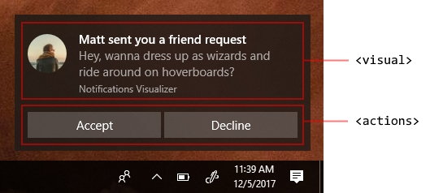
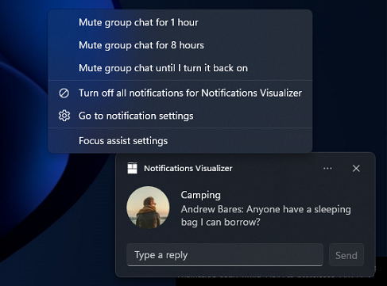
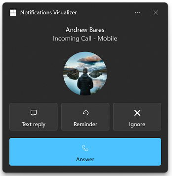
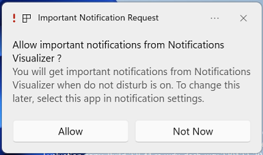

# Toast content

Adaptive and interactive toast notifications let you create flexible notifications with text, images, and buttons/inputs.

> **Important APIs**: [UWP Community Toolkit Notifications nuget package](https://www.nuget.org/packages/Microsoft.Toolkit.Uwp.Notifications/)

> [!NOTE]
> To see the legacy templates from Windows 8.1 and Windows Phone 8.1, see the [legacy toast template catalog](/previous-versions/windows/apps/hh761494(v=win.10)).


## Getting started

**Install Notifications library.** If you'd like to use C# instead of XML to generate notifications, install the NuGet package named [Microsoft.Toolkit.Uwp.Notifications](https://www.nuget.org/packages/Microsoft.Toolkit.Uwp.Notifications/) (search for "notifications uwp"). The C# samples provided in this article use version 7.0.0 of the NuGet package.

**Install Notifications Visualizer.** This free Windows app helps you design interactive toast notifications by providing an instant visual preview of your toast as you edit it, similar to Visual Studio's XAML editor/design view. See [Notifications Visualizer](notifications-visualizer.md) for more information, or [download Notifications Visualizer from the Store](https://www.microsoft.com/store/apps/notifications-visualizer/9nblggh5xsl1).


## Sending a toast notification

To learn how to send a notification, see [Send local toast](send-local-toast.md). This documentation only covers creating the toast content.


## Toast notification structure

Toast notifications are a combination of some data properties like Tag/Group (which let you identify the notification) and the *toast content*.

The core components of toast content are...
* **launch**: This defines what arguments will be passed back to your app when the user clicks your toast, allowing you to deep link into the correct content that the toast was displaying. To learn more, see [Send local toast](send-local-toast.md).
* **visual**: The visual portion of the toast, including the generic binding that contains text and images.
* **actions**: The interactive portion of the toast, including inputs and actions.
* **audio**: Controls the audio played when the toast is shown to the user.

The toast content is defined in raw XML, but you can use our [NuGet library](https://www.nuget.org/packages/Microsoft.Toolkit.Uwp.Notifications/) to get a C# (or C++) object model for constructing the toast content. This article documents everything that goes within the toast content.

#### [Builder syntax](#tab/builder-syntax)

```csharp
new ToastContentBuilder()
    .AddArgument("conversationId", 9813)

    .AddText("Some text")

    .AddButton(new ToastButton()
        .SetContent("Archive")
        .AddArgument("action", "archive")
        .SetBackgroundActivation())

    .AddAudio(new Uri("ms-appx:///Sound.mp3"));
```

#### [XML](#tab/xml)

```xml
<toast launch="app-defined-string">

    <visual>
        <binding template="ToastGeneric">
        ...
        </binding>
    </visual>

    <actions>
        ...
    </actions>

    <audio src="ms-winsoundevent:Notification.Reminder"/>

</toast>
```

---

Here is a visual representation of the toast's content:




## Visual

Each toast must specify a visual, where you must provide a generic toast binding, which can contain text, images, and more. These elements will be rendered on various Windows devices, including desktop, phones, tablets, and Xbox.

For all attributes supported in the visual section and its child elements, [see the schema documentation](toast-schema.md#toastvisual).

Your app's identity on the toast notification is conveyed via your app icon. However, if you use the app logo override, we will display your app name beneath your lines of text.

| App identity for normal toast | App identity with appLogoOverride |
| -- | -- |
|  |  |


## Text elements

Each toast must have at least one text element, and can contain two additional text elements, all of type [**AdaptiveText**](toast-schema.md#adaptivetext).


Since the Windows 10 Anniversary Update, you can control how many lines of text are displayed by using the **HintMaxLines** property on the text. The default (and maximum) is up to 2 lines of text for the title, and up to 4 lines (combined) for the two additional description elements (the second and third **AdaptiveText**).

#### [Builder syntax](#tab/builder-syntax)

```csharp
new ToastContentBuilder()
    .AddText("Adaptive Tiles Meeting", hintMaxLines: 1)
    .AddText("Conf Room 2001 / Building 135")
    .AddText("10:00 AM - 10:30 AM");
```

#### [XML](#tab/xml)

```xml
<toast launch="app-defined-string">

    <visual>
        <binding template="ToastGeneric">
            <text hint-maxLines="1">Adaptive Tiles Meeting</text>
            <text>Conf Room 2001 / Building 135</text>
            <text>10:00 AM - 10:30 AM</text>
        </binding>
    </visual>

</toast>
```

---


## App logo override

By default, your toast will display your app's logo. However, you can override this logo with your own [**ToastGenericAppLogo**](toast-schema.md#toastgenericapplogo) image. For example, if this is a notification from a person, we recommend overriding the app logo with a picture of that person.


You can use the **HintCrop** property to change the cropping of the image. For example, **Circle** results in a circle-cropped image. Otherwise, the image is square. Image dimensions are 48x48 pixels at 100% scaling. We generally recommend providing a version each icon asset for each scale factor: 100%, 125%, 150%, 200%, and 400%. 

#### [Builder syntax](#tab/builder-syntax)

```csharp
new ToastContentBuilder()
    ...
    
    .AddAppLogoOverride(new Uri("https://picsum.photos/48?image=883"), NotificationAppLogoCrop.Circle);
```

#### [XML](#tab/xml)

```xml
<toast launch="app-defined-string">

    <visual>
        <binding template="ToastGeneric">
            ...
            <image placement="appLogoOverride" hint-crop="circle" src="https://picsum.photos/48?image=883"/>
        </binding>
    </visual>

</toast>
```

---


## Hero image

**New in Anniversary Update**: Toasts can display a hero image, which is a featured [**ToastGenericHeroImage**](toast-schema.md#toastgenericheroimage) displayed prominently within the toast banner and while inside Action Center. Image dimensions are 364x180 pixels at 100% scaling.


#### [Builder syntax](#tab/builder-syntax)

```csharp
new ToastContentBuilder()
    ...
    
    .AddHeroImage(new Uri("https://picsum.photos/364/180?image=1043"));
```

#### [XML](#tab/xml)

```xml
<toast launch="app-defined-string">

    <visual>
        <binding template="ToastGeneric">
            ...
            <image placement="hero" src="https://picsum.photos/364/180?image=1043"/>
        </binding>
    </visual>

</toast>
```

---


## Inline image

You can provide a full-width inline-image that appears when you expand the toast.


#### [Builder syntax](#tab/builder-syntax)

```csharp
new ToastContentBuilder()
    ...
    
    .AddInlineImage(new Uri("https://picsum.photos/360/202?image=1043"));
```

#### [XML](#tab/xml)

```xml
<toast launch="app-defined-string">

    <visual>
        <binding template="ToastGeneric">
            ...
            <image src="https://picsum.photos/360/202?image=1043" />
        </binding>
    </visual>

</toast>
```

---


## Image size restrictions

The images you use in your toast notification can be sourced from...

 - http://
 - ms-appx:///
 - ms-appdata:///

For http and https remote web images, there are limits on the file size of each individual image. In the Fall Creators Update (16299), we increased the limit to be 3 MB on normal connections and 1 MB on metered connections. Before that, images were always limited to 200 KB.

| Normal connection | Metered connection | Before Fall Creators Update |
| - | - | - |
| 3 MB | 1 MB | 200 KB |

If an image exceeds the file size, or fails to download, or times out, the image will be dropped and the rest of the notification will be displayed.


## Attribution text

**New in Anniversary Update**: If you need to reference the source of your content, you can use attribution text. This text is always displayed at the bottom of your notification, along with your app's identity or the notification's timestamp.

On older versions of Windows that don't support attribution text, the text will simply be displayed as another text element (assuming you don't already have the maximum of three text elements).


#### [Builder syntax](#tab/builder-syntax)

```csharp
new ToastContentBuilder()
    ...
    
    .AddAttributionText("Via SMS");
```

#### [XML](#tab/xml)

```xml
<toast launch="app-defined-string">

    <visual>
        <binding template="ToastGeneric">
            ...
            <text placement="attribution">Via SMS</text>
        </binding>
    </visual>

</toast>
```

---


## Custom timestamp

**New in Creators Update**: You can now override the system-provided timestamp with your own timestamp that accurately represents when the message/information/content was generated. This timestamp is visible within Action Center.


To learn more about using a custom timestamp, please see [custom timestamps on toasts](custom-timestamps-on-toasts.md).

#### [Builder syntax](#tab/builder-syntax)

```csharp
new ToastContentBuilder()
    ...
    
    .AddCustomTimeStamp(new DateTime(2017, 04, 15, 19, 45, 00, DateTimeKind.Utc));
```

#### [XML](#tab/xml)

```xml
<toast displayTimestamp="2017-04-15T19:45:00Z">
  ...
</toast>
```

---


## Progress bar

**New in Creators Update**: You can provide a progress bar on your toast notification to keep the user informed of the progress of operations such as downloads.


To learn more about using a progress bar, please see [Toast progress bar](toast-progress-bar.md).


## Headers

**New in Creators Update**: You can group notifications under headers within Action Center. For example, you can group messages from a group chat under a header, or group notifications of a common theme under a header, or more.


To learn more about using headers, please see [Toast headers](toast-headers.md).


## Adaptive content

**New in Anniversary Update**: In addition to the content specified above, you can also display additional adaptive content that is visible when the toast is expanded.

This additional content is specified using Adaptive, which you can learn more about by reading the [Adaptive Tiles documentation](create-adaptive-tiles.md).

Note that any adaptive content must be contained within an [**AdaptiveGroup**](./toast-schema.md#adaptivegroup). Otherwise it will not be rendered using adaptive.


### Columns and text elements

Here's an example where columns and some advanced adaptive text elements are used. Since the text elements are within an **AdaptiveGroup**, they support all the rich adaptive styling properties.


#### [Builder syntax](#tab/builder-syntax)

```csharp
new ToastContentBuilder()
    ...
    
    .AddVisualChild(new AdaptiveGroup()
    {
        Children =
        {
            new AdaptiveSubgroup()
            {
                Children =
                {
                    new AdaptiveText()
                    {
                        Text = "52 attendees",
                        HintStyle = AdaptiveTextStyle.Base
                    },
                    new AdaptiveText()
                    {
                        Text = "23 minute drive",
                        HintStyle = AdaptiveTextStyle.CaptionSubtle
                    }
                }
            },
            new AdaptiveSubgroup()
            {
                Children =
                {
                    new AdaptiveText()
                    {
                        Text = "1 Microsoft Way",
                        HintStyle = AdaptiveTextStyle.CaptionSubtle,
                        HintAlign = AdaptiveTextAlign.Right
                    },
                    new AdaptiveText()
                    {
                        Text = "Bellevue, WA 98008",
                        HintStyle = AdaptiveTextStyle.CaptionSubtle,
                        HintAlign = AdaptiveTextAlign.Right
                    }
                }
            }
        }
    });
```

#### [XML](#tab/xml)

```xml
<toast launch="app-defined-string">

    <visual>
        <binding template="ToastGeneric">
            ...
            <group>
                <subgroup>
                    <text hint-style="base">52 attendees</text>
                    <text hint-style="captionSubtle">23 minute drive</text>
                </subgroup>
                <subgroup>
                    <text hint-style="captionSubtle" hint-align="right">1 Microsoft Way</text>
                    <text hint-style="captionSubtle" hint-align="right">Bellevue, WA 98008</text>
                </subgroup>
            </group>
        </binding>
    </visual>

</toast>
```

---


## Buttons

Buttons make your toast interactive, letting the user take quick actions on your toast notification without interrupting their current workflow. For example, users can reply to a message directly from within a toast, or delete an email without even opening the email app. Buttons appear in the expanded portion of your notification.

To learn more about implementing buttons end-to-end, see [Send local toast](send-local-toast.md).

Buttons can perform the following different actions...

-   Activating the app in the foreground, with an argument that can be used to navigate to a specific page/context.
-   Activating the app's background task, for a quick-reply or similar scenario.
-   Activating another app via protocol launch.
-   Performing a system action, such as snoozing or dismissing the notification.

> [!NOTE]
> You can only have up to 5 buttons (including context menu items which we discuss later).


#### [Builder syntax](#tab/builder-syntax)

```csharp
new ToastContentBuilder()
    ...
    
    .AddButton(new ToastButton()
        .SetContent("See more details")
        .AddArgument("action", "viewDetails"))

    .AddButton(new ToastButton()
        .SetContent("Remind me later")
        .AddArgument("action", "remindLater")
        .SetBackgroundActivation());
```

#### [XML](#tab/xml)

```xml
<toast launch="app-defined-string">

    ...

    <actions>

        <action
            content="See more details"
            arguments="action=viewDetails&amp;contentId=351"
            activationType="foreground"/>

        <action
            content="Remind me later"
            arguments="action=remindlater&amp;contentId=351"
            activationType="background"/>

    </actions>

</toast>
```

---


### Buttons with icons

You can add icons to your buttons. These icons are white transparent 16x16 pixel images at 100% scaling, and should have no padding included in the image itself. If you choose to provide icons on a toast notification, you must provide icons for ALL of your buttons in the notification, as it transforms the style of your buttons into icon buttons.

> [!NOTE]
> For accessibility, be sure to include a contrast-white version of the icon (a black icon for white backgrounds), so that when the user turns on High Contrast White mode, your icon is visible. Learn more on the [toast accessiblity page](tile-toast-language-scale-contrast.md).


#### [Builder syntax](#tab/builder-syntax)

```csharp
new ToastContentBuilder()
    ...
    
    .AddButton(new ToastButton()
        .SetContent("Dismiss")
        .AddArgument("action", "dismiss")
        .SetImageUri(new Uri("Assets/NotificationButtonIcons/Dismiss.png", UriKind.Relative))
        .SetBackgroundActivation());
```

#### [XML](#tab/xml)

```xml
<toast launch="app-defined-string">

    ...

    <actions>
        
        <action
            content="Dismiss"
            imageUri="Assets/NotificationButtonIcons/Dismiss.png"
            arguments="dismiss"
            activationType="background"/>

    </actions>

</toast>
```

---

**New in Windows 11 Update**: You can add tooltips to your icons with the **HintToolTip** property in XML. This is ideal if your buttons have icons but no content, as this will make sure you can pass text that Windows Narrator can read. However, if content is present, then Narrator will read the content, no matter what is passed in the tooltip.

#### [Builder syntax](#tab/builder-syntax)

```csharp
// The builder syntax does not support icon tooltips yet. 
```

#### [XML](#tab/xml)

```xml
<toast launch="app-defined-string">

    ...

    <actions>
        
        <action
            content=""
            hint-toolTip="Dismiss"
            imageUri="Assets/NotificationButtonIcons/Dismiss.png"
            arguments="dismiss"
            activationType="background"/>

    </actions>

</toast>
```

---

### Buttons with colors

**New in Windows 11 Update**: You can add red or green colors to your buttons by adding the **UseButtonStyle** property to the toast XML tag and the **HintButtonStyle** property as seen below.


#### [Builder syntax](#tab/builder-syntax)

```csharp
// The builder syntax does not support red and green button colors yet.
```

#### [XML](#tab/xml)

```xml
<toast launch="app-defined-string" useButtonStyle="true">

    ...

    <actions>
        
        <action
            content=""
            hint-toolTip="Answer Video Call"
            hint-buttonStyle="Success"
            imageUri="Assets/Icons/VideoCall.png"
            activationType="foreground"
            arguments="videoId" />

        <action
            content=""
            hint-toolTip="Answer Phone Call"
            hint-buttonStyle="Success"
            imageUri="Assets/Icons/PhoneCall.png"
            activationType="foreground"
            arguments="answerId" />

        <action
            content=""
            hint-toolTip="Hang Up"
            hint-buttonStyle="Critical"
            imageUri="Assets/Icons/HangUp.png"
            activationType="background"
            arguments="hangupId" />

    </actions>

</toast>
```

---

### Buttons with pending update activation

**New in Fall Creators Update**: On background activation buttons, you can use an after activation behavior of **PendingUpdate** to create multi-step interactions in your toast notifications. When the user clicks your button, your background task is activated, and the toast gets placed in a "pending update" state, where it stays on screen till your background task replaces the toast with a new toast.

To learn how to implement this, see [Toast pending update](toast-pending-update.md).


## Context menu actions

**New in Anniversary Update**: You can add additional context menu actions to the existing context menu that appears when the user right clicks your toast notification or selects the context menu icon.

> [!NOTE]
> On older devices, these additional context menu actions will simply appear as normal buttons on your toast.

The additional context menu actions you add (such as "Mute group chat for 1 hour") appear above the two default system entries.




#### [Builder syntax](#tab/builder-syntax)

The builder syntax doesn't support context menu actions, so we recommend using initializer syntax.

```csharp
ToastContent content = new ToastContent()
{
    ...
 
    Actions = new ToastActionsCustom()
    {
        ContextMenuItems =
        {
            new ToastContextMenuItem("Mute group chat for 1 hour", "action=muteId")
        }
    }
};
```

#### [XML](#tab/xml)

```xml
<toast launch="app-defined-string">

    ...

    <actions>

        <action
            placement="contextMenu"
            content="Mute group chat for 1 hour"
            arguments="action=muteId"/>

    </actions>

</toast>
```

---

> [!NOTE]
> Additional context menu items contribute to the total limit of 5 buttons on a toast.

Activation of additional context menu items is handled identical to toast buttons.


## Inputs

Inputs are specified within the Actions region of the toast region of the toast, meaning they are only visible when the toast is expanded.


### Quick reply text box

To enable a quick reply text box (for example, in a messaging app) add a text input and a button, and reference the ID of the text input field so that the button is displayed next to to the input field. The icon for the button should be a 32x32 pixel image with no padding, white pixels set to transparent, and 100% scale.


#### [Builder syntax](#tab/builder-syntax)

```csharp
new ToastContentBuilder()
    ...
    
    .AddInputTextBox("tbReply", "Type a reply")

    .AddButton(new ToastButton()
        .SetContent("Reply")
        .SetTextBoxId("tbReply") // To place button next to text box, reference text box's id
        .SetImageUri(new Uri("Assets/Reply.png", UriKind.Relative))
        .AddArgument("action", "reply")
        .SetBackgroundActivation());
```

#### [XML](#tab/xml)

```xml
<toast launch="app-defined-string">

    ...

    <actions>

        <input id="textBox" type="text" placeHolderContent="Type a reply"/>

        <action
            content="Send"
            arguments="action=reply&amp;convId=9318"
            activationType="background"
            hint-inputId="textBox"
            imageUri="Assets/Reply.png"/>

    </actions>

</toast>
```

---


### Inputs with buttons bar

You also can have one (or many) inputs with normal buttons displayed below the inputs.


#### [Builder syntax](#tab/builder-syntax)

```csharp
new ToastContentBuilder()
    ...
    
    .AddInputTextBox("tbReply", "Type a reply")

    .AddButton(new ToastButton()
        .SetContent("Reply")
        .AddArgument("action", "reply")
        .SetBackgroundActivation())

    .AddButton(new ToastButton()
        .SetContent("Video call")
        .AddArgument("action", "videoCall"));
```

#### [XML](#tab/xml)

```xml
<toast launch="app-defined-string">

    ...

    <actions>

        <input id="textBox" type="text" placeHolderContent="Type a reply"/>

        <action
            content="Reply"
            arguments="action=reply&amp;threadId=9218"
            activationType="background"/>

        <action
            content="Video call"
            arguments="action=videocall&amp;threadId=9218"
            activationType="foreground"/>

    </actions>

</toast>
```

---


### Selection input

In addition to text boxes, you can also use a selection menu.


#### [Builder syntax](#tab/builder-syntax)

```csharp
new ToastContentBuilder()
    ...
    
    .AddToastInput(new ToastSelectionBox("time")
    {
        DefaultSelectionBoxItemId = "lunch",
        Items =
        {
            new ToastSelectionBoxItem("breakfast", "Breakfast"),
            new ToastSelectionBoxItem("lunch", "Lunch"),
            new ToastSelectionBoxItem("dinner", "Dinner")
        }
    })

    .AddButton(...)
    .AddButton(...);
```

#### [XML](#tab/xml)

```xml
<toast launch="app-defined-string">

    ...

    <actions>

        <input id="time" type="selection" defaultInput="lunch">
            <selection id="breakfast" content="Breakfast" />
            <selection id="lunch" content="Lunch" />
            <selection id="dinner" content="Dinner" />
        </input>

        ...

    </actions>

</toast>
```

---


### Snooze/dismiss

Using a selection menu and two buttons, we can create a reminder notification that utilizes the system snooze and dismiss actions. Make sure to set the scenario to Reminder for the notification to behave like a reminder.


We link the Snooze button to the selection menu input using the **SelectionBoxId** property on the toast button.

#### [Builder syntax](#tab/builder-syntax)

```csharp
new ToastContentBuilder()
    .SetToastScenario(ToastScenario.Reminder)
    
    ...
    
    .AddToastInput(new ToastSelectionBox("snoozeTime")
    {
        DefaultSelectionBoxItemId = "15",
        Items =
        {
            new ToastSelectionBoxItem("5", "5 minutes"),
            new ToastSelectionBoxItem("15", "15 minutes"),
            new ToastSelectionBoxItem("60", "1 hour"),
            new ToastSelectionBoxItem("240", "4 hours"),
            new ToastSelectionBoxItem("1440", "1 day")
        }
    })

    .AddButton(new ToastButtonSnooze() { SelectionBoxId = "snoozeTime" })
    .AddButton(new ToastButtonDismiss());
```

#### [XML](#tab/xml)

```xml
<toast scenario="reminder" launch="app-defined-string">
   
    ...
    
    <actions>
     
        <input id="snoozeTime" type="selection" defaultInput="15">
            <selection id="1" content="1 minute"/>
            <selection id="15" content="15 minutes"/>
            <selection id="60" content="1 hour"/>
            <selection id="240" content="4 hours"/>
            <selection id="1440" content="1 day"/>
        </input>
 
        <action activationType="system" arguments="snooze" hint-inputId="snoozeTime" content="" />
 
        <action activationType="system" arguments="dismiss" content=""/>
     
    </actions>
   
</toast>
```

---

To use the system snooze and dismiss actions:

-   Specify a **ToastButtonSnooze** or **ToastButtonDismiss**
-   Optionally specify a custom content string:
    -   If you don't provide a string, we'll automatically use localized strings for "Snooze" and "Dismiss".
-   Optionally specify the **SelectionBoxId**:
    -   If you don't want the user to select a snooze interval and instead just want your notification to snooze only once for a system-defined time interval (that is consistent across the OS), then don't construct any &lt;input&gt; at all.
    -   If you want to provide snooze interval selections:
        -   Specify **SelectionBoxId** in the snooze action
        -   Match the id of the input with the **SelectionBoxId** of the snooze action
        -   Specify **ToastSelectionBoxItem**'s value to be a nonNegativeInteger which represents snooze interval in minutes.


## Audio

Custom audio has always been supported by Mobile, and is supported in Desktop Version 1511 (build 10586) or newer. Custom audio can be referenced via the following paths:

-   ms-appx:///
-   ms-appdata:///

Alternatively, you can pick from the [list of ms-winsoundevents](/uwp/schemas/tiles/toastschema/element-audio#attributes-and-elements), which have always been supported on both platforms.

#### [Builder syntax](#tab/builder-syntax)

```csharp
new ToastContentBuilder()
    ...
    
    .AddAudio(new Uri("ms-appx:///Assets/NewMessage.mp3"));
```

#### [XML](#tab/xml)

```xml
<toast launch="app-defined-string">

    ...

    <audio src="ms-appx:///Assets/NewMessage.mp3"/>

</toast>
```

---


See the [audio schema page](/uwp/schemas/tiles/toastschema/element-audio) for information on audio in toast notifications. To learn how to send a toast using custom audio, see [custom audio on toasts](custom-audio-on-toasts.md).


## Scenarios

To create important notifications, alarms, reminders, and incoming call notifications, you simply use a normal toast notification with a **Scenario** value assigned to it. The scenario adjusts a few behaviors to create a consistent and unified user experience. There are four possible **Scenario** values: 

* **Reminder**
* **Alarm**
* **IncomingCall** 
* **Urgent**

### Reminders
In the reminder scenario, the notification will stay on screen until the user dismisses it or takes action. On Windows Mobile, the toast will also show pre-expanded. A reminder sound will be played. You must provide at least one button on your toast notification. Otherwise, the toast will be treated as a normal toast.

#### [Builder syntax](#tab/builder-syntax)

```csharp
new ToastContentBuilder()
    .SetToastScenario(ToastScenario.Reminder)
    ...
```

#### [XML](#tab/xml)

```xml
<toast scenario="reminder" launch="app-defined-string">

    ...

</toast>
```

---


### Alarms
Alarms behave the same as reminders, except alarms will additionally loop audio with a default alarm sound. You must provide at least one button on your toast notification. Otherwise, the toast will be treated as a normal toast.

#### [Builder syntax](#tab/builder-syntax)

```csharp
new ToastContentBuilder()
    .SetToastScenario(ToastScenario.Alarm)
    ...
```

#### [XML](#tab/xml)

```xml
<toast scenario="alarm" launch="app-defined-string">

    ...

</toast>
```

---


### Incoming calls
Incoming call notifications are displayed pre-expanded in a special call format and stay on the user's screen till dismissed. Ringtone audio will loop by default. On Windows Mobile devices, they display full screen.



#### [Builder syntax](#tab/builder-syntax)

```csharp
new ToastContentBuilder()
    .SetToastScenario(ToastScenario.IncomingCall)
    ...
```

#### [XML](#tab/xml)

```xml
<toast scenario="incomingCall" launch="app-defined-string">

    ...

</toast>
```

---

### Important Notifications

> [!IMPORTANT]
> **Requires**: You must be running Windows Insider Preview Build 22546 or higher to use important notifications.

Important notifications allow users to have more control over what 1st party and 3rd party apps can send them high-priority toast notifications (urgent/important) that can break through Focus Assist (Do not Disturb). This can be modified in the notifications settings.




#### [Builder syntax](#tab/builder-syntax)

```csharp
// The builder syntax does not support important notifications yet.
```

#### [XML](#tab/xml)

```xml
<toast scenario="urgent" launch="app-defined-string">

    ...

</toast>
```

---

## Localization and accessibility

Your tiles and toasts can load strings and images tailored for display language, display scale factor, high contrast, and other runtime contexts. For more info, see [Tile and toast notification support for language, scale, and high contrast](tile-toast-language-scale-contrast.md).


## Handling activation
To learn how to handle toast activations (the user clicking your toast or buttons on the toast), see [Send local toast](send-local-toast.md).
 
## Related topics

* [Send a local toast and handle activation](send-local-toast.md)
* [Notifications library on GitHub (part of the UWP Community Toolkit)](https://github.com/windows-toolkit/WindowsCommunityToolkit/tree/master/Microsoft.Toolkit.Uwp.Notifications)
* [Tile and toast notification support for language, scale, and high contrast](tile-toast-language-scale-contrast.md)
