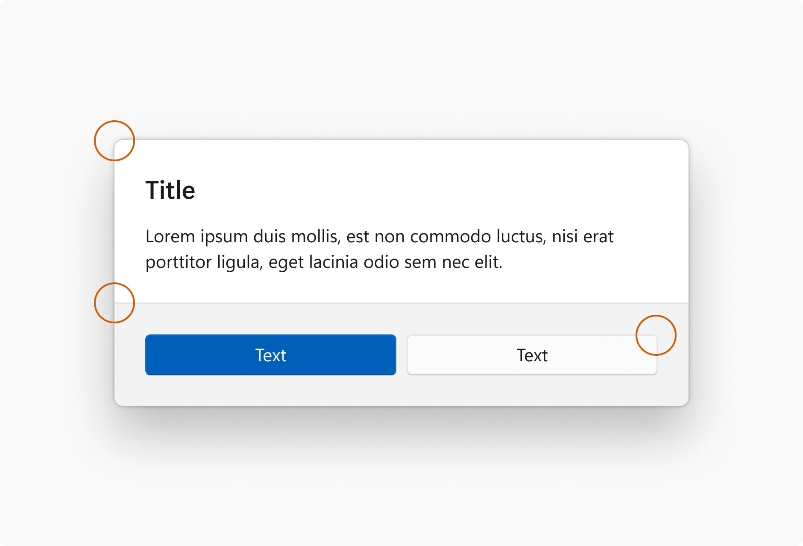
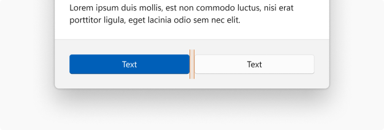

# Geometry in Windows 11

Geometry describes the shape, size and position of UI elements on screen. These fundamental design elements help experiences feel coherent across the entire design system.

Windows 11 geometry has been crafted to support modern app experiences. Progressively rounded corners, nested elements, and consistent gutters combine to create a soft, calm, and approachable effect that emphasizes unity of purpose and ease of use.

## Rounded corners

Windows 11 applies rounded corners to all top-level app windows. The same applies to most common controls such as Button and ListView. (For more information, see [Use the latest common controls](/windows/apps/get-started/make-apps-great-for-windows#4-use-the-latest-common-controls).) 

Windows 11 uses three levels of rounding depending on what UI component is being rounded and how that component is arranged relative to neighboring elements.

| Corner radius | Usage                     |
|---------------|---------------------------|
| 8px           | Top-level containers such as app windows, flyouts and dialogs are rounded using an 8px corner radius. |
| 4px           | In-page elements such as buttons and list backplates are rounded using a 4px corner radius.           |
| 0px           | Straight edges that intersect with other straight edges are not rounded.                              |
| 0px           | Window corners are not rounded when windows are snapped or maximized.                                 |

## Spacing and gutters

The use of consistently sized spacing and gutters semantically groups an experience into separate components. These values map to our rounded corner logic and together help create a cohesive and usable layout.

:::row:::
    :::column:::
        
    :::column-end:::
    :::column span="1":::
        **8px** between buttons
    :::column-end:::
:::row-end:::

:::row:::
    :::column span="1":::
        
    :::column-end:::
    :::column span="1":::
        **8px** between buttons and flyouts
    :::column-end:::
:::row-end:::

:::row:::
    :::column:::
        
    :::column-end:::
    :::column span="1":::
        **8px** between control and header
    :::column-end:::
:::row-end:::

:::row:::
    :::column:::
        
    :::column-end:::
    :::column span="1":::
        **12px** between control and label
    :::column-end:::
:::row-end:::

:::row:::
    :::column:::
        
    :::column-end:::
    :::column span="1":::
        **12px** between content areas
    :::column-end:::
:::row-end:::

:::row:::
    :::column:::
        
    :::column-end:::
    :::column span="1":::
        **12px** between surface and edge text
    :::column-end:::
:::row-end:::
