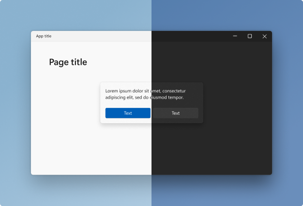
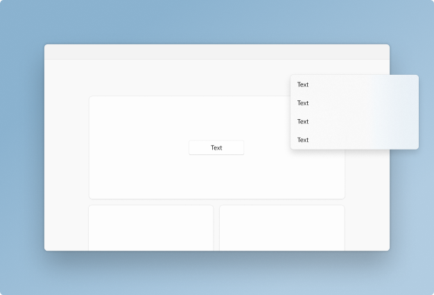
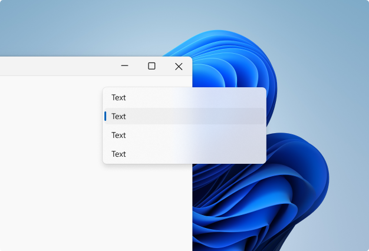

# Windows 11 signature experiences

Signature experiences are the design elements Windows 11 uses to express its visual language, while maintaining a coherent look and feel across all Fluent experiences.

:::row:::
    :::column:::
        
    :::column-end:::
    :::column span="2":::
        **Geometry**  
        [Geometry](geometry.md) describes the shape, size and position of UI elements on screen. These fundamental design elements help experiences feel coherent across the entire design system. Windows 11 features updated geometry that creates a more approachable, engaging and modern experience.
    :::column-end:::
:::row-end:::

:::row:::
    :::column:::
        
    :::column-end:::
    :::column span="2":::
        **Color**  
        [Color](color.md) helps users focus on their tasks by indicating a visual hierarchy and structure between user interface elements. Windows 11 uses color to provide a calming foundation, subtly enhancing user interactions and emphasizing significant items only when necessary.
    :::column-end:::
:::row-end:::

:::row:::
    :::column:::
        
    :::column-end:::
    :::column span="2":::
        **Layering and Elevation**  
        [Layering](layering.md) is the concept of overlapping one surface with another, creating two or more visually distinguished areas within the same surface. Windows 11 uses layering and elevation as its foundation for app hierarchy.
    :::column-end:::
:::row-end:::

:::row:::
    :::column:::
        
    :::column-end:::
    :::column span="2":::
        **Materials**  
        [Materials](materials.md) are visual effects that make UI surfaces resemble real life artifacts. Windows 11 uses materials to keep the UI connected to its environment. Materials bring surfaces to life and help us distinguish between focused and unfocused applications.
    :::column-end:::
:::row-end:::

:::row:::
    :::column:::
        
    :::column-end:::
    :::column span="2":::
        **Iconography**  
        [Iconography](iconography.md) is a set of visual images and symbols that help users understand and navigate your app. Windows 11 iconography has evolved in concert with our design language. Every glyph in our system icon font has been redesigned to embrace a softer geometry and more modern metaphors.  
    :::column-end:::
:::row-end:::

:::row:::
    :::column:::
        
    :::column-end:::
    :::column span="2":::
        **Typography**  
        As the visual representation of language, [typography's](typography.md) main task is to communicate information. The Windows 11 type system helps you create structure and hierarchy in your content in order to maximize legibility and readability in your UI.
    :::column-end:::
:::row-end:::
