# Icons for Windows apps

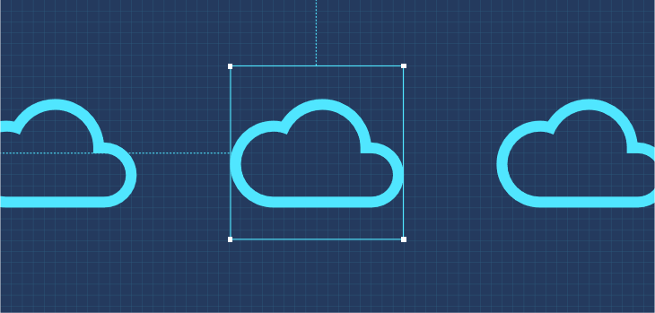

Icons provide a visual shorthand for an action, concept, or product. By compressing meaning into a symbolic image, icons can cross language barriers and help conserve a valuable resource: screen space.

Good icons harmonize with typography and with the rest of the design language. They don't mix metaphors, and they communicate only what's needed, as speedily and simply as possible.

Icons can appear within apps and outside them: 

:::row:::
    :::column:::
        **Icons inside the app**

        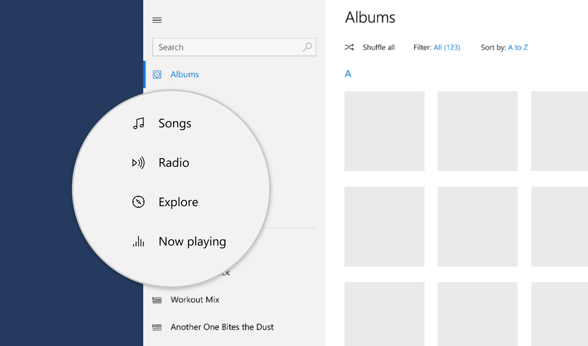
Inside your app, you use icons to represent an action, such as copying text or going to the settings page.
    :::column-end:::
	:::column:::
**Icons outside the app**

		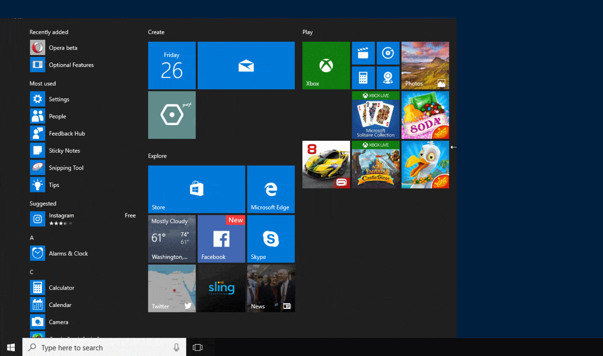
Outside your app, Windows uses an icon to represent the app on the Start menu and on the taskbar. If the user chooses to pin your app to the Start menu, your app's start tile can feature the app's icon. The app's icon appears on the title bar, and you can choose to create a splash screen with your app's logo.
    :::column-end:::
:::row-end:::

This article describes icons within your app. To learn about icons outside your app (app icons), see the [Iconography in Windows](./iconography/overview.md) article.

## Know when to use icons

Icons can save space, but when should you use them? 

:::row:::
    :::column:::
        
        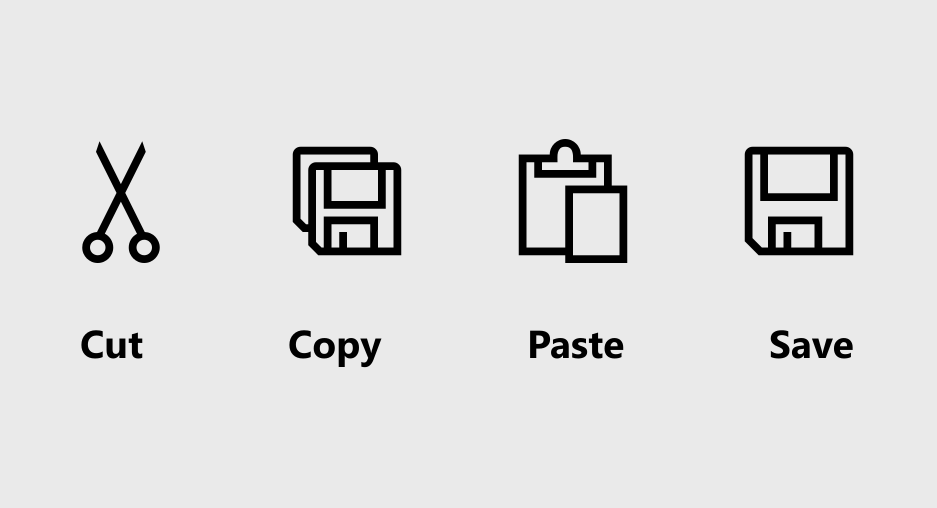<br>

Use an icon for actions, like cut, copy, paste, and save, or for items on a navigation menu.
    :::column-end:::
	:::column:::
		
        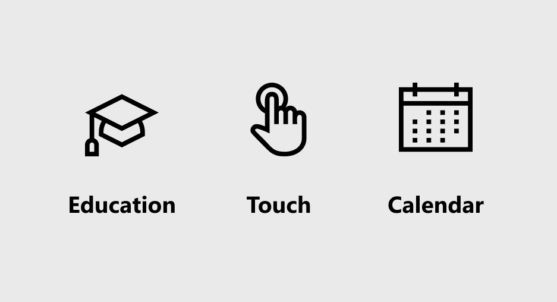<br>

Use an icon if one already exists for the concept that you want to represent. (To see whether an icon exists, check the Segoe icon list.)
    :::column-end:::
:::row-end:::

:::row:::
    :::column:::
        
        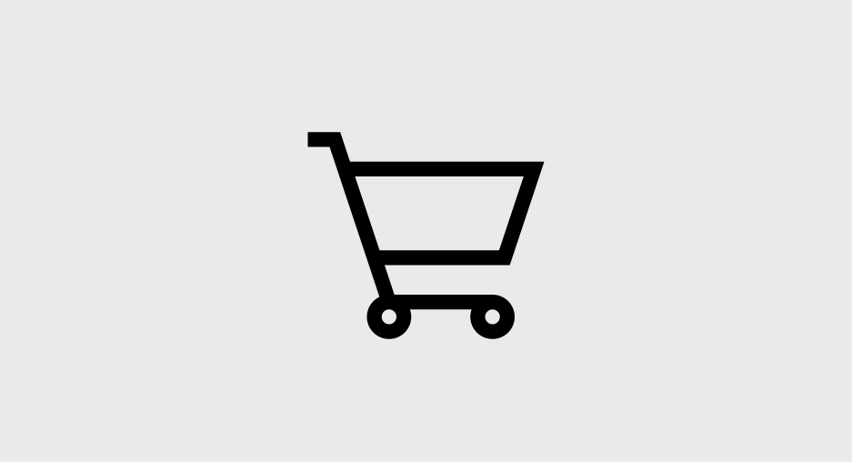<br>

Use an icon if it's easy for the user to understand what the icon means and it's simple enough to be clear at small sizes.
    :::column-end:::
	:::column:::
		
        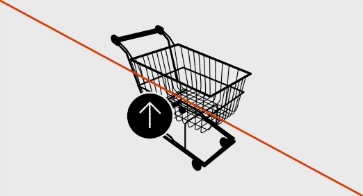<br>

Don't use an icon if its meaning isn't clear, or if making it clear requires a complex shape.
    :::column-end:::
:::row-end:::

## Use the right type of icon

There are many ways to create an icon. You can use a symbol font like Segoe MDL2 Assets. You can create your own vector-based image. You can even use a bitmap image, although we don't recommend it. Here's a summary of the ways that you can add an icon to your app. 

### Predefined icon

:::row:::
    :::column:::
Microsoft provides more than 1,000 icons in the form of the Segoe MDL2 Assets font. It might not be intuitive to get an icon from a font, but Windows font display technology means these icons will look crisp and sharp on any display, at any resolution, and at any size. For instructions, see [Segoe MDL2 Assets icons](segoe-ui-symbol-font.md).
    :::column-end:::
    :::column:::
        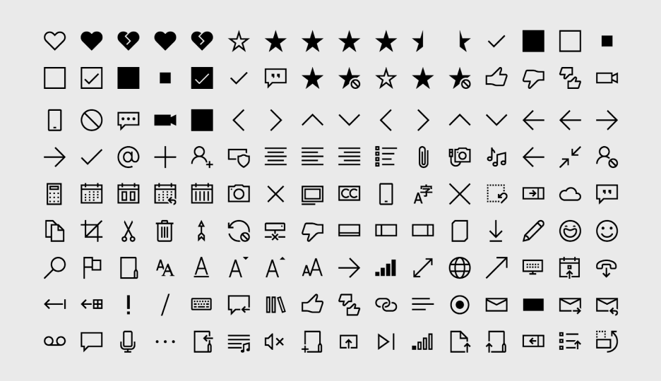
    :::column-end:::
:::row-end:::

### Font
:::row:::
    :::column:::
You don't have to use the Segoe MDL2 Assets font. You can use any font that the user has installed on their system, such as Wingdings or Webdings.
    :::column-end:::
    :::column:::
        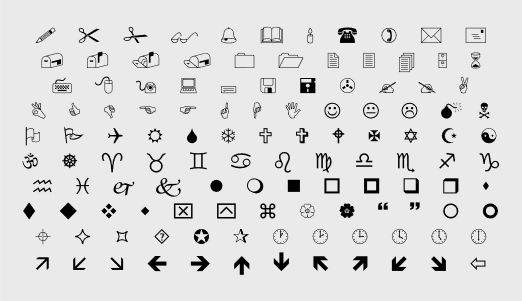
    :::column-end:::
:::row-end:::

### SVG file
:::row:::
    :::column:::
Scalable Vector Graphics (SVG) resources are ideal for icons, because they always look sharp at any size or resolution. Most drawing applications can export to SVG. For instructions, see [SVGImageSource](/uwp/api/windows.ui.xaml.media.imaging.svgimagesource).
    :::column-end:::
    :::column:::
        
    :::column-end:::
:::row-end:::

### Geometry objects
:::row:::
    :::column:::
Like SVG files, geometries are a vector-based resource, so they always look sharp. However, creating a geometry is complicated because you have to individually specify each point and curve. It's a good choice only if you need to modify the icon while your app is running (to animate it, for example). For instructions, see [Move and draw commands for geometries](/windows/uwp/xaml-platform/move-draw-commands-syntax). 
    :::column-end:::
    :::column:::
        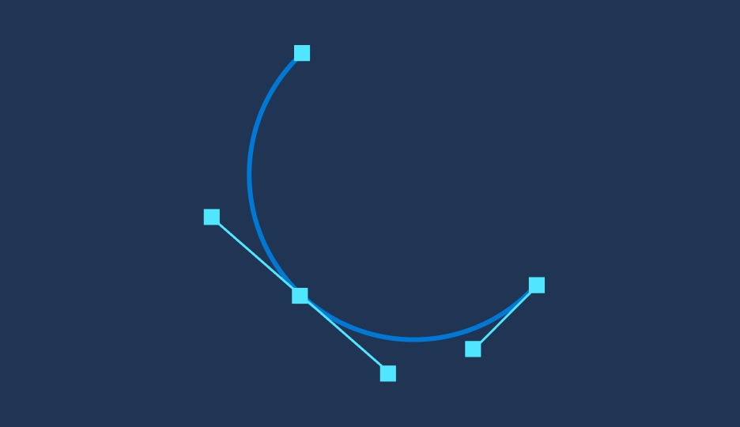
    :::column-end:::
:::row-end:::

### Bitmap image
:::row:::
    :::column:::
You can use a bitmap image (such as PNG, GIF, or JPEG), although we don't recommend it.

Bitmap images are created at a specific size, so they have to be scaled up or down depending on how large you want the icon to be and the resolution of the screen. When the image is scaled down (shrunk), it can appear blurry. When it's scaled up, it can appear blocky and pixelated. If you have to use a bitmap image, we recommend using a PNG or GIF over a JPEG. 
    :::column-end:::
    :::column:::
        
        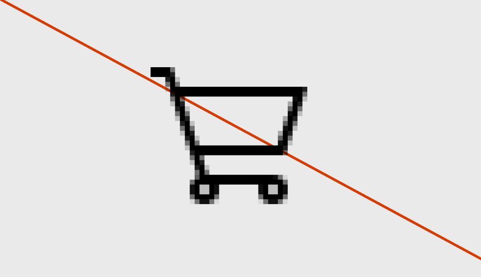
    :::column-end:::
:::row-end:::

## Make an icon do something

After you have an icon, the next step is to make it do something by associating it with a command or a navigation action. The best way is to add the icon to a button or a command bar.

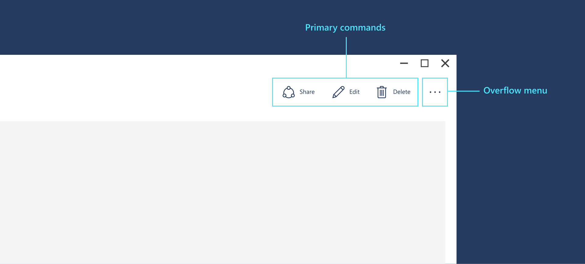

You can also animate an icon to draw attention to a UI component, such as the next button in a tutorial, or to reflect the action that's associated with the icon in an entertaining and interesting way. For more information, see [AnimatedIcon](../controls/animated-icon.md).

## Create an icon button

You can put an icon on a standard button. Because you can use buttons in a wide variety of places, using an icon in this way gives you a little more flexibility for where your action icon appears. 

Here's one way to add an icon to a button:

:::row:::
    :::column span="2":::
        <b>Step 1</b><br>
Set the button's font family to `Segoe MDL2 Assets` and its content property to the Unicode value of the glyph that you want to use:
    :::column-end:::
	:::column:::
        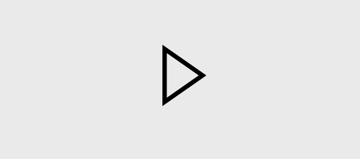
    :::column-end:::
:::row-end:::

```xaml 
<Button FontFamily="Segoe MDL2 Assets" Content="&#xE102;" />
```

:::row:::
    :::column span="2":::
        <b>Step 2</b><br>
Use one of the icon element objects: [BitmapIcon](/uwp/api/windows.ui.xaml.controls.bitmapicon),
[FontIcon](/uwp/api/windows.ui.xaml.controls.fonticon), 
[PathIcon](/uwp/api/windows.ui.xaml.controls.pathicon), 
[ImageIcon](/windows/winui/api/microsoft.ui.xaml.controls.imageicon?view=winui-3.0&preserve-view=true), or
[SymbolIcon](/uwp/api/windows.ui.xaml.controls.symbolicon). This technique gives you more types of icons to choose from. It also enables you to combine icons and other types of content, such as text, if you want.
    :::column-end:::
	:::column:::
        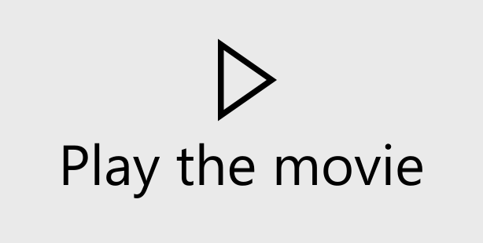
    :::column-end:::
:::row-end:::

```xaml 
<Button>
    <StackPanel>
        <SymbolIcon Symbol="Play" />
        <TextBlock>Play the movie</TextBlock>
    </StackPanel>
</Button>
```

## Create a series of icons on a command bar

:::row:::
    :::column span:::
When you have a series of commands that go together, such as cut/copy/paste or a set of drawing commands for a photo-editing program, put them together on a [command bar](../controls/command-bar.md). A command bar takes one or more app bar buttons or app bar toggle buttons, each of which represents an action. Each button has an [Icon](/uwp/api/windows.ui.xaml.controls.appbarbutton#Windows_UI_Xaml_Controls_AppBarButton_Icon) property that you use to control which icon it displays. There are a variety of ways to specify the icon. 
    :::column-end:::
	:::column:::
        
    :::column-end:::
:::row-end:::

The easiest way is to use the list of predefined icons. Simply specify the icon name, such as **Back** or **Stop**, and the system will draw it: 

``` xaml
<CommandBar>
    <AppBarToggleButton Icon="Shuffle" Label="Shuffle" Click="AppBarButton_Click" />
    <AppBarToggleButton Icon="RepeatAll" Label="Repeat" Click="AppBarButton_Click"/>
    <AppBarSeparator/>
    <AppBarButton Icon="Back" Label="Back" Click="AppBarButton_Click"/>
    <AppBarButton Icon="Stop" Label="Stop" Click="AppBarButton_Click"/>
    <AppBarButton Icon="Play" Label="Play" Click="AppBarButton_Click"/>
    <AppBarButton Icon="Forward" Label="Forward" Click="AppBarButton_Click"/>
</CommandBar>
```

For the complete list of icon names, see the [Symbol enumeration reference](/uwp/api/windows.ui.xaml.controls.symbol). 

There are other ways to provide icons for a button on a command bar:

+ [FontIcon](/uwp/api/windows.ui.xaml.controls.fonticon): The icon is based on a glyph from the specified font family.
+ [BitmapIcon](/uwp/api/windows.ui.xaml.controls.bitmapicon): The icon is based on a bitmap image file with the specified URI.
+ [PathIcon](/uwp/api/windows.ui.xaml.controls.pathicon): The icon is based on [Path](/uwp/api/windows.ui.xaml.shapes.path) data.
+ [ImageIcon](/windows/winui/api/microsoft.ui.xaml.controls.imageicon?view=winui-3.0&preserve-view=true): The icon is based on an image file type that the [Image](/uwp/api/windows.ui.xaml.controls.image) class supports. 

To learn more about command bars, see the [Command bar](../controls/command-bar.md) article. 

## Related articles

- [App icons and logos](./iconography/overview.md)
- [AnimatedIcon](../controls/animated-icon.md)