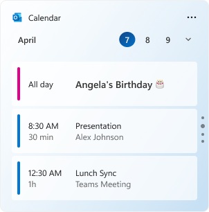

# Integrate with the widget picker

In the current release, the only Widgets host is the Widgets Board built into Windows 11. The Widgets Board displays widgets and manages their layout the on the board. It also provides a widget picker that allows the user to select which available widgets are visible on the board. This article describes the assets required for a widget to successfully integrate into the widget picker.

## Widget screenshot image

Each widget must provide a screenshot image that is displayed as a preview in the widget picker when the widget has focus. The screenshot is specified by the widget provider in the package manifest for the app. For technical information on how to specify an image file to use for the widget screenshot, see [Implement a widget provider in a win32 app](../../develop/widgets/implement-widget-provider-win32.md) and [Widget provider package manifest XML format](../../develop/widgets/widget-provider-manifest.md).

The following screenshot illustrates the placement of the screenshot image within the widget picker.

## Screenshot image requirements 

In order to provide a consistent user experience, widget screenshots for the widget picker must follow the following guidelines.
 

* The screenshot should contain the medium size version of your widget.
* The image should be 300 pixels wide and 304 pixels tall.
* The image should have transparent, rounded corners.

The widget provider manifest includes three different **Screenshot** elements that you can set. The top-level screenshot is required and will be used as the default by the widget picker. The **LightMode** and **DarkMode** sections of the manifest are optional and allow you to specify separate screenshots for your widget in light and dark modes. If you supply one or both of these optional screenshots, the widget picker will use the one that matches the device's current theme. If you do not supply an image specifically for the current theme, the widget picker will use the default, top-level screenshot instead.

You may provide widget screenshots for multiple locales, including locales that use right-to-left (RTL) languages. The locale for each screenshot is specified with the path to the asset relative to your app package.

* Create a directory in your packaging project for the image assets. For example: "Assets".
* The language-neutral or fallback assets can be placed directly in this folder. For example: "Assets/Logo.png"
* Language-specific assets can be placed in subdirectories named after the locale to which they apply. For example: 
  * "English (United States)" assets should be placed in a subdirectory named "en-us": "Assets/en-us/Screenshot.png"
  * "French (France)" assets should be placed in a subdirectory named "fr-fr": "Assets/fr-fr/Screenshot.png"
* Reference these images in the appxmanifest using the ms-appx: URI scheme. For example: Screenshot="ms-appx:Assets\Screenshot.png"
* If you don’t include an image for a specific locale, then the fallback image in the root directory will be used. 

The resource loader will automatically choose the language-appropriate asset to display. For more information, see: [Load images and assets tailored for scale, theme, high contrast, and others](/windows/uwp/app-resources/images-tailored-for-scale-theme-contrast#refer-to-an-image-file-from-your-app-package-manifest).

The following is an example of a widget screenshot image. 

