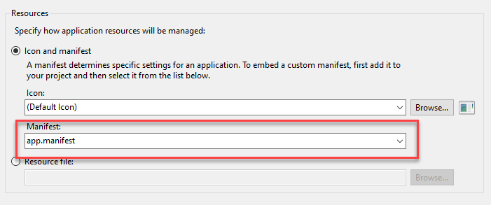
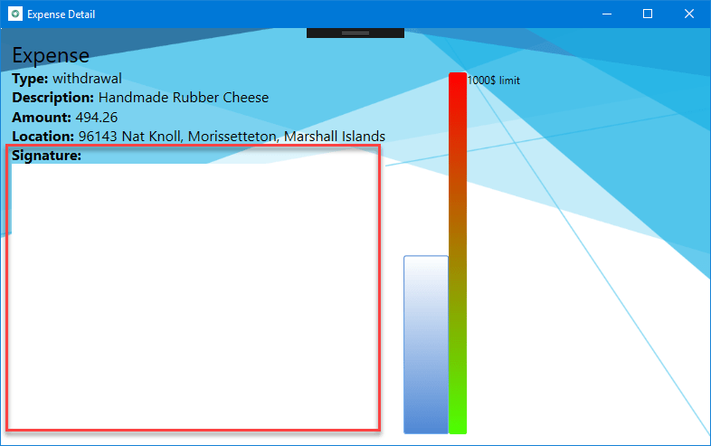
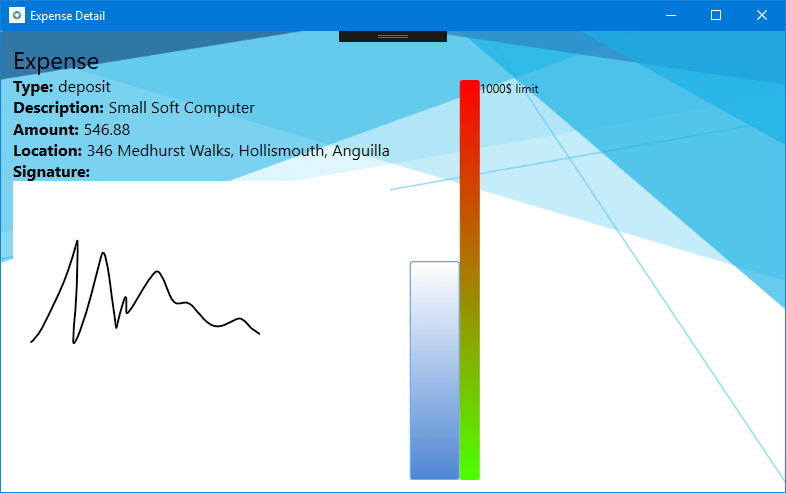

# Part 2: Add a UWP InkCanvas control using XAML Islands

This is the second part of a tutorial that demonstrates how to modernize a sample WPF desktop app named Contoso Expenses. For an overview of the tutorial, prerequisites, and instructions for downloading the sample app, see [Tutorial: Modernize a WPF app](modernize-wpf-tutorial.md). This article assumes you have already completed [part 1](modernize-wpf-tutorial-1.md).

In the fictional scenario of this tutorial, the Contoso development team wants to add support for digital signatures to the Contoso Expenses app. The UWP **InkCanvas** control is a great option for this scenario, because it supports digital ink and AI-powered features like the capability to recognize text and shapes. To do this, you will use the [InkCanvas](https://docs.microsoft.com/windows/communitytoolkit/controls/wpf-winforms/inkcanvas) wrapped UWP control available in the Windows Community Toolkit. This control wraps the interface and functionality of the UWP **InkCanvas** control for use in a WPF app. For more details about wrapped UWP controls, see [Host UWP XAML controls in desktop apps (XAML Islands)](xaml-islands.md).

## Configure the project to use XAML Islands

Before you can add an **InkCanvas** control to the Contoso Expenses app, you first need to configure the project to support UWP XAML Islands.

1. In Visual Studio 2019, right-click on the **ContosoExpenses.Core** project in **Solution Explorer** and choose **Manage NuGet Packages**.

    

2. In the **NuGet Package Manager** window, click **Browse**. Select the **Include prerelease** option, search for the `Microsoft.Toolkit.Wpf.UI.Controls` package, and install the latest preview release of the package shown in the results.

    > [!NOTE]
    > This package contains all the necessary infrastructure for hosting UWP XAML Islands in a WPF app, including the **InkCanvas** wrapped UWP control. A similar package named `Microsoft.Toolkit.Forms.UI.Controls` is available for Windows Forms apps.

3. Right-click **ContosoExpenses.Core** project in **Solution Explorer** and choose **Add -> New item**.

4. Select **Application Manifest File**, name it **app.manifest**, and click **Add**.

5. In the opened manifest file, locate the **compatibility** section and identify the following commented entry.

    ```xml
    <!-- Windows 10 -->
    <!--<supportedOS Id="{8e0f7a12-bfb3-4fe8-b9a5-48fd50a15a9a}" />-->
    ```

6. Below this entry, Add the following item.

    ```xml
    <maxversiontested Id="10.0.18362.0"/>
    ```

7. Uncomment the **supportedOS** entry for Windows 10. This section should now look like this.

    ```xml
    <!-- Windows 10 -->
    <supportedOS Id="{8e0f7a12-bfb3-4fe8-b9a5-48fd50a15a9a}" />
    <maxversiontested Id="10.0.18362.0"/>
    ```

    > [!NOTE]
    > This entry specifies that the app requires Windows 10, version 1903 (build 18362) or later. This is the first version of Windows 10 that supports XAML Islands. Without this entry in the application manifest, the app will throw an exception at run time.

8. In the manifest file, locate the following commented **application** section.

    ```xml
    <!--
    <application xmlns="urn:schemas-microsoft-com:asm.v3">
      <windowsSettings>
        <dpiAware xmlns="http://schemas.microsoft.com/SMI/2005/WindowsSettings">true</dpiAware>
      </windowsSettings>
    </application>
    -->
    ```

9. Delete this section and replace it with the following XML. This configures the app to be DPI aware and better handle different scaling factors supported by Windows 10.

    ```xml
    <application xmlns="urn:schemas-microsoft-com:asm.v3">
      <windowsSettings>
          <dpiAware xmlns="http://schemas.microsoft.com/SMI/2005/WindowsSettings">true/PM</dpiAware>
          <dpiAwareness xmlns="http://schemas.microsoft.com/SMI/2016/WindowsSettings">PerMonitorV2, PerMonitor</dpiAwareness>
      </windowsSettings>
    </application>
    ```

10. Save and close the `app.manifest` file.

12. In **Solution Explorer**, right-click the **ContosoExpenses.Core** project and choose **Properties**.

13. In the **Resources** section of the **Application** tab, make sure the **Manifest** dropdown is set to **app.manifest**.

    

16. Save the changes to the project properties.

## Add an InkCanvas control to the app

Now that you have configured your project to use UWP XAML Islands, you are now ready to add an [InkCanvas](https://docs.microsoft.com/windows/communitytoolkit/controls/wpf-winforms/inkcanvas) wrapped UWP control to the app.

1. In **Solution Explorer**, expand the **Views** folder of the **ContosoExpenses.Core** project and double-click the **ExpenseDetail.xaml** file.

2. In the **Window** element near the top of the XAML file, add the following attribute. This references the XAML namespace for the [InkCanvas](https://docs.microsoft.com/windows/communitytoolkit/controls/wpf-winforms/inkcanvas) wrapped UWP control.

    ```xml
    xmlns:toolkit="clr-namespace:Microsoft.Toolkit.Wpf.UI.Controls;assembly=Microsoft.Toolkit.Wpf.UI.Controls"
    ```

    After adding this attribute, the **Window** element should now look like this.

    ```xml
    <Window x:Class="ContosoExpenses.Views.ExpenseDetail"
            xmlns="http://schemas.microsoft.com/winfx/2006/xaml/presentation"
            xmlns:x="http://schemas.microsoft.com/winfx/2006/xaml"
            xmlns:d="http://schemas.microsoft.com/expression/blend/2008"
            xmlns:mc="http://schemas.openxmlformats.org/markup-compatibility/2006"
            xmlns:toolkit="clr-namespace:Microsoft.Toolkit.Wpf.UI.Controls;assembly=Microsoft.Toolkit.Wpf.UI.Controls"
            xmlns:converters="clr-namespace:ContosoExpenses.Converters"
            DataContext="{Binding Source={StaticResource ViewModelLocator}, Path=ExpensesDetailViewModel}"
            xmlns:local="clr-namespace:ContosoExpenses"
            mc:Ignorable="d"
            Title="Expense Detail" Height="500" Width="800"
            Background="{StaticResource HorizontalBackground}">
    ```

4. In the **ExpenseDetail.xaml** file, locate the closing `</Grid>` tag that immediately precedes the `<!-- Chart -->` comment. Add the following XAML just before the closing `</Grid>` tag. This XAML adds an **InkCanvas** control (prefixed by the **toolkit** keyword you defined earlier as a namespace) and a simple **TextBlock** that acts as a header for the control.

    ```xml
    <TextBlock Text="Signature:" FontSize="16" FontWeight="Bold" Grid.Row="5" />

    <toolkit:InkCanvas x:Name="Signature" Grid.Row="6" />
    ```

5. Save the **ExpenseDetail.xaml** file.

6. Press F5 to run the app in the debugger.

7. Choose an employee from the list and then choose one of the available expenses. Notice that the expense detail page contains space for the **InkCanvas** control.

    

    If you have a device which supports a digital pen, like a Surface, and you're running this lab on a physical machine, go on and try to use it. You will see the digital ink appearing on the screen. However, if you don't have a pen capable device and you try to sign with your mouse, nothing will happen. This is happening because the **InkCanvas** control is enabled only for digital pens by default. However, we can change this behavior.

8. Close the app and double-click the **ExpenseDetail.xaml.cs** file under the **Views** folder of the **ContosoExpenses.Core** project.

9. Add the following namespace declaration at the top of the class:

    ```csharp
    using Microsoft.Toolkit.Win32.UI.Controls.Interop.WinRT;
    ```

10. Locate the `ExpenseDetail()` constructor.

11. Add the following line of code right after the `InitializeComponent()` method and save the code file.

    ```csharp
    Signature.InkPresenter.InputDeviceTypes = CoreInputDeviceTypes.Mouse | CoreInputDeviceTypes.Pen;
    ```

    You can use the **InkPresenter** object to customize the default inking experience. This code uses the **InputDeviceTypes** property to enable mouse as well as pen input.

12. Press F5 again to rebuild and run the app in the debugger. Choose an employee from the list and then choose one of the available expenses.

13. Try now to draw something in the signature space with the mouse. This time, you'll see the ink appearing on the screen.

    

## Next steps

At this point in the tutorial, you have successfully added a UWP **InkCanvas** control to the Contoso Expenses app. You are now ready for [Part 3: Add a UWP CalendarView control using XAML Islands](modernize-wpf-tutorial-3.md).
