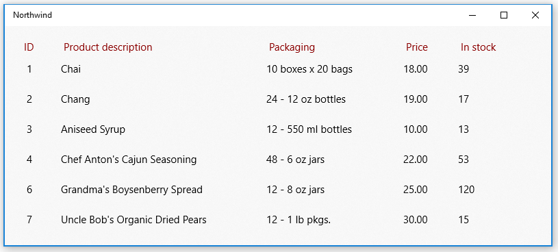

# Use a SQL Server database in a Windows app

Your app can connect directly to a SQL Server database and then store and retrieve data by using classes in the [System.Data.SqlClient](/dotnet/api/system.data.sqlclient) namespace.

In this guide, we'll show you one way to do that. If you install the [Northwind](/dotnet/framework/data/adonet/sql/linq/downloading-sample-databases) sample database onto your SQL Server instance, and then use these snippets, you'll end up with a basic UI that shows products from the Northwind sample database.

The snippets that appear in this guide are based on this more [complete sample](https://github.com/StefanWickDev/IgniteDemos/tree/master/NorthwindDemo).

## First, set up your solution
