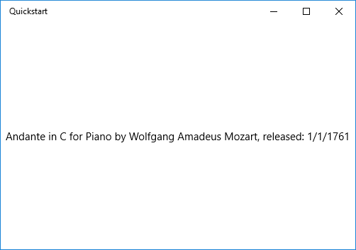
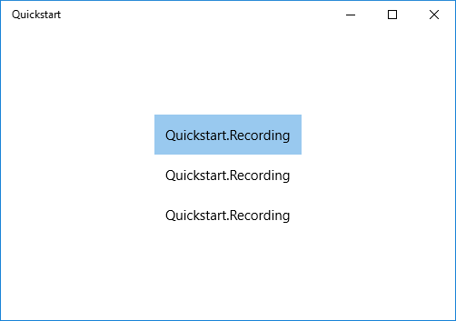
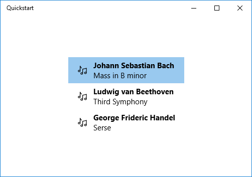
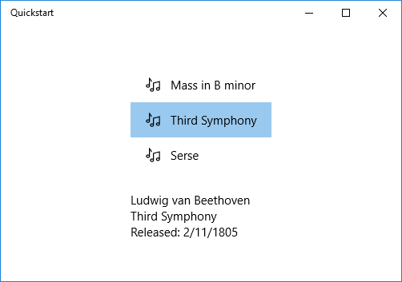

# Data binding overview

This topic shows you how to bind a control (or other UI element) to a single item or bind an items control to a collection of items in a Windows App SDK app. In addition, we show how to control the rendering of items, implement a details view based on a selection, and convert data for display. For more detailed info, see [Data binding in depth](data-binding-in-depth.md).

## Prerequisites

This topic assumes that you know how to create a basic Windows App SDK app. For instructions on creating your first Windows App SDK app, see [Create your first WinUI 3 (Windows App SDK) project](/windows/apps/winui/winui3/create-your-first-winui3-app).

## Create the project

Create a new **Blank App, Packaged (WinUI 3 in Desktop)** C# project. Name it "Quickstart".

## Binding to a single item

Every binding consists of a binding target and a binding source. Typically, the target is a property of a control or other UI element, and the source is a property of a class instance (a data model, or a view model). This example shows how to bind a control to a single item. The target is the `Text` property of a `TextBlock`. The source is an instance of a simple class named `Recording` that represents an audio recording. Let's look at the class first.

Add a new class to your project, and name the class `Recording`.

``` csharp
namespace Quickstart
{
    public class Recording
    {
        public string ArtistName { get; set; }
        public string CompositionName { get; set; }
        public DateTime ReleaseDateTime { get; set; }
        public Recording()
        {
            ArtistName = "Wolfgang Amadeus Mozart";
            CompositionName = "Andante in C for Piano";
            ReleaseDateTime = new DateTime(1761, 1, 1);
        }
        public string OneLineSummary
        {
            get
            {
                return $"{CompositionName} by {ArtistName}, released: "
                    + ReleaseDateTime.ToString("d");
            }
        }
    }
    public class RecordingViewModel
    {
        private Recording defaultRecording = new Recording();
        public Recording DefaultRecording { get { return defaultRecording; } }
    }
}
```

Next, expose the binding source class from the class that represents your window of markup. We do that by adding a property of type `RecordingViewModel` to **MainWindow.xaml.cs**.

``` csharp
namespace Quickstart
{
    public sealed partial class MainWindow : Window
    {
        public MainWindow()
        {
            this.InitializeComponent();
            ViewModel = new RecordingViewModel();
        }
        public RecordingViewModel ViewModel{ get; set; }
    }
}
```

The last piece is to bind a `TextBlock` to the `ViewModel.DefaultRecording.OneLineSummary` property.

``` xaml
<Window x:Class="Quickstart.MainWindow" ... >
    <Grid>
        <TextBlock Text="{x:Bind ViewModel.DefaultRecording.OneLineSummary}"
    HorizontalAlignment="Center"
    VerticalAlignment="Center"/>
    </Grid>
</Window>
```

Here's the result.



## Binding to a collection of items

A common scenario is to bind to a collection of business objects. In C#, the generic [**ObservableCollection&lt;T&gt;**](/dotnet/api/system.collections.objectmodel.observablecollection-1) class is a good collection choice for data binding, because it implements the [**INotifyPropertyChanged**](/dotnet/api/system.componentmodel.inotifypropertychanged) and [**INotifyCollectionChanged**](/dotnet/api/system.collections.specialized.inotifycollectionchanged) interfaces. These interfaces provide change notification to bindings when items are added or removed or a property of the list itself changes. If you want your bound controls to update with changes to properties of objects in the collection, the business object should also implement `INotifyPropertyChanged`. For more info, see [Data binding in depth](data-binding-in-depth.md).

This next example binds a [**ListView**](/windows/windows-app-sdk/api/winrt/microsoft.ui.xaml.controls.listview) to a collection of `Recording` objects. Let's start by adding the collection to our view model. Just add these new members to the `RecordingViewModel` class.

``` csharp
public class RecordingViewModel
{
    ...
    private ObservableCollection<Recording> recordings = new ObservableCollection<Recording>();
    public ObservableCollection<Recording> Recordings{ get{ return recordings; } }
    public RecordingViewModel()
    {
        recordings.Add(new Recording(){ ArtistName = "Johann Sebastian Bach",
            CompositionName = "Mass in B minor", ReleaseDateTime = new DateTime(1748, 7, 8) });
        recordings.Add(new Recording(){ ArtistName = "Ludwig van Beethoven",
            CompositionName = "Third Symphony", ReleaseDateTime = new DateTime(1805, 2, 11) });
        recordings.Add(new Recording(){ ArtistName = "George Frideric Handel",
            CompositionName = "Serse", ReleaseDateTime = new DateTime(1737, 12, 3) });
    }
}
```

And then bind a [**ListView**](/windows/windows-app-sdk/api/winrt/microsoft.ui.xaml.controls.listview) to the `ViewModel.Recordings` property.

``` xaml
<Window x:Class="Quickstart.MainWindow" ... >
    <Grid>
        <ListView ItemsSource="{x:Bind ViewModel.Recordings}"
        HorizontalAlignment="Center" VerticalAlignment="Center"/>
    </Grid>
</Window>
```

We haven't yet provided a data template for the `Recording` class, so the best the UI framework can do is to call [**ToString**](/dotnet/api/system.object.tostring#System_Object_ToString) for each item in the [**ListView**](/windows/windows-app-sdk/api/winrt/microsoft.ui.xaml.controls.listview). The default implementation of `ToString` is to return the type name.



To remedy this, we can either override [**ToString**](/dotnet/api/system.object.tostring#System_Object_ToString) to return the value of `OneLineSummary`, or we can provide a data template. The data template option is a more usual solution, and a more flexible one. You specify a data template by using the [**ContentTemplate**](/windows/windows-app-sdk/api/winrt/microsoft.ui.xaml.controls.contentcontrol.contenttemplate) property of a content control or the [**ItemTemplate**](/windows/windows-app-sdk/api/winrt/microsoft.ui.xaml.controls.itemscontrol.itemtemplate) property of an items control. Here are two ways we could design a data template for `Recording` together with an illustration of the result.

``` xaml
<ListView ItemsSource="{x:Bind ViewModel.Recordings}"
HorizontalAlignment="Center" VerticalAlignment="Center">
    <ListView.ItemTemplate>
        <DataTemplate x:DataType="local:Recording">
            <TextBlock Text="{x:Bind OneLineSummary}"/>
        </DataTemplate>
    </ListView.ItemTemplate>
</ListView>
```


``` xaml
<ListView ItemsSource="{x:Bind ViewModel.Recordings}"
HorizontalAlignment="Center" VerticalAlignment="Center">
    <ListView.ItemTemplate>
        <DataTemplate x:DataType="local:Recording">
            <StackPanel Orientation="Horizontal" Margin="6">
                <SymbolIcon Symbol="Audio" Margin="0,0,12,0"/>
                <StackPanel>
                    <TextBlock Text="{x:Bind ArtistName}" FontWeight="Bold"/>
                    <TextBlock Text="{x:Bind CompositionName}"/>
                </StackPanel>
            </StackPanel>
        </DataTemplate>
    </ListView.ItemTemplate>
</ListView>
```



For more information about XAML syntax, see [Create a UI with XAML](/visualstudio/xaml-tools/creating-a-ui-by-using-xaml-designer-in-visual-studio). For more information about control layout, see [Define layouts with XAML](/windows/apps/design/layout/layouts-with-xaml).

## Adding a details view

You can choose to display all the details of `Recording` objects in [**ListView**](/windows/windows-app-sdk/api/winrt/microsoft.ui.xaml.controls.listview) items. But that takes up a lot of space. Instead, you can show just enough data in the item to identify it and then, when the user makes a selection, you can display all the details of the selected item in a separate piece of UI known as the details view. This arrangement is also known as a master/details view, or a list/details view.

There are two ways to go about this. You can bind the details view to the [**SelectedItem**](/windows/windows-app-sdk/api/winrt/microsoft.ui.xaml.controls.primitives.selector.selecteditem) property of the [**ListView**](/windows/windows-app-sdk/api/winrt/microsoft.ui.xaml.controls.listview). Or you can use a [**CollectionViewSource**](/windows/windows-app-sdk/api/winrt/microsoft.ui.xaml.data.collectionviewsource), in which case you bind both the `ListView` and the details view to the `CollectionViewSource` (doing so takes care of the currently-selected item for you). Both techniques are shown below, and they both give the same results (shown in the illustration).

> [!NOTE]
> So far in this topic we've only used the [{x:Bind} markup extension](/windows/uwp/xaml-platform/x-bind-markup-extension), but both of the techniques we'll show below require the more flexible (but less performant) [{Binding} markup extension](/windows/uwp/xaml-platform/binding-markup-extension).

First, here's the [**SelectedItem**](/windows/windows-app-sdk/api/winrt/microsoft.ui.xaml.controls.primitives.selector.selecteditem) technique. For a C# application, the only change necessary is to the markup.

``` xaml
<Window x:Class="Quickstart.MainWindow" ... >
    <Grid>
        <StackPanel HorizontalAlignment="Center" VerticalAlignment="Center">
            <ListView x:Name="recordingsListView" ItemsSource="{x:Bind ViewModel.Recordings}">
                <ListView.ItemTemplate>
                    <DataTemplate x:DataType="local:Recording">
                        <StackPanel Orientation="Horizontal" Margin="6">
                            <SymbolIcon Symbol="Audio" Margin="0,0,12,0"/>
                            <StackPanel>
                                <TextBlock Text="{x:Bind CompositionName}"/>
                            </StackPanel>
                        </StackPanel>
                    </DataTemplate>
                </ListView.ItemTemplate>
            </ListView>
            <StackPanel DataContext="{Binding SelectedItem, ElementName=recordingsListView}"
            Margin="0,24,0,0">
                <TextBlock Text="{Binding ArtistName}"/>
                <TextBlock Text="{Binding CompositionName}"/>
                <TextBlock Text="{Binding ReleaseDateTime}"/>
            </StackPanel>
        </StackPanel>
    </Grid>
</Window>
```

For the [**CollectionViewSource**](/windows/windows-app-sdk/api/winrt/microsoft.ui.xaml.data.collectionviewsource) technique, first add a `CollectionViewSource` as a window resource.

``` xaml
<Window.Resources>
    <CollectionViewSource x:Name="RecordingsCollection" Source="{x:Bind ViewModel.Recordings}"/>
</Window.Resources>
```

And then adjust the bindings on the [**ListView**](/windows/windows-app-sdk/api/winrt/microsoft.ui.xaml.controls.listview) (which no longer needs to be named) and on the details view to use the [**CollectionViewSource**](/windows/windows-app-sdk/api/winrt/microsoft.ui.xaml.data.collectionviewsource). Note that by binding the details view directly to the `CollectionViewSource`, you're implying that you want to bind to the current item in bindings where the path cannot be found on the collection itself. There's no need to specify the `CurrentItem` property as the path for the binding, although you can do that if there's any ambiguity).

``` xaml
...
<ListView ItemsSource="{Binding Source={StaticResource RecordingsCollection}}">
...
<StackPanel DataContext="{Binding Source={StaticResource RecordingsCollection}}" ...>
...
```

And here's the identical result in each case.


## Formatting or converting data values for display

There is an issue with the rendering above. The `ReleaseDateTime` property is not just a date, it's a [**DateTime**](/uwp/api/windows.foundation.datetime). So, it's being displayed with more precision than we need. One solution is to add a string property to the `Recording` class that returns the equivalent of `ReleaseDateTime.ToString("d")`. Naming that property `ReleaseDate` would indicate that it returns a date, and not a date-and-time. Naming it `ReleaseDateAsString` would further indicate that it returns a string.

A more flexible solution is to use something known as a value converter. Here's an example of how to author your own value converter. Add the code below to your **Recording.cs** source code file.

``` csharp
public class StringFormatter : Microsoft.UI.Xaml.Data.IValueConverter
{
    // This converts the value object to the string to display.
    // This will work with most simple types.
    public object Convert(object value, Type targetType,
        object parameter, string language)
    {
        // Retrieve the format string and use it to format the value.
        string formatString = parameter as string;
        if (!string.IsNullOrEmpty(formatString))
        {
            return string.Format(formatString, value);
        }

        // If the format string is null or empty, simply
        // call ToString() on the value.
        return value.ToString();
    }

    // No need to implement converting back on a one-way binding
    public object ConvertBack(object value, Type targetType,
        object parameter, string language)
    {
        throw new NotImplementedException();
    }
}
```

Now we can add an instance of `StringFormatter` as a page resource and use it in the binding of the `TextBlock` that displays the `ReleaseDateTime` property.

``` xaml
<Window.Resources>
    <local:StringFormatter x:Key="StringFormatterValueConverter"/>
</Window.Resources>
...
<TextBlock Text="{Binding ReleaseDateTime,
    Converter={StaticResource StringFormatterValueConverter},
    ConverterParameter=Released: \{0:d\}}"/>
...
```

As you can see above, for formatting flexibility we use the markup to pass a format string into the converter by way of the converter parameter. In the code example shown in this topic, the C# value converter makes use of that parameter.

Here's the result.



## See also

* [Data binding](index.md)
