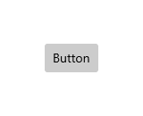

# User interface and input

When building a modern Windows app, you have a selection of UI frameworks to choose from. UI frameworks provide your app with built in controls, styles, animations, input handling, and more. This article provides an overview of the Windows UI frameworks that are currently maintained by Microsoft and compares their capabilities.

Note that Microsoft produces both UI frameworks and app platforms. App platforms will usually include a UI framework, but some UI frameworks are standalone (i.e. not shipped with an app platform), and some can work on multiple app platforms as well. To learn more about app platforms, see [Choose your app platform](/windows/apps/desktop/#choose-your-app-typechoose-your-app-type).

## User interface fundamentals

There are five main components that will go into creating a user interface for your Windows app. These components are usually built into each UI framework.

- [Controls](../design/controls/index.md) and [styles](../design/style/index.md)

  - A control is a UI element that displays content or enables interaction. Controls are the building blocks of the user interface.

    Here's an example of a Button control that's available in UWP, WinUI 2, and WinUI 3. When you place this control into your app, it automatically recieves the default design that the UI framework provides.

    

  - Styles consist of colors, typography, icons, Fluent materials, and more that can be used throughout your app's design to create a truly unique experience.

    Here's an example of a style component called [Acrylic](../design/style/acrylic.md), available in WinUI 2 and WinUI 3. Acrylic is a brush that you can use on surfaces within your app or as the background of your app. It provides a translucent texture.

    

- [Input and interaction](../design/input/index.md)

    End users may interact with your app and provide input to your app (such as selection or typing) through different methods. Some examples of input are:

  - Mouse
  - Touch
  - Gamepad
  - Pen
  - Keyboard
  - Surface Dial
  - Touchpad
  - Speech

- [Device support](../design/devices/index.md)

    End users access Windows apps on a variety of devices, and UI frameworks may only support certain ones. Some common devices for Windows apps to run on are: 

  - PCs (often referred to as "desktop", but includes laptops as well)
  - Tablets
  - HoloLens
  - Xbox
  - Surface Hub

- [Motion and animation](../design/motion/index.md)

    Built-in animations can really give your app a polished look and feel, and provide consistency with first-party apps throughout Windows.

    An example of a built-in animation in UWP, WinUI 2, and WinUI 3 is the animation that occurs when the end user switches between light and dark mode. When the end user switches modes for their entire PC, the app's UI will automatically update as well with a transition animation.

- [Usability and accessibility](../design/usability/index.md)

    In order to ensure your app is delightful to use for every single user, you must take accessibility into account.

    UI frameworks provide built-in accessibility to controls and styles with purposeful keyboard behavior, screenreader support and more. Many also provide APIs for accessible actions in custom controls, like interacting with screenreaders.

## UI frameworks

Each UI framework released by Microsoft has unique capabilities, follows different design languages, and provides different experiences to the end user. This section will compare all the main UI frameworks that you'll be choosing from when you begin to build your app.

The table below shows a brief summary of a few main capabilities between these UI frameworks. For more details on each framework, navigate through the tabs further below. 

| Capability   | WinUI 3   | WinUI 2/UWP      | WPF    | WinForms      |
|--------------|-----------|------------------|--------|---------------|
| Languages supported   | C#/.NET 5, C++/WinRT      | C#/.NET Native, C++/WinRT, C++/CX, VB    | C#/.NET 5 and .NET Framework, C++/CLI (Managed Extensions for C++), F#, VB | C#/.NET 5 and .NET Framework, C++/CLI (Managed Extensions for C++), F#, VB |
| Devices supported   | PCs (incl. laptops and tablets), support for all Windows 10 devices coming soon | All Windows 10 devices (PCs, tablets, HoloLens, Xbox, Surface Dial, and more) | Desktop PCs and laptops    | Desktop PCs and laptops    |
| Inputs supported    | All Windows 10 inputs supported      | All Windows 10 inputs supported   | Mouse and keyboard    | Mouse and keyboard    |
| Windows OS version supported | Windows 10 version 1809 and higher  | Windows 10 version 1703 and higher    | Windows XP and higher     | Windows XP and higher   |
| WebView support   | Chromium-based WebView2         | Non-chromium WebView       | WebView2 support coming soon   | WebView2 support coming soon     |
| Open Source   | Coming soon       | Yes     | Yes (.NET 5 version only)      | Yes (.NET 5 version only)   |

For more information about each of these UI frameworks, see the information on the following tabs.

### [WinUI 3](#tab/winui-3)

### WinUI 3

For most new Windows apps, we recommend using Windows UI Library (WinUI) 3 to build your user interface. WinUI 3 provides consistent, intuitive, and accessible experiences using the latest user interface (UI) patterns.

WinUI 3 is completely decoupled from the Windows OS and ships as a part of the Windows App SDK, which is a set of tools and components that represent the next evolution in the Windows app development platform.

WinUI 3 is the third generation of the Windows UI Library, preceded by WinUI 2. WinUI 2 and 3 share many of the same controls, styles, and other UI fundamentals. For more information, see [Comparison of WinUI 2 and WinUI 3](/windows/apps/winui/).

#### Key app scenarios enabled by WinUI 3

- Modern Windows apps that need to run on a variety of modern devices, with a range of modern inputs
- Desktop/Win32 apps that are written in C++
- Graphics-heavy apps or games that want to take advantage of DirectX and Win2D 
- Apps with a lot of integrated web content that need high-performance
- Apps that seek to provide experiences that "fit right in" on the Windows OS and with other first party Windows apps

#### Helpful documentation for WinUI 3

- Overview: [Windows UI Library 3](/windows/apps/winui/)
- Get started: [Create your first WinUI 3 project](../winui/winui3/create-your-first-winui3-app.md)
- Writing XAML: [XAML Platform](/windows/uwp/xaml-platform)
- API Reference: [WinUI API Reference](/windows/winui/api)
- Controls: [Controls overview](../design/controls/index.md)
- Input: [Input and interactions](../design/input/index.md)
- Motion: [Motion for Windows apps](../design/motion/index.md)
- Accessibility: [Usability for Windows apps](../design/usability/index.md)
- Samples: [WinUI 3 Controls Gallery app](https://www.microsoft.com/p/winui-3-controls-gallery/9p3jfpwwdzrc)

### [WinUI 2](#tab/winui-2)

### WinUI 2

For most UWP apps, we recommend using Windows UI Library (WinUI) 2 to build your user interface. WinUI 2 is a standalone UI framework that ships in a NuGet package and can easily be added to any UWP app to modernize the design and overall experience. 

WinUI 2 is an open source platform, and ships new updates trimesterly. 

WinUI 2 is the second generation of the Windows UI Library, succeeded by WinUI 3. WinUI 2 and 3 share many of the same controls, styles, and other UI fundamentals. For more information, see [Comparison of WinUI 2 and WinUI 3](/windows/apps/winui/).

#### Key app scenarios enabled by WinUI 2

- UWP apps that are looking to work downlevel to all versions of Windows 10
- Graphic-heavy apps or games that want to take advantage of DirectX and Win2D 
- UWP apps that need to run on a variety of modern devices, with a range of modern inputs
- Apps that seek to provide experiences that "fit right in" on the Windows OS and with other first party Windows apps

#### Helpful documentation for WinUI 2

- Overview: [Windows UI Library 2](../winui/winui2/index.md)
- Get started: [Getting started with the Windows UI 2.x Library](../winui/winui2/getting-started.md)
- Writing XAML: [XAML Platform](/windows/uwp/xaml-platform)
- API Reference: [WinUI API Reference](/windows/winui/api)
- Controls: [Controls overview](../design/controls/index.md)
- Input: [Input and interactions](../design/input/index.md)
- Motion: [Motion for Windows apps](../design/motion/index.md)
- Accessibility: [Usability for Windows apps](../design/usability/index.md)
- Samples: [XAML Controls Gallery app](https://www.microsoft.com/p/xaml-controls-gallery/9msvh128x2zt?rtc=1)

### [WPF](#tab/wpf)

### WPF

The Windows Presentation Framework (WPF) is an app model for building desktop apps with .NET 5 or .NET framework.  It's an [open source platform](https://github.com/dotnet/wpf) that is maintained by both the Windows and .NET teams.

The UI framework that ships within WPF provides controls, styles, and capabilities that are supported downlevel through Windows XP.

#### Key app scenarios enabled by WPF

- Apps that need to run downlevel to versions of Windows preceding Windows 10
- Apps that solely run on PCs, and don't require a variety of inputs such as touch
- Apps that are in need of more complex, built in controls: WPF has the largest set of built-in controls available for Windows development

#### Helpful documentation for WPF

- Overview: [Desktop Guide (WPF .NET)](/dotnet/desktop/wpf/overview)
- Get started: [Tutorial: Create a new WPF app](/dotnet/desktop/wpf/get-started/create-app-visual-studio)
- Writing XAML: [XAML Overview (WPF .NET)](/dotnet/desktop/wpf/xaml)
- API Reference: [.NET API Reference](/dotnet/api)
- Controls: [Controls (WPF)](/dotnet/framework/wpf/controls/)
- Input: [Input (WPF)](/dotnet/framework/wpf/advanced/input-wpf)
- Motion: [Animation overview](/dotnet/desktop/wpf/graphics-multimedia/animation-overview)
- Accessibility: [Accessibility best practices](/dotnet/framework/ui-automation/accessibility-best-practices)
- Samples: [WPF Samples GitHub repo](https://github.com/microsoft/WPF-Samples)

### [Windows Forms](#tab/winforms)

### Windows Forms

Windows Forms provides a unique built-in Visual Studio Designer for building desktop .NET apps. With the Designer, you build your user interface by dragging and dropping the built-in controls directly onto your app's UI.

Windows Forms is an [open source project](https://github.com/dotnet/winforms).

Note that Windows Forms does not have animations built in, unlike the other UI frameworks mentioned in this article. It also does not support XAML markup - you must use either the Designer or code to create your app's UI.

#### Key app scenarios enabled by Windows Forms

- Developers or designers who want to build apps without knowing or writing XAML
- Apps that need to run downlevel to versions of Windows preceding Windows 10
- Apps that solely run on PCs, and don't require a variety of inputs such as touch
- Apps that aren't seeking to create custom controls or highly custom UI

#### Helpful documentation for Windows Forms

- Overview: [Desktop Guide (Windows Forms .NET)](/dotnet/desktop/winforms/overview/)
- Get started: [Tutorial: Create a new WinForms app (Windows Forms .NET)](/dotnet/desktop/winforms/get-started/create-app-visual-studio)
- API Reference: [.NET API Reference](/dotnet/api)
- Controls: [Overview of using controls (Windows Forms .NET)](/dotnet/desktop/winforms/controls/overview)
- Input: [User input (Windows Forms)](/dotnet/framework/winforms/user-input-in-windows-forms)
- Accessibility: [Windows Forms Acessibility](/dotnet/desktop/winforms/advanced/windows-forms-accessibility)
- Samples: [Winforms Samples GitHub repo](https://github.com/dotnet/samples/tree/main/windowsforms)

### [Other](#tab/other)

### Other

There are a few UI frameworks that haven't been discussed in this article, including Win32/ComCtl32 and MFC. While these UI frameworks are still available for use, they are not regularly maintained and don't meet the same accessibility and design standards that Windows provides today. It's recommended that you use a more modern framework when creating new Windows apps.

If you'd like to learn about modernizing an app that's using an older UI framework, see [Modernize your desktop apps](/windows/apps/desktop/modernize).

For more information on these UI frameworks, see the following documentation:

- [MFC Overview](/cpp/mfc/mfc-desktop-applications?view=msvc-160&preserve-view=true)
- [Win32/ComCtl32](/windows/win32/appuistart/getting-started-developing-user-interfaces-portal)

---

<!--
## User interface fundamentals

For information about the fundamentals of building user interfaces for Windows apps, see the following articles.

* WinRT APIs: [Layout](/windows/uwp/design/layout/), [Style](/windows/uwp/design/style/), [Motion](/windows/uwp/design/motion/), [Visual layer](/windows/uwp/composition/visual-layer), [XAML platform](/windows/uwp/xaml-platform/)
* Win32 APIs: [Desktop user interface](/windows/win32/windows-application-ui-development), [Desktop environment and shell](/windows/win32/user-interface), [UWP Visual layer in desktop apps](../desktop/modernize/visual-layer-in-desktop-apps.md), [Windows and messages](/windows/win32/winmsg/windowing), [Menus and other resources](/windows/win32/menurc/resources), [High DPI](/windows/win32/hidpi/high-dpi-desktop-application-development-on-windows)
* .NET APIs: [Windows in WPF](/dotnet/framework/wpf/app-development/windows-in-wpf-applications), [Create a Windows Form](/dotnet/framework/winforms/creating-a-new-windows-form), [Navigation overview](/dotnet/framework/wpf/app-development/navigation-overview), [XAML in WPF](/dotnet/framework/wpf/advanced/xaml-in-wpf), [Visual layer programming](/dotnet/framework/wpf/graphics-multimedia/visual-layer-programming)

## Controls

For information about using controls in Windows apps, see the following articles.

* WinRT APIs: [Controls](/windows/uwp/design/controls-and-patterns/), [Intro to controls and patterns](/windows/uwp/design/controls-and-patterns/controls-and-events-intro), [Forms](/windows/uwp/design/controls-and-patterns/forms)
* Win32 APIs: [Windows controls](/windows/win32/controls/window-controls), [UWP controls in desktop apps (XAML Islands)](../desktop/modernize/xaml-islands.md)
* .NET APIs: [Controls (WPF)](/dotnet/framework/wpf/controls/), [Controls (Windows Forms)](/dotnet/framework/winforms/controls/)

## Input

For information about handing user input in Windows apps, see the following articles.

* WinRT APIs: [Input](/windows/uwp/design/input/)
* Win32 APIs: [Windows and messages](/windows/win32/winmsg/windowing), [User interaction](/windows/win32/user-interaction)
* .NET APIs: [Input (WPF)](/dotnet/framework/wpf/advanced/input-wpf), [User input (Windows Forms)](/dotnet/framework/winforms/user-input-in-windows-forms)
-->