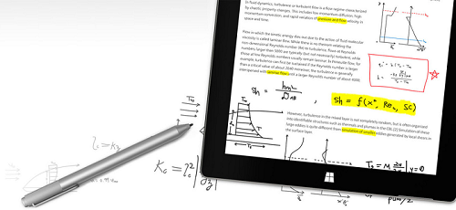
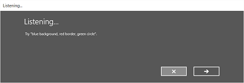
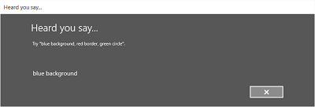
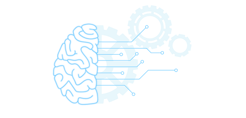

# Features and technologies for Windows apps

No matter what type of app you are building or device you are targeting, Windows supports many features that are key building blocks for important app scenarios. Some of these features are exposed to the Universal Windows Platform (UWP), Win32 (Windows API), and other app platforms in different ways. The following articles help you understand how certain Windows features are supported in different app platforms and how to get started using the features in your code.

This article provides a tailored list of articles to read more about how you can access important Windows features and technologies in the UWP, Win32 (Windows API), WPF, and Windows Forms app platforms. For complete information about the development features of each platform, see the following resources:

* [UWP documentation](/windows/uwp/index)
* [Win32 (Windows API) documentation](/windows/desktop/index)
* [WPF documentation](https://docs.microsoft.com/dotnet/framework/wpf/index)
* [Windows Forms documentation](https://docs.microsoft.com/dotnet/framework/winforms/index)

## Key Windows features and technologies

The following sections highlight several important Windows features and technologies that enable you to deliver modern and deliver compelling experiences to your customers.

### Windows Ink

  

The Windows Ink platform, together with a pen device, provides a natural way to create digital handwritten notes, drawings, and annotations. The platform supports capturing digitizer input as ink data, generating ink data, managing ink data, rendering ink data as ink strokes on the output device, and converting ink to text through handwriting recognition.

For more information about the different ways to use Windows Ink in Windows apps, see [Windows Ink](/windows/uwp/design/input/pen-and-stylus-interactions).

### Speech interactions

Windows provides many ways to integrate speech recognition and text-to-speech (also known as TTS, or speech synthesis) directly into the user experience of your app. Speech can be a robust and enjoyable way for people to interact with your app, complementing, or even replacing, keyboard, mouse, touch, and gestures.

For more information about the different ways to use speech interactions in Windows apps, see [Speech interactions](/windows/uwp/design/input/speech-interactions).

### Windows AI

We offer several different AI solutions that you can use to enhance your Windows applications. With Windows Machine Learning, you can integrate trained machine learning models into your apps and run them locally on the device. Windows Vision Skills allows you to use pre-built libraries to accomplish common image processing tasks, or create your own custom solutions. DirectML provides low-level, DirectX-style APIs that let you take full advantage of the hardware.

For more information about the different ways to integrate AI in Windows apps, see [Windows AI](https://docs.microsoft.com/windows/ai/).

## Features and technologies by platform

The following sections provides useful links to learn more about how to integrate with core Windows features and technologies from our main app platforms: UWP, Win32 (Windows API), WPF, and Windows Forms.

### User interface and accessibility

|  UWP  |  Win32 (Windows API) |  WPF  |  Windows Forms  |
|-------|----------------------|-------|-----------------|
| [Design](/windows/uwp/design/basics/)  [Layout](/windows/uwp/design/layout/)  [Controls](/windows/uwp/design/controls-and-patterns/)  [Input](/windows/uwp/design/input/)  [Tiles](/windows/uwp/design/shell/tiles-and-notifications/creating-tiles)  [Visual layer](/windows/uwp/composition/visual-layer)  [XAML platform](/windows/uwp/xaml-platform/)  [Launching, resuming, and background tasks](/windows/uwp/launch-resume/)  [Windows accessibility](/windows/uwp/design/accessibility/accessibility)    |  [Desktop user interface](/windows/desktop/windows-application-ui-development)  [Desktop environment and shell](/windows/desktop/user-interface)  [Windows controls](/windows/desktop/controls/window-controls)  [UWP controls in desktop apps (XAML Islands)](/windows/apps/desktop/modernize/xaml-islands)  [UWP Visual layer in desktop apps](/windows/apps/desktop/modernize/visual-layer-in-desktop-apps)  [Windows and messages](/windows/desktop/winmsg/windowing)  [Menus and other resources](/windows/desktop/menurc/resources)  [High DPI](/windows/desktop/hidpi/high-dpi-desktop-application-development-on-windows)  [Accessibility](/windows/desktop/accessibility)    |  [Windows in WPF](https://docs.microsoft.com/dotnet/framework/wpf/app-development/windows-in-wpf-applications)  [Navigation overview](https://docs.microsoft.com/dotnet/framework/wpf/app-development/navigation-overview)  [XAML in WPF](https://docs.microsoft.com/dotnet/framework/wpf/advanced/xaml-in-wpf)  [Controls](https://docs.microsoft.com/dotnet/framework/wpf/controls/)  [Visual layer programming](https://docs.microsoft.com/dotnet/framework/wpf/graphics-multimedia/visual-layer-programming)  [Input](https://docs.microsoft.com/dotnet/framework/wpf/advanced/input-wpf)  [Accessibility](https://docs.microsoft.com/dotnet/framework/ui-automation/)    | [Create a Windows Form](https://docs.microsoft.com/dotnet/framework/winforms/creating-a-new-windows-form)  [Controls](https://docs.microsoft.com/dotnet/framework/winforms/controls/)  [Dialog boxes](https://docs.microsoft.com/dotnet/framework/winforms/dialog-boxes-in-windows-forms)  [User input](https://docs.microsoft.com/dotnet/framework/winforms/user-input-in-windows-forms)  [Windows Forms accessibility](https://docs.microsoft.com/dotnet/framework/winforms/advanced/windows-forms-accessibility)   |

### Audio, video, and graphics

|  UWP  |  Win32 (Windows API) |  WPF  |  Windows Forms  |
|-------|----------------------|-------|-----------------|
| [Audio, video, and camera](/windows/uwp/audio-video-camera/)  [Media playback](/windows/uwp/audio-video-camera/media-playback/)  [Visual layer](/windows/uwp/composition/visual-layer)  [XAML platform](/windows/uwp/xaml-platform/) |  [Audio and video](/windows/desktop/audio-and-video)  [Graphics and gaming](/windows/desktop/graphics-and-multimedia)  [DirectX](/windows/desktop/getting-started-with-directx-graphics)  [Direct2D](/windows/desktop/direct2d/direct2d-portal)  [Direct3D](/windows/desktop/direct3d)  [Windows GDI](/windows/desktop/gdi/windows-gdi)  [GDI+](/windows/desktop/gdiplus/-gdiplus-gdi-start)  |  [Graphics](https://docs.microsoft.com/dotnet/framework/wpf/graphics-multimedia/graphics)  [Mutimedia](https://docs.microsoft.com/dotnet/framework/wpf/graphics-multimedia/multimedia-overview)  |  [Graphics and drawing](https://docs.microsoft.com/dotnet/framework/winforms/advanced/graphics-and-drawing-in-windows-forms?view=netframework-4.8)  [SoundPlayer class](https://docs.microsoft.com/dotnet/framework/winforms/controls/soundplayer-class-overview)  |

### Data access and app resources

|  UWP  |  Win32 (Windows API) |  WPF  |  Windows Forms  |
|-------|----------------------|-------|-----------------|
| [Data access](/windows/uwp/data-access/)  [Data binding](/windows/uwp/data-binding/)  [Files, folders, and libraries](/windows/uwp/files/)  [App resources](/windows/uwp/app-resources/) |  [Data access and storage](/windows/desktop/data-access-and-storage)  [Local file systems](/windows/desktop/fileio/file-systems)  [Resource overviews](/windows/desktop/menurc/resources-overviews)</li>  |  [Data and modeling](https://docs.microsoft.com/dotnet/framework/data/)  [Data binding](https://docs.microsoft.com/dotnet/framework/wpf/data/data-binding-wpf)  [Resources in .NET apps](https://docs.microsoft.com/dotnet/framework/resources/?view=netframework-4.8)  [Application resource, content, and data files](https://docs.microsoft.com/dotnet/framework/wpf/app-development/wpf-application-resource-content-and-data-files)  |  [Data and modeling](https://docs.microsoft.com/dotnet/framework/data/)  [Data binding](https://docs.microsoft.com/dotnet/framework/winforms/windows-forms-data-binding)  [Resources in .NET apps](https://docs.microsoft.com/dotnet/framework/resources/?view=netframework-4.8)  [Application settings](https://docs.microsoft.com/dotnet/framework/winforms/advanced/application-settings-for-windows-forms)  |

### Devices, documents, and printing

|  UWP  |  Win32 (Windows API) |  WPF  |  Windows Forms  |
|-------|----------------------|-------|-----------------|
| [Enable device capabilities](/windows/uwp/devices-sensors/enable-device-capabilities)  [Enumerate devices](/windows/uwp/devices-sensors/enumerate-devices)  [Sensors](/windows/uwp/devices-sensors/sensors)  [Bluetooth](/windows/uwp/devices-sensors/bluetooth)  [Printing and scanning](/windows/uwp/devices-sensors/printing-and-scanning)  [NFC](/windows/uwp/devices-sensors/nfc) | [Sensor API](/windows/desktop/sensorsapi/portal)  [Printing](/desktop/printdocs/printdocs-printing)  [UPnP APIs](/desktop/upnp/universal-plug-and-play-start-page) |  [Printing and print system management](https://docs.microsoft.com/dotnet/framework/wpf/advanced/printing-and-print-system-management)  |  [Print support](https://docs.microsoft.com/dotnet/framework/winforms/advanced/windows-forms-print-support)  |

### System, network, and power

|  UWP  |  Win32 (Windows API) |  WPF  |  Windows Forms  |
|-------|----------------------|-------|-----------------|
| [Enumerate devices](/windows/uwp/devices-sensors/enumerate-devices)  [Get battery information](/windows/uwp/devices-sensors/get-battery-info)  [Threading and async programming](/windows/uwp/threading-async/)  [Networking and web services](/windows/uwp/networking/) | [System services](/windows/desktop/system-services)  [Memory management](/windows/desktop/memory/memory-management)  [Power management](/windows/desktop/power/power-management-portal)  [Processes and threads](/windows/desktop/procthread/processes-and-threads)  [Networking and Internet](/windows/desktop/networking)  [Windows system information](/windows/desktop/sysinfo/windows-system-information) |  [Threading model](https://docs.microsoft.com/dotnet/framework/wpf/advanced/threading-model)  [Network programming in the .NET Framework](https://docs.microsoft.com/dotnet/framework/network-programming/)  |  [System Information](https://docs.microsoft.com/dotnet/framework/winforms/advanced/system-information-and-windows-forms)  [Power management](https://docs.microsoft.com/dotnet/framework/winforms/advanced/power-management-in-windows-forms)  [Network programming in the .NET Framework](https://docs.microsoft.com/dotnet/framework/network-programming/)  [Networking in Windows Forms](https://docs.microsoft.com/dotnet/framework/winforms/advanced/networking-in-windows-forms-applications)  |

### Packaging and deployment

|  UWP  |  Win32 (Windows API) |  WPF  |  Windows Forms  |
|-------|----------------------|-------|-----------------|
| [Packaging apps](/windows/uwp/packaging/)  [MSIX](https://docs.microsoft.com/windows/msix/)  [App package manifest schema](https://docs.microsoft.com/uwp/schemas/appxpackage/uapmanifestschema/schema-root) | [Package Windows desktop apps (MSIX)](/windows/msix/desktop/desktop-to-uwp-root)  [Application installation and servicing](/windows/desktop/application-installing-and-servicing)  [Windows Installer](/windows/desktop/msi/windows-installer-portal) |  [Package Windows desktop apps (MSIX)](/windows/msix/desktop/desktop-to-uwp-root)  [Deploying the .NET Framework and applications](https://docs.microsoft.com/dotnet/framework/deployment/)  [Deploying a WPF application](https://docs.microsoft.com/dotnet/framework/wpf/app-development/deploying-a-wpf-application-wpf)  |  [Package Windows desktop apps (MSIX)](/windows/msix/desktop/desktop-to-uwp-root)  [Deploying the .NET Framework and applications](https://docs.microsoft.com/dotnet/framework/deployment/)  [ClickOnce Deployment for Windows Forms](https://docs.microsoft.com/dotnet/framework/winforms/clickonce-deployment-for-windows-forms)  |
