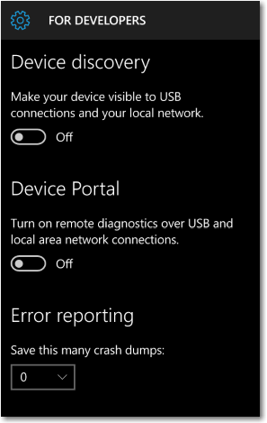
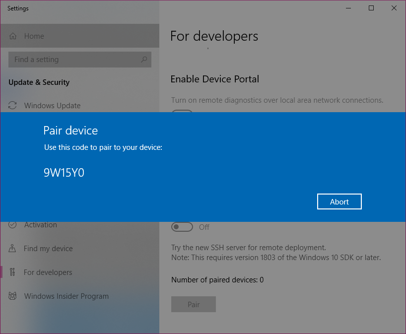

# Developer Mode features and debugging

If you're just interested in the basics of installing developer mode on your app, you can just follow the instructions outlined in [enable your device for development](enable-your-device-for-development.md) to get started. This article covers advanced features of developer mode, developer mode on previous versions of Windows 10, and debugging failures in Developer Mode installation.

## Additional Developer Mode features

For each device family, additional developer features might be available. These features are available only when Developer Mode is enabled on the device, and might vary depending on your OS version.

This image shows developer features for Windows 10:



### <span id="device-discovery-and-pairing"></span>Device Portal

To learn more about Device Portal, see [Windows Device Portal overview](/windows/uwp/debug-test-perf/device-portal.md).


For device specific setup instructions, see:
- [Device Portal for Desktop](/windows/uwp/debug-test-perf/device-portal-desktop)
- [Device Portal for HoloLens](/windows/mixed-reality/using-the-windows-device-portal)
- [Device Portal for IoT](/windows/iot-core/manage-your-device/deviceportal)
- [Device Portal for Mobile](/windows/uwp/debug-test-perf/device-portal-mobile)
- [Device Portal for Xbox](/windows/uwp/xbox-apps/device-portal-xbox)

If you encounter problems enabling Developer Mode or Device Portal, see the [Known Issues](https://social.msdn.microsoft.com/Forums/en-US/home?forum=Win10SDKToolsIssues&sort=relevancedesc&brandIgnore=True&searchTerm=%22device+portal%22) forum to find workarounds for these issues, or visit [Failure to install the Developer Mode package](#failure-to-install-developer-mode-package) for additional details and which WSUS KBs to allow in order to unblock the Developer Mode package.

### Sideload apps

> [!IMPORTANT]
> As of the latest Windows 10 update, this setting won't be visible, as sideloading is enabled by default. If you are on a previous version of Windows 10, your default settlings will only permit you to run apps from the Microsoft Store, and you must enable Sideloading to install apps from non-Microsoft sources.

The Sideload apps setting is typically used by companies or schools that need to install custom apps on managed devices without going through the Microsoft Store, or anyone else who needs to run apps from non-Microsoft sources. In this case, it's common for the organization to enforce a policy that disables the *UWP apps* setting, as shown previously in the image of the settings page. The organization also provides the required certificate and install location to sideload apps. For more info, see the TechNet articles [Sideload apps in Windows 10](/windows/deploy/sideload-apps-in-windows-10) and [Microsoft Intune fundamentals](/mem/intune/fundamentals/).

Device family specific info

-   On the desktop device family: You can install an app package (.appx) and any certificate that is needed to run the app by running the Windows PowerShell script that is created with the package ("Add-AppDevPackage.ps1"). For more info, see [Package a desktop or UWP app in Visual Studio](/windows/msix/package/packaging-uwp-apps).

-   On the mobile device family: If the required certificate is already installed, you can tap the file to install any .appx sent to you via email or on an SD card.


**Sideload apps** is a more secure option than Developer Mode because you cannot install apps on the device without a trusted certificate.

> [!NOTE]
> If you sideload apps, you should still only install apps from trusted sources. When you install a sideloaded app that has not been certified by the Microsoft Store, you are agreeing that you have obtained all rights necessary to sideload the app and that you are solely responsible for any harm that results from installing and running the app. See the Windows &gt; Microsoft Store section of this [privacy statement](https://privacy.microsoft.com/privacystatement).


### SSH

SSH services are enabled when you enable Device Discovery on your device.  This is used when your device is a remote deployment target for MSIX packaged applications. The names of the services are 'SSH Server Broker' and 'SSH Server Proxy'.

> [!NOTE]
> This is not Microsoft's OpenSSH implementation, which you can find on [GitHub](https://github.com/PowerShell/Win32-OpenSSH).  

In order to take advantage of the SSH services, you can enable device discovery to allow pin pairing. If you intend to run another SSH service, you can set this up on a different port or turn off the Developer Mode SSH services. To turn off the SSH services, turn off Device Discovery.  

SSH login is done via the "DevToolsUser" account, which accepts a password for authentication.  This password is the PIN displayed on the device after pressing the device discovery "Pair" button, and is only valid while the PIN is displayed.  An SFTP subsystem is also enabled, for manual management of the DevelopmentFiles folder where loose file deployments are installed from Visual Studio.

#### Caveats for SSH usage
The existing SSH server used in Windows is not yet protocol compliant, so using an SFTP or SSH client may require special configuration.  In particular, the SFTP subsystem runs at version 3 or less, so any connecting client should be configured to expect an old server.  The SSH server on older devices uses `ssh-dss` for public key authentication, which OpenSSH has deprecated.  To connect to such devices the SSH client must be manually configured to accept `ssh-dss`.  

### Device Discovery

When you enable device discovery, you are allowing your device to be visible to other devices on the network through mDNS.  This feature also allows you to get the SSH PIN for pairing to this device by pressing the "Pair" button exposed once device discovery is enabled.  This PIN prompt must be displayed on the screen in order to complete your first Visual Studio deployment targeting the device.  



You should enable device discovery only if you intend to make the device a deployment target. For example, if you use Device Portal to deploy an app to a phone for testing, you need to enable device discovery on the phone, but not on your development PC.

### Optimizations for Windows Explorer, Remote Desktop, and PowerShell (Desktop only)

 On the desktop device family, the **For developers** settings page has shortcuts to settings that you can use to optimize your PC for development tasks. For each setting, you can select the checkbox and click **Apply**, or click the **Show settings** link to open the settings page for that option.


## Notes
In early versions of Windows 10 Mobile, a Crash Dumps option was present in the Developer Settings menu.  This has been moved to [Device Portal](/windows/uwp/debug-test-perf/device-portal.md) so that it can be used remotely rather than just over USB.  

There are several tools you can use to deploy an app from a Windows 10 PC to a Windows 10 device. Both devices must be connected to the same subnet of the network by a wired or wireless connection, or they must be connected by USB. Both of the ways listed install only the app package (.appx/.appxbundle); they do not install certificates.

-   Use the Windows 10 Application Deployment (WinAppDeployCmd) tool. Learn more about [the WinAppDeployCmd tool](/previous-versions/windows/apps/mt203806(v=vs.140)).
-   You can use [Device Portal](/windows/uwp/debug-test-perf/device-portal.md) to deploy from your browser to a mobile device running Windows 10, Version 1511 or later. Use the **[Apps](/windows/uwp/debug-test-perf/device-portal.md#apps-manager)** page in Device Portal to upload an app package (.appx) and install it on the device.

## Failure to install Developer Mode package
Sometimes, due to network or administrative issues, Developer Mode won't install correctly. The Developer Mode package is required for **remote** deployment to this PC -- using Device Portal from a browser or Device Discovery to enable SSH -- but not for local development.  Even if you encounter these issues, you can still deploy your app locally using Visual Studio, or from this device to another device.

See the [Known Issues](https://social.msdn.microsoft.com/Forums/en-US/home?forum=Win10SDKToolsIssues&sort=relevancedesc&brandIgnore=True&searchTerm=%22device+portal%22) forum to find workarounds to these issues and more.

> [!NOTE]
> If Developer Mode doesn't install correctly, we encourage you to file a feedback request. In the **Feedback Hub** app, select **Add new feedback**, and choose the **Developer Platform** category and the **Developer Mode** subcategory. Submitting feedback will help Microsoft resolve the issue you encountered.

### Failed to locate the package

"Developer Mode package couldn’t be located in Windows Update. Error Code 0x80004005 Learn more"   

This error may occur due to a network connectivity problem, Enterprise settings, or the package may be missing.

To fix this issue:

1. Ensure your computer is connected to the Internet.
2. If you are on a domain-joined computer, speak to your network administrator. The Developer Mode package, like all Features on Demand,  is blocked by default in WSUS.
2.1. In order to unblock the Developer Mode package in the current and previous releases, the following KBs should be allowed in WSUS: 4016509, 3180030, 3197985  
3. Check for Windows updates in the Settings > Updates and Security > Windows Updates.
4. Verify that the Windows Developer Mode package is present in Settings > System > Apps & Features > Manage optional features > Add a feature. If it is missing, Windows cannot find the correct package for your computer.

After doing any of the above steps, disable and then re-enable Developer Mode to verify the fix.


### Failed to install the package

"Developer Mode package failed to install. Error code 0x80004005  Learn more"

This error may occur due to incompatibilities between your build of Windows and the Developer Mode package.

To fix this issue:

1. Check for Windows updates in the Settings > Updates and Security > Windows Updates.
2. Reboot your computer to ensure all updates are applied.


## Use group policies or registry keys to enable a device

For most developers, you want to use the settings app to enable your device for debugging. In certain scenarios, such as automated tests, you can use other ways to enable your Windows 10 desktop device for development.  Note that these steps will not enable the SSH server or allow the device to be targeted for remote deployment and debugging.

You can use gpedit.msc to set the group policies to enable your device, unless you have Windows 10 Home. If you do have Windows 10 Home, you need to use regedit or PowerShell commands to set the registry keys directly to enable your device.

**Use gpedit to enable your device**

1.  Run **Gpedit.msc**.
2.  Go to Local Computer Policy &gt; Computer Configuration &gt; Administrative Templates &gt; Windows Components &gt; App Package Deployment
3.  To enable sideloading, edit the policies to enable:

    -   **Allow all trusted apps to install**

    OR

    To enable developer mode, edit the policies to enable both:

    -   **Allow all trusted apps to install**
    -   **Allows development of UWP apps and installing them from an integrated development environment (IDE)**

4.  Reboot your machine.

**Use regedit to enable your device**

1.  Run **regedit**.
2.  To enable sideloading, set the value of this DWORD to 1:

    -   `HKLM\SOFTWARE\Microsoft\Windows\CurrentVersion\AppModelUnlock\AllowAllTrustedApps`

    OR

    To enable developer mode, set the values of this DWORD to 1:

    -   `HKLM\SOFTWARE\Microsoft\Windows\CurrentVersion\AppModelUnlock\AllowDevelopmentWithoutDevLicense`

**Use PowerShell to enable your device**

1.  Run PowerShell with administrator privileges.
2.  To enable sideloading, run this command:

    ```powershell
    PS C:\WINDOWS\system32> reg add "HKEY_LOCAL_MACHINE\SOFTWARE\Microsoft\Windows\CurrentVersion\AppModelUnlock" /t REG_DWORD /f /v "AllowAllTrustedApps" /d "1"
    ```

    OR

    To enable developer mode, run this command:

    ```powershell
    PS C:\WINDOWS\system32> reg add "HKEY_LOCAL_MACHINE\SOFTWARE\Microsoft\Windows\CurrentVersion\AppModelUnlock" /t REG_DWORD /f /v "AllowDevelopmentWithoutDevLicense" /d "1"
    ```

## Upgrade your device from Windows 8.1 to Windows 10

When you create or sideload apps on your Windows 8.1 device, you have to install a developer license. If you upgrade your device from Windows 8.1 to Windows 10, this information remains. Run the following command to remove this information from your upgraded Windows 10 device. This step is not required if you upgrade directly from Windows 8.1 to Windows 10, Version 1511 or later.

**To unregister a developer license**

1.  Run PowerShell with administrator privileges.
2.  Run this command: `unregister-windowsdeveloperlicense`.

After this you need to enable your device for development as described in this topic so that you can continue to develop on this device. If you don't do that, you might get an error when you debug your app, or you try to create a package for it. Here is an example of this error:

Error : DEP0700 : Registration of the app failed.
