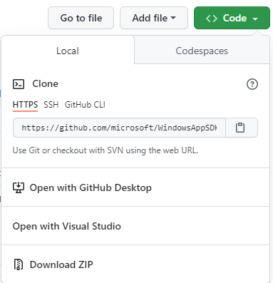
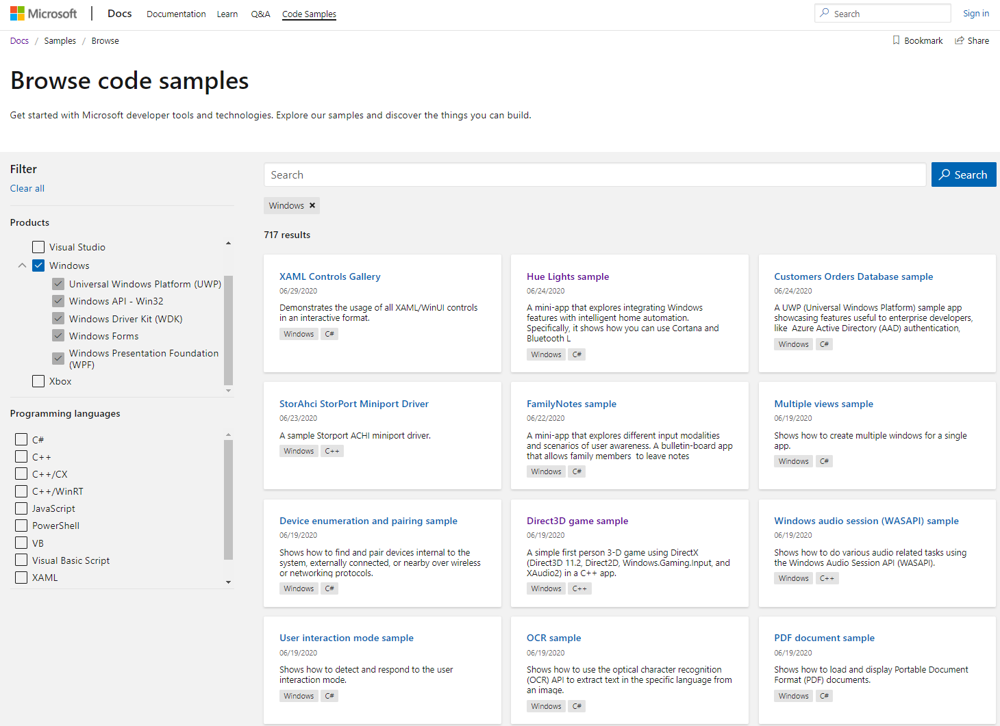

# Sample applications for Windows development

We've published several Github repositories (repos) containing sample applications for Windows development. The available sample apps cover different application types. They demonstrate a range of Windows features, API usage patterns, and end-to-end scenarios.

## Windows sample apps repos

Most of the repos below include several sample apps that demonstrate specific APIs and scenarios in the same technology area. This isn't a comprehensive list of available Windows sample apps. You can find many additional sample apps, including end-to-end and mini sample apps, through the [Samples Browser](/samples/browse/).

| Sample apps repo | Description |
|-------------|-------------|
| [Template Studio](https://github.com/microsoft/TemplateStudio#template-studio) | Accelerate the creation of apps using a wizard-based UI. |
| [Windows App SDK samples](https://github.com/microsoft/WindowsAppSDK-Samples) | Demonstrates API usage patterns for the Windows App SDK &mdash; the next evolution in the Windows app development platform. |
| [WinUI Gallery](https://github.com/Microsoft/WinUI-Gallery) | Demonstrates all of the Xaml and Windows UI library controls available to make a Fluent Windows app. |
| [App Model Samples](https://github.com/Microsoft/AppModelSamples) | Contains sample apps that demonstrate the core application activation and lifecycle management infrastructure of various platforms such as the Universal Windows Platform (UWP), Windows Forms (WinForms), and console. |
| [Windows classic samples](https://github.com/microsoft/Windows-classic-samples) | Demonstrates a wide range of desktop app scenarios, including Win32, Windows Runtime (WinRT), and .NET. |
| [Universal Windows Platform (UWP) app samples](https://github.com/microsoft/Windows-universal-samples) | Demonstrates WinRT API usage patterns for UWP. |
| [Desktop Bridge to UWP samples](https://github.com/Microsoft/DesktopBridgeToUWP-Samples) | Demonstrates the Desktop Conversion Extensions for converting classic desktop apps (such as Win32, Windows Presentation Foundation, and Windows Forms) and games to UWP apps and games. |
| [DirectX 12 graphics samples](https://github.com/Microsoft/DirectX-Graphics-Samples) | Demonstrates how to build graphics-intensive apps on Windows using DirectX 12. |
| [Windows Composition samples](https://github.com/microsoft/WindowsCompositionSamples) | Demonstrates how to use types from the **Windows.UI.Xaml** and **Windows.UI.Composition** namespaces to make beautiful UWP apps. |
| [Windows samples for IoT](https://github.com/Microsoft/Windows-iotcore-samples) | Sample apps to help you get started with developing for Windows on Devices. |
| [Windows Community Toolkit](https://github.com/windows-toolkit/WindowsCommunityToolkit) | A collection of helper functions, custom controls, and app services. It simplifies and demonstrates common developer tasks when building apps for Windows. |
| [Windows task snippets](https://github.com/Microsoft/Windows-task-snippets) | Ready-to-use snippets of code that accomplish small but useful tasks of interest to UWP app developers. These snippets show simple solutions to common problems, and simple recipes to help you implement new app features. |
| [Win2D](https://github.com/Microsoft/win2d) | Win2D is an easy-to-use Windows Runtime (WinRT) API for immediate-mode 2D graphics rendering with GPU acceleration. It's available to C# and C++ developers, and it utilizes the power of Direct2D, integrating seamlessly with XAML and **CoreWindow**. |

## Using the sample apps repos

The following sections include guidance on how to access and use sample apps from Github repos. You can share your feedback and report issues.

### Download the source code

To download the source code for a specific sample app, go to the main page of the relevant Microsoft Github repo, and choose either **Clone** or **Download ZIP**.

If you don't have a Github account, then you can download the `.zip` file. Unzip the file before opening the sample apps. When updates are made to any sample apps, you can either download the latest `.zip` file, or pull down the changes using Git.

### Open and run sample apps

Once you have the sample apps downloaded on your development computer, in most cases you can navigate to the solution (`.sln`) file for the chosen sample app, and open it in Visual Studio. Each individual repository might include further prerequisites and steps on building and running a specific sample app.

### Give feedback, ask questions, and report issues

If you have problems or questions with a sample app, use the **Issues** tab in the repository where the sample app is hosted to create a new issue. Some Github repositories such as the [Windows App SDK Samples repo](https://github.com/microsoft/WindowsAppSDK-Samples) might also use the **Discussions** feature, which can be used to share ideas, and engage with other community members.

## Samples Browser

To make finding specific sample apps easier, you can browse and search a categorized collection of sample apps for various Microsoft developer tools and technologies through the [Samples Browser](/samples/browse/). You can find sample apps by searching or applying product and/or programming language filters. Not all Windows sample apps are available through the Samples Browser.

## Next steps

- [Best Practices](best-practices.md)
- [Windows developer FAQ](windows-developer-faq.yml)
