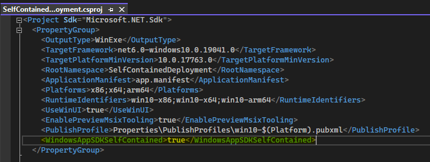

# Windows App SDK deployment guide for self-contained apps

A Windows App SDK project is framework-dependent by default. To switch to self-contained deployment, follow the steps below (the terms *framework-dependent* and *self-contained* are described in [Windows App SDK deployment overview](../deploy-overview.md)).

* In Visual Studio, right-click the app project node, and click **Edit Project File** to open the app project file for editing. For a C++ project, first click **Unload Project**.
* In the app project file, inside the main `PropertyGroup`, add `<WindowsAppSDKSelfContained>true</WindowsAppSDKSelfContained>` as shown in the screenshot below.


* For MSIX-packaged projects, in the app project file, at the end of the file before the closing `</Project>`, add the `Target` shown below.
    
```
  <Target Name="_RemoveFrameworkReferences" BeforeTargets="_ConvertItems;_CalculateInputsForGenerateCurrentProjectAppxManifest">
    <ItemGroup>
      <FrameworkSdkReference Remove="@(FrameworkSdkReference)" Condition="$([System.String]::Copy('%(FrameworkSdkReference.SDKName)').StartsWith('Microsoft.WindowsAppRuntime.'))" />
    </ItemGroup>
  </Target>
```
> [!NOTE]
> This is a workaround for a bug in Windows App SDK 1.1 and will not be necessary with Windows App SDK 1.2. It is only required for MSIX-packaged projects.
* Save and close the project file.
* Click **Reload Project**.
* If you're using a **Windows Application Packaging Project** (rather than the single-project MSIX that you get with **Blank App, Packaged (WinUI 3 in Desktop)**), then make all of the above changes in the project file for the packaging project as well.

> [!NOTE]
> Library projects should not be changed. Self-contained deployment should only be configured in app projects (and, where applicable, in a **Windows Application Packaging Project**).

For sample apps, see [Windows App SDK self-contained deployment samples](https://github.com/microsoft/WindowsAppSDK-Samples/tree/main/Samples/SelfContainedDeployment).

Having set the `WindowsAppSDKSelfContained` property to `true` in your project file, the contents of the Windows App SDK Framework package will be extracted to your build output, and deployed as part of your application.

> [!NOTE]
> .NET apps need to be [published as self-contained](/dotnet/core/deploying/#publish-self-contained) as well to be fully self-contained. See [this sample](https://github.com/microsoft/WindowsAppSDK-Samples/blob/f1a30c2524c785739fee842d02a1ea15c1362f8f/Samples/SelfContainedDeployment/cs-winui-unpackaged/SelfContainedDeployment.csproj#L12) for how to configure .NET self-contained with publish profiles. `dotnet publish` is not yet supported with Windows App SDK 1.1.

> [!NOTE]
> C++ apps need to use the [hybrid CRT](https://github.com/microsoft/WindowsAppSDK/blob/main/docs/Coding-Guidelines/HybridCRT.md#what-is-the-hybrid-crt) as well to be fully self-contained. Importing [HybridCRT.props](https://github.com/microsoft/WindowsAppSDK/blob/main/HybridCRT.props) from [Directory.Build.props](/visualstudio/msbuild/customize-your-build#directorybuildprops-and-directorybuildtargets) is the recommended way to configure it for all projects in a solution (see an example in [Directory.Build.props](https://github.com/microsoft/WindowsAppSDK-Samples/blob/43404afcc4e72294b3e2706d2eff12418dbb815a/Samples/SelfContainedDeployment/cpp-winui-unpackaged/Directory.Build.props#L3)). MSIX-packaged apps must also set `<UseCrtSDKReferenceStaticWarning>false</UseCrtSDKReferenceStaticWarning>` in their project file. See the [Self-contained deployment](https://github.com/microsoft/WindowsAppSDK-Samples/tree/main/Samples/SelfContainedDeployment/) sample app for how to use the hybrid CRT.

If your app is MSIX-packaged (for more info, see [Deployment overview](/windows/apps/package-and-deploy/)), then the Windows App SDK dependencies will be included as content inside the MSIX package. Deploying the app still requires registering the MSIX package like any other MSIX-packaged app.

If your app is not MSIX-packaged, then the Windows App SDK dependencies are copied next to the `.exe` in your build output. You can xcopy-deploy the resulting files, or include them in a custom installer.

## Dependencies on additional MSIX packages

A small set of APIs in the Windows App SDK rely on additional MSIX packages that represent critical operating system (OS) functionality.

* As of the Windows App SDK 1.1, push notifications depends on additional MSIX packages (see [Deployment architecture for the Windows App SDK](/windows/apps/windows-app-sdk/deployment-architecture)).

Consider these options when you're considering using those APIs in a self-contained app:

1. Light up the functionality as optional in your app using the API's **IsSupported** design pattern.
    * Doing so enables optional use of the API without compromising the simplicity of self-contained deployment.
    * Only if the OS services are installed outside of your app deployment will your app light up the appropriate functionality.
2. Deploy the required MSIX packages as part of your app installation.
    * Doing so allows you to depend on the API in all scenarios. But requiring MSIX package deployment of dependencies as part of your app deployment can compromise the simplicity of self-contained deployment.
3. Don't use the API.
    * Consider alternative APIs that would provide similar functionality without additional deployment requirements.

## Related topics

* [Windows App SDK deployment overview](../deploy-overview.md)
* [Windows App SDK self-contained deployment samples](https://github.com/microsoft/WindowsAppSDK-Samples/tree/main/Samples/SelfContainedDeployment)
* [Deployment overview](/windows/apps/package-and-deploy/)
* [Deployment architecture for the Windows App SDK](/windows/apps/windows-app-sdk/deployment-architecture)
