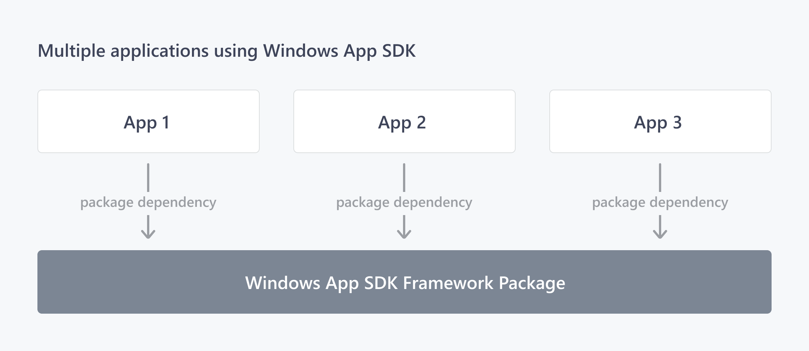
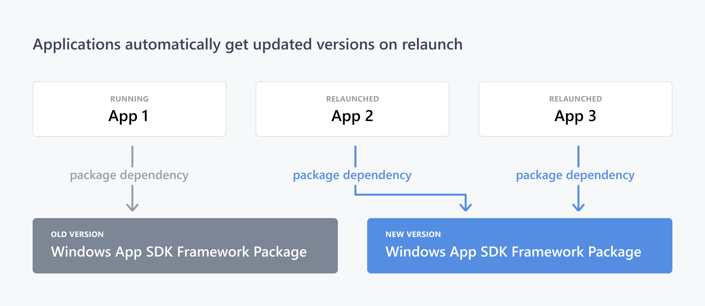

# Run time architecture and deployment scenarios for the Windows App SDK

This article explains the basic building blocks and high-level architecture of Windows App SDK deployment. For instructions to deploy apps that use the Windows App SDK, see these articles:

- [Deploy MSIX-packaged apps that use the Windows App SDK](deploy-packaged-apps.md)
- [Deploy non-MSIX packaged apps that use the Windows App SDK](deploy-unpackaged-apps.md) (experimental feature)

## Key terms

| Term | Definition |
|------|------------|
| **Windows App SDK runtime** | All the MSIX packages required by an app to be able to use the Windows App SDK. These packages include: Framework, Main, and DDLM. |
| **Framework package** | Contains binaries used at run time by apps. The framework includes a bootstrapper component that enables apps to automatically install the latest version of the Windows App SDK, which will be updated on a regular release cadence. |
| **Main package** | Contains the background tasks, services, app extensions, and other components not included in the Framework package. These are generally out-of-process services that are brokered between apps, such as push notifications and the Clipboard. |
| **Singleton package** | Contains services and other components not included in the Framework package. This is generally a single long-running process that is brokered between apps, such as push notifications. |
| **Dynamic Dependency Lifetime Manager (DDLM)** | A main package that prevents the OS from performing servicing updates to the MSIX packages while an unpackaged app is in use. |
| **Bootstrapper** | An app-local binary used by unpackaged apps to locate and load the best Windows App SDK version match as needed by the app.  |
| **Provisioning** | The process of installing and registering packages (including files and registry keys) system-wide to eliminate the need for repeated installation by the other users. It can be done either as part of the OS or done during installation of an app. |
| **Installer** | An installation technology for installing an app, such an MSI, App Installer, or .exe setup. |
| **MSIX** | Modern installer technology that enables users to safely install an app per user, directly from the Microsoft Store or a web site. On Enterprise or shared PCs, apps can be installed for all users via PowerShell and MDM. |

## Framework packages for packaged and unpackaged apps

When you build an app that uses the Windows App SDK, your app references a set of Windows App SDK runtime components that are distributed to end users via a *framework package*. The framework package allows packaged apps to access Windows App SDK components through a single shared source on the user's device, instead of bundling them into the app package. The framework package also carries its own resources, such as DLLs and API definitions (COM and Windows Runtime registrations). These resources run in the context of your app, so they inherit the capabilities and privileges of your app, and don't assert any capabilities or privileges of their own. For more information about framework package dependencies, see [MSIX framework packages and dynamic dependencies](../desktop/modernize/framework-packages/framework-packages-overview.md).

The Windows App SDK framework package is an MSIX package that is deployed to end users through the Microsoft Store. It can be easily and quickly updated with the latest releases, in addition to security and reliability fixes. All apps that use the Windows App SDK on a computer have a dependency on a shared instance of the framework package, as illustrated in the following diagram.

When a new version of the Windows App SDK framework package is released, all apps are updated to the new version without themselves having to redistribute a copy. Windows updates to the newest version of frameworks as they are released, and apps will automatically reference the latest framework package version during relaunch. Older framework package versions will not be removed from the system until they are no longer running or being actively used by apps on the system.

Because app compatibility is important to Microsoft and to apps that depend on the Windows App SDK, the Windows App SDK framework package follows [Semantic Versioning 2.0.0](https://semver.org/) rules. This means that after we release version 1.0 of the Windows App SDK, the Windows App SDK framework package will guarantee compatibility between minor and patch version changes, and breaking changes will occur only between major version updates.

## Additional requirements for unpackaged apps

> [!IMPORTANT]
> [Unpackaged app deployment](deploy-unpackaged-apps.md) is an experimental feature that is currently supported only in the [experimental release channel](experimental-channel.md). This feature is not supported for use by apps in production environments.

Unpackaged apps use the *dynamic dependencies* support in the Windows App SDK to dynamically take a dependency on the Windows App SDK framework package and any other MSIX framework packages. Dynamic dependencies enables unpackaged applications to keep their existing deployment mechanism, such as MSI or any installer, and be able to leverage the Windows App SDK in their application. Dynamic dependencies can be used by both packaged applications and unpackaged apps, although it is primarily intended to be used by unpackaged apps.

There are three components to dynamic dependencies support in the Windows App SDK: the bootstrapper, the Dynamic Dependency Lifetime Manager (DDLM), and the Main package.

### Bootstrapper

The bootstrapper is a library that must be included with your unpackaged app. It provides the [bootstrapper API](reference-framework-package-run-time.md), which enables unpackaged apps to perform these important tasks:

- Initialize the Dynamic Dependency Lifetime Manager (DDLM) for the Windows App SDK Framework package.
- Find and load the Windows App SDK framework package to the app's package graph.

To accomplish these tasks, the bootstrapper API must be called in your unpackaged app's startup code so it can properly initialize the system for the unpackaged app. Your unpackaged app must use the bootstrapper API before it can use Windows App SDK features such as WinUI, App lifecycle, MRT Core, and DWriteCore.

The bootstrapper library has different names depending on the Windows App SDK release:

- Windows App SDK 1.0 Experimental and later releases: **Microsoft.WindowsAppSDK.Bootstrap.dll**.
- Windows App SDK 0.8 Preview: **Microsoft.ProjectReunion.Bootstrap.dll**.

### Dynamic Dependency Lifetime Manager (DDLM)

The purpose of the DDLM is to prevent servicing of the Windows App SDK Framework package while it is in use by an unpackaged app. It contains a server that must be initialized by the bootstrapper early in an app's startup to provide that functionality.

There is one DDLM for each version and architecture of the Windows App SDK Framework package. This means on an `x64` computer, you may have both an `x86` and an `x64` version of the DDLM to support apps of both architectures.

### Main package

The Main package contains a short-lived server process that keeps track of dynamic dependencies that have been added, and it enables the Store to update the framework package.

### Singleton package

The Singleton package ensures that a single long-running process can handle services that are used across multiple apps, which may be running on different versions of the Windows App SDK. 

## Deployment scenarios

### Windows App SDK MSIX packages are already installed on the computer

If the Windows App SDK MSIX packages (Framework, Main, and DDLM) are already installed on the computer, no further installation is expected by a packaged or unpackaged app. MSIX packages are installed to a system-wide location with only one copy on disk. Therefore, if an app attempts installation of the Windows App SDK when there are no missing packages, then the installation is not performed.

### Windows App SDK Runtime is not installed on the computer

When installing the Windows App SDK, all Windows App SDK packages (Framework, Main, and DDLM) should be installed to ensure that all apps and the end-user avoid experiencing friction in the future.

### Windows App SDK Runtime needs to be provisioned system-wide

Provisioning requires elevation and an admin user-token. If the app's MSI or setup program attempts to install the app system-wide, the user will see a UAC prompt requesting their permission.

If the user does not grant full-trust access, then the Windows App SDK Runtime will at least be installed for the current user doing the installation. If permission is granted, the Windows App SDK Runtime will be registered for all users.

In a managed Enterprise environment, the IT admin should be able to provision for everyone as usual.  

## Related topics

- [Deploy apps that use the Windows App SDK](deploy-apps-that-use-the-windows-app-sdk.md)
- [Check for installed versions of the Windows App SDK runtime](check-windows-app-sdk-versions.md)
- [Remove outdated Windows App SDK runtime versions from your development computer](remove-windows-app-sdk-versions.md)
