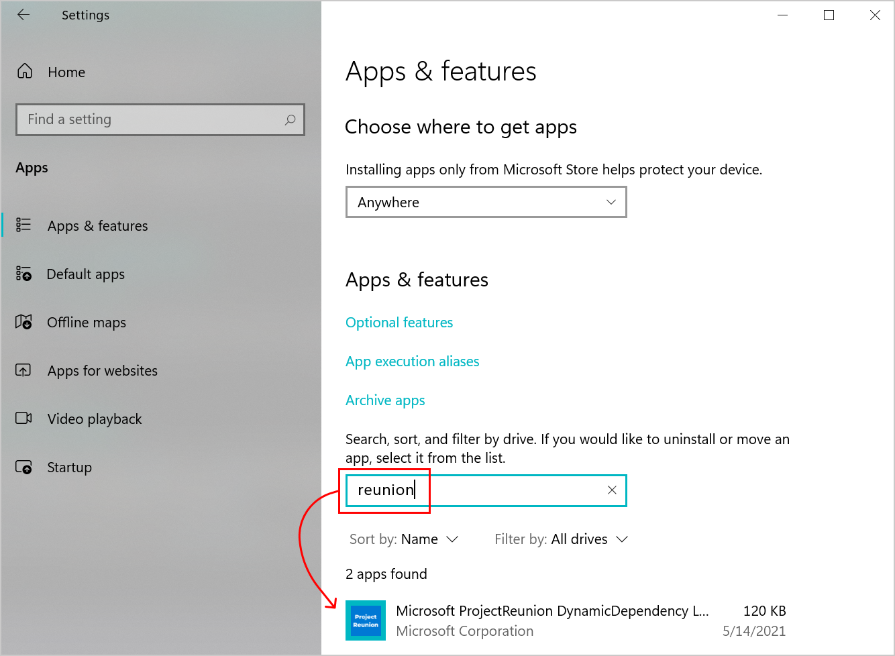

# Remove outdated Windows App SDK runtime versions from your development computer

As you install updated versions of the Windows App SDK runtime over time, you may want to remove outdated versions from your development computer. In general, you only need the Windows App SDK runtime and extension that you have chosen to reference and require in your application. Unless your application has specific reasons for earlier extensions or runtimes, you may safely remove older versions.

The Windows App SDK runtime includes the Framework, Main, Singleton, and Dynamic Dependency Lifetime Manager (DDLM) packages. All of these packages can be uninstalled by using **PowerShell** commands. The Main, Singleton, and DDLM packages can alternatively be uninstalled in **Settings**.

> [!IMPORTANT]
> We recommend that you do not remove Windows App SDK runtime packages from end-user's machines after deployment. Doing so will break other applications that are taking a dependency on those packages.

## Remove Windows App SDK runtime components using PowerShell

First, run the `get-appxpackage` command to list all versions of the Windows App SDK runtime packages that are installed on your computer (including the framework, main, singleton, and DDLM packages). The list includes details about each runtime package, including the **PackageFullName** value. For an example of the output of this command, see [Check for installed versions of the Windows App SDK runtime](check-windows-app-sdk-versions.md).

```Powershell
# For 1.0 Stable and Preview releases 
get-appxpackage *appruntime*

# For 1.0 Experimental
get-appxpackage *WindowsAppSDK* 

# For version 0.8
get-appxpackage *reunion*
```

Next, run the `remove-appxpackage` command to remove specific versions of the Windows App SDK runtime packages from your development computer. For each package, specify the **PackageFullName** value of the runtime packages you want to remove, as provided by the preceding step. The following example removes the framework, main, and DDLM package, respectively. Make sure you specify the correct **PackageFullName** values for the packages on your computer.

```Powershell
remove-appxpackage -Package Microsoft.ProjectReunion.0.8-preview_8000.144.525.0_x86__8wekyb3d8bbwe
remove-appxpackage -Package Microsoft.ProjectReunion.Main.0.8-preview_8000.144.525.0_x64__8wekyb3d8bbwe
remove-appxpackage -Package Microsoft.ProjectReunion.DDLM.8000.144.525.0-x8-p_8000.144.525.0_x86__8wekyb3d8bbwe
```

## Remove main and DDLM packages in Settings

To remove the Main and Dynamic Dependency Lifetime Manager (DDLM) packages, you can alternatively use the **Apps & features** page in **Settings**.

> [!NOTE]
> The Windows App SDK framework package will not show up in **Apps & features**, and will need to be uninstalled using the **PowerShell** commands described earlier in this article.

On the **Apps & features** page, search for **reunion** to filter and show installed versions of Windows App SDK packages. Select any versions you want to remove from your computer and click **Uninstall**.

[ ](images/remove-reunion-packages-versions.png#lightbox)


## Related topics

- [Deploy unpackaged apps](deploy-unpackaged-apps.md)
- [Runtime architecture](deployment-architecture.md)
- [Check for installed versions of the Windows App SDK runtime](check-windows-app-sdk-versions.md)
- [Install tools for the Windows App SDK](set-up-your-development-environment.md)
- [Create your first WinUI 3 project](../winui/winui3/create-your-first-winui3-app.md)
- [Use the Windows App SDK in an existing project](use-windows-app-sdk-in-existing-project.md)
