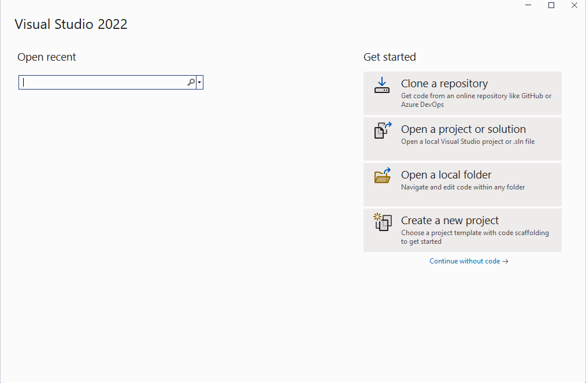
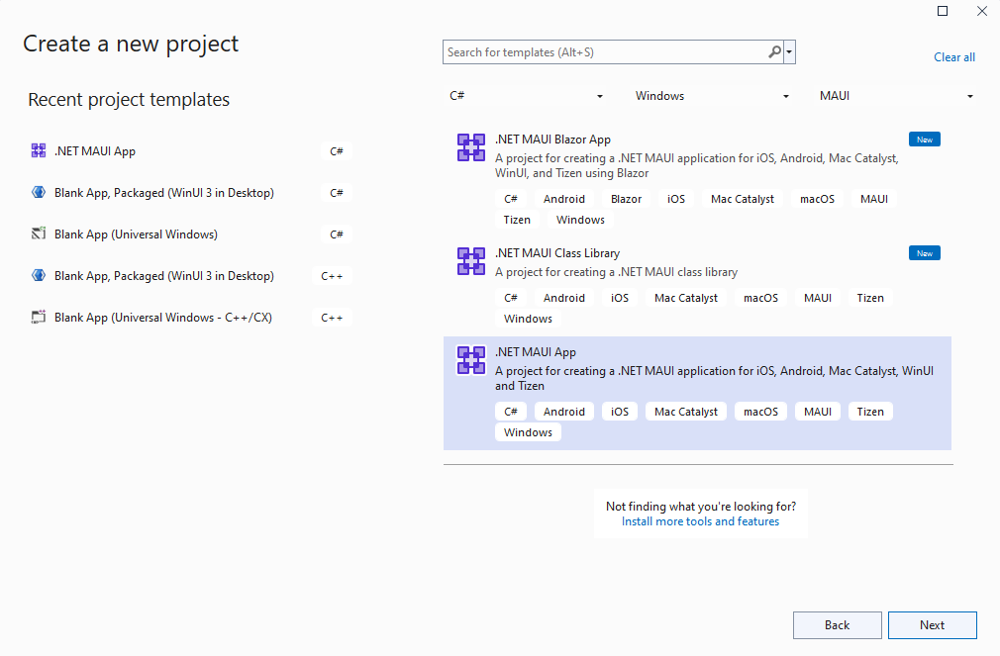
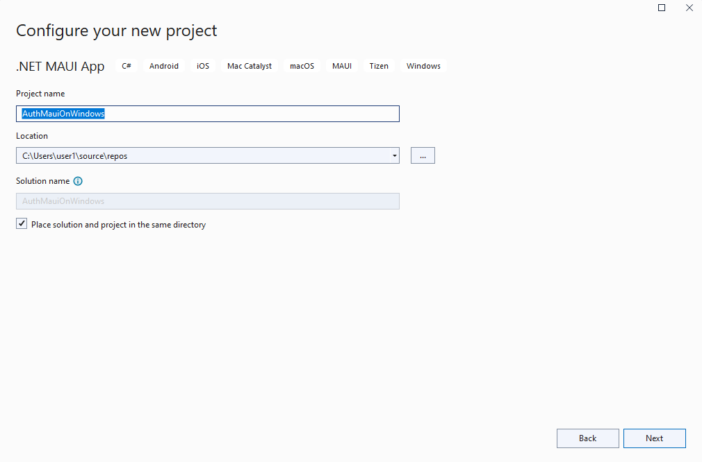
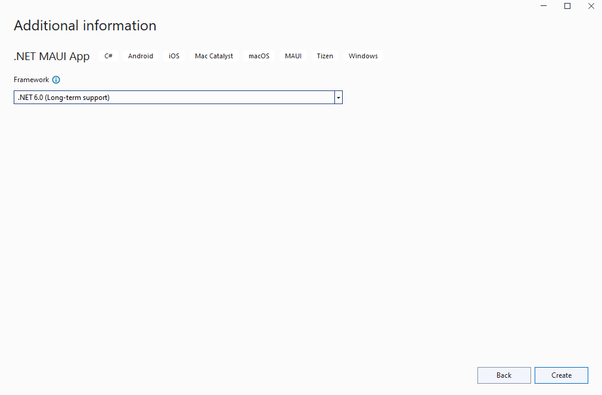
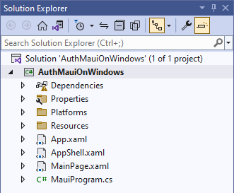
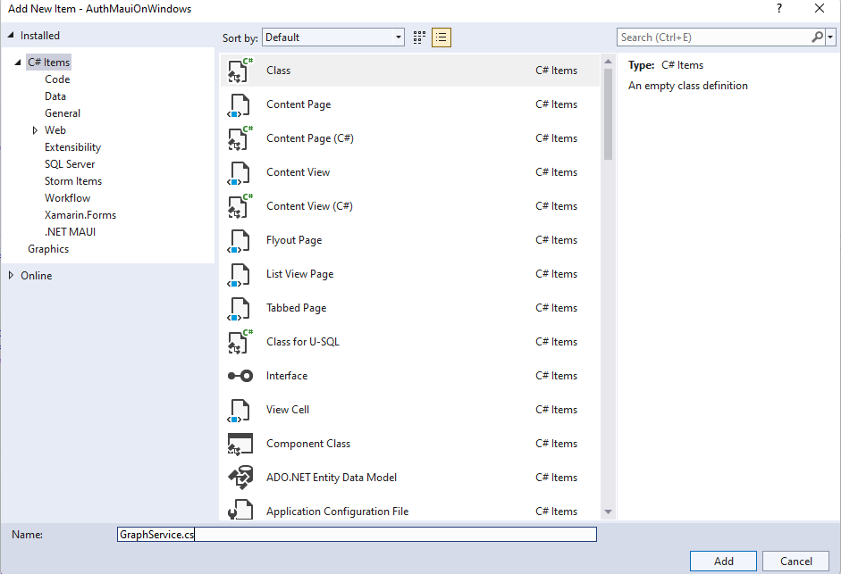
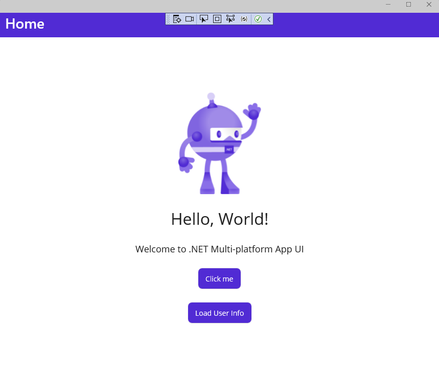
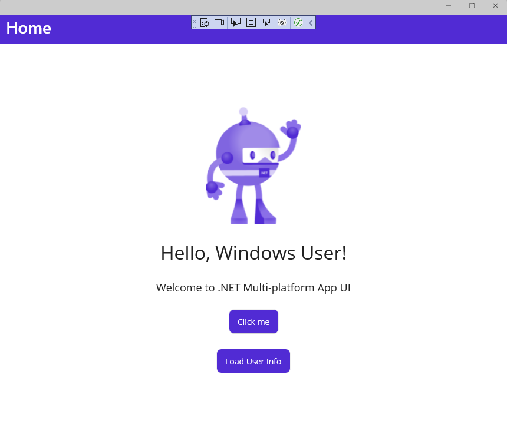

# Tutorial&mdash;Create a .NET MAUI app using the Microsoft Graph SDK

Get hands-on with .NET MAUI by building a cross-platform app on Windows that leverages the [Microsoft Graph SDK](/graph/sdks/sdks-overview) to display user data.

## Introduction

In this tutorial, you'll learn how to create a .NET MAUI app for Windows in Visual Studio 2022 17.3 that loads some user data from [Microsoft Graph](/graph/). We will [authenticate](/graph/authenticationmethods-get-started) a Microsoft account with [Azure Identity](/graph/azuread-identity-access-management-concept-overview). The identity information, in the form of an MSAL token, will be used to authorize the Graph SDK call and get the display name for the authenticated user.

## Setting up the environment

If you haven't already set up your environment for .NET MAUI development, please follow the steps to [Get started with .NET MAUI on Windows](index.md#get-started-with-net-maui-on-windows).

## Creating the .NET MAUI project

> [!NOTE]
> If you are already familiar with setting up a .NET MAUI project, you can skip to the [Register your client in Azure](#register-your-client-in-azure) section.

1. Launch Visual Studio 2022 17.3, and in the start window click **Create a new project** to create a new project:



2. In the **Create a new project** window, select **MAUI** in the All project types drop-down, select the **.NET MAUI App** template, and click the **Next** button:



> [!NOTE]
> The .NET MAUI templates might not appear in Visual Studio if you also have .NET 7 Preview installed. For more information, see [.NET MAUI templates do not appear in Visual Studio](https://github.com/dotnet/maui/wiki/Known-Issues#net-maui-templates-do-not-appear-in-visual-studio).

3. In the **Configure your new project** window, give your project a name, choose a location for it, and click the **Next** button:



4. In the **Additional information** window, click the **Create** button:



5. Wait for the project to be created, and for its dependencies to be restored:



6. In the Visual Studio toolbar, press the **Windows Machine** button to build and run the app. Click the **Click me** button and verify that the button content updates with the number of clicks.

Now that you have verified that the .NET MAUI app on Windows is working as expected, we can integrate the Graph SDK. In the next section, you'll add the packages necessary to authenticate and make calls to Microsoft Graph.

## Register your client in Azure

An **app registration** in Azure with the **User.Read** scope granted to the app is required to read user data from Microsoft Graph. To register your application, follow these steps:

1. Sign in to the [Azure portal](https://portal.azure.com/).

2. If you have access to multiple tenants, use the **Directories + subscriptions** filter  in the top menu to switch to the tenant in which you want to register the application.

3. Search for and select **Azure Active Directory**.

4. Under **Manage**, select **App registrations > New registration**.

5. Enter a **Name** for your application, for example `Win-App-calling-MsGraph`. Users of your app might see this name, and you can change it later.

6. In the Supported account types section, select Accounts in any organizational directory and personal Microsoft accounts (for example, Skype, Xbox, Outlook.com).

7. Select Register to create the application.

8. Copy and save the of the **Application (client) ID** and the **Directory (tenant) ID** values for later use. We will store those values in the GraphService class in the next section.

9. Under **Manage**, select **Authentication**.

10. Select **Add a platform > Mobile and desktop applications**.

11. In the **Redirect URIs** section, select `https://login.microsoftonline.com/common/oauth2/nativeclient` and in **Custom redirect URIs** add `https://localhost`.

12. Select **Configure**.

13. Under **Manage**, select **API permissions**.

14. If the Microsoft Graph **User.Read** permission is not present under **Configured permissions**, select **Add permission**. In the **Request API permissions** screen, select **Microsoft Graph > Application permissions** and search for **User.Read**. Expand **User**, select **User.Read**, and click **Add permissions**.

## Integrate the Graph SDK and Azure Identity

Now that you have your .NET MAUI app running on Windows and have configured the app registration in Azure, let's add a couple of NuGet packages to the project to integrate with Azure Identity and Microsoft Graph.

1. Right-click the project in **Solution Explorer** and select **Manage NuGet Packages...** from the context menu.

2. In the **NuGet Package Manager** window, select the **Browse** tab and search for **Azure.Identity**:


3. Add the latest stable version of the **Azure.Identity** package to the project by clicking **Install**.

4. Next, search for **Microosft.Graph**:


5. Add the latest stable version of the **Microsoft.Graph** package to the project by clicking **Install**.

6. Close the **NuGet Package Manager** window after the new package has finished installing.

7. Right-click the project again and select **Add | Class** from the context menu.

8. In the **Add New Item** window that appears, name the class `GraphService` and click **Add**:



9. Add four private members to the `GraphService` class, substituting your own _client ID_ and _tenant ID_ values for the placeholder text:

``` csharp
private readonly string[] _scopes = new[] { "User.Read" };
private const string TenantId = "<add your tenant id here>";
private const string ClientId = "<add your client id here>";
private GraphServiceClient _client;
```

10. Add an `Initialize()` method to `GraphService`, which will be called from the constructor. The initialization code will authenticate using the `InteractiveBrowserCredential` class. Upon successful authentication, the auth token will be provided to the `GraphServiceClient` by the credential class along with the requested scopes (`User.Read`).

``` csharp
public GraphService()
{
    Initialize();
}

private void Initialize()
{
    // assume Windows for this sample
    if (OperatingSystem.IsWindows())
    {
        var options = new InteractiveBrowserCredentialOptions
        {
            TenantId = TenantId,
            ClientId = ClientId,
            AuthorityHost = AzureAuthorityHosts.AzurePublicCloud,
            RedirectUri = new Uri("https://localhost"),
        };

        InteractiveBrowserCredential interactiveCredential = new(options);
        _client = new GraphServiceClient(interactiveCredential, _scopes);
    }
    else 
    {
        // TODO: Add iOS/Android support
    }
}
```

> [!NOTE]
> The 'Initialize()' method currently only supports Windows. Authenticating on iOS and Android requires a different NuGet package (Microsoft.Identity.Client) and some additional steps. To read more about mobile authentication, see [Configure a native client application](/azure/developer/mobile-apps/azure-mobile-apps/quickstarts/maui/authentication).

11. Add a public async method named `GetMyDetailsAsync()` to return the `User` object for the authenticated user:

``` csharp
public async Task<User> GetMyDetailsAsync()
{
    try
    {
        return await _client.Me.Request().GetAsync();
    }
    catch (Exception ex)
    {
        Console.WriteLine($"Error loading user details: {ex}");
        return null;
    }
}
```

12. Two `using` statements will be needed to compile the new code added to `GraphService`:

``` csharp
using Azure.Identity;
using Microsoft.Graph;
```

13. In **MainPage.xaml**, add an `x:Name` to the **Hello, World!** label:

``` xaml
<Label
    x:Name="HelloLabel"
    Text="Hello, World!"
    SemanticProperties.HeadingLevel="Level1"
    FontSize="32"
    HorizontalOptions="Center" />
```

14. Add a new button to the page after the existing `CounterBtn` to get the user information from Graph:

``` xaml
<Button
    x:Name="GetUserInfoBtn"
    Text="Load User Info"
    SemanticProperties.Hint="Loads user information from Microsoft Graph"
    Clicked="GetUserInfoBtn_Clicked"
    HorizontalOptions="Center" />
```

15. In **MainPage.xaml.cs**, add private variables to for `GraphService` and `User`:

``` csharp
private GraphService graphService;
private User user;
```

16. Add an event handler for the `Clicked` event that you added to the `GetUserInfoButton` on **MainPage.xaml**. The event handler will create an instance of `GraphService` if it is null and make the call to fetch the user data. The `HelloLabel`'s text will be updated to say hello to the user, displaying the `DisplayName` property from Microsoft Graph:

``` csharp
private async void GetUserInfoBtn_Clicked(object sender, EventArgs e)
{
    if (graphService == null)
    {
        graphService = new GraphService();
    }
    user = await graphService.GetMyDetailsAsync();
    HelloLabel.Text = $"Hello, {user.DisplayName}!";
}
```

17. Run the app and click the **Load User Info** button:



18. When the **Sign in to your account** window appears, select an existing account or click **Use another account**:


19. If you selected a different account, enter the email address and password for the account and sign in.

20. After the authentication completes, you will see your user's **DisplayName** in on the app:



## Related topics

[Resources for learning .NET MAUI](/dotnet/maui/get-started/resources)

[Microsoft Graph SDK overview](/graph/sdks/sdks-overview)

[Configure a native client application](/azure/developer/mobile-apps/azure-mobile-apps/quickstarts/maui/authentication)

[Azure AD identity and access management API overview](/graph/azuread-identity-access-management-concept-overview)
