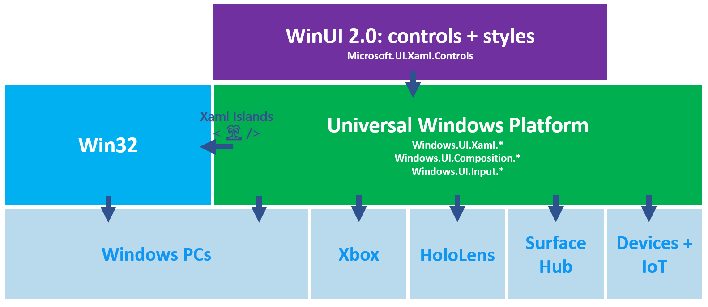

# Windows UI Library (WinUI)

WinUI is the modern native Windows UI platform and the future of Windows development.

By providing a state-of-the-art UI framework for all Windows apps across both Win32 and UWP, you can gradually migrate existing apps written in familiar technologies like MFC, Winforms, Silverlight, and WPF, and move these applications forward at your own pace.

WinUI also supports familiar languages such as C++, C#, Visual Basic, and even Javascript via React Native for Windows.

## Windows UI 2.x Library

The WinUI 2.x Library is coupled to the UWP SDK and provides official native Windows UI controls and other UI elements for UWP apps.

By maintaining down-level compatibility with earlier versions of Windows 10, WinUI 2.x controls work even if users don't have the latest OS.

> [!NOTE]
> WinUI 2.4 is the next WinUI 2.x release (WinUI 2.4 Preview is available now). See the [WinUI 2.4 milestone](https://github.com/microsoft/microsoft-ui-xaml/milestone/9) for a list of planned work.

For installation instructions see [Getting started with the Windows UI Library](winui2/getting-started.md).

### Related links

- [WinUI 2.x Library overview](winui2/index.md)
- [API docs](https://docs.microsoft.com/uwp/api/overview/winui/)
- [Source code](https://aka.ms/winui)
- [XAML Controls Gallery app](https://www.microsoft.com/p/xaml-controls-gallery/9msvh128x2zt)

## Windows UI 3.0 Library (Alpha)

By completely decoupling Xaml, composition, and input APIs from the UWP SDK, the Windows UI 3.0 Library can greatly expand the scope of WinUI to include the full Windows 10 native UI platform. 

WinUI serves as the path forward for all Windows apps - you can use it as the UI layer on your native UWP or Win32 app, or you can use it to modernize your desktop app piece by piece with [Xaml Islands](https://docs.microsoft.com/windows/apps/desktop/modernize/xaml-islands).
 
> [!NOTE]
> The WinUI 3.0 Alpha is a pre-release build of WinUI 3.0. We welcome your feedback in the [WinUI GitHub repo](https://github.com/microsoft/microsoft-ui-xaml).

All new Xaml features will ship as part of WinUI. The existing UWP Xaml APIs that ship as part of the OS will no longer receive new feature updates. However, they will continue to receive security updates and critical fixes according to the Windows 10 support lifecycle.

The Universal Windows Platform contains more than just the Xaml framework (such as application and security models, media pipeline, Xbox and Windows 10 shell integrations, broad device support) and will continue to be supported.

> [!Important]
> The WinUI 3.0 Alpha is intended for early evaluation and to gather feedback from the developer community. It should **NOT** be used for production apps.
>
> **WinUI 3.0 Preview 1 will be available soon.**

<!-- See the [WinUI 3.0 Preview 1 milestone](https://github.com/microsoft/microsoft-ui-xaml/milestone/9) for a list of planned work.
 -->

### Related links

- [WinUI 3.0 Alpha (November 2019)](winui3/index.md)
- [XAML Controls Gallery (WinUI 3.0 Alpha) app](https://github.com/microsoft/Xaml-Controls-Gallery/tree/winui3alpha)

## WinUI resources
**Github**: WinUI is an open-source project hosted on Github. On the [WinUI repository](https://github.com/microsoft/microsoft-ui-xaml), you can file feature requests or bugs, interact with the WinUI team, and view the team's plans for WinUI 3 and beyond on their [roadmap](https://github.com/microsoft/microsoft-ui-xaml/blob/master/docs/roadmap.md). 

**Website**: The [WinUI website](https://aka.ms/winui) has helpful info on product comparisons, WinUI's advantages, and ways of staying engaged with the product and the product team. 
