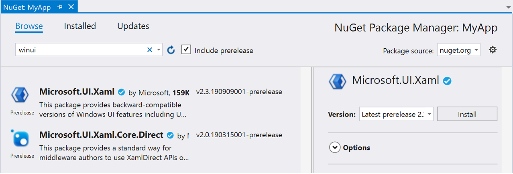

# Getting started with the Windows UI 2.x Library

[WinUI 2.4](release-notes/winui-2.4.md) is the latest stable version of WinUI and should be used for apps in production.

The library is available as a NuGet package that can be added to any new or existing Visual Studio project.

> [!NOTE]
> For more information on trying out early previews of WinUI 3, see [Windows UI Library 3 Preview 2 (July 2020)](../winui3/index.md).

## Download and install the Windows UI Library

1. Download [Visual Studio 2019](https://developer.microsoft.com/windows/downloads) and ensure you choose the **Universal Windows Platform development** Workload in the Visual Studio installer.

2. Open an existing project, or create a new project using the Blank App template under Visual C# -> Windows -> Universal, or the appropriate template for your language projection.  

    > [!IMPORTANT]
    > To use WinUI 2.4, you must set TargetPlatformVersion >= 10.0.18362.0 and TargetPlatformMinVersion >= 10.0.15063.0 in the project properties.

3. In the Solution Explorer panel, right click on your project name and select **Manage NuGet Packages**. Select the **Browse** tab, and search for **Microsoft.UI.Xaml** or **WinUI**. Then choose which [Windows UI Library NuGet Packages](nuget-packages.md) you want to use.
The **Microsoft.UI.Xaml** package contains Fluent controls and features suitable for all apps.  
You can optionally check "Include prerelease" to see the latest prerelease versions that include experimental new features.

    

    

4. Add the Windows UI (WinUI) Theme Resources to your App.xaml resources. There are two ways to do this, depending on whether you have additional application resources.

    a. If you don't have other application resources,
    add `<XamlControlsResources xmlns="using:Microsoft.UI.Xaml.Controls"/>` to your Application.Resources:

    ``` XAML
    <Application>
        <Application.Resources>
            <XamlControlsResources xmlns="using:Microsoft.UI.Xaml.Controls" />
        </Application.Resources>
    </Application>
    ```

    b. Otherwise, if you have more than one set of application resources, add `<XamlControlsResources xmlns="using:Microsoft.UI.Xaml.Controls"/>` to  Application.Resources.MergedDictionaries:

    ``` XAML
    <Application>
        <Application.Resources>
            <ResourceDictionary>
                <ResourceDictionary.MergedDictionaries>
                    <XamlControlsResources xmlns="using:Microsoft.UI.Xaml.Controls" />
                </ResourceDictionary.MergedDictionaries>
            </ResourceDictionary>
        </Application.Resources>
    </Application>
    ```

    > [!IMPORTANT]
    > The order of resources added to a ResourceDictionary affects the order in which they are applied. The `XamlControlsResources` dictionary overrides many default resource keys and should therefore be added to `Application.Resources` first so that it doesn't override any other custom styles or resources in your app. For more information on resource loading, see [ResourceDictionary and XAML resource references](https://docs.microsoft.com/windows/uwp/design/controls-and-patterns/resourcedictionary-and-xaml-resource-references).

5. Add a reference to the toolkit to XAML pages and your code-behind pages.

    * In your XAML page, add a reference at the top of your page

        ```xaml
        xmlns:muxc="using:Microsoft.UI.Xaml.Controls"
        ```

    * In your code (if you want to use the type names without qualifying them), you can add a using directive.

        ```csharp
        using MUXC = Microsoft.UI.Xaml.Controls;
        ```

## Additional steps for a C++/WinRT project

When you add a NuGet package to a C++/WinRT project, the tooling generates a set of projection headers in your project's `\Generated Files\winrt` folder. To bring those headers files into your project, so that references to those new types resolve, you can go into your precompiled header file (typically `pch.h`) and include them. Below is an example that includes the generated header files for the **Microsoft.UI.Xaml** package.

```cppwinrt
// pch.h
...
#include "winrt/Microsoft.UI.Xaml.Automation.Peers.h"
#include "winrt/Microsoft.UI.Xaml.Controls.Primitives.h"
#include "winrt/Microsoft.UI.Xaml.Media.h"
#include "winrt/Microsoft.UI.Xaml.XamlTypeInfo.h"
...
```

For a full, step-by-step walkthrough of adding simple support for the Windows UI Library to a C++/WinRT project, see [A simple C++/WinRT Windows UI Library example](/windows/uwp/cpp-and-winrt-apis/simple-winui-example).

## Contributing to the Windows UI Library

WinUI is an open source project hosted on GitHub.

We welcome bug reports, feature requests and community code contributions in the [Windows UI Library repo](https://aka.ms/winui).

## Other resources

If you're new to UWP, then we recommend that you visit the [Getting Started with UWP Development](https://developer.microsoft.com/windows/getstarted) pages on the Developer portal.
