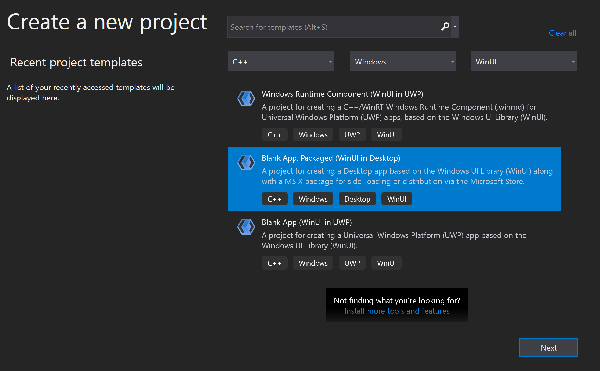
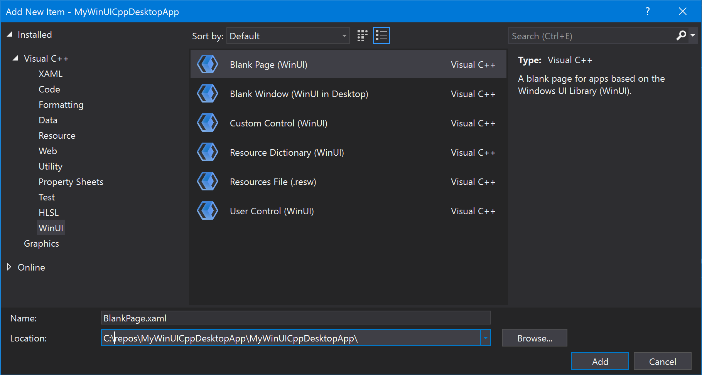

# Get started with WinUI 3 for desktop apps

WinUI 3 Preview 3 includes project templates that enable you to create managed desktop C#/.NET Core and native C++/Win32 desktop apps with an entirely WinUI-based user interface. When you create apps using these project templates, the entire user interface of your application is implemented using windows, controls, and other UI types provided by WinUI 3. For a complete list of the project templates, see [this section](index.md#project-templates-for-winui-3).

## Prerequisites

To use the WinUI 3 for desktop project templates described in this article, configure your development computer and install WinUI 3 Preview 3 by following the instructions [here](index.md#install-winui-3-preview-3).

## Create a WinUI 3 desktop app for C# and .NET 5

1. In Visual Studio 2019, select **File** -> **New** -> **Project**.

2. In the project drop-down filters, select **C#**, **Windows**, and **WinUI**, respectively.

3. Select the **Blank App, Packaged (WinUI in Desktop)** project type and click **Next**.

    

4. Enter a project name, choose any other options as desired, and click **Create**.

5. In the following dialog box, set the **Target version** to Windows 10, version 1903 (build 18362) and **Minimum version** to Windows 10, version 1803 (build 17134) and then click **OK**.

    

6. At this point, Visual Studio generates two projects:

    * **_Project name_ (Desktop)**: This project contains your app's code. The **App.xaml** file and **App.xaml.cs** code-behind file define an `Application` class that represents your app instance. The **MainWindow.xaml** file and **MainWindow.xaml.cs** code-behind file define a `MainWindow` class that represents the main window displayed by your app. These classes derive from types in the **Microsoft.UI.Xaml** namespace provided by WinUI.

        

    * **_Project name_ (Package)**: This is a [Windows Application Packaging Project](/windows/msix/desktop/desktop-to-uwp-packaging-dot-net) that is configured to build the app into an [MSIX package](/windows/msix/overview). This provides a modern deployment experience, the ability to integrate with Windows 10 features via package extensions, and much more. This project contains the [package manifest](/uwp/schemas/appxpackage/uapmanifestschema/schema-root) for your app, and it is the startup project for your solution by default.

        

7. To add a new item to your app project, right-click the **_Project name_ (Desktop)** project node in **Solution Explorer** and select **Add** -> **New Item**. In the **Add New Item** dialog box, select the **WinUI** tab, choose the item you want to add, and then click **Add**. For more details about the available items, see [this section](index.md#item-templates-for-winui-3).

    

8. Build and run your solution to confirm that the app runs without errors.

## Create a WinUI 3 desktop app for C++/Win32

1. In Visual Studio 2019, select **File** -> **New** -> **Project**.

2. In the project drop-down filters, select **C++**, **Windows**, and **WinUI**.

3. Select the **Blank App, Packaged (WinUI in Desktop)** project type and click **Next**.

    

4. Enter a project name, choose any other options as desired, and click **Create**.

5. In the following dialog box, set the **Target version** to Windows 10, version 1903 (build 18362) and **Minimum version** to Windows 10, version 1803 (build 17134) and then click **OK**.

    

6. At this point, Visual Studio generates two projects:

    * **_Project name_ (Desktop)**: This project contains your app's code. The **App.xaml** and various **App** code files define an `Application` class that represents your app instance, and the **MainWindow.xaml** and various **MainWindow** code files define a `MainWindow` class that represents the main window displayed by your app. These classes derive from types in the **Microsoft.UI.Xaml** namespace provided by WinUI.

        

    * **_Project name_ (Package)**: This is a [Windows Application Packaging Project](/windows/msix/desktop/desktop-to-uwp-packaging-dot-net) that is configured to build the app into an [MSIX package](/windows/msix/overview). This provides a modern deployment experience, the ability to integrate with Windows 10 features via package extensions, and much more. This project contains the [package manifest](/uwp/schemas/appxpackage/uapmanifestschema/schema-root) for your app, and it is the startup project for your solution by default.

        

7. To add a new item to your app project, right-click the **_Project name_ (Desktop)** project node in **Solution Explorer** and select **Add** -> **New Item**. In the **Add New Item** dialog box, select the **WinUI** tab, choose the item you want to add, and then click **Add**. For more details about the available items, see [this section](index.md#item-templates-for-winui-3).

    

8. Build and run your solution to confirm that the app runs without errors.

   > [!NOTE]
   > Only the packaged project will launch, so make sure that one is set as the Startup Project.

## Localizing your WinUI Desktop app

To support multiple languages in a WinUI Desktop app, and ensure proper localization of your packaged project, add the appropriate resources to the project (see [App resources and the Resource Management System](/windows/uwp/app-resources/)) and declare each supported language in the `package.appxmanifest` file of your project. When you build the project, the specified languages are added to the generated app manifest (`AppxManifest.xml`) and the corresponding resources are used.

1. Open the .wapproj's `package.appxmanifest` in a text editor and locate the following section:

    ```xml
    <Resources>
        <Resource Language="x-generate"/>
    </Resources>
    ```

2. Replace the `<Resource Language="x-generate">` with `<Resource />` elements for each of your supported languages. For example, the following markup specifies that "en-US" and "es-ES" localized resources are available:

    ```xml
    <Resources>
        <Resource Language="en-US"/>
        <Resource Language="es-ES"/>
    </Resources>
    ```

## Known issues and limitations

For a list of known issues and limitations, see [this section](index.md#preview-3-limitations-and-known-issues).

## Related topics

* [Windows UI Library 3](index.md)