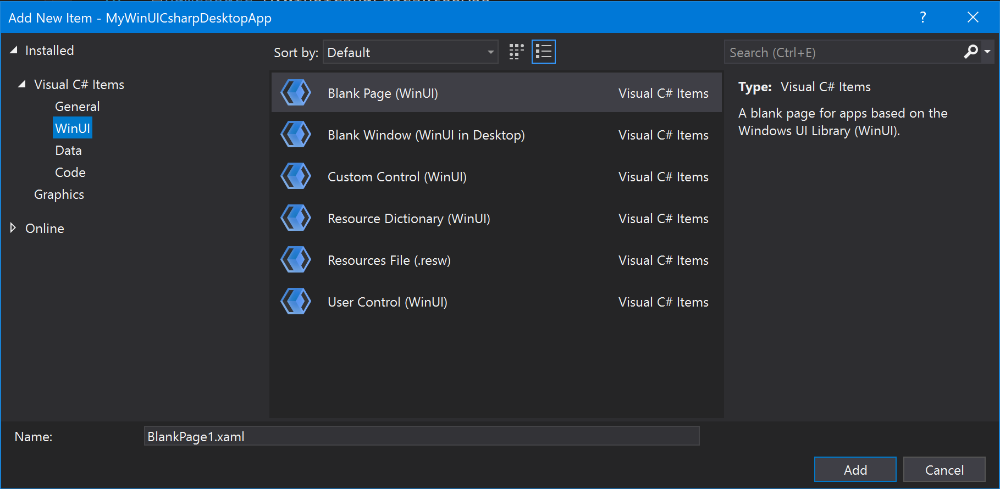
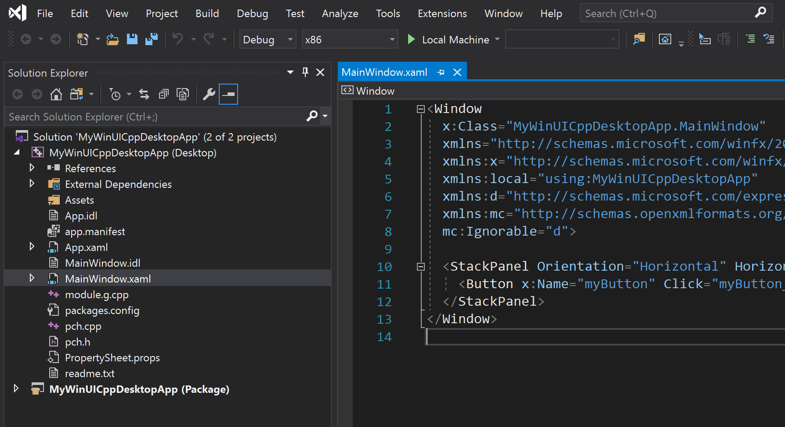

# Get started with WinUI 3.0 for desktop apps

WinUI 3.0 Preview 1 introduces new project templates that enable you to create managed desktop C#/.NET and native C++/Win32 desktop apps with an entirely WinUI-based user interface. When you create apps using these project templates, the entire user interface of your application is implemented using windows, controls, and other UI types provided by WinUI 3.0. 

WinUI 3.0 Preview 1 adds the following Visual Studio 2019 project templates in **WinUI for desktop app**:

* C# apps and libraries that target .NET 5:
  * Blank App, Packaged (WinUI in Desktop)
  * Class Library (WinUI in Desktop)

* C++/Win32 apps:
  * Blank App, Packaged (WinUI in Desktop)

The app project templates generate a WinUI app project and a [Windows Application Packaging Project](https://docs.microsoft.com/windows/msix/desktop/desktop-to-uwp-packaging-dot-net) that is configured to build the app into an [MSIX package](https://docs.microsoft.com/windows/msix/overview) for deployment.

## Prerequisites

To use the WinUI 3 for desktop project templates described in this article, configure your development computer by following these instructions:

1. Make sure that your development computer has Windows 10, version 1803 (build 17134), or a later version installed. WinUI 3 for desktop apps requires 1803 or a later OS version.

2. Install Visual Studio 2019, version 16.7 Preview 1. For details, see [these instructions](index.md#configure-your-dev-environment).

3. Install both x64 and x86 versions of .NET 5 Preview 4:
    * x64: [https://aka.ms/dotnet/net5/preview4/Sdk/dotnet-sdk-win-x64.exe](https://aka.ms/dotnet/net5/preview4/Sdk/dotnet-sdk-win-x64.exe)
    * x86: [https://aka.ms/dotnet/net5/preview4/Sdk/dotnet-sdk-win-x86.exe](https://aka.ms/dotnet/net5/preview4/Sdk/dotnet-sdk-win-x86.exe)

    > [!NOTE]
    > WinUI 3.0 Preview 1 requires .NET 5 Preview 4. Later preview versions of .NET 5 are not supported with WinUI 3.0 Preview 1.

4. Install the VSIX extension that includes the WinUI 3.0 Preview 1 project templates for Visual Studio 2019. For details, see [these instructions](index.md#visual-studio-project-templates).

## Create a WinUI 3 desktop app for C# and .NET 5

1. In Visual Studio 2019, select **File** -> **New** -> **Project**.

2. In the project drop-down filters, select **C#**, **Windows**, and **WinUI**, respectively.

3. Select the **Blank App, Packaged (WinUI in Desktop)** project type and click **Next**.

    

4. Enter a project name, choose any other options as desired, and click **Create**.

5. In the following dialog box, set the **Target version** to Windows 10, version 1903 (build 18362) and **Minimum version** to Windows 10, version 1803 (build 17134) and then click **OK**.

    

6. At this point, Visual Studio generates two projects:

    * ***Project name* (Desktop)**: This project contains your app's code. The **App.xaml.cs** code file defines an `Application` class that represents your app instance, and the **MainWindow.xaml.cs** code file defines a `MainWindow` class that represents the main window displayed by your app. These classes derive from types in the **Microsoft.UI.Xaml** namespace provided by WinUI.

        

    * ***Project name* (Package)**: This is a [Windows Application Packaging Project](https://docs.microsoft.com/windows/msix/desktop/desktop-to-uwp-packaging-dot-net) that is configured to build the app into an MSIX package for deployment. This project contains the [package manifest](https://docs.microsoft.com/uwp/schemas/appxpackage/uapmanifestschema/schema-root) for your app, and it is the startup project for your solution by default.

        

7. To add a new item to your app project, right-click the ***Project name* (Desktop)** project node in **Solution Explorer** and select **Add** -> **New Item**. In the **Add New Item** dialog box, select the **WinUI** tab, choose the item you want to add, and then click **Add**. You can choose from the following types of items:

    * **Blank Page**
    * **Blank Window**
    * **Custom Control**
    * **Resource Dictionary**
    * **Resources File**
    * **User Control**

    

8. Build and run your solution to confirm that the app runs without errors.

## Create a WinUI 3 desktop app for C++/Win32

1. In Visual Studio 2019, select **File** -> **New** -> **Project**.

2. In the project drop-down filters, select **C++**, **Windows**, and **WinUI**.

3. Select the **Blank App, Packaged (WinUI in Desktop)** project type and click **Next**.

    

4. Enter a project name, choose any other options as desired, and click **Create**.

5. In the following dialog box, set the **Target version** to Windows 10, version 1903 (build 18362) and **Minimum version** to Windows 10, version 1803 (build 17134) and then click **OK**.

    

6. At this point, Visual Studio generates two projects:

    * ***Project name* (Desktop)**: This project contains your app's code. The **App.xaml** and various **App** code files define an `Application` class that represents your app instance, and the **MainWindow.xaml** and various **MainWindow** code files define a `MainWindow` class that represents the main window displayed by your app. These classes derive from types in the **Microsoft.UI.Xaml** namespace provided by WinUI.

        

    * ***Project name* (Package)**: This is a [Windows Application Packaging Project](https://docs.microsoft.com/windows/msix/desktop/desktop-to-uwp-packaging-dot-net) that is configured to build the app into an MSIX package for deployment. This project contains the [package manifest](https://docs.microsoft.com/uwp/schemas/appxpackage/uapmanifestschema/schema-root) for your app, and it is the startup project for your solution by default.

        

7. To add a new item to your app project, right-click the ***Project name* (Desktop)** project node in **Solution Explorer** and select **Add** -> **New Item**. In the **Add New Item** dialog box, select the **WinUI** tab, choose the item you want to add, and then click **Add**. You can choose from the following types of items:

    * **Blank Page**
    * **Blank Window**
    * **Custom Control**
    * **Resource Dictionary**
    * **Resources File**
    * **User Control**

    

8. Build and run your solution to confirm that the app runs without errors.

## Known issues and limitations

For a list of known issues and limitations in Preview 1, see [this section](index.md#preview-1-limitations-and-known-issues).

## Related topics

* [WinUI 3.0](index.md)
