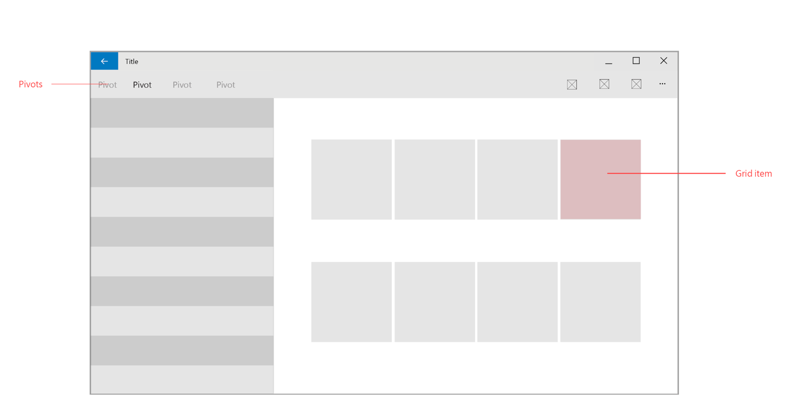
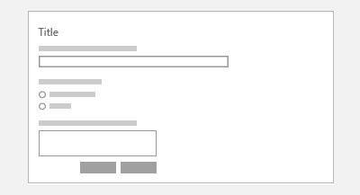

# Content design basics for Windows apps

The main purpose of any app is to provide access to content. Since apps exist for many different purposes, content comes in many forms: in a photo-editing app, the photo is the content; in a travel app, maps and information about travel destinations is the content; and so on. 

This article provides an overview of how you can present content in your app. We describe common page patterns and UI elements that you can use to display your content, whatever form it may be in.

## Common page patterns

Many apps use some, or all, of these common page patterns to display different types of content. Likewise, feel free to mix and match these patterns to optimize for your app's content.

### Landing

Landing pages, also known as hero screens, often appear at the top level of an app experience. The large surface area serves as a stage for apps to highlight content that users may want to browse and consume.

### Collections

Collections allow users to browse groups of content or data. [Grid view](../controls-and-patterns/item-templates-gridview.md) is a good option for photos or media-centric content, and [list view](../controls-and-patterns/item-templates-listview.md) is a good option for text-heavy content or data.

### List/detail

The [list/details](../controls-and-patterns/list-details.md) model consists of a list view and a content view (detail). Both panes are fixed and have vertical scrolling. There is a clear relationship between the list item and the content view: the item in the list view is selected, and the detail view is correspondingly updated. In addition to providing detail view navigation, items in the list view can be added and removed.

### Details

When users find the content they are looking for, consider creating a dedicated content-viewing page so that users can view the page free of distractions. If possible, [create a full-screen view option](../layout/show-multiple-views.md) that expands the content to fill the entire screen and hides all other UI elements. 

To adjust for changes in screen size, also consider creating a [responsive design](design-and-ui-intro.md) that hides/shows UI elements as appropriate.

### Forms

A [form](../controls-and-patterns/forms.md) is a group of controls that collect and submit data from users. Most, if not all apps, use a form of some sort for settings pages, log in portals, feedback hubs, account creation, or other purposes. 

## Common content elements

To create these page patterns, you'll need to use a combination of individual content elements. Here are some UI elements that are commonly used to display content. (For a complete list of UI elements, see [controls and patterns](../controls-and-patterns/index.md).

<table>
<colgroup>
<col width="33%" />
<col width="33%" />
<col width="33%" />
</colgroup>
<thead>
<tr class="header">
<th align="left">Category</th>
<th align="left">Elements</th>
<th align="left">Description</th>
</tr>
</thead>
<tbody>
<tr class="odd">
<td align="left">Audio and video  
    </td>
<td align="left"><a href="../controls-and-patterns/media-playback.md">Media playback and transport controls</a></td>
<td align="left">Plays audio and video.</td>
</tr>
<tr class="even">
<td align="left">Image viewers  
    </td>
<td align="left"><a href="../controls-and-patterns/flipview.md">Flip view</a>, <a href="../controls-and-patterns/images-imagebrushes.md">image</a></td>
<td align="left">Displays images. The flip view displays images in a collection, such as photos in an album or items in a product details page, one image at a time.</td>
</tr>
<tr class="odd">
<td align="left">Collections   
    </td>
<td align="left"><a href="../controls-and-patterns/lists.md">List view and grid view</a></td>
<td align="left">Presents items in an interactive list or a grid. Use these elements to let users select a movie from a list of new releases or manage an inventory.</td>
</tr>
<tr class="even">
<td align="left">Text and text input   
    </td>
<td align="left">
<a href="../controls-and-patterns/text-block.md">Text block</a>, <a href="../controls-and-patterns/text-box.md">text box</a>, <a href="../controls-and-patterns/rich-edit-box.md">rich edit box</a>

</td>
<td align="left">Displays text. Some elements enable the user to edit text. For more info, see <a href="../controls-and-patterns/text-controls.md">Text controls</a>.

For guidelines on how to display text, see <a href="../style/typography.md">Typography</a>.

</td>
</tr>
<tr class="odd">
<td align="left">Maps  
    </td>
<td align="left"><a href="/windows/uwp/maps-and-location/display-maps">MapControl</a></td>
<td align="left">Displays a symbolic or photorealistic map of the Earth.</td>
</tr>
<tr class="even">
<td align="left">WebView</td>
<td align="left"><a href="../controls-and-patterns/web-view.md">WebView</a></td>
<td align="left">Renders HTML content.</td>
</tr>
</tbody>
</table>

