# Overview of Docker remote development on Windows

Using containers for remote development and deploying applications with the Docker platform is a very popular solution with many benefits. Learn more about the variety of support offered by Microsoft tools and services, including Windows Subsystem for Linux (WSL), Visual Studio, Visual Studio Code, .NET, and a broad variety of Azure services.

## Docker on Windows 10

:::row:::
    :::column:::
        
        **[Install Docker Desktop for Windows](https://docs.docker.com/docker-for-windows/install/)** 
        Find installation steps, system requirements, what's included in the installer, how to uninstall, differences between stable and edge versions, and how to switch between Windows and Linux containers.
    :::column-end:::
    :::column:::
       [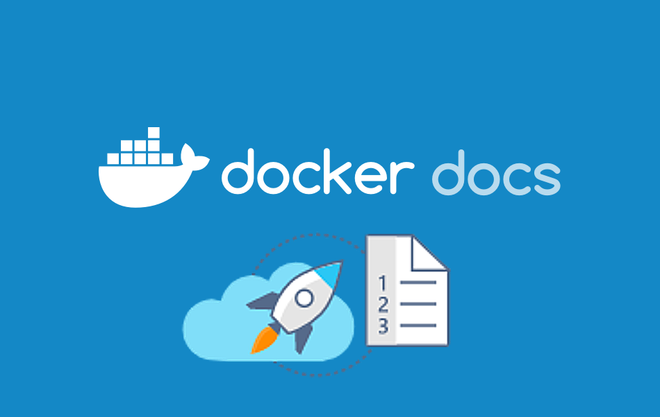](https://docs.docker.com/get-started/) 
        **[Get started with Docker](https://docs.docker.com/get-started/)** 
        Docker orientation and setup docs with step-by-step instructions on how to get started, including a video walk-through.
    :::column-end:::
    :::column:::
        
        **[MS Learn course: Introduction to Docker containers](/learn/modules/intro-to-docker-containers/)** 
        Microsoft Learn offers a free intro course on Docker containers, in addition to a [variety of courses](/learn/browse/?terms=docker) on get started with Docker and connecting with Azure services.
    :::column-end:::
    :::column:::
        
        **[Get started with Docker remote containers on WSL 2](/windows/wsl/tutorials/wsl-containers)** 
        Learn how to set up Docker Desktop for Windows to use with a Linux command line (Ubuntu, Debian, SUSE, etc) using WSL 2 (Windows Subsystem for Linux, version 2).
    :::column-end:::
:::row-end:::

## VS Code and Docker

:::row:::
    :::column:::
       [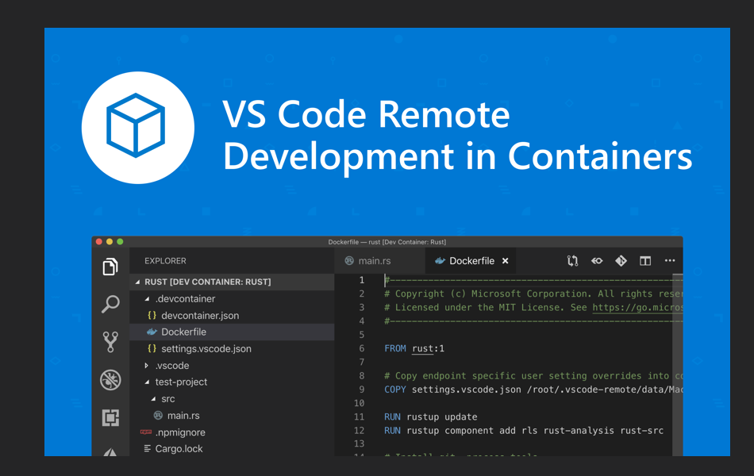](https://code.visualstudio.com/docs/remote/create-dev-container) 
        **[Create a Docker container with VS Code](https://code.visualstudio.com/docs/remote/containers-tutorial)** 
        Learn how to create a full-featured development environment inside of a Docker container with Visual Studio Code and the [Remote - Containers extension](https://marketplace.visualstudio.com/items?itemName=ms-vscode-remote.remote-containers) in this tutorial, or find a deeper dive in [this article](https://code.visualstudio.com/docs/remote/create-dev-container) or tutorials on how to set up a [NodeJS container](https://code.visualstudio.com/docs/containers/quickstart-node), a [Python container](https://code.visualstudio.com/docs/containers/quickstart-python), or a [ASP.NET Core container](https://code.visualstudio.com/docs/containers/quickstart-aspnet-core).
    :::column-end:::
    :::column:::
        
        **[Attach VS Code to a Docker container](https://code.visualstudio.com/docs/remote/attach-container)** 
        Learn how to attach Visual Studio Code to a Docker container that is already running or to a [container in a Kubernetes cluster](https://code.visualstudio.com/docs/remote/attach-container#_attach-to-a-container-in-a-kubernetes-cluster).
    :::column-end:::
    :::column:::
       [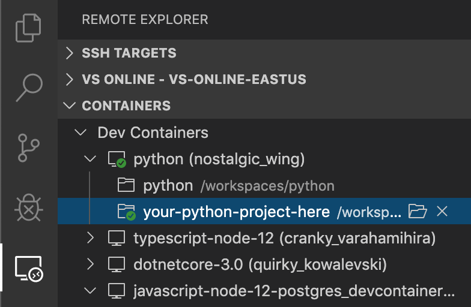](https://code.visualstudio.com/docs/remote/containers-advanced) 
        **[Advanced Container Configuration](https://code.visualstudio.com/docs/remote/containers-advanced)** 
        Learn about advanced setup scenarios for using Docker containers with Visual Studio Code or read this article on how to [Inspect Containers](https://code.visualstudio.com/blogs/2019/10/31/inspecting-containers) for debugging with VS Code.
    :::column-end:::
    :::column:::
       [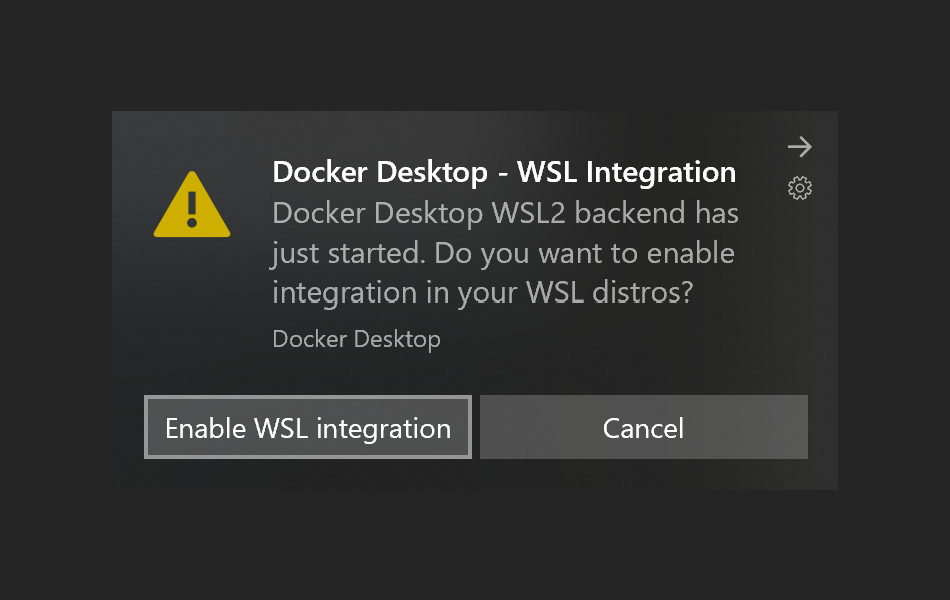](https://code.visualstudio.com/blogs/2020/07/01/containers-wsl) 
        **[Using Remote Containers in WSL 2](https://code.visualstudio.com/blogs/2020/07/01/containers-wsl)** 
        Read about using Docker containers with WSL 2 (Windows Subsystem for Linux, version 2) and how to set everything up with VS Code. You can also read about [how it works](https://code.visualstudio.com/blogs/2020/03/02/docker-in-wsl2#_how-it-works).
    :::column-end:::
:::row-end:::

## Visual Studio and Docker

:::row:::
    :::column:::
        
        **[Docker support in Visual Studio](/visualstudio/containers/overview#docker-support-in-visual-studio-1)** 
        Learn about the Docker support available for ASP.NET projects, ASP.NET Core projects, and .NET Core and .NET Framework console projects in Visual Studio, in addition to support for container orchestration.
    :::column-end:::
    :::column:::
       [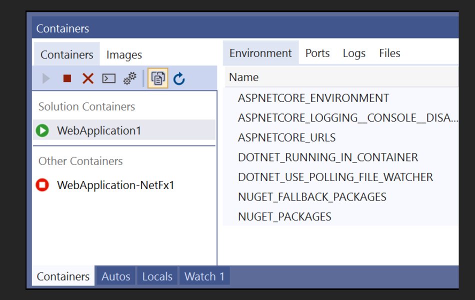](/visualstudio/containers/container-tools) 
        **[Quickstart: Docker in Visual Studio](/visualstudio/containers/container-tools)** 
        Learn how to build, debug, and run containerized .NET, ASP.NET, and ASP.NET Core apps and publish them to Azure Container Registry (ACR), Docker Hub, Azure App Service, or your own container registry with Visual Studio.
    :::column-end:::
    :::column:::
        
        **[Tutorial: Create a multi-container app with Docker Compose](/visualstudio/containers/tutorial-multicontainer)** 
        Learn how to manage more than one container and communicate between them when using Container Tools in Visual Studio. You can also find links to tutorials like how to [Use Docker with a React Single-page App](/visualstudio/containers/container-tools-react).
    :::column-end:::
    :::column:::
        
        **[Container Tools in Visual Studio](/visualstudio/containers)** 
        Find topics covering how to run build tools in a container, [debugging Docker apps](/visualstudio/containers/edit-and-refresh), troubleshoot development tools, deploy Docker containers, and bridge Kubernetes with Visual Studio.
    :::column-end:::
:::row-end:::

## .NET Core and Docker

:::row:::
    :::column:::
       [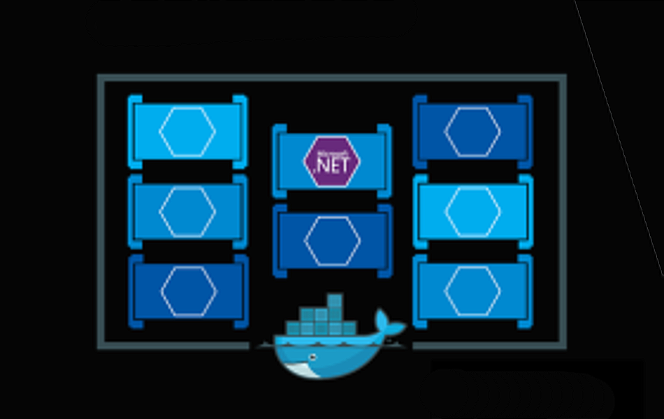](/dotnet/architecture/microservices/) 
        **[.NET Guide: Microservice apps and containers](/dotnet/architecture/microservices/)** 
        An introductory guide to developing microservices-based apps and managing them using containers. Discusses architectural design and implementation approaches using .NET Core and Docker containers, including [Choosing between .NET Core and .NET Framework for Docker containers](/dotnet/architecture/microservices/net-core-net-framework-containers/).
    :::column-end:::
    :::column:::
       [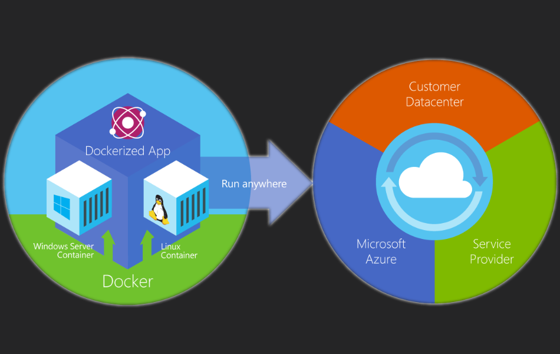](/dotnet/architecture/microservices/container-docker-introduction/docker-defined) 
        **[What is Docker?](/dotnet/architecture/microservices/container-docker-introduction/docker-defined)** 
        Basic explanation of Docker containers, including [Comparing Docker containers with Virtual machines](/dotnet/architecture/microservices/container-docker-introduction/docker-defined#comparing-docker-containers-with-virtual-machines) and a basic [taxonomy of Docker terms and concepts](/dotnet/architecture/microservices/container-docker-introduction/docker-containers-images-registries) explaining the difference between containers, images, and registries.
    :::column-end:::
    :::column:::
        
        **[Tutorial: Containerize a .NET Core app](/dotnet/core/docker/build-container?tabs=windows)** 
        Learn how to containerize a .NET Core application with Docker, including creation of a Dockerfile, essential commands, and cleaning up resources.
    :::column-end:::
    :::column:::
       [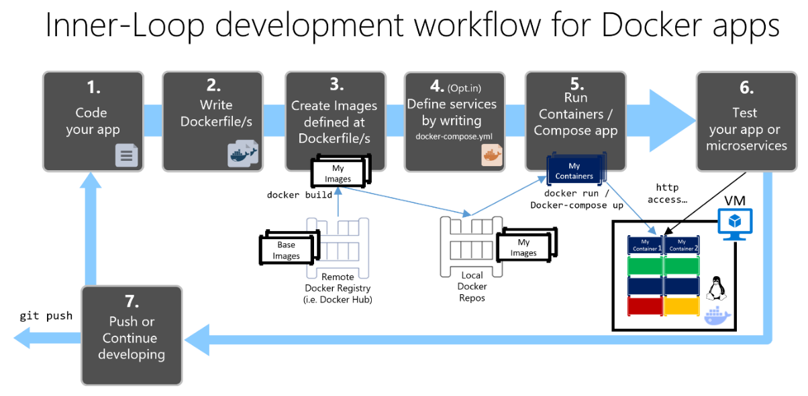](/dotnet/architecture/microservices/docker-application-development-process/docker-app-development-workflow) 
        **[Development workflow for Docker apps](/dotnet/architecture/microservices/docker-application-development-process/docker-app-development-workflow)** 
        Describes the inner-loop development workflow for Docker container-based applications.
    :::column-end:::
:::row-end:::

## Azure Container Services

:::row:::
    :::column:::
       [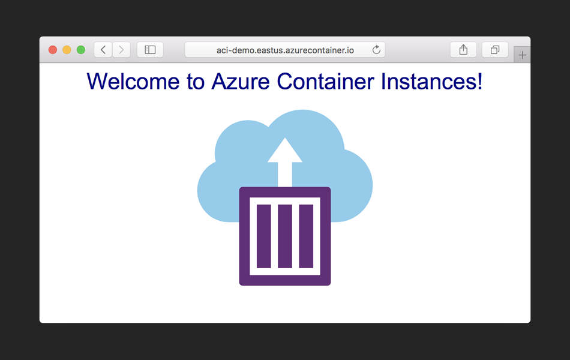](/azure/container-instances/) 
        **[Azure Container Instances](/azure/container-instances/)** 
        Learn how to run Docker containers on-demand in a managed, serverless Azure environment, includes ways to deploy with Docker CLI, ARM, Azure Portal, create multi-container groups, share data between containers, connect to a virtual network, and more.
    :::column-end:::
    :::column:::
       [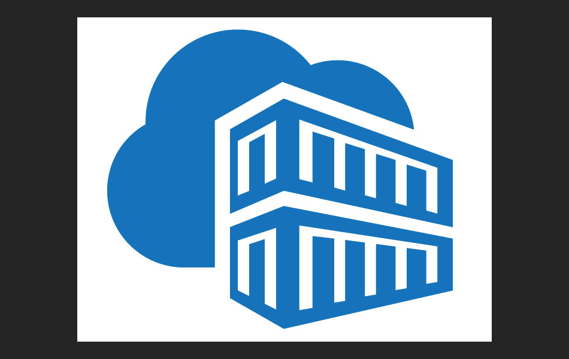](/azure/container-registry) 
        **[Azure Container Registry](/azure/container-registry)** 
        Learn how to build, store, and manage container images and artifacts in a private registry for all types of container deployments. Create Azure container registries for your existing container development and deployment pipelines, set up automation tasks, and learn how to manage your registries, including geo-replication and best practices.
    :::column-end:::
    :::column:::
       [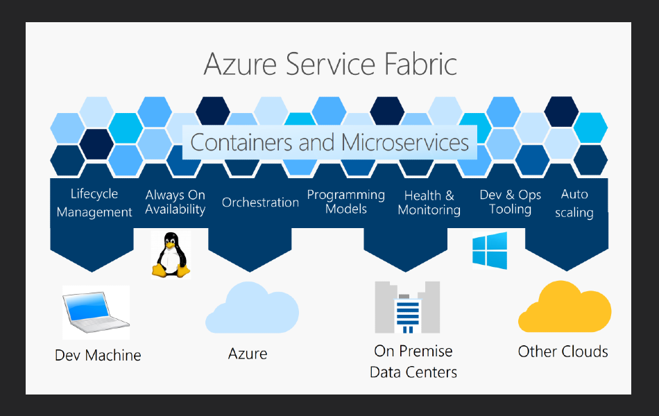](/azure/service-fabric) 
        **[Azure Service Fabric](/azure/service-fabric)** 
        Learn about Azure Service Fabric, a distributed systems platform for packaging, deploying, and managing scalable and reliable microservices and containers.
    :::column-end:::
    :::column:::
       [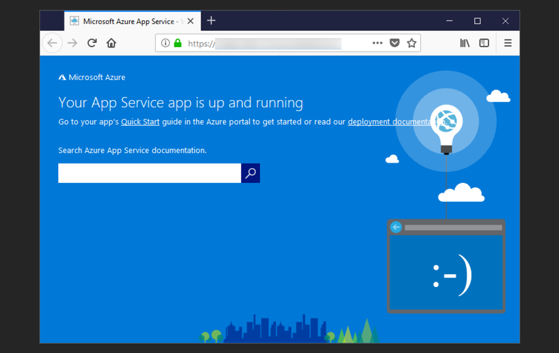](/azure/app-service) 
        **[Azure App Service](/azure/app-service)** 
        Learn how to build and host web apps, mobile back ends, and RESTful APIs in the programming language of your choice without managing infrastructure. Try the [Azure App Service course on MS Learn](/learn/modules/deploy-run-container-app-service) to deploy a web app based on a Docker image and configure continuous deployment.
    :::column-end:::
:::row-end:::

Learn about more [Azure services that support containers](https://azure.microsoft.com/overview/containers/).
