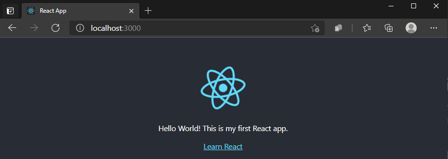
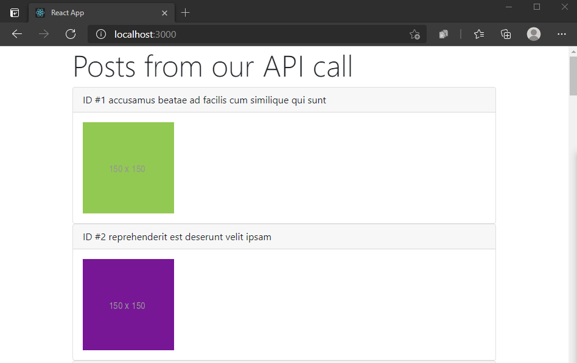

# Tutorial: React on Windows for beginners

If you're brand new to using React, this guide will help you to get started with some basics.

- [A few basic terms and concepts](#a-few-basic-terms-and-concepts)
- [Try using React in Visual Studio Code](#try-using-react-in-visual-studio-code)
- [Try using React with an API](#try-using-react-with-an-api)

## Prerequisites

- Install React *([Should I install on Windows or Windows Subsystem for Linux](./windows-or-wsl.md))*
  - [Install React on Windows](./react-on-windows.md)
  - [Install React on Windows Subsystem for Linux](./react-on-wsl.md)
- [Install VS Code](https://code.visualstudio.com/download). We recommend installing VS Code on Windows, regardless of whether you plan to use React on Windows or WSL.

## A few basic terms and concepts

React is a JavaScript library for building user interfaces.

- It is [open-source](https://github.com/facebook/react), meaning that you can contribute to it by filing issues or pull requests. *(Just like [these docs](https://docs.microsoft.com/contribute/)!)*

- It is [declarative](https://en.wikipedia.org/wiki/Declarative_programming), meaning that you write the code that you want and React takes that declared code and performs all of the JavaScript/DOM steps to get the desired result.

- It is [component-based](https://en.wikipedia.org/wiki/Component-based_software_engineering), meaning that applications are created using prefabricated and reusable independent code modules that manage their own state and can be glued together using the React framework, making it possible to pass data through your app while keeping state out of the DOM.

- The React motto is "Learn once, write anywhere." The intention is for [code reuse](https://en.wikipedia.org/wiki/Code_reuse) and not making assumptions about how you will use React UI with other technologies, but to make components reusable without the need to rewrite existing code.

- [JSX](https://reactjs.org/docs/introducing-jsx.html) is a syntax extension for JavaScript written to be used with React that looks like HTML, but is actually a JavaScript file that needs to be compiled, or translated into regular JavaScript.

- [Virtual DOM](https://reactjs.org/docs/faq-internals.html): [DOM](https://en.wikipedia.org/wiki/Document_Object_Model) stands for Document Object Model and represents the UI of your app. Every time the state of your app's UI changes, the DOM gets updated to represent the change. When a DOM is frequently updating, performance becomes slow. A Virtual DOM is only a visual representation of the DOM, so when the state of the app changes, the virtual DOM is updated rather than the real DOM, reducing the performance cost. It's a *representation* of a DOM object, like a lightweight copy.

- *Views*: are what the user sees rendered in the browser. In React, view is related to the concept of [rendering elements](https://reactjs.org/docs/rendering-elements.html) that you want a user to see on their screen.

- [State](https://reactjs.org/docs/faq-state.html): refers to the data stored by different views. The state will typically rely on who the user is and what the user is doing. For example, signing into a website may show your user profile (view) with your name (state). The state data will change based on the user, but the view will remain the same.

## Try using React in Visual Studio Code

There are many ways to create an application with React (see the [React Overview](./react-overview.md) for examples). This tutorial will walk through how to use [create-react-app](https://create-react-app.dev/) to fast-forward the set up for a functioning React app so that you can see it running and focus on experimenting with the code, not yet concerning yourself with the build tools.

1. Use create-react-app on Windows or WSL (see the [prerequisites above](#prerequisites)) to create a new project: `npx create-react-app hello-world`

2. Change directories so that you're inside the folder for your new app: `cd hello-world` and start your app: `npm start`

    Your new React Hello World app will compile and open your default web browser to show that it's running on localhost:3000.

3. Stop running your React app (Ctrl+c) and open it's code files in VS Code by entering: `code .`

4. Find the src/App.js file and find the header section that reads:

    ```JavaScript
    <p>Edit <code>src/App.js</code> and save to reload.</p>
    ```

    Change it to read:

    ```JavaScript
    <p>Hello World! This is my first React app.</p>
    ```

    

## Try using React with an API

Using the same Hello World! app that you built with React and updated with Visual Studio Code, let's try adding an API call to display some data.

1. First, let's remove everything from that app.js file and make it into a class component. We will first import *[component](https://reactjs.org/docs/react-component.html)* from React and use it to create the class component. (There are two types of components: class and function). We will also add some custom JSX code in a `return()` statement. You can reload the page to see the result.

    Your app.js file should now look like this:

    ```JavaScript
    import React, { Component } from 'react';
    
    class App extends Component {
      render() {
        return (
          <p>Hello world! This is my first React app.</p>
        );
      }
    }
    export default App;
    ```

    

2. Next, let's set a local state where we can save data from an API. A state object is where we can store data to be used in the view. The view is rendered to the page inside of `render()`.

    To add a local state, we need to first add a [constructor](https://reactjs.org/docs/react-component.html#constructor). When implementing the constructor for a React.Component subclass, you should call `super(props)` before any other statement. Otherwise, `this.props` will be undefined in the constructor, which can lead to bugs. [Props](https://reactjs.org/docs/components-and-props.html) are what pass data down into components.

    We also need to initialize the local state and assign an object to `this.state`. We will use "posts" as an empty array that we can fill with post data from an API.

    Your app.js file should now look like this:

    ```JavaScript
    import React, { Component } from 'react';

    class App extends Component {
    constructor(props) {
        super(props);
        this.state = {
          posts: []
        }
      }
      render() {
        return (
          <p>Hello world!</p>
        );
      }
    }
    export default App;
    ```

3. To call an API with data for us to use in our React app, we will use the .fetch JavaScript method. The API we will call is [JSONPlaceholder](https://jsonplaceholder.typicode.com/guide/), a free API for testing and prototyping that serves up fake placeholder data in JSON format. The [`componentDidMount`](https://reactjs.org/docs/react-component.html#mounting) method is used to mount the `fetch` to our React component. The data from the API is saved in our state (using the [setState](https://reactjs.org/docs/react-component.html#setstate) request).

    ```JavaScript
    import React, { Component } from 'react';

    class App extends Component {
    constructor(props) {
        super(props);
        this.state = {
          posts: []
        }
      }
      componentDidMount() {
        const url = "https://jsonplaceholder.typicode.com/albums/1/photos";
        fetch(url)
        .then(response => response.json())
        .then(json => this.setState({ posts: json }))
      }
      render() {
        return (
          <p>Hello world!</p>
        );
      }
    }
    export default App;
    ```

4. Let's take a look at what sort of data the API has saved in our `posts` state. Below is some of the contents of the [fake JSON API file](https://jsonplaceholder.typicode.com/albums/1/photos). We can see the format the data is listed in, using the categories: "albumId", "id", "title", "url", and "thumbnailUrl".

    ```json
    [
      {
        "albumId": 1,
        "id": 1,
        "title": "accusamus beatae ad facilis cum similique qui sunt",
        "url": "https://via.placeholder.com/600/92c952",
        "thumbnailUrl": "https://via.placeholder.com/150/92c952"
      },
      {
        "albumId": 1,
        "id": 2,
        "title": "reprehenderit est deserunt velit ipsam",
        "url": "https://via.placeholder.com/600/771796",
        "thumbnailUrl": "https://via.placeholder.com/150/771796"
      }
    ]
    ```

5. We will need to add some page styling to display our API data. Let's just use [Bootstrap](https://getbootstrap.com/docs/5.0/getting-started/introduction/) to handle the styling for us. We can copy + paste the Bootstrap CDN stylesheet reference inside the `./public/index.html` file of our React app.

    ```html
        <!-- Bootstrap -->
        <link href="https://cdn.jsdelivr.net/npm/bootstrap@5.0.0-beta3/dist/css/bootstrap.min.css" rel="stylesheet" integrity="sha384-eOJMYsd53ii+scO/bJGFsiCZc+5NDVN2yr8+0RDqr0Ql0h+rP48ckxlpbzKgwra6" crossorigin="anonymous">
    
        <title>React App</title>
      </head>
      <body>
    ```

6. To display the API data, referencing our Bootstrap classes for styling, we will now need to add a bit of JSX code inside the rendered `return()` statement. We will add a container, a header ("Posts from our API call"), and a card for each piece of data from our API. We will use the [`map()`](https://reactjs.org/docs/lists-and-keys.html) method to display our data from the `posts` object that we stored it in as keys. Each card will display a header with "ID #" and then the post.id key value + post.title key value from our JSON data. Followed by the body displaying the image based on the thumbnailURL key value.

    ```javascript
      render() {
        const { posts } = this.state;
        return (
          <div className="container">
            <div class="jumbotron">
              <h1 class="display-4">Posts from our API call</h1>
            </div>
            {posts.map((post) => (
              <div className="card" key={post.id}>
                <div className="card-header">
                  ID #{post.id} {post.title}
                </div>
                <div className="card-body">
                  </img>
                </div>
              </div>
            ))}
          </div>
        );
      }
    ```

7. Run your React app again: `npm start` and take a look in your local web browser on `localhost:3000` to see your API data being displayed.

    

## Additional resources

- The [official React docs](https://reactjs.org/) offer all of the latest, up-to-date information on React
- [Microsoft Edge Add-ons for React Developer Tools](https://microsoftedge.microsoft.com/addons/detail/react-developer-tools/gpphkfbcpidddadnkolkpfckpihlkkil): Add two tabs to your Microsoft Edge dev tools to help with your React development: Components and Profiler.
- Microsoft Learn: The [React Learning Path](https://docs.microsoft.com/learn/paths/react/) contains online course modules to help you get started with the basics.
