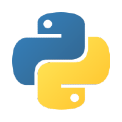
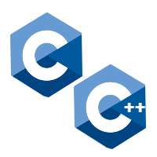
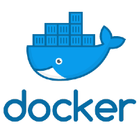

# Set up your development environment on Windows 10

This guide will help you get started with installing and setting up the languages and tools you need to develop on Windows or Windows Subsystem for Linux.

## Development paths

:::row:::
    :::column:::
        
        **[Get started with NodeJS](../nodejs/index.yml)** 
        Install NodeJS and get your development environment setup on Windows or Windows Subsystem for Linux.
    :::column-end:::
    :::column:::
        
        **[Get started with Python](../python/index.yml)** 
        Install Python and get your development environment setup on Windows or Windows Subsystem for Linux.
    :::column-end:::
    :::column:::
        
        **[Get started with Android](/windows/android)** 
        Install Android Studio, or choose a cross-platform solution like Xamarin, React, or Cordova, and get your development environment setup on Windows.
    :::column-end:::
    :::column:::
        
        **[Get started with Windows Desktop](../apps/index.yml)** 
        Get started building desktop apps for Windows 10 using UWP, Win32, WPF, Windows Forms, or updating and deploying existing desktop apps with MSIX and XAML Islands.
    :::column-end:::
:::row-end:::

:::row:::
    :::column:::
        
        **[Get started with C++ and C](/cpp/)** 
        Get started with C++, C, and assembly to develop apps, services, and tools.
    :::column-end:::
    :::column:::
        
        **[Get started with C#](/dotnet/csharp/)** 
        Get started building apps using C# and .NET Core.
    :::column-end:::
    :::column:::
        
        **[Get started with Docker Desktop for Windows](..windows/dev-environment/docker/overview.md)** 
        Create remote development containers for work scenarios with Visual Studio, VS Code, .NET, Windows Subsystem for Linux, or connecting to Azure services.
    :::column-end:::
    :::column:::
        
        **[Get started with PowerShell](/powershell/)** 
        Get started with cross-platform task automation and configuration management using PowerShell, a command-line shell and scripting language.
    :::column-end:::
:::row-end:::

## Tools and platforms

:::row:::
    :::column:::
        
        **[Windows Subsystem for Linux](/windows/wsl/)** 
        Use your favorite Linux distribution fully integrated with Windows (no more need for dual-boot). 
        [Install WSL](/windows/wsl/install-win10)
    :::column-end:::
    :::column:::
        
        **[Windows Terminal](/windows/terminal/)** 
        Customize your terminal environment to work with multiple command line shells.
         
        [Install Terminal](https://www.microsoft.com/p/windows-terminal/9n0dx20hk701?rtc=1&activetab=pivot:overviewtab)
    :::column-end:::
    :::column:::
        
        **[Windows Package Manager](../package-manager/index.md)** 
        Use the winget.exe client, a comprehensive package manager, with your command line to install applications on Windows 10. 
        [Install Windows Package Manager (public preview)](../package-manager/winget/index.md#install-winget)
    :::column-end:::
    :::column:::
        
        **[Windows PowerToys](https://github.com/microsoft/PowerToys)** 
        Tune and streamline your Windows experience for greater productivity with this set of power user utilities. 
        [Install PowerToys (public preview)](https://github.com/microsoft/PowerToys#installing-and-running-microsoft-powertoys)
    :::column-end:::
:::row-end:::
:::row:::
    :::column:::
        
        **[VS Code](https://code.visualstudio.com/docs)** 
        A lightweight source code editor with built-in support for JavaScript, TypeScript, Node.js, a rich ecosystem of extensions (C++, C#, Java, Python, PHP, Go) and runtimes (such as .NET and Unity). 
        [Install VS Code](https://code.visualstudio.com/download)
    :::column-end:::
    :::column:::
        
        **[Visual Studio](/visualstudio/windows/)** 
        An integrated development environment that you can use to edit, debug, build code, and publish apps, including compilers, intellisense code completion, and many more features. 
        [Install Visual Studio](/visualstudio/install/install-visual-studio)
    :::column-end:::
    :::column:::
        
        **[Azure](/azure/guides/developer/azure-developer-guide)** 
        A complete cloud platform to host your existing apps and streamline new development. Azure services integrate everything you need to develop, test, deploy, and manage your apps. 
        [Set up an Azure account](https://azure.microsoft.com/free/)
    :::column-end:::
    :::column:::
        
        **[.NET](/dotnet/standard/get-started/)** 
        An open source development platform with tools and libraries for building any type of app, including web, mobile, desktop, gaming, IoT, cloud, and microservices. 
        [Install .NET](https://dotnet.microsoft.com/download)
    :::column-end:::
:::row-end:::

 

## Run Windows and Linux

Windows Subsystem for Linux (WSL) allows developers to run a Linux operating system right alongside Windows. Both share the same hard drive (and can access each other’s files), the clipboard supports copy-and-paste between the two naturally, there's no need for dual-booting. WSL enables you to use BASH and will provide the kind of environment most familiar to Mac users.
- Learn more in the [WSL docs](/windows/wsl) or via [WSL videos on Channel 9](https://channel9.msdn.com/Search?term=wsl&lang-en=true).

> [!VIDEO https://channel9.msdn.com/Blogs/One-Dev-Minute/What-can-I-do-with-WSL--One-Dev-Question/player?format=ny]

You can also use Windows Terminal to open all of your favorite command line tools in the same window with multiple tabs, or in multiple panes, whether that's PowerShell, Windows Command Prompt, Ubuntu, Debian, Azure CLI, Oh-my-Zsh, Git Bash, or all of the above.

Learn more in the [Windows Terminal docs](/windows/terminal) or via [Windows Terminal videos on Channel 9](https://channel9.msdn.com/Search?term=windows%20terminal&lang-en=true).

> [!VIDEO https://channel9.msdn.com/Blogs/One-Dev-Minute/What-are-the-main-features-of-the-new-Terminal--One-Dev-Question/player?format=ny]

## Transitioning between Mac and Windows

Check out our [guide to transitioning between between a Mac and Windows](./mac-to-windows.md) (or Windows Subsystem for Linux) development environment. It can help you map the difference between:

- [Keyboard shortcuts](./mac-to-windows.md#keyboard-shortcuts)
- [Trackpad shortcuts](./mac-to-windows.md#trackpad-shortcuts)
- [Terminal and shell tools](./mac-to-windows.md#command-line-shells-and-terminals)
- [Apps and utilities](./mac-to-windows.md#apps-and-utilities)

## Additional resources

- [Tips for improving your workflow](./tips.md)
- [Stories from developers who have switched from Mac to Windows](./dev-stories.md)
- [Popular tutorials, courses, and code samples](./tutorials.md)
- [Microsoft's Game Stack documentation](/gaming/)