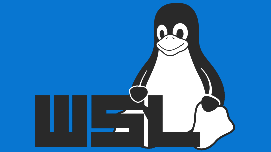
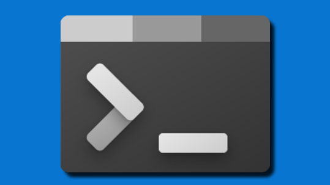
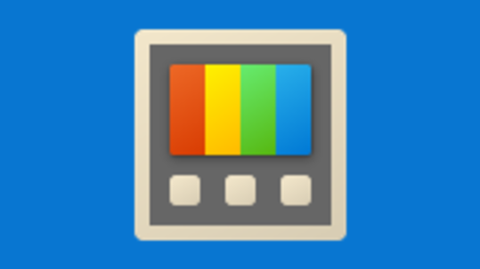
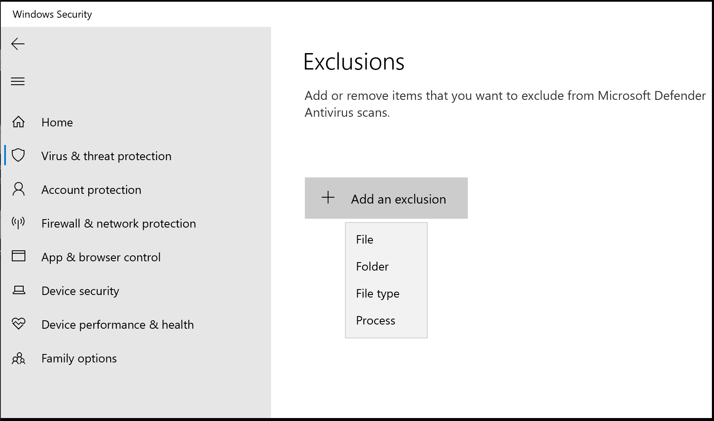
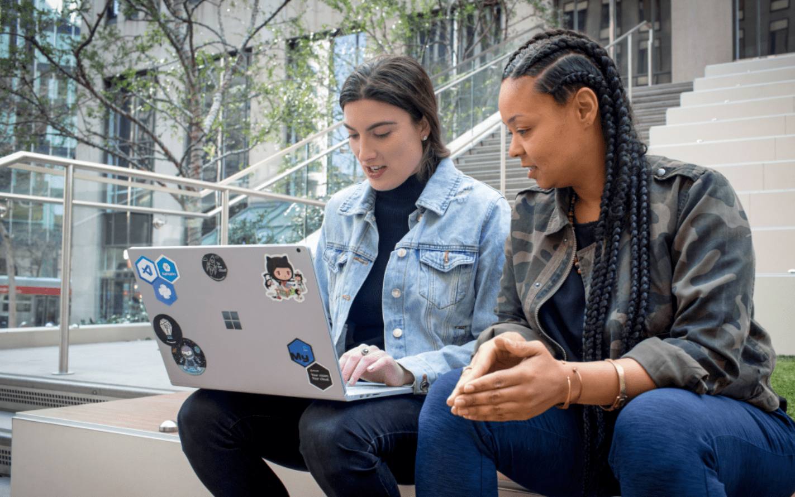

# Set up your Windows 10 development environment

This guide will help you get started with installing and setting up the languages and tools you need to develop on Windows or Windows Subsystem for Linux.

## Development paths

:::row:::
    :::column:::
       [](https://docs.microsoft.com/windows/nodejs)<br>
        **[Get started with NodeJS](https://docs.microsoft.com/windows/nodejs)**<br>
        Install NodeJS and get your development environment setup on Windows or Windows Subsystem for Linux.
    :::column-end:::
    :::column:::
       [](https://docs.microsoft.com/windows/python)<br>
        **[Get started with Python](https://docs.microsoft.com/windows/python)**<br>
        Install Python and get your development environment setup on Windows or Windows Subsystem for Linux.
    :::column-end:::
    :::column:::
       [](https://docs.microsoft.com/windows/android)<br>
        **[Get started with Android](https://docs.microsoft.com/windows/android)**<br>
        Install Android Studio, or choose a cross-platform solution like Xamarin, React, or Cordova, and get your development environment setup on Windows.
    :::column-end:::
    :::column:::
       [](https://docs.microsoft.com/windows/apps/)<br>
        **[Get started with Windows](https://docs.microsoft.com/windows/apps/)**<br>
        Get started building desktop apps for Windows 10 using UWP, Win32, WPF, Windows Forms, or updating and deploying existing desktop apps with MSIX and XAML Islands.
    :::column-end:::
:::row-end:::

## Tools and platforms

:::row:::
    :::column:::
       [](https://docs.microsoft.com/windows/wsl/)<br>
        **[Windows Subsystem for Linux](https://docs.microsoft.com/windows/wsl/)**<br>
        Use your favorite Linux distribution fully integrated with Windows (no more need for dual-boot).<br>
        [Install WSL](https://docs.microsoft.com/windows/wsl/install-win10)
    :::column-end:::
    :::column:::
       [](https://docs.microsoft.com/windows/terminal/)<br>
        **[Windows Terminal](https://docs.microsoft.com/windows/terminal/)**<br>
        Customize your terminal environment to work with multiple command line shells.
        <br>
        [Install Terminal](https://www.microsoft.com/p/windows-terminal/9n0dx20hk701?rtc=1&activetab=pivot:overviewtab)
    :::column-end:::
    :::column:::
       [](https://docs.microsoft.com/windows/package-manager/)<br>
        **[Windows Package Manager](https://docs.microsoft.com/windows/package-manager/)**<br>
        Use WinGet, the comprehensive package manager, with your command line to install applications on Windows 10.<br>
        [Install WinGet](https://docs.microsoft.com/windows/package-manager/winget/#install-winget)
    :::column-end:::
    :::column:::
       [](https://github.com/microsoft/PowerToys)<br>
        **[Windows PowerToys](https://github.com/microsoft/PowerToys)**<br>
        Tune and streamline your Windows experience for greater productivity with this set of power user utilities.<br>
        [Install PowerToys](https://github.com/microsoft/PowerToys#installing-and-running-microsoft-powertoys)
    :::column-end:::
:::row-end:::
:::row:::
    :::column:::
       [](https://code.visualstudio.com/docs)<br>
        **[VS Code](https://code.visualstudio.com/docs)**<br>
        A lightweight source code editor with built-in support for JavaScript, TypeScript, Node.js, a rich ecosystem of extensions (C++, C#, Java, Python, PHP, Go) and runtimes (such as .NET and Unity).<br>
        [Install VS Code](https://code.visualstudio.com/download)
    :::column-end:::
    :::column:::
       [](https://docs.microsoft.com/visualstudio/windows/)<br>
        **[Visual Studio](https://docs.microsoft.com/visualstudio/windows/)**<br>
        An integrated development environment that you can use to edit, debug, build code, and publish apps, including compilers, intellisense code completion, and many more features.<br>
        [Install Visual Studio](https://docs.microsoft.com/visualstudio/install/install-visual-studio)
    :::column-end:::
    :::column:::
       [](https://docs.microsoft.com/azure/guides/developer/azure-developer-guide)<br>
        **[Azure](https://docs.microsoft.com/azure/guides/developer/azure-developer-guide)**<br>
        A complete cloud platform to host your existing apps and streamline new development. Azure services integrate everything you need to develop, test, deploy, and manage your apps.<br>
        [Set up an Azure account](https://azure.microsoft.com/free/)
    :::column-end:::
    :::column:::
       [](https://dotnet.microsoft.com/)<br>
        **[.NET](https://docs.microsoft.com/dotnet/standard/get-started/)**<br>
        An open source development platform with tools and libraries for building any type of app, including web, mobile, desktop, gaming, IoT, cloud, and microservices.<br>
        [Install .NET](https://dotnet.microsoft.com/download)
    :::column-end:::
:::row-end:::

<br>

---

<br>


## Tips for improving your workflow

We've gathered a few tips that we hope will help to make your workflow more efficient and enjoyable. Do you have additional tips to share? File a pull request, using the "Edit" button above, or an issue, using the "Feedback" button below and we may add it to the list.

* Windows Subsystem for Linux is intended for use as part of an inner dev loop. An example workflow we recommend would be to create a CI/CD pipeline, use WSL 2 to install Ubuntu on your Windows machine and develop locally with an actual Linux instance. After verifying that things behave correctly, you can then push that CI/CD pipeline up to the cloud by making it into a Docker container and pushing the container to your cloud instance where it runs on a production-ready Ubuntu VM. For more ways to use WSL, check out this [Tabs vs Spaces episode on WSL 2](https://channel9.msdn.com/Shows/Tabs-vs-Spaces/WSL2-Code-faster-on-the-Windows-Subsystem-for-Linux).

* If you're working with both Windows and Windows Subsystem for Linux, you have two file systems installed: NTSF (Windows) and WSL (your Linux distro). For fast performance, ensure that your project files are stored in the same system as the tools you're using. Learn more about [choosing the correct file system for faster performance](https://docs.microsoft.com/windows/wsl/compare-versions#use-the-linux-file-system-for-faster-performance).

* You can improve your build speed by updating your Windows Defender settings to add exclusions for project folders or file types that you trust enough to avoid scanning for security threats. Learn more about how to [Update Windows Defender settings to improve performance](https://docs.microsoft.com/windows/android/defender-settings).



* You can launch VS Code from your command line into the project that you have open by using the command: `code .` or open your project directory from the command line with Windows File Explorer using `explorer.exe .` from Windows or your WSL distribution. You may need to add the VS Code executable to your PATH environment variable if this doesn't work by default. Learn more about [Launching from the Command Line](https://code.visualstudio.com/docs/editor/command-line#_launching-from-command-line).


* If you're using Git for version control and collaboration, you can streamline your authentication process by [setting up Git Credential Manager](https://docs.microsoft.com/windows/wsl/tutorials/wsl-git#git-credential-manager-setup) to store your tokens in the Windows Credential Manager. We also recommend [adding a .gitignore file](https://docs.microsoft.com/windows/wsl/tutorials/wsl-git#adding-a-git-ignore-file) to your project.

* You can launch multiple command lines, like PowerShell, Ubuntu, and Azure CLI, all into a single window with multiple panes using [Windows Terminal Command Line Arguments](https://docs.microsoft.com/windows/terminal/command-line-arguments?tabs=powershell#multiple-panes). After installing [Windows Terminal](https://docs.microsoft.com/windows/terminal/get-started), [WSL/Ubuntu](https://docs.microsoft.com/windows/wsl/install-win10), and [Azure CLI](https://docs.microsoft.com/cli/azure/install-azure-cli?view=azure-cli-latest), enter this command in PowerShell to open a new multi-pane window with all three:

    ```powershell
    wt -p "Command Prompt" `; split-pane -p "Windows PowerShell" `; split-pane -H wsl.exe
    ```


## Transitioning between Mac and Windows

Check out our [guide to transitioning between between a Mac and Windows](https://docs.microsoft.com/windows/dev-environment/mac-to-windows) (or Windows Subsystem for Linux) development environment. It can help you map the difference between:

* [Keyboard shortcuts](https://docs.microsoft.com/windows/dev-environment/mac-to-windows#keyboard-shortcuts)
* [Trackpad shortcuts](https://docs.microsoft.com/windows/dev-environment/mac-to-windows#trackpad-shortcuts)
* [Terminal and shell tools](https://docs.microsoft.com/windows/dev-environment/mac-to-windows#terminal-and-shell)
* [Apps and utilities](https://docs.microsoft.com/windows/dev-environment/mac-to-windows#apps-and-utilities)

## Stories from developers who have switched

We thought it may be helpful to hear from other developers about their experiences switching between a Mac and Windows development environment. Most found the process reasonably simple, appreciated that they could still use their favorite Linux and open source tools, while also having integrated access to Windows productivity tools, like [Microsoft Office](https://www.microsoft.com/microsoft-365/products-apps-services), [Outlook](https://www.microsoft.com/microsoft-365/outlook/email-and-calendar-software-microsoft-outlook), and [Teams](https://www.microsoft.com/microsoft-365/microsoft-teams/group-chat-software). Here are a few articles and blog entries that we found:

* Ken Wang, ["Think Different — Software Developer Switching from Mac to Windows"](https://medium.com/@kenwang_57215/software-developer-switching-from-mac-to-windows-66773d331910)
* Owen Williams, ["The state of switching to Windows from Mac in 2019"](https://char.gd/blog/2019/the-state-of-switching-to-windows-from-mac-in-2019)
* Brent Rose, ["What Happened When I Switched From Mac to Windows"](https://www.wired.com/story/rant-switching-from-mac-to-windows/)
* Jack Franklin, ["Using Windows 10 and WSL for frontend web development"](https://www.jackfranklin.co.uk/blog/frontend-development-with-windows-10/)
* Aaron Schlesinger, ["Coming from a Mac to Windows & WSL 2"](https://arschles.com/blog/coming-from-a-mac-to-windows-wsl-2/)
* David Heinemeier Hansson, ["Back to windows after twenty years"](https://m.signalvnoise.com/back-to-windows-after-twenty-years/)
* Ray Elenteny, ["Why I returned to Windows"](https://dzone.com/articles/why-i-returned-to-windows)

## Tutorials, courses, and code samples

We've listed a few tutorials, course, and code samples below to help you get started on some common work scenarios.

* [Create a MongoDB app with React and Azure Cosmos DB](https://docs.microsoft.com/azure/cosmos-db/tutorial-develop-mongodb-react)

* [Build an Android dual-screen app with drag and drop capabilities](https://docs.microsoft.com/dual-screen/android/samples)

* [Build a to-do list cross-platform app with Xamarin.Forms](https://docs.microsoft.com/samples/xamarin/xamarin-forms-samples/todo/)

* [Build a Xamarin.Android app that utilizes Google Play Services to demo the Google Maps API](https://docs.microsoft.com/samples/xamarin/xamarin-forms-samples/todo/)

* [Deploy a Python (Django) web app with PostgreSQL in Azure App Service](https://docs.microsoft.com/azure/app-service/containers/tutorial-python-postgresql-app?tabs=bash)

* [Build your first ASP.Net Core web app with Blazor](https://docs.microsoft.com/aspnet/core/tutorials/build-your-first-blazor-app?view=aspnetcore-3.1)

* [Build a Java app with Microsoft Graph](https://docs.microsoft.com/graph/tutorials/java)

* [Call an ASP.NET Core Web API from a WPF application using Azure AD V2](https://docs.microsoft.com/samples/azure-samples/active-directory-dotnet-native-aspnetcore-v2/calling-an-aspnet-core-web-api-from-a-wpf-application-using-azure-ad-v2/?view=aspnetcore-3.1)

* [Create and deploy a cloud-native ASP.NET Core microservice](https://docs.microsoft.com/learn/modules/microservices-aspnet-core/?view=aspnetcore-3.1)

* [Explore free online courses on Microsoft Learn](https://docs.microsoft.com/learn/browse/)



## Additional resources

* [Microsoft Edge web browser docs](https://docs.microsoft.com/microsoft-edge/)
* [Try WebHint to improve your website](https://webhint.io/)
* [Microsoft's Game Stack documentation](https://docs.microsoft.com/gaming/)
