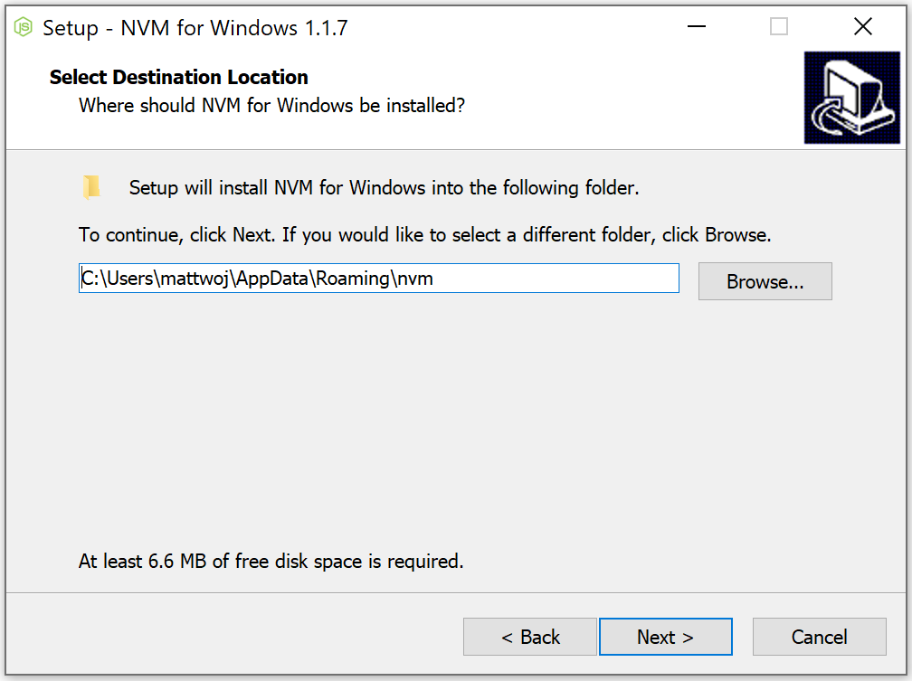
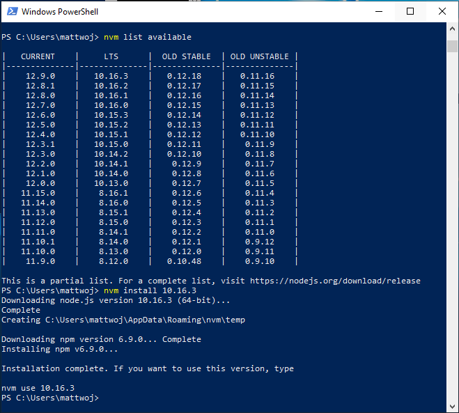
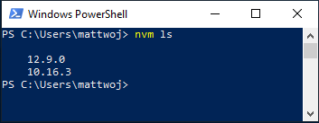

# Set up your Node.js development environment directly on Windows

The following is a step-by-step guide to get you started using Node.js in a native Windows development environment.

> [!NOTE]
> While using Node.js on Windows is certainly a viable option, we generally recommend using Windows Subsystem for Linux (WSL) for developing Node.js web apps. Many Node.js packages and frameworks are created with a *nix environment in mind and most Node.js apps are deployed on Linux, so developing on WSL ensures consistency between your development and production environments. To set up a WSL dev environment, see [Set up your Node.js development environment with WSL 2](./setup-on-wsl2.md).

## Install nvm-windows, node.js, and npm

There are multiple ways to install Node.js. We recommend using a version manager as versions change very quickly. You will likely need to switch between multiple versions based on the needs of different projects you're working on. Node Version Manager, more commonly called nvm, is the most popular way to install multiple versions of Node.js, but is only available for Mac/Linux and not supported on Windows. Instead, we will walk through the steps to install nvm-windows and then use it to install Node.js and Node Package Manager (npm). There are [alternative version managers](#alternative-version-managers) to consider as well covered in the next section.

> [!IMPORTANT]
> It is always recommended to remove any existing installations of Node.js or npm from your operating system before installing a version manager as the different types of installation can lead to strange and confusing conflicts. This includes deleting any existing nodejs installation directories (e.g., "C:\Program Files\nodejs") that might remain. NVM's generated symlink will not overwrite an existing (even empty) installation directory. For help with removing previous installations, see [How to completely remove node.js from Windows](https://stackoverflow.com/questions/20711240/how-to-completely-remove-node-js-from-windows).)

1. Open the [windows-nvm repository](https://github.com/coreybutler/nvm-windows#node-version-manager-nvm-for-windows) in your internet browser and select the **Download Now** link.
2. Download the **nvm-setup.zip** file for the most recent release.
3. Once downloaded, open the zip file, then open the **nvm-setup.exe** file.
4. The Setup-NVM-for-Windows installation wizard will walk you through the setup steps, including choosing the directory where both nvm-windows and Node.js will be installed.

    

5. Once the installation is complete. Open PowerShell and try using windows-nvm to list which versions of Node are currently installed (should be none at this point): `nvm ls`

    

6. Install the current release of Node.js (for testing the newest feature improvements, but more likely to have issues than the LTS version): `nvm install latest`
7. Install the latest stable LTS release of Node.js (recommended) by first looking up what the current LTS version number is with: `nvm list available`, then installing the LTS version number with: `nvm install <version>` (replacing `<version>` with the number, ie: `nvm install 10.16.3`).

    

8. List what versions of Node are installed: `nvm ls` ...now you should see the two versions that you just installed listed.

    

9. To check which version of Node.js is currently the default, enter: `node --version`
10. To change the version of Node.js you would like to use for a project, create a new project directory `mkdir NodeTest`, and enter the directory `cd NodeTest`, then enter `nvm use <version>` replacing `<version>` with the version number you'd like to use (ie v10.16.3`).
11. Verify which version of npm is installed with: `npm --version`, this version number will automatically change to whichever npm version is associated with your current version of Node.js.

## Alternative version managers

While windows-nvm is currently the most popular version manager for node, there are alternatives to consider:

- [nvs](https://github.com/jasongin/nvs) (Node Version Switcher) is a cross-platform `nvm` alternative with the ability to [integrate with VS Code](https://github.com/jasongin/nvs/blob/master/doc/VSCODE.md).
- 
- [Volta](https://github.com/volta-cli/volta#installing-volta) is a new version manager from the LinkedIn team that claims improved speed and cross-platform support.

To install Volta as your version manager (rather than windows-nvm), go to the **Windows Installation** section of their [Getting Started guide](https://docs.volta.sh/guide/getting-started), then download and run their Windows installer, following the setup instructions.

> [!IMPORTANT]
> You must ensure that [Developer Mode](https://docs.microsoft.com/en-us/windows/uwp/get-started/enable-your-device-for-development#accessing-settings-for-developers) is enabled on your Windows machine before installing Volta.

To learn more about using Volta to install multiple versions of Node.js on Windows, see the [Volta Docs](https://docs.volta.sh/guide/understanding#managing-your-toolchain).

## Install your favorite code editor

We recommend you [install VS Code](https://code.visualstudio.com), as well as the [Node.js Extension Pack](https://marketplace.visualstudio.com/items?itemName=waderyan.nodejs-extension-pack), for developing with Node.js on Windows. Install them all or pick and choose which seem the most useful to you.

To install the Node.js extension pack:

1. Open the **Extensions** window (Ctrl+Shift+X) in VS Code.
2. In the search box at the top of the Extensions window, enter: "Node Extension Pack" (or the name of whatever extension you are looking for).
3. Select **Install**. Once installed, your extension will appear in the "Enabled" folder of your **Extensions** window. You can disable, uninstall, or configure settings by selecting the gear icon next to the description of your new extension.

A few additional extensions you may want to consider include:

- [Debugger for Chrome](https://code.visualstudio.com/blogs/2016/02/23/introducing-chrome-debugger-for-vs-code): Once you finish developing on the server side with Node.js, you'll need to develop and test the client side. This extension integrates your VS Code editor with your Chrome browser debugging service, making things a bit more efficient.
- [Keymaps from other editors](https://marketplace.visualstudio.com/search?target=VSCode&category=Keymaps&sortBy=Downloads): These extensions can help your environment feel right at home if you're transitioning from another text editor (like Atom, Sublime, Vim, eMacs, Notepad++, etc).
- [Settings Sync](https://marketplace.visualstudio.com/items?itemName=Shan.code-settings-sync): Enables you to synchronize your VS Code settings across different installations using GitHub. If you work on different machines, this helps keep your environment consistent across them.

## Install Git (optional)

If you plan to collaborate with others, or host your project on an open-source site (like GitHub), VS Code supports [version control with Git](https://code.visualstudio.com/docs/editor/versioncontrol#_git-support). The Source Control tab in VS Code tracks all of your changes and has common Git commands (add, commit, push, pull) built right into the UI. You first need to install Git to power the Source Control panel.

1. Download and install Git for Windows from [the git-scm website](https://git-scm.com/download/win).

2. An Install Wizard is included that will ask you a series of questions about settings for your Git installation. We recommend using all of the default settings, unless you have a specific reason for changing something.

3. If you've never worked with Git before, [GitHub Guides](https://guides.github.com/) can help you get started.

4. We recommend adding a [.gitignore file](https://help.github.com/en/articles/ignoring-files) to your Node projects. Here is [GitHub's default gitignore template for Node.js](https://github.com/github/gitignore/blob/master/Node.gitignore).
