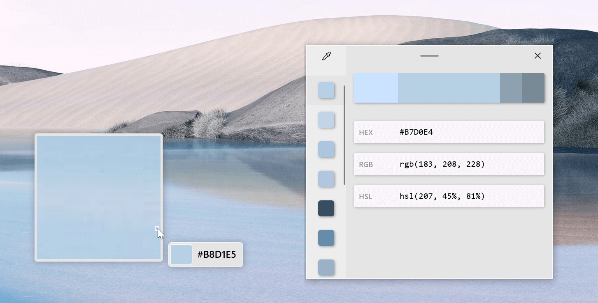
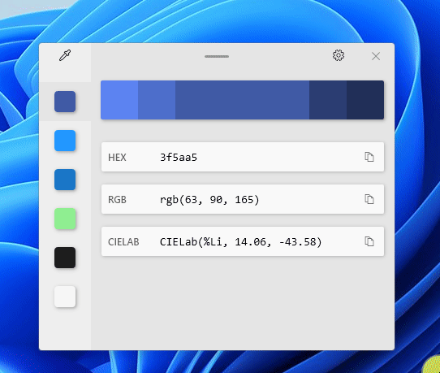

# Color Picker utility

A system-wide color picking utility for Windows 10 that enables you to pick colors from any currently running application and automatically copies it in a configurable format to your clipboard.

## Getting started

### Enable

To start using Color Picker, you need to first make sure it is enabled in the PowerToys settings (Color Picker section).

### Activate

Once enabled, you can choose one of the following three behaviors to be executed when launching Color Picker with the activation shortcut <kbd>Win</kbd>+<kbd>Shift</kbd>+<kbd>C</kbd> (note that this shortcut can be changed in the settings dialog):

:::image type="content" source="../images/pt-colorpicker-behaviors.png" alt-text="ColorPicker behaviors.":::

- **Color Picker with editor mode enabled** - Opens Color Picker, after selecting a color, the editor is opened and the selected color is copied into the clipboard (in the default format - configurable in the settings dialog).
- **Editor** - Opens Editor directly, from here you can choose a color from the history, fine tune a selected color, or capture a new color with by opening the color picker.
- **Color Picker only** - Opens Color Picker only and the selected color will be copied into the clipboard.

### Select color

After the Color Picker is activated, hover your mouse cursor over the color you would like to copy and left-click the mouse button to select a color. If you want to see the area around your cursor in more detail, scroll up to zoom in.

The copied color will be stored in your clipboard in the format that is configured in the settings (HEX by default).

## Editor usage

The editor lets you see the history of picked colors (up to 20) and copy their representation in any predefined string format. You can configure what color formats are visible in the editor, along with the order that they appear. This configuration can be found in PowerToys settings.

The editor also allows you to fine tune any picked color or get a new similar color. Editor previews different shades of currently selected color - 2 lighter and 2 darker ones.

Clicking on any of those alternative color shades will add the selection to the history of picked colors (appears on the top of the colors history list). Color in the middle represents your currently selected color from the colors history. By clicking on it, the fine tuning configuration control will appear, that will let you change HUE or RGB values of the current color. Pressing OK will add newly configured color into the colors history.

To remove any color from the colors history, right click a desired color and select *Remove*.

## Settings

Color picker will let you change following settings:

- Activation shortcut
- Behavior of activation shortcut
- Format of a copied color (HEX, RGB, etc.)
- Order and appearance of color formats in the editor

## Limitations

- Color picker can't be displayed on top of the start menu or action center (you can still pick a color).
- If the currently focused application was started with an administrator elevation (Run as administrator), the Color Picker activation shortcut will not work, unless PowerToys was also started with an administrator elevation.
