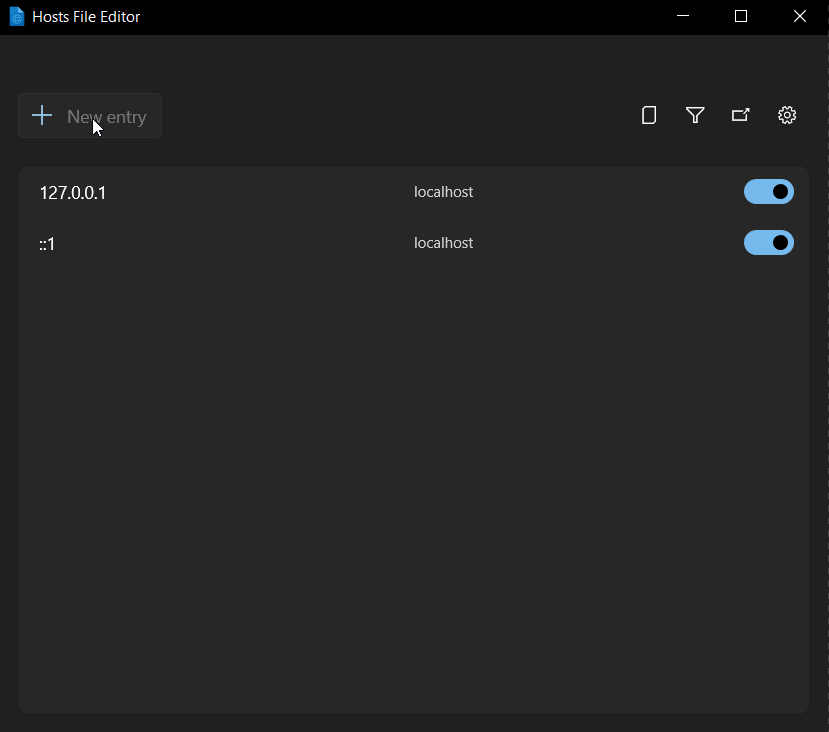
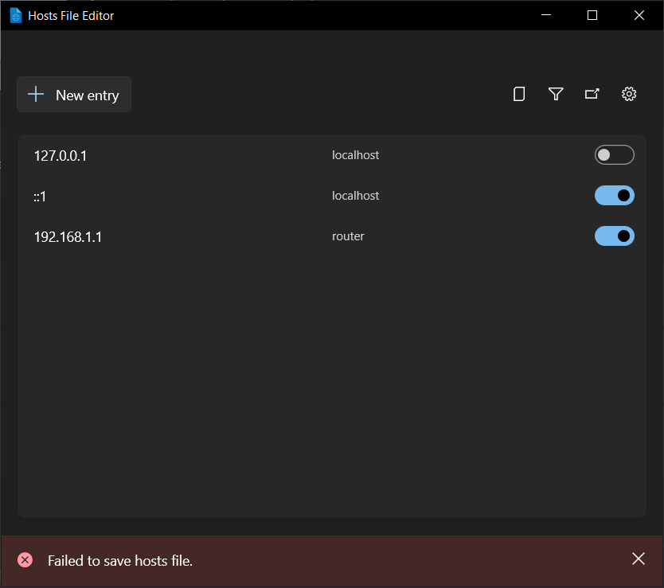

# Hosts File Editor utility

Hosts File Editor provides a convenient way to edit hosts file configuration.

## Adding new entry demo

## Filtering entries demo

## Hosts file backups

Hosts File Editor creates a backup of the hosts file before editing session. The backup files are located near by hosts file in `%SystemRoot%/System32/drivers/etc` named `hosts_PowerToysBackup_YYYYMMDDHHMMSS`.

## Settings

From the Settings menu, the following options can be configured:

| Setting | Description |
| :--- | :--- |
| Launch as administrator | Launch as administrator to be able edit the hosts file. If disabled, then editor is run in read-only mode. Hosts File Editor is started as administrator by default. |
| Show a warning at startup | Warns that editing hosts can change DNS names resolution. Warning is enabled by default. |
| Additional lines position | If `Bottom` is selected, then file header is moved after hosts settings to the bottom. Default value is `Top`.

## Troubleshooting

Next error appears if a change is made without administrator permissions:

Enable `Launch as administrator` option in settings to fix the error.
