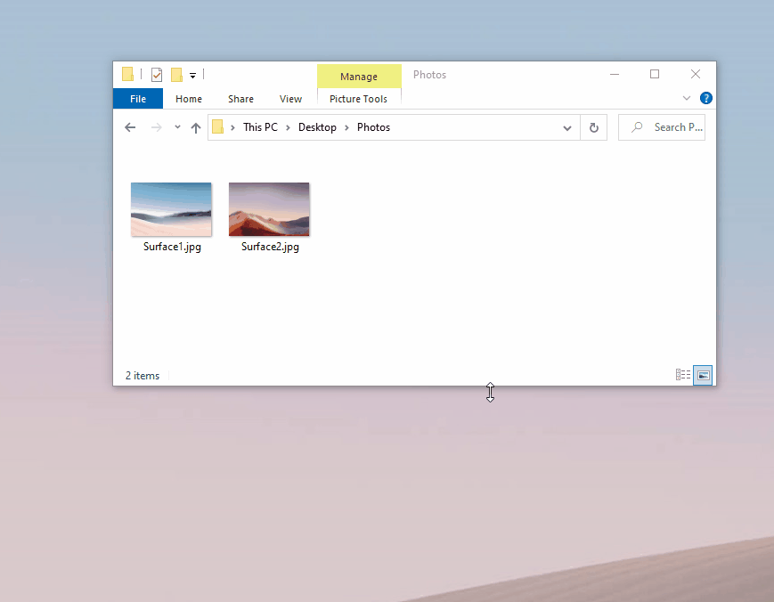
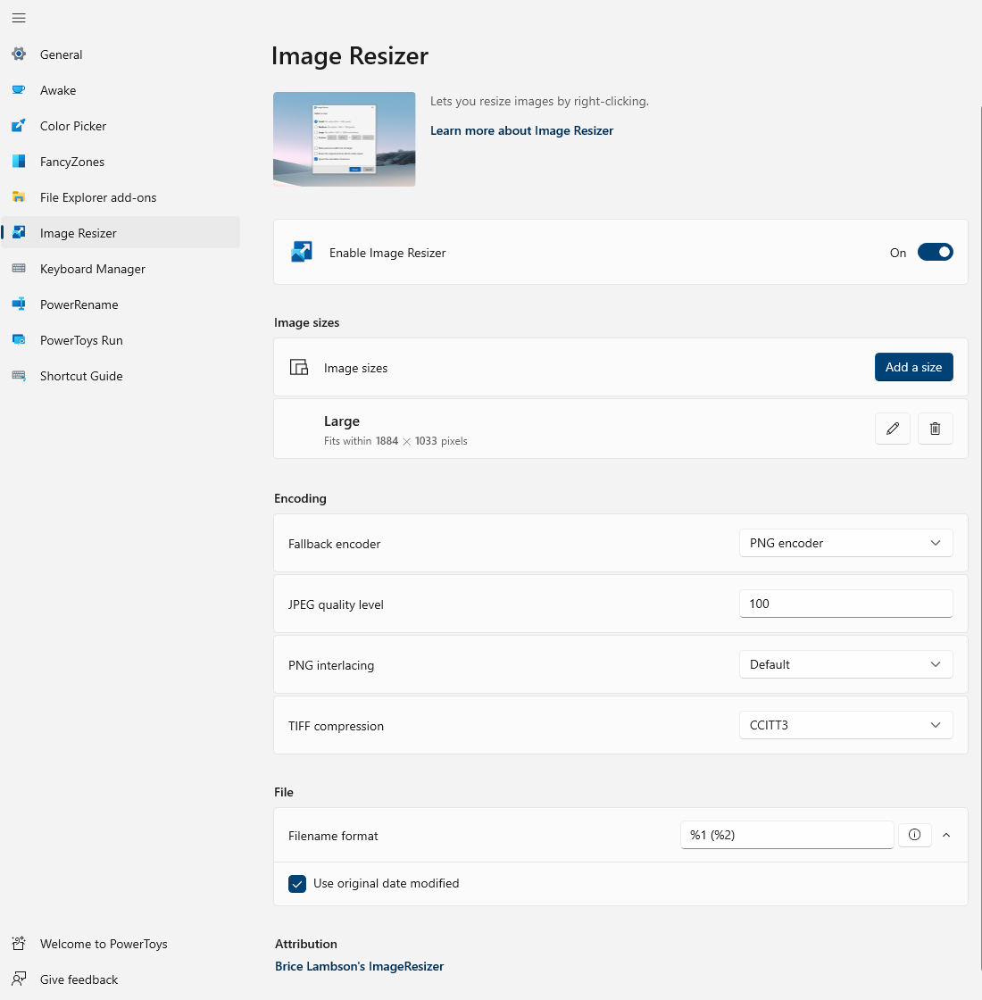

# Image Resizer utility

Image Resizer is a Windows shell extension for bulk image-resizing. After installing PowerToys, right-click on one or more selected image files in File Explorer, and then select **Resize pictures** from the menu.

Image Resizer allows you to resize images by dragging and dropping your selected files with the right mouse button. This way, resized pictures can quickly be saved in a different folder.

> [!NOTE]
> If **Ignore the orientation of pictures** is checked, the width and height of the specified size _may_ be swapped to match the orientation (portrait/landscape) of the current image. In other words: If checked, the **smallest** number (in width/height) in the settings will be applied to the **smallest** dimension of the picture. Regardless if this is declared as width or height. The idea is that different photos with different orientations will still be the same size.

## PowerToys Settings

Inside the PowerToys Settings window, on the Image Resizer tab, you can configure the following settings.

### Sizes

Add new preset sizes. Each size can be configured as Fill, Fit or Stretch. The dimension to be used for resizing can be configured as Centimeters, Inches, Percent and Pixels.

#### Fill versus Fit versus Stretch

- **Fill:** Fills the entire specified size with the image. Scales the image proportionally. Crops the image as needed.
- **Fit:** Fits the entire image into the specified size. Scales the image proportionally. Does not crop the image.
- **Stretch:** Fills the entire specified size with the image. Stretches the image disproportionally as needed. Does not crop the image.

> ![TIP]
> You can leave the width or height empty. The other dimension will be calculated to a value proportional to the original image aspect ratio.

### Fallback encoding

The fallback encoder is used when the file cannot be saved in its original format. For example, the Windows Metafile (.wmf) image format has a decoder to read the image, but no encoder to write a new image. In this case, the image cannot be saved in its original format. Image Resizer enables you to specify what format the fallback encoder will use: PNG, JPEG, TIFF, BMP, GIF, or WMPhoto settings. **This is not a file type conversion tool, but only works as a fallback for unsupported file formats.**

### File

The file name of the resized image can be modified with the following parameters:

| Parameter | Result |
| :--- | :--- |
| `%1` | Original filename |
| `%2` | Size name (as configured in the PowerToys Image Resizer settings) |
| `%3` | Selected width |
| `%4` | Selected height |
| `%5` | Actual height |
| `%6` | Actual width |

Example: setting the filename format to: `%1 (%2)` on the file `example.png` and selecting the `Small` file size setting, would result in the file name `example (Small).png`. Setting the format to `%1_%4` on the file `example.jpg` and selecting the size setting `Medium 1366 x 768px` would result in the file name: `example_768.jpg`.

You can specify a directory in the filename format to group resized images into sub-directories. Example: a value of `%2\%1` would save the resized image(s) to `Small\example.jpg`

[Characters that are illegal in file names](/windows/win32/fileio/naming-a-file#file-and-directory-names) will be replaced by an underscore `_`.

You can choose to retain the original _last modified_ date on the resized image or reset it at time of the resizing action.
