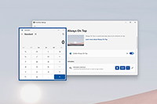
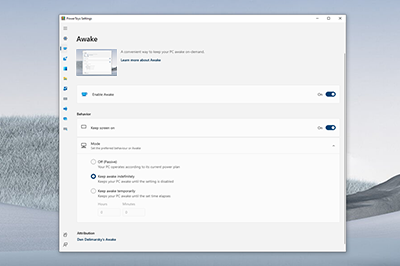
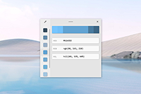
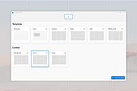
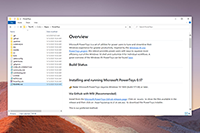
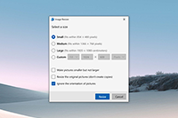
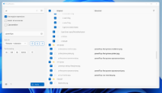
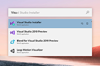
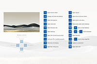

# Microsoft PowerToys: Utilities to customize Windows

Microsoft PowerToys is a set of utilities for power users to tune and streamline their Windows experience for greater productivity.

> [!div class="nextstepaction"]
> [Install PowerToys](install.md)

## Processor support

- **x64**: Supported
- **ARM**: In development (see [issue #490](https://github.com/microsoft/PowerToys/issues/490))

## Current PowerToy utilities

The currently available utilities include:

### Always on Top

:::row:::
    :::column:::
        
    :::column-end:::
    :::column span="2":::
        [Always on Top](always-on-top.md) enables you to pin windows on top of other windows with a quick key shortcut (<kbd>⊞ Win</kbd>+<kbd>Ctrl</kbd>+<kbd>T</kbd>).
    :::column-end:::
:::row-end:::

### PowerToys Awake

:::row:::
    :::column:::
        
    :::column-end:::
    :::column span="2":::
        [PowerToys Awake](awake.md) is designed to keep a computer awake without having to manage its power & sleep settings. This behavior can be helpful when running time-consuming tasks, ensuring that the computer does not go to sleep or turns off its screens.
    :::column-end:::
:::row-end:::

### Color Picker

:::row:::
    :::column:::
        
    :::column-end:::
    :::column span="2":::
        [ColorPicker](color-picker.md) is a system-wide color picking utility activated with <kbd>Win</kbd>+<kbd>Shift</kbd>+<kbd>C</kbd>. Pick colors from any currently running application, the picker automatically copies the color into your clipboard in a set format.
		Color Picker contains an editor that shows a history of previously picked colors, allows you to fine-tune the selected color and to copy different string representations. This code is based on [Martin Chrzan's Color Picker](https://github.com/martinchrzan/ColorPicker).
    :::column-end:::
:::row-end:::

### FancyZones

:::row:::
    :::column:::
        
    :::column-end:::
    :::column span="2":::
        [FancyZones](fancyzones.md) is a window manager that makes it easy to create complex window layouts and quickly position windows into those layouts.
    :::column-end:::
:::row-end:::

### File Explorer add-ons

:::row:::
    :::column:::
        
    :::column-end:::
    :::column span="2":::
        [File Explorer](file-explorer.md) add-ons enable Preview pane rendering in File Explorer to display SVG icons (.svg), Markdown (.md) and PDF file previews. To enable the Preview pane, select the "View" tab in File Explorer, then select "Preview Pane".
    :::column-end:::
:::row-end:::

### Image Resizer

:::row:::
    :::column:::
        
    :::column-end:::
    :::column span="2":::
        [Image Resizer](image-resizer.md) is a Windows Shell extension for quickly resizing images. With a simple right click from File Explorer, resize one or many images instantly. This code is based on [Brice Lambson's Image Resizer](https://github.com/bricelam/ImageResizer).
    :::column-end:::
:::row-end:::

### Keyboard Manager

:::row:::
    :::column:::
        
    :::column-end:::
    :::column span="2":::
        [Keyboard Manager](keyboard-manager.md) allows you to customize the keyboard to be more productive by remapping keys and creating your own keyboard shortcuts.
    :::column-end:::
:::row-end:::

### Mouse utilities

:::row:::
    :::column:::
        
    :::column-end:::
    :::column span="2":::
        [Mouse utilities](mouse-utilities.md) add functionality to enhance your mouse and cursor. With Find My Mouse, quickly locate your mouse's position with a spotlight that focuses on your cursor. This feature is based on source code developed by [Raymond Chen](https://github.com/oldnewthing). Mouse Highlighter displays visual indicators when the left or right mouse buttons are clicked. Mouse Pointer Crosshairs draws crosshairs centered on the mouse pointer.
    :::column-end:::
:::row-end:::

### PowerRename

:::row:::
    :::column:::
        
    :::column-end:::
    :::column span="2":::
        [PowerRename](powerrename.md) enables you to perform bulk renaming, searching and replacing file names. It includes advanced features, such as using regular expressions, targeting specific file types, previewing expected results, and the ability to undo changes. This code is based on [Chris Davis's SmartRename](https://github.com/chrdavis/SmartRename).
    :::column-end:::
:::row-end:::

### PowerToys Run

:::row:::
    :::column:::
        
    :::column-end:::
    :::column span="2":::
        [PowerToys Run](run.md) can help you search and launch your app instantly - just press the shortcut <kbd>Alt</kbd>+<kbd>Space</kbd> and start typing. It is open source and modular for additional plugins. Window Walker is now included as well.
    :::column-end:::
:::row-end:::

### Shortcut Guide

:::row:::
    :::column:::
        
    :::column-end:::
    :::column span="2":::
        [Windows key shortcut guide](shortcut-guide.md) appears when you press <kbd>⊞ Win</kbd>+<kbd>Shift</kbd>+<kbd>/</kbd> (or as we like to think, <kbd>⊞ Win</kbd>+<kbd>?</kbd>) and shows the available shortcuts for the current state of the desktop. You can also change this setting and press and hold <kbd>⊞ Win</kbd>.
    :::column-end:::
:::row-end:::

### Video Conference Mute

:::row:::
    :::column:::
        
    :::column-end:::
    :::column span="2":::
        [Video Conference Mute](video-conference-mute.md) is a quick way to globally "mute" both your microphone and camera using <kbd>⊞ Win</kbd>+<kbd>Shift</kbd>+<kbd>Q</kbd> while on a conference call, regardless of the application that currently has focus.
    :::column-end:::
:::row-end:::

## Languages

Currently, PowerToys is available in the following languages: Chinese (simplified), Chinese (traditional), Czech, Dutch, English, French, German, Hungarian, Italian, Japanese, Korean, Polish, Portuguese, Portuguese (Brazil), Russian, Spanish, Turkish.

_Note that new elements of the app might not yet be translated in the first version release._

## PowerToys video walk-through

In this video, Clint Rutkas (PM for PowerToys) walks through how to install and use the various utilities available, in addition to sharing some tips, info on how to contribute, and more.

> [!VIDEO https://docs.microsoft.com/shows/Tabs-vs-Spaces/PowerToys-Utilities-to-customize-Windows-10/player?format=ny]

## Known issues

Search known issues or file a new issue in the [Issues](https://github.com/microsoft/PowerToys/issues) tab of the PowerToys repository on GitHub. View instructions in the [Report a Bug](reportbug.md) section of these docs.

## Contribute to PowerToys (Open Source)

PowerToys welcomes your contributions! The PowerToys development team is excited to partner with the power user community to build tools that help users get the most out of Windows. There are a variety of ways to contribute:

- Write a [tech spec](https://codeburst.io/on-writing-tech-specs-6404c9791159)
- Submit a [design concept or recommendation](https://www.microsoft.com/design/inclusive/)
- [Contribute to documentation](/contribute/)
- Identify and fix bugs in the [source code](https://github.com/microsoft/PowerToys/tree/main/src)
- [Code new features and PowerToy utilities](https://github.com/microsoft/PowerToys/tree/main/doc/devdocs)

Before starting work on a feature that you would like to contribute, **read the [Contributor's Guide](https://github.com/microsoft/PowerToys/blob/main/CONTRIBUTING.md)**. The PowerToys team will be happy to work with you to figure out the best approach, provide guidance and mentorship throughout feature development, and help avoid any wasted or duplicate effort.

## PowerToys release notes

PowerToys [release notes](https://github.com/microsoft/PowerToys/releases/) are listed on the install page of the GitHub repo. For reference, you can also find the [Release checklist](https://github.com/microsoft/PowerToys/wiki/Release-check-list) on the PowerToys wiki.

## PowerToys history

Inspired by the [Windows 95 era PowerToys project](https://en.wikipedia.org/wiki/Microsoft_PowerToys), this reboot provides power users with ways to squeeze more efficiency out of the Windows shell and customize it for individual workflows. An overview of the original PowerToys can be found here: [Using Windows 95 PowerToys](https://socket3.wordpress.com/2016/10/22/using-windows-95-powertoys/).

## PowerToys roadmap

PowerToys is a rapid-incubation, open source team aimed at providing power users ways to squeeze more efficiency out of the Windows shell and customize it for individual workflows. Work priorities will consistently be examined, reassessed, and adjusted with the aim of improving our users productivity.

- [New specs for possible PowerToys](https://github.com/microsoft/PowerToys/wiki/Specs)
- [Backlog priority list](https://github.com/microsoft/PowerToys/wiki/Roadmap#backlog-priority-list-in-order)
- [Version 1.0 Strategy spec](https://github.com/microsoft/PowerToys/wiki/Version-1.0-Strategy), February 2020