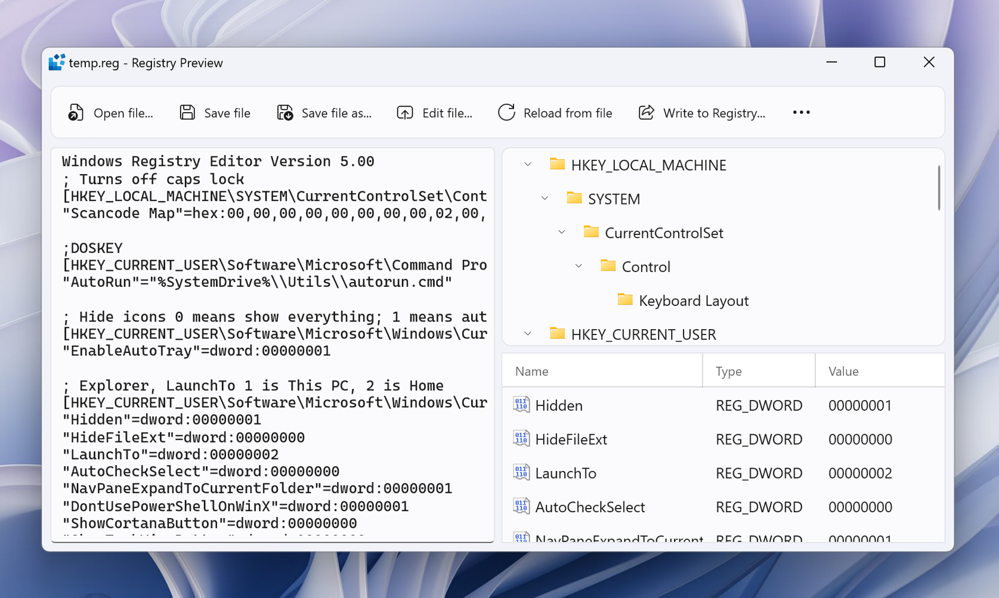

# Registry Preview

PowerToys **Registry Preview** enables you to easily visualize and edit complex Windows Registry files. It also allows you to write the registry changes to Windows Registry.

## Getting started

### Enable

To start using Registry Preview, enable it in the PowerToys Settings (Registry Preview section).

### How to activate

Select one or more .reg files in Windows File Explorer. Right-click on the selected file(s), choose **Show more options** from the menu to expand your list of menu options, then select **Preview** to open Registry Preview. **Registry Preview** can also be launched from PowerToys Settings' Registry Preview section.

**Note:** Currently, there is a 10MB file limit for opening Windows Registry files with **Registry Preview**. If file contains invalid content, **Registry Preview** will show appropriate message. 

## How to use

After opening Windows Registry file, file content is shown on the left side of the **Registry Preview**. By default, file content is read-only. This can be changed by unchecking `Read only` checkbox bellow the file content. When `Read only` checkbox is unchecked, file content can be changed manually.

Visual tree representation of the registry keys listed in the file is shown in top-right area of the **Registry Preview** window. Visual tree will be automatically updated on file content change inside the app. By clicking on specific registri key in visual tree, registry values will be shown in bottom-right are of the app.

Pressing `Edit file...` button will open loaded file in `Notepad`.

If loaded file is being edited outside the application, file content can be reloaded by clicking `Reload from file` button.

Registry changes listed in the loaded file can be written to Windows Registry by pressing `Write to Registry` button. Windows Registry Editor will be opened and will ask for confirmation before writing changes. UAC prompt will appear to open Windows Registry Editor.

