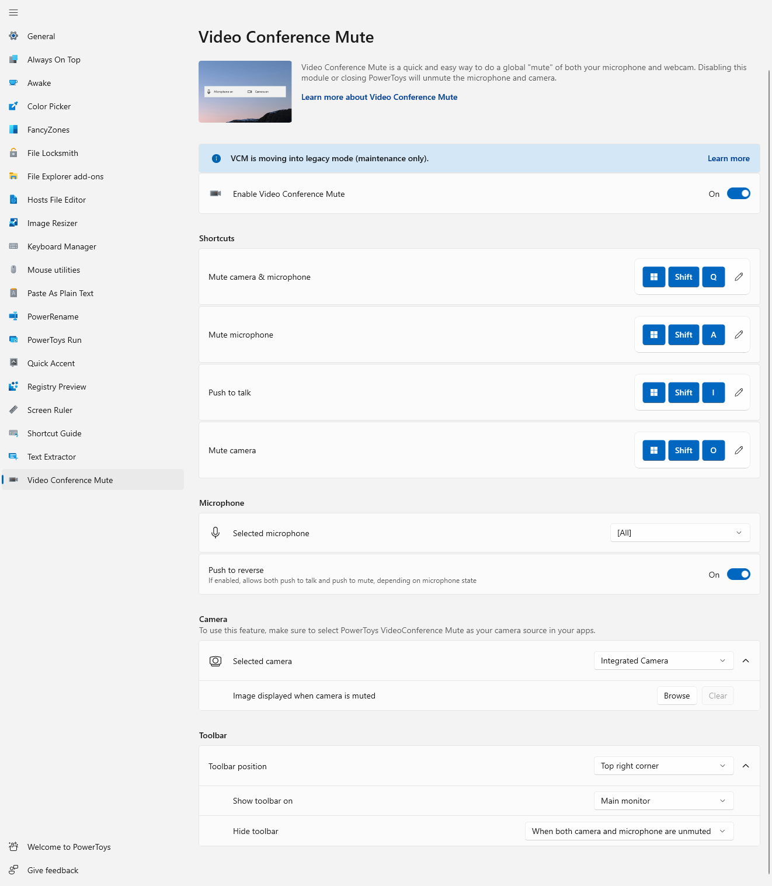
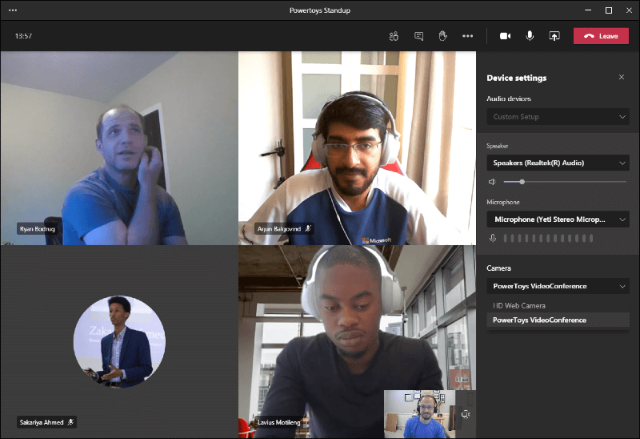

# Video Conference Mute (Preview)

> [!IMPORTANT]
> This is a preview feature and only included in the pre-release version of PowerToys. Running this pre-release requires Windows 10 version 1903 (build 18362) or later.

Quickly mute your microphone (audio) and turn off your camera (video) while on a conference call with a single keystroke, regardless of what application has focus on your computer.

## Usage

The default settings to use Video Conference Mute are:

- <kbd>⊞ Win</kbd>+<kbd>N</kbd> to toggle both Audio and Video at the same time
- <kbd>⊞ Win</kbd>+<kbd>Shift</kbd>+<kbd>A</kbd> to toggle microphone
- <kbd>⊞ Win</kbd>+<kbd>Shift</kbd>+<kbd>O</kbd> to toggle video


When using the microphone and/or camera toggle shortcut keys, you will see a small toolbar window display letting you know whether the your Microphone and Camera are set to on, off, or not in use. You can set the position of this toolbar in the Video Conference Mute tab of PowerToys settings.

> [!NOTE]
> Remember that you must have the [pre-release/experimental version of PowerToys](https://github.com/microsoft/PowerToys/releases/) installed and running, with the Video Conference Mute feature enabled in PowerToys settings in order to use this utility.

## Settings

The Video Conference Mute tab in PowerToys settings provides the following options:

- **Shortcuts:** Change the shortcut key used to mute your microphone, camera, or both combined.
- **Selected microphone:** Select the microphone on your machine that this utility will target.
- **Selected camera:** Select the camera on your machine that this utility will target.
- **Camera overlay image:** Select an image to that will be used as a placeholder when your camera is turned off. (By default, a black screen will appear when your camera is turned off with this utility).
- **Toolbar:** Determine the position where the *Microphone On, Camera On* toolbar displays when toggled (top right corner by default).
- **Show toolbar on:** Select whether you prefer the toolbar to be displayed on the main monitor only (default) or on all monitors.
- **Hide toolbar when both camera and microphone are unmuted**: A checkbox is available to toggle this option.



## How does this work under the hood

Application interact with audio and video in different ways.

If a camera stops working, the application using it tends not to recover until the API does a full reset. To toggle the global privacy camera on and off while using the camera in an application, typically it will crash and not recover.

So, how does PowerToys handle this so you can keep streaming?

- **Audio:** PowerToys uses the global microphone mute API in Windows.  Apps should recover when this is toggled on and off.
- **Video:** PowerToys has a virtual driver for the camera. The video is routed through the driver and back to the application. Selecting the Video Conference Mute shortcut key stops video from streaming, but the application still thinks it is receiving video, the video is just replaced with black or the image placeholder you've saved in the settings.

### Debug the camera driver

To debug the camera driver, look in this folder on your machine:

```markdown
C:\Windows\ServiceProfiles\LocalService\AppData\Local\Temp\PowerToysVideoConference.log
```

You could also create an empty `PowerToysVideoConferenceVerbose.flag` in the same directory to enable verbose logging mode in the driver.

## Known issues

To view all of the known issues currently open on the Video Conference Mute utility, see [PowerToys tracking issue #6246 on GitHub](https://github.com/microsoft/PowerToys/issues/6246). The PowerToys development team and contributor community is actively working toward resolving these issues and plans to keep the utility in pre-release until essential issues are resolved.


