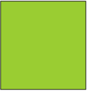
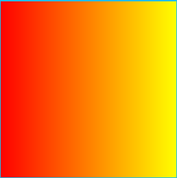
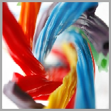
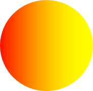

# Composition brushes
Everything visible on your screen from a UWP application is visible because it was painted by a Brush. Brushes enable you to paint user interface (UI) objects with content ranging from simple, solid colors to images or drawings to complex effects chain. This topic introduces the concepts of painting with CompositionBrush.

Note, when working with XAML UWP app, you can chose to paint a UIElement with a [XAML Brush](https://docs.microsoft.com/windows/uwp/graphics/using-brushes) or a [CompositionBrush](https://docs.microsoft.com/uwp/api/Windows.UI.Composition.CompositionBrush). Typically, it is easier and advisable to choose a XAML brush if your scenario is supported by a XAML Brush. For example, animating the color of a button, changing the fill of a text or a shape with an image. On the other hand, if you are trying to do something that is not supported by a XAML brush like like painting with an animated mask or an animated nine-grid stretch or an effect chain, you can use a CompositionBrush to paint a UIElement through the use of [XamlCompositionBrushBase](https://docs.microsoft.com/uwp/api/windows.ui.xaml.media.xamlcompositionbrushbase).

When working with the Visual layer, a CompositionBrush must be used to paint the area of a [SpriteVisual](https://docs.microsoft.com/uwp/api/Windows.UI.Composition.SpriteVisual).

-   [Prerequisites](./composition-brushes.md#prerequisites)
-   [Paint with CompositionBrush](./composition-brushes.md#paint-with-a-compositionbrush)
	-   [Paint with a solid color](./composition-brushes.md#paint-with-a-solid-color)
	-   [Paint with a linear gradient](./composition-brushes.md#paint-with-a-linear-gradient)
	-   [Paint with an image](./composition-brushes.md#paint-with-an-image)
	-   [Paint with a custom drawing](./composition-brushes.md#paint-with-a-custom-drawing)
	-   [Paint with a video](./composition-brushes.md#paint-with-a-video)
	-   [Paint with a filter effect](./composition-brushes.md#paint-with-a-filter-effect)
	-   [Paint with a CompositionBrush with an opacity mask](./composition-brushes.md#paint-with-a-compositionbrush-with-opacity-mask-applied)
	-   [Paint with a CompositionBrush using NineGrid stretch](./composition-brushes.md#paint-with-a-compositionbrush-using-ninegrid-stretch)
	-   [Paint using Background Pixels](./composition-brushes.md#paint-using-background-pixels)
-   [Combining CompositionBrushes](./composition-brushes.md#combining-compositionbrushes)
-   [Using a XAML Brush vs. CompositionBrush](./composition-brushes.md#using-a-xaml-brush-vs-compositionbrush)
-   [Related Topics](./composition-brushes.md#related-topics)

## Prerequisites
This overview assumes that you are familiar with the structure of a basic Composition application, as described in the [Visual layer overview](visual-layer.md).

## Paint with a CompositionBrush

A [CompositionBrush](https://docs.microsoft.com/uwp/api/Windows.UI.Composition.CompositionBrush) "paints" an area with its output. Different brushes have different types of output. Some brushes paint an area with a solid color, others with a gradient, image, custom drawing, or effect. There are also specialized brushes that modify the behavior of other brushes. For example, opacity mask can be used to control which area is painted by a CompositionBrush, or a nine-grid can be used to control the stretch applied to a CompositionBrush when painting an area. CompositionBrush can be of one of the following types:

|Class                                   |Details                                         |Introduced In|
|-------------------------------------|---------------------------------------------------------|--------------------------------------|
|[CompositionColorBrush](https://docs.microsoft.com/uwp/api/Windows.UI.Composition.CompositionColorBrush)         |Paints an area with a solid color                        |Windows 10 November Update (SDK 10586)|
|[CompositionSurfaceBrush](https://docs.microsoft.com/uwp/api/Windows.UI.Composition.CompositionSurfaceBrush)       |Paints an area with the contents of an [ICompositionSurface](https://docs.microsoft.com/en-us/uwp/api/Windows.UI.Composition.ICompositionSurface)|Windows 10 November Update (SDK 10586)|
|[CompositionEffectBrush](https://docs.microsoft.com/uwp/api/Windows.UI.Composition.CompositionEffectBrush)        |Paints an area with the contents of a composition effect |Windows 10 November Update (SDK 10586)|
|[CompositionMaskBrush](https://docs.microsoft.com/uwp/api/Windows.UI.Composition.CompositionMaskBrush)          |Paints a visual with a CompositionBrush with an opacity mask |Windows 10 Anniversary Update (SDK 14393)
|[CompositionNineGridBrush](https://docs.microsoft.com/uwp/api/Windows.UI.Composition.CompositionNineGridBrush)      |Paints an area with a CompositionBrush using a NineGrid stretch |Windows 10 Anniversary Update SDK (14393)
|[CompositionLinearGradientBrush](https://docs.microsoft.com/uwp/api/windows.ui.composition.compositionlineargradientbrush)|Paints an area with a linear gradient                    |Windows 10 Fall Creators Update (Insider Preview SDK)
|[CompositionBackdropBrush](https://docs.microsoft.com/uwp/api/Windows.UI.Composition.CompositionBackdropBrush)     |Paints an area by sampling background pixels from either the application or pixels directly behind the application's window on desktop. Used as an input to another CompositionBrush like a CompositionEffectBrush | Windows 10 Anniversary Update (SDK 14393)

### Paint with a solid color

A [CompositionColorBrush](https://docs.microsoft.com/uwp/api/Windows.UI.Composition.CompositionColorBrush) paints an area with a solid color. There are a variety of ways to specify the color of a SolidColorBrush. For example, you can specify its alpha, red, blue, and green (ARGB) channels or use one of the predefined colors provided by the [Colors](https://docs.microsoft.com/uwp/api/windows.ui.colors) class.

The following illustration and code shows a small visual tree to create a rectangle that is stroked with a black color brush and painted with a solid color brush that has the color value of 0x9ACD32.



```cs
Compositor _compositor;
ContainerVisual _container;
SpriteVisual _colorVisual1, _colorVisual2;
CompositionColorBrush _blackBrush, _greenBrush;

_compositor = Window.Current.Compositor;
_container = _compositor.CreateContainerVisual();

_blackBrush = _compositor.CreateColorBrush(Colors.Black);
_colorVisual1= _compositor.CreateSpriteVisual();
_colorVisual1.Brush = _blackBrush;
_colorVisual1.Size = new Vector2(156, 156);
_colorVisual1.Offset = new Vector3(0, 0, 0);
_container.Children.InsertAtBottom(_colorVisual1);

_ greenBrush = _compositor.CreateColorBrush(Color.FromArgb(0xff, 0x9A, 0xCD, 0x32));
_colorVisual2 = _compositor.CreateSpriteVisual();
_colorVisual2.Brush = _greenBrush;
_colorVisual2.Size = new Vector2(150, 150);
_colorVisual2.Offset = new Vector3(3, 3, 0);
_container.Children.InsertAtBottom(_colorVisual2);
```

### Paint with a linear gradient

A [CompositionLinearGradientBrush](https://docs.microsoft.com/uwp/api/windows.ui.composition.compositionlineargradientbrush) paints an area with a linear gradient. A linear gradient blends two or more colors across a line, the gradient axis. You use GradientStop objects to specify the colors in the gradient and their positions.

The following illustration and code shows a SpriteVisual painted with a LinearGradientBrush with 2 stops using a red and yellow color.



```cs
Compositor _compositor;
SpriteVisual _gradientVisual;
CompositionLinearGradientBrush _redyellowBrush;

_compositor = Window.Current.Compositor;

_redyellowBrush = _compositor.CreateLinearGradientBrush();
_redyellowBrush.ColorStops.Add(_compositor.CreateColorGradientStop(0, Colors.Red));
_redyellowBrush.ColorStops.Add(_compositor.CreateColorGradientStop(1, Colors.Yellow));
_gradientVisual = _compositor.CreateSpriteVisual();
_gradientVisual.Brush = _redyellowBrush;
_gradientVisual.Size = new Vector2(156, 156);
```

### Paint with an image

A [CompositionSurfaceBrush](https://docs.microsoft.com/uwp/api/Windows.UI.Composition.CompositionSurfaceBrush) paints an area with pixels rendered onto an ICompositionSurface. For example, a CompositionSurfaceBrush can be used to paint an area with an image rendered onto an ICompositionSurface surface using [LoadedImageSurface](https://docs.microsoft.com/uwp/api/windows.ui.xaml.media.loadedimagesurface) API.

The following illustration and code shows a SpriteVisual painted with a bitmap of a licorice rendered onto an ICompositionSurface using LoadedImageSurface. The properties of CompositionSurfaceBrush can be used to stretch and align the bitmap within the bounds of the visual.



```cs
Compositor _compositor;
SpriteVisual _imageVisual;
CompositionSurfaceBrush _imageBrush;

_compositor = Window.Current.Compositor;

_licoriceBrush = _compositor.CreateSurfaceBrush();

// The loadedSurface has a size of 0x0 till the image has been been downloaded, decoded and loaded to the surface. We can assign the surface to the CompositionSurfaceBrush and it will show up once the image is loaded to the surface.
LoadedImageSurface _loadedSurface = LoadedImageSurface.StartLoadFromUri(new Uri("ms-appx:///Assets/licorice.jpg"));
_licoriceBrush.Surface = _loadedSurface;

_imageVisual = _compositor.CreateSpriteVisual();
_imageVisual.Brush = _imageBrush;
_imageVisual.Size = new Vector2(156, 156);
```

### Paint with a custom drawing
A [CompositionSurfaceBrush](https://docs.microsoft.com/uwp/api/Windows.UI.Composition.CompositionSurfaceBrush) can also be used to paint an area with pixels from an ICompositionSurface rendered using [Win2D](http://microsoft.github.io/Win2D/html/Introduction.htm) (or D2D).

The following code shows a SpriteVisual painted with a text run rendered onto an ICompositionSurface using Win2D. Note, in order to use Win2D you need to include the [Win2D NuGet](http://www.nuget.org/packages/Win2D.uwp) package into your project.

```cs
Compositor _compositor;
CanvasDevice _device;
CompositionGraphicsDevice _compositionGraphicsDevice;
SpriteVisual _drawingVisual;
CompositionSurfaceBrush _drawingBrush;

_device = CanvasDevice.GetSharedDevice();
_compositionGraphicsDevice = CanvasComposition.CreateCompositionGraphicsDevice(_compositor, _device);

_drawingBrush = _compositor.CreateSurfaceBrush();
CompositionDrawingSurface _drawingSurface = _compositionGraphicsDevice.CreateDrawingSurface(new Size(256, 256), DirectXPixelFormat.B8G8R8A8UIntNormalized, DirectXAlphaMode.Premultiplied);

using (var ds = CanvasComposition.CreateDrawingSession(_drawingSurface))
{
     ds.Clear(Colors.Transparent);
     var rect = new Rect(new Point(2, 2), (_drawingSurface.Size.ToVector2() - new Vector2(4, 4)).ToSize());
     ds.FillRoundedRectangle(rect, 15, 15, Colors.LightBlue);
     ds.DrawRoundedRectangle(rect, 15, 15, Colors.Gray, 2);
     ds.DrawText("This is a composition drawing surface", rect, Colors.Black, new CanvasTextFormat()
     {
          FontFamily = "Comic Sans MS",
          FontSize = 32,
          WordWrapping = CanvasWordWrapping.WholeWord,
          VerticalAlignment = CanvasVerticalAlignment.Center,
          HorizontalAlignment = CanvasHorizontalAlignment.Center
     }
);

_drawingBrush.Surface = _drawingSurface;

_drawingVisual = _compositor.CreateSpriteVisual();
_drawingVisual.Brush = _drawingBrush;
_drawingVisual.Size = new Vector2(156, 156);
```

Similarly, the CompositionSurfaceBrush can also be used to paint a SpriteVisual with a SwapChain using Win2D interop. [This sample](https://github.com/Microsoft/Win2D-Samples/tree/master/CompositionExample) provides an example of how to use Win2D to paint a SpriteVisual with a swapchain.

### Paint with a video
A [CompositionSurfaceBrush](https://docs.microsoft.com/uwp/api/Windows.UI.Composition.CompositionSurfaceBrush) can also be used to paint an area with pixels from an ICompositionSurface rendered using a video loaded through the [MediaPlayer](https://docs.microsoft.com/en-us/uwp/api/Windows.Media.Playback.MediaPlayer) class.

The following code shows a SpriteVisual painted with a video loaded onto an ICompositionSurface.

```cs
Compositor _compositor;
SpriteVisual _videoVisual;
CompositionSurfaceBrush _videoBrush;

// MediaPlayer set up with a create from URI

_mediaPlayer = new MediaPlayer();

// Get a source from a URI. This could also be from a file via a picker or a stream
var source = MediaSource.CreateFromUri(new Uri("http://go.microsoft.com/fwlink/?LinkID=809007&clcid=0x409"));
var item = new MediaPlaybackItem(source);
_mediaPlayer.Source = item;
_mediaPlayer.IsLoopingEnabled = true;

// Get the surface from MediaPlayer and put it on a brush
_videoSurface = _mediaPlayer.GetSurface(_compositor);
_videoBrush = _compositor.CreateSurfaceBrush(_videoSurface.CompositionSurface);

_videoVisual = _compositor.CreateSpriteVisual();
_videoVisual.Brush = _videoBrush;
_videoVisual.Size = new Vector2(156, 156);
```

### Paint with a filter effect

A [CompositionEffectBrush](https://docs.microsoft.com/uwp/api/Windows.UI.Composition.CompositionEffectBrush) paints an area with output of a CompositionEffect. Effects in the Visual Layer may be thought of as animatable filter effects applied to a collection of source content such as colors, gradients, images, videos, swapchains, regions of your UI, or trees of Visuals. The source content is typically specified using another CompositionBrush.

The following illustration and code shows a SpriteVisual painted with an image of a cat that has desaturation filter effect applied.


```cs
Compositor _compositor;
SpriteVisual _effectVisual;
CompositionEffectBrush _effectBrush;

_compositor = Window.Current.Compositor;

var graphicsEffect = new SaturationEffect {
                              Saturation = 0.0f,
                              Source = new CompositionEffectSourceParameter("mySource")
                         };

var effectFactory = _compositor.CreateEffectFactory(graphicsEffect);
_effectBrush = effectFactory.CreateBrush();

CompositionSurfaceBrush surfaceBrush =_compositor.CreateSurfaceBrush();
LoadedImageSurface loadedSurface = LoadedImageSurface.StartLoadFromUri(new Uri("ms-appx:///Assets/cat.jpg"));
SurfaceBrush.surface = loadedSurface;

_effectBrush.SetSourceParameter("mySource", surfaceBrush);

_effectVisual = _compositor.CreateSpriteVisual();
_effectVisual.Brush = _effectBrush;
_effectVisual.Size = new Vector2(156, 156);
```

For more information on creating an Effect using CompositionBrushes see [Effects in Visual layer](https://docs.microsoft.com/en-us/windows/uwp/composition/composition-effects)

### Paint with a CompositionBrush with opacity mask applied

A [CompositionMaskBrush](https://docs.microsoft.com/uwp/api/Windows.UI.Composition.CompositionMaskBrush) paints an area with a CompositionBrush with an opacity mask applied to it. The source of the opacity mask can be any CompositionBrush of type CompositionColorBrush, CompositionLinearGradientBrush, CompositionSurfaceBrush, CompositionEffectBrush, or CompositionNineGridBrush. The opacity mask must be specified as a CompositionSurfaceBrush.

The following illustration and code shows a SpriteVisual painted with a CompositionMaskBrush. The source of the mask is a CompositionLinearGradientBrush which is masked to look like a circle using an image of circle as a mask.



```cs
Compositor _compositor;
SpriteVisual _maskVisual;
CompositionMaskBrush _maskBrush;

_compositor = Window.Current.Compositor;

_maskBrush = _compositor.CreateMaskBrush();

CompositionLinearGradientBrush _sourceGradient = _compositor.CreateLinearGradientBrush();
_sourceGradient.ColorStops.Add(_compositor.CreateColorGradientStop(0,Colors.Red));
_sourceGradient.ColorStops.Add(_compositor.CreateColorGradientStop(1,Colors.Yellow));
_maskBrush.Source = _sourceGradient;

LoadedImageSurface loadedSurface = LoadedImageSurface.StartLoadFromUri(new Uri("ms-appx:///Assets/circle.png"), new Size(156.0, 156.0));
_maskBrush.Mask = _compositor.CreateSurfaceBrush(loadedSurface);

_maskVisual = _compositor.CreateSpriteVisual();
_maskVisual.Brush = _maskBrush;
_maskVisual.Size = new Vector2(156, 156);
```

### Paint with a CompositionBrush using NineGrid stretch

A [CompositionNineGridBrush](https://docs.microsoft.com/uwp/api/Windows.UI.Composition.CompositionNineGridBrush) paints an area with a CompositionBrush that is stretched using the nine-grid metaphor. The nine-grid metaphor enables you to stretch edges and corners of a CompositionBrush differently than its center. The source of the nine-grid stretch can by any CompositionBrush of type CompositionColorBrush, CompositionSurfaceBrush, or CompositionEffectBrush.

The following code shows a SpriteVisual painted with a CompositionNineGridBrush. The source of the mask is a CompositionSurfaceBrush which is stretched using a Nine-Grid.

```cs
Compositor _compositor;
SpriteVisual _nineGridVisual;
CompositionNineGridBrush _nineGridBrush;

_compositor = Window.Current.Compositor;

_ninegridBrush = _compositor.CreateNineGridBrush();

// nineGridImage.png is 50x50 pixels; nine-grid insets, as measured relative to the actual size of the image, are: left = 1, top = 5, right = 10, bottom = 20 (in pixels)

LoadedImageSurface _imageSurface = LoadedImageSurface.StartLoadFromUri(new Uri("ms-appx:///Assets/nineGridImage.png"));
_nineGridBrush.Source = _compositor.CreateSurfaceBrush(_imageSurface);

// set Nine-Grid Insets

_ninegridBrush.SetInsets(1, 5, 10, 20);

// set appropriate Stretch on SurfaceBrush for Center of Nine-Grid

sourceBrush.Stretch = CompositionStretch.Fill;

_nineGridVisual = _compositor.CreateSpriteVisual();
_nineGridVisual.Brush = _ninegridBrush;
_nineGridVisual.Size = new Vector2(100, 75);
```

### Paint using Background Pixels

A [CompositionBackdropBrush](https://docs.microsoft.com/uwp/api/Windows.UI.Composition.CompositionBackdropBrush)  paints an area with the content behind the area. A CompositionBackdropBrush is never used on its own, but instead is used as an input to another CompositionBrush like an EffectBrush. For example, by using a CompositionBackdropBrush as an input to a Blur effect, you can achieve a frosted glass effect.

The following code shows a small visual tree to create an image using CompositionSurfaceBrush and a frosted glass overlay above the image. The frosted glass overlay is created by placing a SpriteVisual filled with an EffectBrush above the image. The EffectBrush uses a CompositionBackdropBrush as an input to the blur effect.

```cs
Compositor _compositor;
SpriteVisual _containerVisual;
SpriteVisual _imageVisual;
SpriteVisual _backdropVisual;

_compositor = Window.Current.Compositor;

// Create container visual to host the visual tree
_containerVisual = _compositor.CreateContainerVisual();

// Create _imageVisual and add it to the bottom of the container visual.
// Paint the visual with an image.

CompositionSurfaceBrush _licoriceBrush = _compositor.CreateSurfaceBrush();

LoadedImageSurface loadedSurface = 
    LoadedImageSurface.StartLoadFromUri(new Uri("ms-appx:///Assets/licorice.jpg"));
_licoriceBrush.Surface = loadedSurface;

_imageVisual = _compositor.CreateSpriteVisual();
_imageVisual.Brush = _licoriceBrush;
_imageVisual.Size = new Vector2(156, 156);
_imageVisual.Offset = new Vector3(0, 0, 0);
_containerVisual.Children.InsertAtBottom(_imageVisual)

// Create a SpriteVisual and add it to the top of the containerVisual.
// Paint the visual with an EffectBrush that applies blur to the content
// underneath the Visual to create a frosted glass effect.

GaussianBlurEffect blurEffect = new GaussianBlurEffect(){
                                    Name = "Blur",
                                    BlurAmount = 1.0f,
                                    BorderMode = EffectBorderMode.Hard,
                                    Source = new CompositionEffectSourceParameter("source");
                                    };

CompositionEffectFactory blurEffectFactory = _compositor.CreateEffectFactory(blurEffect);
CompositionEffectBrush _backdropBrush = blurEffectFactory.CreateBrush();

// Create a BackdropBrush and bind it to the EffectSourceParameter source

_backdropBrush.SetSourceParameter("source", _compositor.CreateBackdropBrush());
_backdropVisual = _compositor.CreateSpriteVisual();
_backdropVisual.Brush = _licoriceBrush;
_backdropVisual.Size = new Vector2(78, 78);
_backdropVisual.Offset = new Vector3(39, 39, 0);
_containerVisual.Children.InsertAtTop(_backdropVisual);
```

## Combining CompositionBrushes
A number of CompositionBrushes use other CompositionBrushes as inputs. For example, using the SetSourceParameter method can be used to set another CompositionBrush as an input to a CompositionEffectBrush. The table below outlines the supported combinations of CompositionBrushes. Note, that using an unsupported combination will throw an exception.

<table>
<tbody>
<tr>
<th>Brush</th>
<th>EffectBrush.SetSourceParameter()</th>
<th>MaskBrush.Mask</th>
<th>MaskBrush.Source</th>
<th>NineGridBrush.Source</th>
</tr>
<tr>
<td>CompositionColorBrush</td>
<td>YES</td>
<td>YES</td>
<td>YES</td>
<td>YES</td>
</tr>
<tr>
<td>CompositionLinear<br />GradientBrush</td>
<td>YES</td>
<td>YES</td>
<td>YES</td>
<td>NO</td>
</tr>
<tr>
<td>CompositionSurfaceBrush</td>
<td>YES</td>
<td>YES</td>
<td>YES</td>
<td>YES</td>
</tr>
<tr>
<td>CompositionEffectBrush</td>
<td>NO</td>
<td>NO</td>
<td>YES</td>
<td>NO</td>
</tr>
<tr>
<td>CompositionMaskBrush</td>
<td>NO</td>
<td>NO</td>
<td>NO</td>
<td>NO</td>
</tr>
<tr>
<td>CompositionNineGridBrush</td>
<td>YES</td>
<td>YES</td>
<td>YES</td>
<td>NO</td>
</tr>
<tr>
<td>CompositionBackdropBrush</td>
<td>YES</td>
<td>NO</td>
<td>NO</td>
<td>NO</td>
</tr>
</tbody>
</table>


## Using a XAML Brush vs. CompositionBrush

The following table provides a list of scenarios and whether XAML or Composition brush use is prescribed when painting a UIElement or a SpriteVisual in your application. 

> [!NOTE]
> If a CompositionBrush is suggested for a XAML UIElement, it is assumed that the CompositionBrush is packaged using a XamlCompositionBrushBase.

|Scenario                                                                   | XAML UIElement                                                                                                |Composition SpriteVisual
|---------------------------------------------------------------------------|---------------------------------------------------------------------------------------------------------------|----------------------------------
|Paint an area with solid color                                             |[SolidColorBrush](https://msdn.microsoft.com/library/windows/apps/BR242962)                                |[CompositionColorBrush](https://msdn.microsoft.com/library/windows/apps/Mt589399)
|Paint an area with animated color                                          |[SolidColorBrush](https://msdn.microsoft.com/library/windows/apps/BR242962)                                |[CompositionColorBrush](https://msdn.microsoft.com/library/windows/apps/Mt589399)
|Paint an area with a static gradient                                       |[LinearGradientBrush](https://msdn.microsoft.com/library/windows/apps/BR210108)                            |[CompositionLinearGradientBrush](https://docs.microsoft.com/uwp/api/windows.ui.composition.compositionlineargradientbrush)
|Paint an area with animated gradient stops                                 |[CompositionLinearGradientBrush](https://docs.microsoft.com/uwp/api/windows.ui.composition.compositionlineargradientbrush)                                                                                 |[CompositionLinearGradientBrush](https://docs.microsoft.com/uwp/api/windows.ui.composition.compositionlineargradientbrush)
|Paint an area with an image                                                |[ImageBrush](https://msdn.microsoft.com/library/windows/apps/BR210101)                                     |[CompositionSurfaceBrush](https://msdn.microsoft.com/library/windows/apps/Mt589415)
|Paint an area with a webpage                                               |[WebViewBrush](https://msdn.microsoft.com/library/windows/apps/BR227703)                                   |N/A
|Paint an area with an image using NineGrid stretch                         |[Image Control](https://docs.microsoft.com/uwp/api/Windows.UI.Xaml.Controls.Image)                   |[CompositionNineGridBrush](https://docs.microsoft.com/uwp/api/Windows.UI.Composition.CompositionNineGridBrush)
|Paint an area with animated NineGrid stretch                               |[CompositionNineGridBrush](https://docs.microsoft.com/uwp/api/Windows.UI.Composition.CompositionNineGridBrush)                                                                                       |[CompositionNineGridBrush](https://docs.microsoft.com/uwp/api/Windows.UI.Composition.CompositionNineGridBrush)
|Paint an area with a swapchain                                             |[SwapChainPanel](https://docs.microsoft.com/uwp/api/Windows.UI.Xaml.Controls.SwapChainPanel)                                                                                                 |[CompositionSurfaceBrush](https://msdn.microsoft.com/library/windows/apps/Mt589415) w/ swapchain interop
|Paint an area with a video                                                 |[MediaElement](https://msdn.microsoft.com/library/windows/apps/mt187272.aspx)                                                                                                  |[CompositionSurfaceBrush](https://msdn.microsoft.com/library/windows/apps/Mt589415) w/ media interop
|Paint an area with custom 2D drawing                                       |[CanvasControl](http://microsoft.github.io/Win2D/html/T_Microsoft_Graphics_Canvas_UI_Xaml_CanvasControl.htm) from Win2D                                                                                                 |[CompositionSurfaceBrush](https://msdn.microsoft.com/library/windows/apps/Mt589415) w/ Win2D interop
|Paint an area with non-animated mask                                       |Use XAML [shapes](https://docs.microsoft.com/windows/uwp/graphics/drawing-shapes) to define a mask   |[CompositionMaskBrush](https://docs.microsoft.com/uwp/api/Windows.UI.Composition.CompositionMaskBrush)
|Paint an area with an animated mask                                        |[CompositionMaskBrush](https://docs.microsoft.com/uwp/api/Windows.UI.Composition.CompositionMaskBrush)                                                                                           |[CompositionMaskBrush](https://docs.microsoft.com/uwp/api/Windows.UI.Composition.CompositionMaskBrush)
|Paint an area with an animated filter effect                               |[CompositionEffectBrush](https://docs.microsoft.com/uwp/api/Windows.UI.Composition.CompositionEffectBrush)                                                                                         |[CompositionEffectBrush](https://docs.microsoft.com/uwp/api/Windows.UI.Composition.CompositionEffectBrush)
|Paint an area with an effect applied to background pixels        |[CompositionBackdropBrush](https://docs.microsoft.com/uwp/api/Windows.UI.Composition.CompositionBackdropBrush)                                                                                        |[CompositionBackdropBrush](https://docs.microsoft.com/uwp/api/Windows.UI.Composition.CompositionBackdropBrush)

## Related Topics

[Composition native DirectX and Direct2D interop with BeginDraw and EndDraw](composition-native-interop.md)

[XAML brush interop with XamlCompositionBrushBase](../graphics/using-brushes.md#xamlcompositionbrushbase)