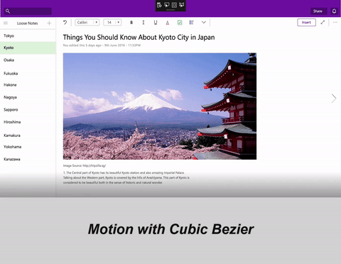
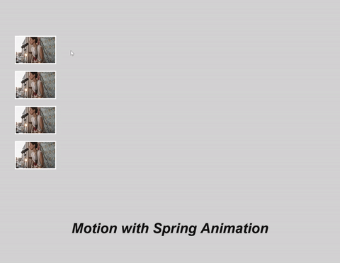
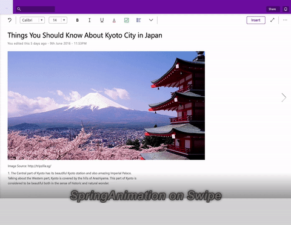

---

title: Spring animations
description: Learn how to use spring natural motion animations.

ms.date: 10/10/2017
ms.topic: article


keywords: windows 10, uwp, animation
ms.localizationpriority: medium
---
# Spring animations

The article shows how to use spring NaturalMotionAnimations.

## Prerequisites

Here, we assume that you're familiar with the concepts discussed in these articles:

- [Natural motion animations](natural-animations.md)

## Why springs?

Springs are a common motion experience we've all experienced at some point in our lives; ranging from slinky toys to Physics classroom experiences with a spring-tied block. The oscillating motion of a spring often incites a playful and lighthearted emotional response from those who observe it. As a result, the motion of a spring translates well into application UI for those who are looking to create a livelier motion experience that "pops" more to the end user than a traditional Cubic Bezier. In these cases, spring motion not only creates a livelier motion experience, but also can help draw attention to new or currently animating content. Depending on the application branding or motion language, the oscillation is more pronounced and visible, but in other cases it is more subtle.




## Using springs in your UI

As mentioned previously, springs can be a useful motion to integrate into your app to introduce a very familiar and playful UI experience. Common usage of springs in UI are:

| Spring Usage Description | Visual Example |
| ------------------------ | -------------- |
| Making a motion experience "pop" and look livelier. (Animating Scale) |  |
| Making a motion experience subtly feel more energetic (Animating Offset) |  |

In each of these cases, the spring motion can be triggered either by "springing to" and oscillating around a new value or oscillating around its current value with some initial velocity.


## Defining your spring motion

You create a spring experience by using the NaturalMotionAnimation APIs. Specifically, you create a SpringNaturalMotionAnimation by using the Create* methods off the Compositor. You are then able to define the following properties of the motion:

- DampingRatio – expresses the level of damping of the spring motion used in the animation.

| Damping Ratio Value | Description |
| ------------------- | ----------- |
| DampingRatio = 0 | Undamped – the spring will oscillate for a long time |
| 0 < DampingRatio < 1 | Underdamped – spring will oscillate from a little to a lot. |
| DampingRatio = 1 | Criticallydamped – the spring will perform no oscillation. |
| DampingRation > 1 | Overdamped – the spring will quickly reach its destination with an abrupt deceleration and no oscillation |

- Period – the time it takes the spring to perform a single oscillation.
- Final / Starting Value – defined starting and ending positions of the spring motion (if not defined, starting value and/or final value will be current value).
- Initial Velocity – programmatic initial velocity for the motion.

You can also define a set of properties of the motion that are the same as KeyFrameAnimations:

- DelayTime / Delay Behavior
- StopBehavior

In the common cases of animating Offset and Scale/Size, the following values are recommended by the Windows Design team for DampingRatio and Period for different types of springs:

| Property | Normal Spring | Dampened Spring | Less-Dampened Spring |
| -------- | ------------- | --------------- | -------------------- |
| Offset | Damping Ratio = 0.8 <br/> Period = 50 ms | Damping Ratio = 0.85 <br/> Period = 50 ms | Damping Ratio = 0.65 <br/> Period = 60 ms |
| Scale/Size | Damping Ratio = 0.7 <br/> Period = 50 ms | Damping Ratio = 0.8 <br/> Period = 50 ms | Damping Ratio = 0.6 <br/> Period = 60 ms |

Once you have defined the properties, you can then pass in your spring NaturalMotionAnimation into the StartAnimation method of a CompositionObject or the Motion property of an InteractionTracker InertiaModifier.

## Example

In this example, you create a navigation and canvas UI experience in which, when the user clicks an expand button, a navigation pane is animated out with a springy, oscillation motion.


Start by defining the spring animation within the clicked event for when the navigation pane appears. You then define the properties of the animation, using the InitialValueExpression feature to use an Expression to define the FinalValue. You also keep track of whether the pane is opened or not and, when ready, start the animation.

```csharp
private void Button_Clicked(object sender, RoutedEventArgs e)
{
 _springAnimation = _compositor.CreateSpringScalarAnimation();
 _springAnimation.DampingRatio = 0.75f;
 _springAnimation.Period = TimeSpan.FromSeconds(0.5);

 if (!_expanded)
 {
 _expanded = true;
 _propSet.InsertBoolean("expanded", true);
 _springAnimation.InitialValueExpression[“FinalValue”] = “this.StartingValue + 250”;
 } else
 {
 _expanded = false;
 _propSet.InsertBoolean("expanded", false);
_springAnimation.InitialValueExpression[“FinalValue”] = “this.StartingValue - 250”;
 }
 _naviPane.StartAnimation("Offset.X", _springAnimation);
}
```

Now what if you wanted to tie this motion to input? So if the end user swipes out, the panes come out with a Spring motion? More importantly, if the user swipes harder or faster, the motion adapts based on the velocity from the end user.



To do this, you can take our same Spring Animation and pass it into an InertiaModifier with InteractionTracker. For more information about InputAnimations and InteractionTracker, see [Custom manipulation experiences with InteractionTracker](interaction-tracker-manipulations.md). We’ll assume for this code example, you have already setup your InteractionTracker and VisualInteractionSource. We’ll focus on creating the InertiaModifiers that will take in a NaturalMotionAnimation, in this case a spring.

```csharp
// InteractionTracker and the VisualInteractionSource previously setup
// The open and close ScalarSpringAnimations defined earlier
private void SetupInput()
{
 // Define the InertiaModifier to manage the open motion
 var openMotionModifer = InteractionTrackerInertiaNaturalMotion.Create(compositor);

 // Condition defines to use open animation if panes in non-expanded view
 // Property set value to track if open or closed is managed in other part of code
 openMotionModifer.Condition = _compositor.CreateExpressionAnimation(
"propset.expanded == false");
 openMotionModifer.Condition.SetReferenceParameter("propSet", _propSet);
 openMotionModifer.NaturalMotion = _openSpringAnimation;

 // Define the InertiaModifer to manage the close motion
 var closeMotionModifier = InteractionTrackerInertiaNaturalMotion.Create(_compositor);

 // Condition defines to use close animation if panes in expanded view
 // Property set value to track if open or closed is managed in other part of code
 closeMotionModifier.Condition = 
_compositor.CreateExpressionAnimation("propSet.expanded == true");
 closeMotionModifier.Condition.SetReferenceParameter("propSet", _propSet);
 closeMotionModifier.NaturalMotion = _closeSpringAnimation;

 _tracker.ConfigurePositionXInertiaModifiers(new 
InteractionTrackerInertiaNaturalMotion[] { openMotionModifer, closeMotionModifier});

 // Take output of InteractionTracker and assign to the pane
 var exp = _compositor.CreateExpressionAnimation("-tracker.Position.X");
 exp.SetReferenceParameter("tracker", _tracker);
 ElementCompositionPreview.GetElementVisual(pageNavigation).
StartAnimation("Translation.X", exp);
}
```

Now you have both a programmatic and input-driven spring animation in your UI!

In summary, the steps to using a spring animation in your app:

1. Create your SpringAnimation off your Compositor.
1. Define properties of the SpringAnimation if you wanted non-default values:
    - DampingRatio
    - Period
    - Final Value
    - Initial Value
    - Initial Velocity
1. Assign to target.
    - If you're animating a CompositionObject property, pass in SpringAnimation as parameter to StartAnimation.
    - If you want to use with input, set NaturalMotion property of an InertiaModifier to SpringAnimation.

