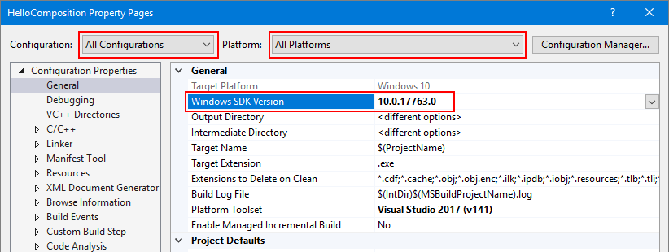
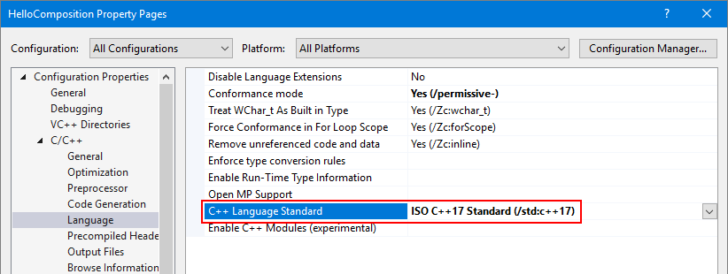
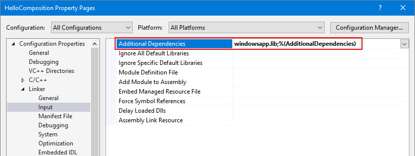
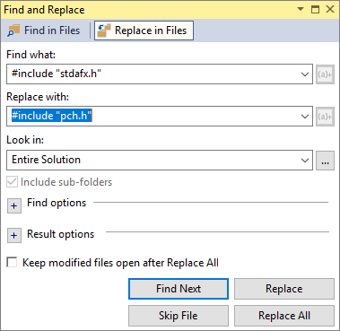

# Using the Visual Layer with Win32

You can use Windows Runtime Composition APIs (also called the [Visual layer](visual-layer.md)) in your Win32 apps to create modern experiences that light up for Windows 10 users.

The complete code for this tutorial is available on GitHub: [Win32 HelloComposition sample](https://github.com/Microsoft/Windows.UI.Composition-Win32-Samples/tree/master/cpp/HelloComposition).

Universal Windows Applications that need precise control over their UI composition have access to the [Windows.UI.Composition](/uwp/api/windows.ui.composition) namespace to exert fine grained control over how their UI is composed and rendered. This composition API is not limited to UWP apps, however. Win32 desktop applications can take advantage of the modern composition systems in UWP and Windows 10.

## Prerequisites

The UWP hosting API has these prerequisites.

- We assume that you have some familiarity with app development using Win32 and UWP. For more info, see:
  - [Get Started with Win32 and C++](/windows/desktop/learnwin32/learn-to-program-for-windows)
  - [Get started with Windows 10 apps](/windows/uwp/get-started/)
  - [Enhance your desktop application for Windows 10](/windows/uwp/porting/desktop-to-uwp-enhance)
- Windows 10 version 1803 or later
- Windows 10 SDK 17134 or later

## How to use Composition APIs from a Win32 desktop application

In this tutorial, you create a simple Win32 C++ app and add UWP Composition elements to it. The focus is on correctly configuring the project, creating the interop code, and drawing something simple using Windows Composition APIs. The finished app looks like this.


## Create a C++ Win32 project in Visual Studio

The first step is to create the Win32 app project in Visual Studio.

To create a new Win32 Application project in C++ named _HelloComposition_:

1. Open Visual Studio and select **File** > **New** > **Project**.

    The **New Project** dialog opens.
1. Under the **Installed** category, expand the **Visual C++** node, and then select **Windows Desktop**.
1. Select the **Windows Desktop Application** template.
1. Enter the name _HelloComposition_, then click **OK**.

    Visual Studio creates the project and opens the editor for the main app file.

## Configure the project to use Windows Runtime APIs

To use Windows Runtime (WinRT) APIs in your Win32 app, we use C++/WinRT. You need to configure your Visual Studio project to add C++/WinRT support.

(For details, see [Get started with C++/WinRT - Modify a Windows Desktop application project to add C++/WinRT support](../cpp-and-winrt-apis/get-started.md#modify-a-windows-desktop-application-project-to-add-cwinrt-support)).

1. From the **Project** menu, open the project properties (_HelloComposition Properties_) and ensure the following settings are set to the specified values:

    - For **Configuration**, select _All Configurations_. For **Platform**, select _All Platforms_.
    - **Configuration Properties** > **General** > **Windows SDK Version** = _10.0.17763.0_ or greater

    

    - **C/C++** > **Language** > **C++ Language Standard** = _ISO C++ 17 Standard (/stf:c++17)_

    

    - **Linker** > **Input** > **Additional Dependencies** must include "_windowsapp.lib_". If it's not included in the list, add it.

    

1. Update the precompiled header

    - Rename `stdafx.h` and `stdafx.cpp` to `pch.h` and `pch.cpp`, respectively.
    - Set project property **C/C++** > **Precompiled Headers** > **Precompiled Header File** to *pch.h*.
    - Find and replace `#include "stdafx.h"` with `#include "pch.h"` in all files.

        (**Edit** > **Find and Replace** > **Find in Files**)

        

    - In `pch.h`, include `winrt/base.h` and `unknwn.h`.

        ```cppwinrt
        // reference additional headers your program requires here
        #include <unknwn.h>
        #include <winrt/base.h>
        ```

It's a good idea to build the project at this point to make sure there are no errors before going on.

## Create a class to host composition elements

To host content you create with the visual layer, create a class (_CompositionHost_) to manage interop and create composition elements. This is where you do most of the configuration for hosting Composition APIs, including:

- getting a [Compositor](/uwp/api/windows.ui.composition.compositor), which creates and manages objects in the [Windows.UI.Composition](/uwp/api/windows.ui.composition) namespace.
- creating a [DispatcherQueueController](/uwp/api/windows.system.dispatcherqueuecontroller)/[DispatcherQueue](/uwp/api/windows.system.dispatcherqueue) to manage tasks for the WinRT APIs.
- creating a [DesktopWindowTarget](/uwp/api/windows.ui.composition.desktop.desktopwindowtarget) and Composition container to display the composition objects.

We make this class a singleton to avoid threading issues. For example, you can only create one dispatcher queue per thread, so instantiating a second instance of CompositionHost on the same thread would cause an error.

> [!TIP]
> If you need to, check the complete code at the end of the tutorial to make sure all the code is in the right places as you work through the tutorial.

1. Add a new class file to your project.
    - In **Solution Explorer**, right click the _HelloComposition_ project.
    - In the context menu, select **Add** > **Class...**.
    - In the **Add Class** dialog, name the class _CompositionHost.cs_, then click **Add**.

1. Include headers and _usings_ required for composition interop.
    - In CompositionHost.h, add these _includes_ at the top of the file.

    ```cppwinrt
    #pragma once
    #include <winrt/Windows.UI.Composition.Desktop.h>
    #include <windows.ui.composition.interop.h>
    #include <DispatcherQueue.h>
    ```

    - In CompositionHost.cpp, add these _usings_ at the top of the file, after any _includes_.

    ```cppwinrt
    using namespace winrt;
    using namespace Windows::System;
    using namespace Windows::UI;
    using namespace Windows::UI::Composition;
    using namespace Windows::UI::Composition::Desktop;
    using namespace Windows::Foundation::Numerics;
    ```

1. Edit the class to use the singleton pattern.
    - In CompositionHost.h, make the constructor private.
    - Declare a public static _GetInstance_ method.

    ```cppwinrt
    class CompositionHost
    {
    public:
        ~CompositionHost();
        static CompositionHost* GetInstance();

    private:
        CompositionHost();
    };
    ```

    - In CompositionHost.cpp, add the definition of the _GetInstance_ method.

    ```cppwinrt
    CompositionHost* CompositionHost::GetInstance()
    {
        static CompositionHost instance;
        return &instance;
    }
    ```

1. In CompositionHost.h, declare private member variables for the Compositor, DispatcherQueueController, and DesktopWindowTarget.

    ```cppwinrt
    winrt::Windows::UI::Composition::Compositor m_compositor{ nullptr };
    winrt::Windows::System::DispatcherQueueController m_dispatcherQueueController{ nullptr };
    winrt::Windows::UI::Composition::Desktop::DesktopWindowTarget m_target{ nullptr };
    ```

1. Add a public method to initialize the composition interop objects.
    > [!NOTE]
    > In _Initialize_, you call the _EnsureDispatcherQueue_, _CreateDesktopWindowTarget_, and _CreateCompositionRoot_ methods. You create these methods in the next steps.

    - In CompositionHost.h, declare a public method named _Initialize_ that takes an HWND as an argument.

    ```cppwinrt
    void Initialize(HWND hwnd);
    ```

    - In CompositionHost.cpp, add the definition of the _Initialize_ method.

    ```cppwinrt
    void CompositionHost::Initialize(HWND hwnd)
    {
        EnsureDispatcherQueue();
        if (m_dispatcherQueueController) m_compositor = Compositor();

        CreateDesktopWindowTarget(hwnd);
        CreateCompositionRoot();
    }
    ```

1. Create a dispatcher queue on the thread that will be using Windows Composition.

    A Compositor must be created on a thread that has a dispatcher queue, so this method is called first during initialization.

    - In CompositionHost.h, declare a private method named _EnsureDispatcherQueue_.

    ```cppwinrt
    void EnsureDispatcherQueue();
    ```

    - In CompositionHost.cpp, add the definition of the _EnsureDispatcherQueue_ method.

    ```cppwinrt
    void CompositionHost::EnsureDispatcherQueue()
    {
        namespace abi = ABI::Windows::System;

        if (m_dispatcherQueueController == nullptr)
        {
            DispatcherQueueOptions options
            {
                sizeof(DispatcherQueueOptions), /* dwSize */
                DQTYPE_THREAD_CURRENT,          /* threadType */
                DQTAT_COM_ASTA                  /* apartmentType */
            };

            Windows::System::DispatcherQueueController controller{ nullptr };
            check_hresult(CreateDispatcherQueueController(options, reinterpret_cast<abi::IDispatcherQueueController**>(put_abi(controller))));
            m_dispatcherQueueController = controller;
        }
    }
    ```

1. Register your app's window as a composition target.
    - In CompositionHost.h, declare a private method named _CreateDesktopWindowTarget_ that takes an HWND as an argument.

    ```cppwinrt
    void CreateDesktopWindowTarget(HWND window);
    ```

    - In CompositionHost.cpp, add the definition of the _CreateDesktopWindowTarget_ method.

    ```cppwinrt
    void CompositionHost::CreateDesktopWindowTarget(HWND window)
    {
        namespace abi = ABI::Windows::UI::Composition::Desktop;

        auto interop = m_compositor.as<abi::ICompositorDesktopInterop>();
        DesktopWindowTarget target{ nullptr };
        check_hresult(interop->CreateDesktopWindowTarget(window, false, reinterpret_cast<abi::IDesktopWindowTarget**>(put_abi(target))));
        m_target = target;
    }
    ```

1. Create a root visual container to hold visual objects.
    - In CompositionHost.h, declare a private method named _CreateCompositionRoot_.

    ```cppwinrt
    void CreateCompositionRoot();
    ```

    - In CompositionHost.cpp, add the definition of the _CreateCompositionRoot_ method.

    ```cppwinrt
    void CompositionHost::CreateCompositionRoot()
    {
        auto root = m_compositor.CreateContainerVisual();
        root.RelativeSizeAdjustment({ 1.0f, 1.0f });
        root.Offset({ 24, 24, 0 });
        m_target.Root(root);
    }
    ```

Build the project now to make sure there are no errors.

These methods set up the components needed for interop between the UWP visual layer and Win32 APIs. Now you can add content to your app.

### Add composition elements

With the infrastructure in place, you can now generate the Composition content you want to show.

For this example, you add code that creates a simple square [SpriteVisual](/uwp/api/windows.ui.composition.spritevisual).

1. Add a composition element.
    - In CompositionHost.h, declare a public method named _AddElement_ that takes 3 **float** values as arguments.

    ```cppwinrt
    void AddElement(float size, float x, float y);
    ```

    - In CompositionHost.cpp, add the definition of the _AddElement_ method.

    ```cppwinrt
    void CompositionHost::AddElement(float size, float x, float y)
    {
        if (m_target.Root())
        {
            auto visuals = m_target.Root().as<ContainerVisual>().Children();
            auto visual = m_compositor.CreateSpriteVisual();

            visual.Brush(m_compositor.CreateColorBrush({ 0xDC, 0x5B, 0x9B, 0xD5 }));
            visual.Size({ size, size });
            visual.Offset({ x, y, 0.0f, });

            visuals.InsertAtTop(visual);
        }
    }
    ```

## Create and show the window

Now, you can add the UWP composition content to your Win32 UI. Use your application's _InitInstance_ method to initialize Windows Composition and generate the content.

1. In HelloComposition.cpp, include _CompositionHost.h_ at the top of the file.

    ```cppwinrt
    #include "CompositionHost.h"
    ```

1. In the `InitInstance` method, add code to initialize and use the CompositionHost class.

    Add this code after the HWND is created and before the call to `ShowWindow`.

    ```cppwinrt
    CompositionHost* compHost = CompositionHost::GetInstance();
    compHost->Initialize(hWnd);
    compHost->AddElement(150, 10, 10);
    ```

You can now build and run your app. If you need to, check the complete code at the end of the tutorial to make sure all the code is in the right places.

When you run the app, you should see a blue square added to the UI.

## Additional resources

- [Win32 HelloComposition sample (GitHub)](https://github.com/Microsoft/Windows.UI.Composition-Win32-Samples/tree/master/cpp/HelloComposition)
- [Get Started with Win32 and C++](/windows/desktop/learnwin32/learn-to-program-for-windows)
- [Get started with Windows 10 apps](/windows/uwp/get-started/) (UWP)
- [Enhance your desktop application for Windows 10](/windows/uwp/porting/desktop-to-uwp-enhance) (UWP)
- [Windows.UI.Composition namespace](/uwp/api/windows.ui.composition) (UWP)

## Complete code

Here's the complete code for the CompositionHost class and the InitInstance method.

### CompositionHost.h

```cppwinrt
#pragma once
#include <winrt/Windows.UI.Composition.Desktop.h>
#include <windows.ui.composition.interop.h>
#include <DispatcherQueue.h>

class CompositionHost
{
public:
    ~CompositionHost();
    static CompositionHost* GetInstance();

    void Initialize(HWND hwnd);
    void AddElement(float size, float x, float y);

private:
    CompositionHost();

    void CreateDesktopWindowTarget(HWND window);
    void EnsureDispatcherQueue();
    void CreateCompositionRoot();

    winrt::Windows::UI::Composition::Compositor m_compositor{ nullptr };
    winrt::Windows::UI::Composition::Desktop::DesktopWindowTarget m_target{ nullptr };
    winrt::Windows::System::DispatcherQueueController m_dispatcherQueueController{ nullptr };
};
```

### CompositionHost.cpp

```cppwinrt
#include "pch.h"
#include "CompositionHost.h"

using namespace winrt;
using namespace Windows::System;
using namespace Windows::UI;
using namespace Windows::UI::Composition;
using namespace Windows::UI::Composition::Desktop;
using namespace Windows::Foundation::Numerics;

CompositionHost::CompositionHost()
{
}

CompositionHost* CompositionHost::GetInstance()
{
    static CompositionHost instance;
    return &instance;
}

CompositionHost::~CompositionHost()
{
}

void CompositionHost::Initialize(HWND hwnd)
{
    EnsureDispatcherQueue();
    if (m_dispatcherQueueController) m_compositor = Compositor();

    if (m_compositor)
    {
        CreateDesktopWindowTarget(hwnd);
        CreateCompositionRoot();
    }
}

void CompositionHost::EnsureDispatcherQueue()
{
    namespace abi = ABI::Windows::System;

    if (m_dispatcherQueueController == nullptr)
    {
        DispatcherQueueOptions options
        {
            sizeof(DispatcherQueueOptions), /* dwSize */
            DQTYPE_THREAD_CURRENT,          /* threadType */
            DQTAT_COM_ASTA                  /* apartmentType */
        };

        Windows::System::DispatcherQueueController controller{ nullptr };
        check_hresult(CreateDispatcherQueueController(options, reinterpret_cast<abi::IDispatcherQueueController**>(put_abi(controller))));
        m_dispatcherQueueController = controller;
    }
}

void CompositionHost::CreateDesktopWindowTarget(HWND window)
{
    namespace abi = ABI::Windows::UI::Composition::Desktop;

    auto interop = m_compositor.as<abi::ICompositorDesktopInterop>();
    DesktopWindowTarget target{ nullptr };
    check_hresult(interop->CreateDesktopWindowTarget(window, false, reinterpret_cast<abi::IDesktopWindowTarget**>(put_abi(target))));
    m_target = target;
}

void CompositionHost::CreateCompositionRoot()
{
    auto root = m_compositor.CreateContainerVisual();
    root.RelativeSizeAdjustment({ 1.0f, 1.0f });
    root.Offset({ 24, 24, 0 });
    m_target.Root(root);
}

void CompositionHost::AddElement(float size, float x, float y)
{
    if (m_target.Root())
    {
        auto visuals = m_target.Root().as<ContainerVisual>().Children();
        auto visual = m_compositor.CreateSpriteVisual();

        visual.Brush(m_compositor.CreateColorBrush({ 0xDC, 0x5B, 0x9B, 0xD5 }));
        visual.Size({ size, size });
        visual.Offset({ x, y, 0.0f, });

        visuals.InsertAtTop(visual);
    }
}
```

### HelloComposition.cpp - InitInstance

```cppwinrt
BOOL InitInstance(HINSTANCE hInstance, int nCmdShow)
{
   hInst = hInstance; // Store instance handle in our global variable

   HWND hWnd = CreateWindowW(szWindowClass, szTitle, WS_OVERLAPPEDWINDOW,
      CW_USEDEFAULT, 0, CW_USEDEFAULT, 0, nullptr, nullptr, hInstance, nullptr);

   if (!hWnd)
   {
      return FALSE;
   }

   CompositionHost* compHost = CompositionHost::GetInstance();
   compHost->Initialize(hWnd);
   compHost->AddElement(150, 10, 10);

   ShowWindow(hWnd, nCmdShow);
   UpdateWindow(hWnd);

   return TRUE;
}
```