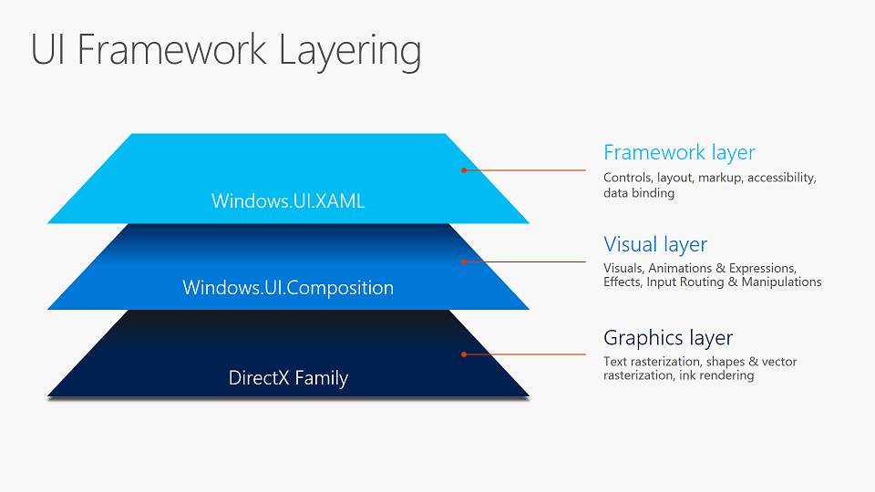

# Visual layer

The Visual layer provides a high performance, retained-mode API for graphics, effects and animations, and is the foundation for all UI across Windows devices. You define your UI in a declarative manner and the Visual layer relies on graphics hardware acceleration to ensure your content, effects and animations are rendered in a smooth, glitch-free manner independent of the app's UI thread.

Notable highlights:

* Familiar WinRT APIs
* Architected for more dynamic UI and interactions
* Concepts aligned with design tools
* Linear scalability with no sudden performance cliffs

Your Windows UWP apps are already using the Visual layer via one of the UI frameworks. You can also take advantage of Visual layer directly for custom rendering, effects and animations with very little effort.

## What's in the Visual layer?

The primary functions of the Visual layer are:

1. **Content**: Lightweight compositing of custom drawn content
1. **Effects**: Real-time UI effects system whose effects can be animated, chained and customized
1. **Animations**: Expressive, framework-agnostic animations running independent of the UI thread

### Content

Content is hosted, transformed and made available for use by the animation and effects system using visuals. At the base of the class hierarchy is the [**Visual**](https://msdn.microsoft.com/library/windows/apps/Dn706858) class, a lightweight, thread-agile proxy in the app process for visual state in the compositor. Sub-classes of Visual include  [**ContainerVisual**](https://msdn.microsoft.com/library/windows/apps/Dn706810) to allow for children to create trees of visuals and [**SpriteVisual**](https://msdn.microsoft.com/library/windows/apps/Mt589433) that contains content and can be painted with either solid colors, custom drawn content or visual effects. Together, these Visual types make up the visual tree structure for 2D UI and back most visible XAML FrameworkElements.

For more information, see the [Composition Visual](composition-visual-tree.md) overview.

### Effects

The Effects system in the Visual layer lets you apply a chain of filter and transparency effects to a Visual or a tree of Visuals. This is a UI effects system, not to be confused with image and media effects. Effects work in conjunction with the Animation system, allowing users to achieve smooth and dynamic animations of Effect properties, rendered independent of the UI thread. Effects in the Visual Layer provide the creative building blocks that can be combined and animated to construct tailored and interactive experiences.

In addition to animatable effect chains, the Visual Layer also supports a lighting model that allows Visuals to mimic material properties by responding to animatable lights. Visuals may also cast shadows. Lighting and shadows can be combined to create a perception of depth and realism.

For more information, see the [Composition Effects](composition-effects.md) overview.

### Animations

The animation system in the Visual layer lets you move visuals, animate effects, and drive transformations, clips, and other properties.  It is a framework agnostic system that has been designed from the ground up with performance in mind.  It runs independently from the UI thread to ensure smoothness and scalability.  While it lets you use familiar KeyFrame animations to drive property changes over time, it also lets you set up mathematical relationships between different properties, including user input, letting you directly craft seamless choreographed experiences.

For more information, see the [Composition animations](composition-animation.md) overview.

### Working with your XAML UWP app

You can get to a Visual created by the XAML framework, and backing a visible FrameworkElement, using the [**ElementCompositionPreview**](https://msdn.microsoft.com/library/windows/apps/Mt608976) class in [**Windows.UI.Xaml.Hosting**](https://msdn.microsoft.com/library/windows/apps/Hh701908). Note that Visuals created for you by the framework come with some limits on customization. This is because the framework is managing offsets, transforms and lifetimes. You can however create your own Visuals and attach them to an existing XAML element via ElementCompositionPreview, or by adding it to an existing ContainerVisual somewhere in the visual tree structure.

For more information, see the [Using the Visual layer with XAML](using-the-visual-layer-with-xaml.md) overview.

### Working with your desktop app

You can use the Visual layer to enhance the look, feel, and functionality of your WPF, Windows Forms, and C++ Win32 desktop apps. You can migrate islands of content to use the Visual layer and keep the rest of your UI in its existing framework. This means you can make significant updates and enhancements to your application UI without needing to make extensive changes to your existing code base.

For more information, see [Modernize your desktop app using the Visual layer](/windows/apps/desktop/modernize/visual-layer-in-desktop-apps).

## Additional resources

* [**Full reference documentation for the API**](https://msdn.microsoft.com/library/windows/apps/Dn706878)
* Advanced UI and Composition samples in the [WindowsUIDevLabs GitHub](https://github.com/microsoft/windowsuidevlabs)
* [Windows.UI.Composition Sample Gallery](https://aka.ms/winuiapp)
* [@windowsui Twitter feed ](https://twitter.com/windowsui)
* Read Kenny Kerr's MSDN Article on this API: [Graphics and Animation - Windows Composition Turns 10](https://msdn.microsoft.com/magazine/mt590968)
