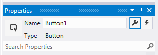
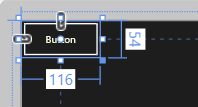
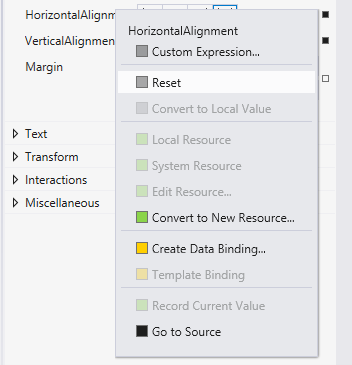
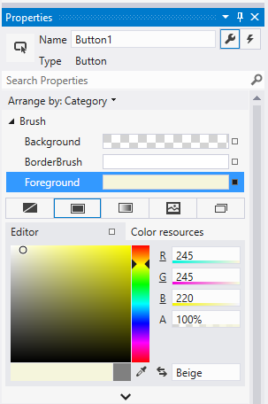
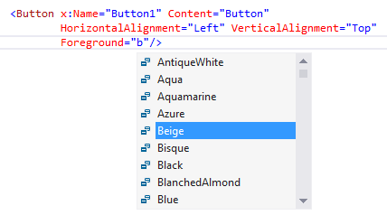
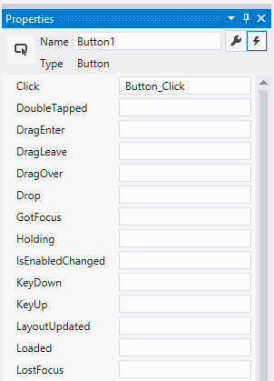

# Intro to controls and patterns

<link rel="stylesheet" href="https://az835927.vo.msecnd.net/sites/uwp/Resources/css/custom.css"> 

In UWP app development, a *control* is a UI element that displays content or enables interaction. You create the UI for your app by using controls such as buttons, text boxes, and combo boxes to display data and get user input.

> **Important APIs**: [Windows.UI.Xaml.Controls namespace](https://msdn.microsoft.com/library/windows/apps/windows.ui.xaml.controls.aspx)

A *pattern* is a recipe for modifying a control or combining several controls to make something new. For example, the [Nav pane](navigationview.md) pattern is a way that you can use a [SplitView](split-view.md) control for app navigation. Similarly, you can customize the template of a [Pivot](tabs-pivot.md) control to implement the tab pattern.

In many cases, you can use a control as-is. But XAML controls separate function from structure and appearance, so you can make various levels of modification to make them fit your needs. In the [Style](../style/index.md) section, you can learn how to use [XAML styles](xaml-styles.md) and [control templates](control-templates.md) to modify a control.

In this section, we provide guidance for each of the XAML controls you can use to build your app UI. To start, this article shows you how to add controls to your app. There are 3 key steps to using controls to your app: 

- Add a control to your app UI. 
- Set properties on the control, such as width, height, or foreground color. 
- Add code to the control's event handlers so that it does something. 

## Add a control
You can add a control to an app in several ways:
 
- Use a design tool like Blend for Visual Studio or the Microsoft Visual Studio Extensible Application Markup Language (XAML) designer. 
- Add the control to the XAML markup in the Visual Studio XAML editor. 
- Add the control in code. Controls that you add in code are visible when the app runs, but are not visible in the Visual Studio XAML designer.

In Visual Studio, when you add and manipulate controls in your app, you can use many of the program's features, including the Toolbox, XAML designer, XAML editor, and the Properties window. 

The Visual Studio Toolbox displays many of the controls that you can use in your app. To add a control to your app, double-click it in the Toolbox. For example, when you double-click the TextBox control, this XAML is added to the XAML view. 

```xaml
<TextBox HorizontalAlignment="Left" Text="TextBox" VerticalAlignment="Top"/>
```

You can also drag the control from the Toolbox to the XAML designer.

## Set the name of a control 

To work with a control in code, you set its [x:Name](../xaml-platform/x-name-attribute.md) attribute and reference it by name in your code. You can set the name in the Visual Studio Properties window or in XAML. Here's how to set the name of the currently selected control by using the Name text box at the top of the Properties window. 

To name a control
1. Select the element to name.
2. In the Properties panel, type a name into the Name text box.
3. Press Enter to commit the name.



Here's how to set the name of a control in the XAML editor by adding the x:Name attribute.

```xaml
<Button x:Name="Button1" Content="Button"/>
```

## Set the control properties 

You use properties to specify the appearance, content, and other attributes of controls. When you add a control using a design tool, some properties that control size, position, and content might be set for you by Visual Studio. You can change some properties, such as Width, Height or Margin, by selecting and manipulating the control in the Design view. This illustration shows some of the resizing tools available in Design view. 



You might want to let the control be sized and positioned automatically. In this case, you can reset the size and position properties that Visual Studio set for you.

To reset a property
1. In the Properties panel, click the property marker next to the property value. The property menu opens.
2. In the property menu, click Reset.



You can set control properties in the Properties window, in XAML, or in code. For example, to change the foreground color for a Button, you set the control's Foreground property. This illustration shows how to set the Foreground property by using the color picker in the Properties window. 



Here's how to set the Foreground property in the XAML editor. Notice the Visual Studio IntelliSense window that opens to help you with the syntax. 




Here's the resulting XAML after you set the Foreground property. 

```xaml
<Button x:Name="Button1" Content="Button" 
        HorizontalAlignment="Left" VerticalAlignment="Top"
        Foreground="Beige"/>
```

Here's how to set the Foreground property in code. 

```csharp
Button1.Foreground = new SolidColorBrush(Windows.UI.Colors.Beige);
```

## Create an event handler 

Each control has events that enable you to respond to actions from your user or other changes in your app. For example, a Button control has a Click event that is raised when a user clicks the Button. You create a method, called an event handler, to handle the event. You can associate a control's event with an event handler method in the Properties window, in XAML, or in code. For more info about events, see [Events and routed events overview](../xaml-platform/events-and-routed-events-overview.md).

To create an event handler, select the control and then click the Events tab at the top of the Properties window. The Properties window lists all of the events available for that control. Here are some of the events for a Button.



To create an event handler with the default name, double-click the text box next to the event name in the Properties window. To create an event handler with a custom name, type the name of your choice into the text box and press enter. The event handler is created and the code-behind file is opened in the code editor. The event handler method has 2 parameters. The first is `sender`, which is a reference to the object where the handler is attached. The `sender` parameter is an **Object** type. You typically cast `sender` to a more precise type if you expect to check or change the state on the `sender` object itself. Based on your own app design, you expect a type that is safe to cast the `sender` to, based on where the handler is attached. The second value is event data, which generally appears in signatures as the `e` or `args` parameter.

Here's code that handles the Click event of a Button named `Button1`. When you click the button, the Foreground property of the Button you clicked is set to blue. 

```csharp
private void Button_Click(object sender, RoutedEventArgs e)
{
    Button b = (Button)sender;
    b.Foreground = new SolidColorBrush(Windows.UI.Colors.Blue);
}
```

You can also associate an event handler in XAML. In the XAML editor, type in the event name that you want to handle. Visual Studio shows an IntelliSense window when you begin typing. After you specify the event, you can double-click `<New Event Handler>` in the IntelliSense window to create a new event handler with the default name, or select an existing event handler from the list. 

Here's the IntelliSense window that appears. It helps you create a new event handler or select an existing event handler.


This example shows how to associate a Click event with an event handler named Button_Click in XAML. 

```xaml
<Button Name="Button1" Content="Button" Click="Button_Click"/>
```

You can also associate an event with its event handler in the code-behind. Here's how to associate an event handler in code.

```csharp
Button1.Click += new RoutedEventHandler(Button_Click);
```

## Related topics

- 	[Index of controls by function](controls-by-function.md)
- 	[Windows.UI.Xaml.Controls namespace](https://msdn.microsoft.com/library/windows/apps/windows.ui.xaml.controls.aspx)
- 	[Layout](../layout/index.md)
- 	[Style](../style/index.md)
- 	[Usability](../usability/index.md)
