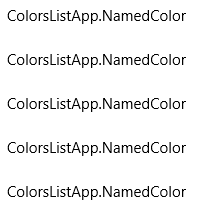
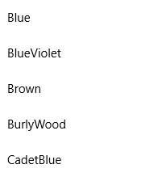
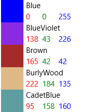
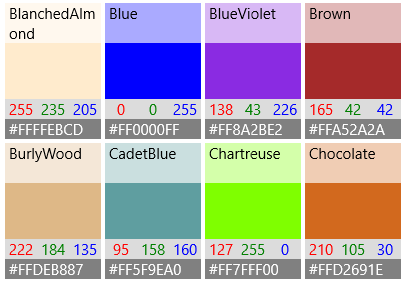
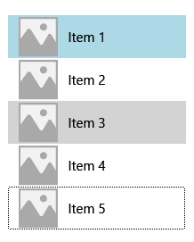
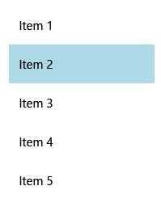
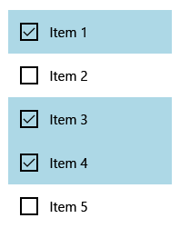
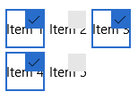
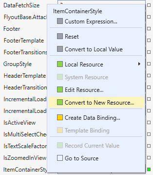

# Item containers and templates

<link rel="stylesheet" href="https://az835927.vo.msecnd.net/sites/uwp/Resources/css/custom.css"> 

**ListView** and **GridView** controls manage how their items are arranged (horizontal, vertical, wrapping, etc…) and how a user interacts with the items, but not how the individual items are shown on the screen. Item visualization is managed by item containers. When you add items to a list view they are automatically placed in a container. The default item container for ListView is [**ListViewItem**](https://msdn.microsoft.com/library/windows/apps/xaml/windows.ui.xaml.controls.listviewitem.aspx); for GridView, it’s [**GridViewItem**](https://msdn.microsoft.com/library/windows/apps/xaml/windows.ui.xaml.controls.gridviewitem.aspx).

<div class="important-apis" >
<b>Important APIs</b><br/>
<ul>
<li>[**ListView class**](https://msdn.microsoft.com/library/windows/apps/windows.ui.xaml.controls.listview.aspx)</li>
<li>[**GridView class**](https://msdn.microsoft.com/library/windows/apps/windows.ui.xaml.controls.gridview.aspx)</li>
<li>[**ItemTemplate property**](https://msdn.microsoft.com/library/windows/apps/windows.ui.xaml.controls.itemscontrol.itemtemplate.aspx)</li>
<li>[**ItemContainerStyle property**](https://msdn.microsoft.com/library/windows/apps/xaml/windows.ui.xaml.controls.itemscontrol.itemcontainerstyle.aspx)</li>
</ul>
</div>


> ListView and GridView both derive from the [**ListViewBase**](https://msdn.microsoft.com/library/windows/apps/windows.ui.xaml.controls.listviewbase.aspx) class, so they have the same functionality, but display data differently. In this article, when we talk about list view, the info applies to both the ListView and GridView controls unless otherwise specified. We may refer to classes like ListView or ListViewItem, but the *List* prefix can be replaced with *Grid* for the corresponding grid equivalent (GridView or GridViewItem). 

These container controls consist of two important parts that combine to create the final visuals shown for an item: the *data template* and the *control template*.

- **Data template** - You assign a [**DataTemplate**](https://msdn.microsoft.com/library/windows/apps/xaml/windows.ui.xaml.datatemplate.aspx) to the [**ItemTemplate**](https://msdn.microsoft.com/library/windows/apps/windows.ui.xaml.controls.itemscontrol.itemtemplate.aspx) property of the list view to specify how individual data items are shown.
- **Control template** - The control template provides the part of the item visualization that the framework is responsible for, like visual states. You can use the [**ItemContainerStyle**](https://msdn.microsoft.com/library/windows/apps/xaml/windows.ui.xaml.controls.itemscontrol.itemcontainerstyle.aspx) property to modify the control template. Typically, you do this to modify the list view colors to match your branding, or change how selected items are shown.

This image shows how the control template and the data template combine to create the final visual for an item.


Here's the XAML that creates this item. We explain the templates later.

```xaml
<ListView Width="220" SelectionMode="Multiple">
    <ListView.ItemTemplate>
        <DataTemplate x:DataType="x:String">
            <Grid Background="Yellow">
                <Grid.ColumnDefinitions>
                    <ColumnDefinition Width="54"/>
                    <ColumnDefinition/>
                </Grid.ColumnDefinitions>
                <Image Source="Assets/placeholder.png" Width="44" Height="44" 
                       HorizontalAlignment="Left"/>
                <TextBlock Text="{x:Bind}" Foreground="Blue" 
                           FontSize="36" Grid.Column="1"/>
            </Grid>
        </DataTemplate>
    </ListView.ItemTemplate>
    <ListView.ItemContainerStyle>
        <Style TargetType="ListViewItem">
            <Setter Property="Background" Value="Green"/>
        </Style>
    </ListView.ItemContainerStyle>
    <x:String>Item 1</x:String>
    <x:String>Item 2</x:String>
    <x:String>Item 3</x:String>
    <x:String>Item 4</x:String>
    <x:String>Item 5</x:String>
</ListView>
```
 
## Prerequisites

- We assume that you know how to use a list view control. For more info, see the [ListView and GridView](listview-and-gridview.md) article.
- We also assume that you understand control styles and templates, including how to use a style inline or as a resource. For more info, see [Styling controls](styling-controls.md) and [Control templates](control-templates.md).

## The data

Before we look deeper into how to show data items in a list view, we need to understand the data to be shown. In this example, we create a data type called `NamedColor`. It combines a color name, color value, and a **SolidColorBrush** for the color, which are exposed as 3 properties: `Name`, `Color`, and `Brush`.
 
We then populate a **List** with a `NamedColor` object for each named color in the [**Colors**](https://msdn.microsoft.com/library/windows/apps/windows.ui.colors.aspx) class. The list is set as the [**ItemsSource**](https://msdn.microsoft.com/library/windows/apps/windows.ui.xaml.controls.itemscontrol.itemssource.aspx) for the list view.

Here’s the code to define the class and populate the `NamedColors` list.

**C#**
```csharp
using System.Collections.Generic;
using System.Linq;
using System.Reflection;
using Windows.UI;
using Windows.UI.Xaml.Controls;
using Windows.UI.Xaml.Media;

namespace ColorsListApp
{
    public sealed partial class MainPage : Page
    {
        // The list of colors won't change after it's populated, so we use List<T>. 
        // If the data can change, we should use an ObservableCollection<T> intead.
        List<NamedColor> NamedColors = new List<NamedColor>();

        public MainPage()
        {
            this.InitializeComponent();

            // Use reflection to get all the properties of the Colors class.
            IEnumerable<PropertyInfo> propertyInfos = typeof(Colors).GetRuntimeProperties();

            // For each property, create a NamedColor with the property name (color name),
            // and property value (color value). Add it the NamedColors list.
            for (int i = 0; i < propertyInfos.Count(); i++)
            {
                NamedColors.Add(new NamedColor(propertyInfos.ElementAt(i).Name,
                                    (Color)propertyInfos.ElementAt(i).GetValue(null)));
            }

            colorsListView.ItemsSource = NamedColors;
        }
    }

    class NamedColor
    {
        public NamedColor(string colorName, Color colorValue)
        {
            Name = colorName;
            Color = colorValue;
        }

        public string Name { get; set; }

        public Color Color { get; set; }

        public SolidColorBrush Brush
        {
            get { return new SolidColorBrush(Color); }
        }
    }
}
```

## Data template

You specify a data template to tell the list view how your data item should be shown. 

By default, a data item is displayed in the list view as the string representation of the data object it's bound to. If you show the 'NamedColors' data in a list view without telling the list view how it should look, it just shows whatever the **ToString** method returns, like this.

**XAML**
```xaml
<ListView x:Name="colorsListView"/>
```



You can show the string representation of a particular property of the data item by setting the [**DisplayMemberPath**](https://msdn.microsoft.com/library/windows/apps/xaml/windows.ui.xaml.controls.itemscontrol.displaymemberpath.aspx) to that property. Here, you set DisplayMemberPath to the `Name` property of the `NamedColor` item.

**XAML**
```xaml
<ListView x:Name="colorsListView" DisplayMemberPath="Name" />
```

The list view now displays items by name, as shown here. It’s more useful, but it’s not very interesting and leaves a lot of information hidden.



You typically want to show a more rich presentation of your data. To specify exactly how items in the list view are displayed, you create a [**DataTemplate**](https://msdn.microsoft.com/library/windows/apps/xaml/windows.ui.xaml.datatemplate.aspx). The XAML in the DataTemplate defines the layout and appearance of controls used to display an individual item. The controls in the layout can be bound to properties of a data object, or have static content defined inline. You assign the DataTemplate to the [**ItemTemplate**](https://msdn.microsoft.com/library/windows/apps/xaml/windows.ui.xaml.controls.itemscontrol.itemtemplate.aspx) property of the list control.

> [!IMPORTANT]
> You can’t use a **ItemTemplate** and **DisplayMemberPath** at the same time. If both properties are set, an exception occurs.

Here, you define a DataTemplate that shows a [**Rectangle**](https://msdn.microsoft.com/library/windows/apps/windows.ui.xaml.shapes.rectangle.aspx) in the color of the item, along with the color name and RGB values. 

> [!NOTE]
> When you use the [x:Bind markup extension](https://msdn.microsoft.com/windows/uwp/xaml-platform/x-bind-markup-extension) in a DataTemplate, you have to specify the DataType (`x:DataType`) on the DataTemplate.

**XAML**
```XAML
<ListView x:Name="colorsListView">
    <ListView.ItemTemplate>
        <DataTemplate x:DataType="local:NamedColor">
            <Grid>
                <Grid.ColumnDefinitions>
                    <ColumnDefinition MinWidth="54"/>
                    <ColumnDefinition Width="32"/>
                    <ColumnDefinition Width="32"/>
                    <ColumnDefinition Width="32"/>
                    <ColumnDefinition/>
                </Grid.ColumnDefinitions>
                <Grid.RowDefinitions>
                    <RowDefinition/>
                    <RowDefinition/>
                </Grid.RowDefinitions>
                <Rectangle Width="44" Height="44" Fill="{x:Bind Brush}" Grid.RowSpan="2"/>
                <TextBlock Text="{x:Bind Name}" Grid.Column="1" Grid.ColumnSpan="4"/>
                <TextBlock Text="{x:Bind Color.R}" Grid.Column="1" Grid.Row="1" Foreground="Red"/>
                <TextBlock Text="{x:Bind Color.G}" Grid.Column="2" Grid.Row="1" Foreground="Green"/>
                <TextBlock Text="{x:Bind Color.B}" Grid.Column="3" Grid.Row="1" Foreground="Blue"/>
            </Grid>
        </DataTemplate>
    </ListView.ItemTemplate>
</ListView>
```

Here's what the data items look like when they're displayed with this data template.



You might want to show the data in a GridView. Here's another data template that displays the data in a way that's more appropriate for a grid layout. This time, the data template is defined as a resource rather than inline with the XAML for the GridView.


**XAML**
```xaml
<Page.Resources>
    <DataTemplate x:Key="namedColorItemGridTemplate" x:DataType="local:NamedColor">
        <Grid>
            <Grid.ColumnDefinitions>
                <ColumnDefinition Width="32"/>
                <ColumnDefinition Width="32"/>
                <ColumnDefinition Width="32"/>
            </Grid.ColumnDefinitions>
            <Grid.RowDefinitions>
                <RowDefinition Height="96"/>
                <RowDefinition/>
                <RowDefinition/>
            </Grid.RowDefinitions>
    
            <Rectangle Width="96" Height="96" Fill="{x:Bind Brush}" Grid.ColumnSpan="3" />
            <!-- Name -->
            <Border Background="#AAFFFFFF" Grid.ColumnSpan="3" Height="40" VerticalAlignment="Top">
                <TextBlock Text="{x:Bind Name}" TextWrapping="Wrap" Margin="4,0,0,0"/>
            </Border>
            <!-- RGB -->
            <Border Background="Gainsboro" Grid.Row="1" Grid.ColumnSpan="3"/>
            <TextBlock Text="{x:Bind Color.R}" Foreground="Red"
                   Grid.Column="0" Grid.Row="1" HorizontalAlignment="Center"/>
            <TextBlock Text="{x:Bind Color.G}" Foreground="Green"
                   Grid.Column="1" Grid.Row="1" HorizontalAlignment="Center"/>
            <TextBlock Text="{x:Bind Color.B}" Foreground="Blue" 
                   Grid.Column="2" Grid.Row="1" HorizontalAlignment="Center"/>
            <!-- HEX -->
            <Border Background="Gray" Grid.Row="2" Grid.ColumnSpan="3">
                <TextBlock Text="{x:Bind Color}" Foreground="White" Margin="4,0,0,0"/>
            </Border>
        </Grid>
    </DataTemplate>
</Page.Resources>

...

<GridView x:Name="colorsGridView" 
          ItemTemplate="{StaticResource namedColorItemGridTemplate}"/>
```

When the data is shown in a grid using this data template, it looks like this.



### Performance considerations

Data templates are the primary way you define the look of your list view. They can also have a significant impact on performance if your list displays a large number of items. 

An instance of every XAML element in a data template is created for each item in the list view. For example, the grid template in the previous example has 10 XAML elements (1 Grid, 1 Rectangle, 3 Borders, 5 TextBlocks). A GridView that shows 20 items on screen using this data template creates at least 200 elements (20*10=200). Reducing the number of elements in a data template can greatly reduce the total number of elements created for your list view. For more info, see [ListView and GridView UI optimization: Element count reduction per item](https://msdn.microsoft.com/windows/uwp/debug-test-perf/optimize-gridview-and-listview#element-reduction-per-item).

 Consider this section  of the grid data template. Let's look at a few things that reduce the element count.

**XAML**
```xaml
<!-- RGB -->
<Border Background="Gainsboro" Grid.Row="1" Grid.ColumnSpan="3"/>
<TextBlock Text="{x:Bind Color.R}" Foreground="Red"
           Grid.Column="0" Grid.Row="1" HorizontalAlignment="Center"/>
<TextBlock Text="{x:Bind Color.G}" Foreground="Green"
           Grid.Column="1" Grid.Row="1" HorizontalAlignment="Center"/>
<TextBlock Text="{x:Bind Color.B}" Foreground="Blue" 
           Grid.Column="2" Grid.Row="1" HorizontalAlignment="Center"/>
```

 - First, the layout uses a single Grid. You could have a single-column Grid and place these 3 TextBlocks in a StackPanel, but in a data template that gets created many times, you should look for ways to avoid embedding layout panels within other layout panels.
 - Second, you can use a Border control to render a background without actually placing items within the Border element. A Border element can have only one child element, so you would need to add an additional layout panel to host the 3 TextBlock elements within the Border element in XAML. By not making the TextBlocks children of the Border, you eliminate the need for a panel to hold the TextBlocks.
 - Finally, you could place the TextBlocks inside a StackPanel, and set the border properties on the StackPanel rather than using an explicit Border element. However, the Border element is a more lightweight control than a StackPanel, so it has less of an impact on performance when rendered many times over.

## Control template
An item’s control template contains the visuals that display state, like selection, pointer over, and focus. These visuals are rendered either on top of or below the data template. Some of the common default visuals drawn by the ListView control template are shown here.

- Hover – A light gray rectangle drawn below the data template.  
- Selection – A light blue rectangle drawn below the data template. 
- Keyboard focus– A black and white dotted border drown on top of the item template. 


The list view combines the elements from the data template and control template to create the final visuals rendered on the screen. Here, the state visuals are shown in the context of a list view.



### ListViewItemPresenter

As we noted previously about data templates, the number of XAML elements created for each item can have a significant impact on the performance of a list view. Because the data template and control template are combined to display each item, the actual number of elements needed to display an item includes the elements in both templates.

The ListView and GridView controls are optimized to reduce the number of XAML elements created per item. The **ListViewItem** visuals are created by the [**ListViewItemPresenter**](https://msdn.microsoft.com/library/windows/apps/windows.ui.xaml.controls.primitives.listviewitempresenter.aspx), which is a special XAML element that displays complex visuals for focus, selection, and other visual states, without the overhead of numerous UIElements.
 
> [!NOTE]
> In UWP apps for Windows 10, both **ListViewItem** and **GridViewItem** use **ListViewItemPresenter**; the GridViewItemPresenter is deprecated and you should not use it. ListViewItem and GridViewItem set different property values on ListViewItemPresenter to achieve different default looks.)

To modify the look of the item container, use the [**ItemContainerStyle**](https://msdn.microsoft.com/library/windows/apps/windows.ui.xaml.controls.itemscontrol.itemcontainerstyle.aspx) property and provide a [**Style**](https://msdn.microsoft.com/library/windows/apps/windows.ui.xaml.style.aspx) with its [**TargetType**](https://msdn.microsoft.com/library/windows/apps/windows.ui.xaml.style.targettype.aspx) set to **ListViewItem** or **GridViewItem**.

In this example, you add padding to the ListViewItem to create some space between the items in the list.

```xaml
<ListView x:Name="colorsListView">
    <ListView.ItemTemplate>
        <!-- DataTemplate XAML shown in previous ListView example -->
    </ListView.ItemTemplate>

    <ListView.ItemContainerStyle>
        <Style TargetType="ListViewItem">
            <Setter Property="Padding" Value="0,4"/>
        </Style>
    </ListView.ItemContainerStyle>
</ListView>
```

Now the list view looks like this with space between the items.


In the ListViewItem default style, the ListViewItemPresenter **ContentMargin** property has a [**TemplateBinding**](https://msdn.microsoft.com/windows/uwp/xaml-platform/templatebinding-markup-extension) to the ListViewItem **Padding** property (`<ListViewItemPresenter ContentMargin="{TemplateBinding Padding}"/>`). When we set the Padding property, that value is really being passed to the ListViewItemPresenter ContentMargin property.

To modify other ListViewItemPresenter properties that aren't template bound to ListViewItems properties, you need to retemplate the ListViewItem with a new ListViewItemPresenter that you can modify properties on. 

> [!NOTE]
> ListViewItem and GridViewItem default styles set a lot of properties on ListViewItemPresenter. You should always start with a copy of the default style and modify only the properties you need too. Otherwise, the visuals will probably not show up the way you expect because some properties won't be set correctly.

**To make a copy of the default template in Visual Studio**
 
1. Open the Document Outline pane (**View > Other Windows > Document Outline**).
2. Select the list or grid element to modify. In this example, you modify the `colorsGridView` element.
3. Right-click and select **Edit Additional Templates > Edit Generated Item Container (ItemContainerStyle) > Edit a Copy**.
    
4. In the Create Style Resource dialog, enter a name for the style. In this example, you use `colorsGridViewItemStyle`.
    ![Visual Studio Create Style Resource dialog(images/listview-style-resource-vs.png)

A copy of the default style is added to your app as a resource, and the **GridView.ItemContainerStyle** property is set to that resource, as shown in this XAML. 

```xaml
<Style x:Key="colorsGridViewItemStyle" TargetType="GridViewItem">
    <Setter Property="FontFamily" Value="{ThemeResource ContentControlThemeFontFamily}"/>
    <Setter Property="FontSize" Value="{ThemeResource ControlContentThemeFontSize}" />
    <Setter Property="Background" Value="Transparent"/>
    <Setter Property="Foreground" Value="{ThemeResource SystemControlForegroundBaseHighBrush}"/>
    <Setter Property="TabNavigation" Value="Local"/>
    <Setter Property="IsHoldingEnabled" Value="True"/>
    <Setter Property="HorizontalContentAlignment" Value="Center"/>
    <Setter Property="VerticalContentAlignment" Value="Center"/>
    <Setter Property="Margin" Value="0,0,4,4"/>
    <Setter Property="MinWidth" Value="{ThemeResource GridViewItemMinWidth}"/>
    <Setter Property="MinHeight" Value="{ThemeResource GridViewItemMinHeight}"/>
    <Setter Property="Template">
        <Setter.Value>
            <ControlTemplate TargetType="GridViewItem">
                <ListViewItemPresenter 
                    CheckBrush="{ThemeResource SystemControlForegroundBaseMediumHighBrush}" 
                    ContentMargin="{TemplateBinding Padding}" 
                    CheckMode="Overlay" 
                    ContentTransitions="{TemplateBinding ContentTransitions}" 
                    CheckBoxBrush="{ThemeResource SystemControlBackgroundChromeMediumBrush}" 
                    DragForeground="{ThemeResource ListViewItemDragForegroundThemeBrush}" 
                    DragOpacity="{ThemeResource ListViewItemDragThemeOpacity}" 
                    DragBackground="{ThemeResource ListViewItemDragBackgroundThemeBrush}" 
                    DisabledOpacity="{ThemeResource ListViewItemDisabledThemeOpacity}" 
                    FocusBorderBrush="{ThemeResource SystemControlForegroundAltHighBrush}" 
                    FocusSecondaryBorderBrush="{ThemeResource SystemControlForegroundBaseHighBrush}" 
                    HorizontalContentAlignment="{TemplateBinding HorizontalContentAlignment}" 
                    PointerOverForeground="{ThemeResource SystemControlForegroundBaseHighBrush}" 
                    PressedBackground="{ThemeResource SystemControlHighlightListMediumBrush}" 
                    PlaceholderBackground="{ThemeResource ListViewItemPlaceholderBackgroundThemeBrush}" 
                    PointerOverBackground="{ThemeResource SystemControlHighlightListLowBrush}" 
                    ReorderHintOffset="{ThemeResource GridViewItemReorderHintThemeOffset}" 
                    SelectedPressedBackground="{ThemeResource SystemControlHighlightListAccentHighBrush}" 
                    SelectionCheckMarkVisualEnabled="True" 
                    SelectedForeground="{ThemeResource SystemControlForegroundBaseHighBrush}" 
                    SelectedPointerOverBackground="{ThemeResource SystemControlHighlightListAccentMediumBrush}" 
                    SelectedBackground="{ThemeResource SystemControlHighlightAccentBrush}" 
                    VerticalContentAlignment="{TemplateBinding VerticalContentAlignment}"/>
            </ControlTemplate>
        </Setter.Value>
    </Setter>
</Style>

...

<GridView x:Name="colorsGridView" ItemContainerStyle="{StaticResource colorsGridViewItemStyle}"/>
```

You can now modify properties on the ListViewItemPresenter to control the selection check box, item positioning, and brush colors for visual states. 

#### Inline and Overlay selection visuals

ListView and GridView indicate selected items in different ways depending on the control and the [**SelectionMode**](https://msdn.microsoft.com/library/windows/apps/windows.ui.xaml.controls.listviewbase.selectionmode.aspx). For more info about list view selection, see [ListView and GridView](listview-and-gridview.md). 

When **SelectionMode** is set to **Multiple**, a selection check box is shown as part of the item's control template. You can use the [**SelectionCheckMarkVisualEnabled**](https://msdn.microsoft.com/library/windows/apps/windows.ui.xaml.controls.primitives.listviewitempresenter.selectioncheckmarkvisualenabled.aspx) property to turn off the selection check box in Multiple selection mode. However, this property is ignored in other selection modes, so you can't turn on the check box in Extended or Single selection mode.

You can set the [**CheckMode**](https://msdn.microsoft.com/library/windows/apps/windows.ui.xaml.controls.primitives.listviewitempresenter.checkmode.aspx) property to specify whether the check box is shown using the inline style or overlay style.

- **Inline**: This style shows the check box to the left of the content, and colors the background of the item container to indicate selection. This is the default style for ListView.
- **Overlay**: This style shows the check box on top of the content, and colors only the border of the item container to indicate selection. This is the default style for GridView.

This table shows the default visuals used to indicate selection.

SelectionMode:&nbsp;&nbsp; | Single/Extended | Multiple
---------------|-----------------|---------
Inline |  | 
Overlay |  | 

> [!NOTE]
> In this and the following examples, simple string data items are shown without data templates to emphasize the visuals provided by the control template.

There are also several brush properties to change the colors of the check box. We'll look at these next along with other brush properties.

#### Brushes 

Many of the properties specify the brushes used for different visual states. You might want to modify these to match the color of your brand. 

This table shows the Common and Selection visual states for ListViewItem, and the brushes used to render the visuals for each state. The images show the effects of the brushes on both the inline and overlay selection visual styles.

> [!NOTE]
> In this table, the modified color values for the brushes are hardcoded named colors and the colors are selected to make it more apparent where they are applied in the template. These are not the default colors for the visual states. If you modify the default colors in your app, you should use brush resources to modify the color values as done in the default template.

State/Brush name | Inline style | Overlay style
------------|--------------|--------------
<b>Normal</b><ul><li><b>CheckBoxBrush="Red"</b></li></ul> |  | 
<b>PointerOver</b><ul><li><b>PointerOverForeground="DarkOrange"</b></li><li><b>PointerOverBackground="MistyRose"</b></li><li>CheckBoxBrush="Red"</li></ul> |  | 
<b>Pressed</b><ul><li><b>PressedBackground="LightCyan"</b></li><li>PointerOverForeground="DarkOrange"</li><li>CheckBoxBrush="Red"</li></ul> |  | 
<b>Selected</b><ul><li><b>SelectedForeground="Navy"</b></li><li><b>SelectedBackground="Khaki"</b></li><li><b>CheckBrush="Green"</b></li><li>CheckBoxBrush="Red" (inline only)</li></ul> |  | 
<b>PointerOverSelected</b><ul><li><b>SelectedPointerOverBackground="Lavender"</b></li><li>SelectedForeground="Navy"</li><li>SelectedBackground="Khaki" (overlay only)</li><li>CheckBrush="Green"</li><li>CheckBoxBrush="Red" (inline only)</li></ul> |  | 
<b>PressedSelected</b><ul><li><b>SelectedPressedBackground="MediumTurquoise"</b></li></li><li>SelectedForeground="Navy"</li><li>SelectedBackground="Khaki" (overlay only)</li><li>CheckBrush="Green"</li><li>CheckBoxBrush="Red" (inline only)</li></ul> |  | 
<b>Focused</b><ul><li><b>FocusBorderBrush="Crimson"</b></li><li><b>FocusSecondaryBorderBrush="Gold"</b></li><li>CheckBoxBrush="Red"</li></ul> |  | 

ListViewItemPresenter has other brush properties for data placeholders and drag states. If you use incremental loading or drag and drop in your list view, you should consider whether you need to also modify these additional brush properties. See the ListViewItemPresenter class for the complete list of properties you can modify. 

### Expanded XAML item templates

If you need to make more modifications than what is allowed by the **ListViewItemPresenter** properties - if you need to change the position of the check box, for example - you can use the *ListViewItemExpanded* or *GridViewItemExpanded* templates. These templates are included with the default styles in generic.xaml. They follow the standard XAML pattern of building all the visuals from individual UIElements.

As mentioned previously, the number of UIElements in an item template has a significant impact on the performance of your list view. Replacing ListViewItemPresenter with the expanded XAML templates greatly increases the element count, and is not recommended when your list view will show a large number of items or when performance is a concern.

> [!NOTE]
> **ListViewItemPresenter** is supported only when the list view’s [**ItemsPanel**](https://msdn.microsoft.com/library/windows/apps/windows.ui.xaml.controls.itemscontrol.itemspanel.aspx) is an [**ItemsWrapGrid**](https://msdn.microsoft.com/library/windows/apps/windows.ui.xaml.controls.itemswrapgrid.aspx) or [**ItemsStackPanel**](https://msdn.microsoft.com/library/windows/apps/windows.ui.xaml.controls.itemsstackpanel.aspx). If you change the ItemsPanel to use [**VariableSizedWrapGrid**](https://msdn.microsoft.com/library/windows/apps/windows.ui.xaml.controls.variablesizedwrapgrid.aspx), [**WrapGrid**](https://msdn.microsoft.com/library/windows/apps/windows.ui.xaml.controls.wrapgrid.aspx), or [**StackPanel**](https://msdn.microsoft.com/library/windows/apps/windows.ui.xaml.controls.stackpanel.aspx), then the item template is automatically switched to the expanded XAML template. For more info, see [ListView and GridView UI optimization](https://msdn.microsoft.com/windows/uwp/debug-test-perf/optimize-gridview-and-listview).

To customize an expanded XAML template, you need to make a copy of it in your app, and set the **ItemContainerStyle** property to your copy.

**To copy the expanded template**
1. Set the ItemContainerStyle property as shown here for your ListView or GridView.
    ```xaml
    <ListView ItemContainerStyle="{StaticResource ListViewItemExpanded}"/>
    <GridView ItemContainerStyle="{StaticResource GridViewItemExpanded}"/>
    ```
2. In the Visual Studio Properties pane, expand the Miscellaneous section and find the ItemContainerStyle property. (Make sure the ListView or GridView is selected.)
3. Click the property marker for the ItemContainerStyle property. (It’s the small box next to the TextBox. It’s coloreed green to show that it’s set to a StaticResource.) The property menu opens.
4. In the property menu, click **Convert to New Resource**. 
    
    
5. In the Create Style Resource dialog, enter a name for the resource and click OK.

A copy of the expanded template from generic.xaml is created in your app, which you can modify as needed.


## Related articles

- [Lists](lists.md)
- [ListView and GridView](listview-and-gridview.md)

