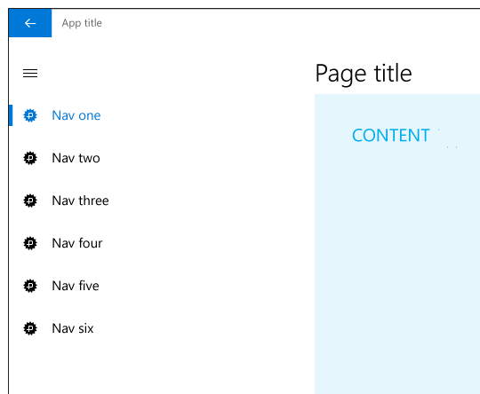
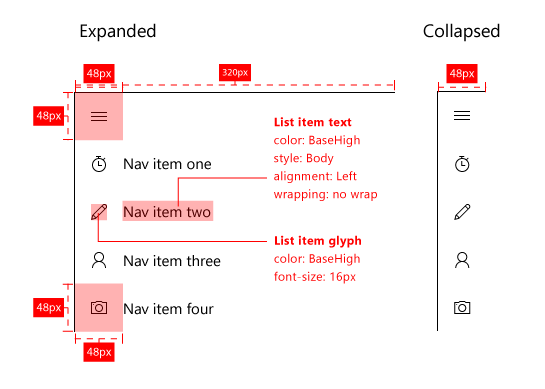
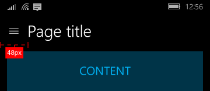
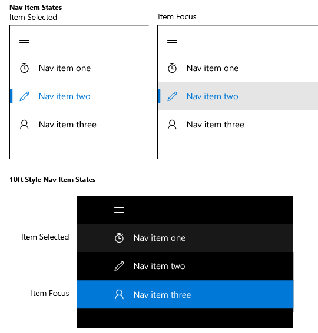

---
author: Jwmsft
Description: Provides top-level navigation while conserving screen real estate.
title: Guidelines for navigation panes
ms.assetid: 8FB52F5E-8E72-4604-9222-0B0EC6A97541
label: Nav pane
template: detail.hbs
ms.author: jimwalk
ms.date: 02/08/2017
ms.topic: article
ms.prod: windows
ms.technology: uwp
keywords: windows 10, uwp
---
# Nav panes

<link rel="stylesheet" href="https://az835927.vo.msecnd.net/sites/uwp/Resources/css/custom.css"> 

A navigation pane (or just "nav" pane) is a pattern that allows for many top-level navigation items while conserving screen real estate. The nav pane is widely used for mobile apps, but also works well on larger screens. When used as an overlay, the pane remains collapsed and out-of-the way until the user presses the button, which is handy for smaller screens. When used in its docked mode, the pane remains open, which allows greater utility if there's enough screen real estate.




<b>Important APIs</b> 
<ul>
<li>[**SplitView class**](https://msdn.microsoft.com/library/windows/apps/dn864360)</li>
<li> </li>
<li> </li>
<li> </li>
<li> </li>
<li> </li>
</ul>



## Is this the right pattern?

The nav pane works well for:

-   Apps with many top-level navigation items that are of similar type. For example, a sports app with categories like Football, Baseball, Basketball, Soccer, and so on.
-   Providing a consistent navigational experience across apps. Nav pane should include only navigational elements, not actions.
-   A medium-to-high number (5-10+) of top-level navigational categories.
-   Preserving screen real estate (as an overlay).
-   Navigation items that are infrequently accessed. (as an overlay).

## Building a nav pane

The nav pane pattern consists of a pane for navigation categories, a content area, and an optional button to open or close the pane. The easiest way to build a nav pane is with a [split view control](split-view.md), which comes with an empty pane and a content area that's always visible.

To try out code implementing this pattern, download the [XAML Navigation solution](https://github.com/Microsoft/Windows-universal-samples/tree/master/Samples/XamlNavigation) from GitHub.


Redlines for the nav pane and hamburger are available on [UNI](http://uni/DesignDepot.FrontEnd/#/Search?c=t&t=Windows%2BRS1%2BControls&f=NavPane_Hamburger).


### Pane

Headers for navigational categories go in the pane. Entry points to app settings and account management, if applicable, also go in the pane. Navigation headers are usually a list of items for the user to choose from.



### Content area

The content area is where information for the selected nav location is displayed. It can contain individual elements or other sub-level navigation.

### Button

When present, the button allows users to open and close the pane. The button remains visible in a fixed position and does not move with the pane. We recommend placing the button in the upper-left corner of your app. The nav pane button is visualized as three stacked horizontal lines and is commonly referred to as the "hamburger" button.



The button is usually associated with a text string. At the top level of the app, the app title can be displayed next to the button. At lower levels of the app, the text string may be the title of the page that the user is currently on.

## Nav pane variations

The nav pane has three modes: overlay, compact and inline. An overlay collapses and expands as needed. When compact, the pane always shows as a narrow sliver which can be expanded. An inline pane remains open by default.

### Overlay

-   An overlay can be used on any screen size and in either portrait or landscape orientation. In its default (collapsed) state, the overlay takes up no real-estate, with only the button shown.
-   Provides on-demand navigation that conserves screen real estate. Ideal for apps on phones and phablets.
-   The pane is hidden by default, with only the button visible.
-   Pressing the nav pane button opens and closes the overlay.
-   The expanded state is transient and is dismissed when a selection is made, when the back button is used, or when the user taps outside of the pane.
-   The overlay draws over the top of content and does not reflow content.

### Compact

-   Compact mode can be specified as `CompactOverlay`, which overlays content when opened, or `CompactInline`, which pushes content out of its way. We recommend using CompactOverlay.
-   Compact panes provide some indication of the selected location while using a small amount of screen real-estate.
-   This mode is better suited for medium screens like tablets.
-   By default, the pane is closed with only navigation icons and the button visible.
-   Pressing the nav pane button opens and closes the pane, which behaves like overlay or inline depending on the specified display mode.
-   The selection should be shown on the list icons to highlight where the user is in the navigation tree.

### Inline

-   The navigation pane remains open. This mode is better suited for larger screens.
-   Supports drag-and-drop scenarios to and from the pane.
-   The nav pane button is not required for this state. If the button is used, then the content area is pushed out and the content within that area will reflow.
-   The selection should be shown on the list items to highlight where the user is in the navigation tree.

## Adaptability

To maximize usability on a variety of devices, we recommend utilizing [break points](../layout/screen-sizes-and-breakpoints-for-responsive-design.md) and adjusting nav pane's mode based on the width of its app window.
-   Small window
   -   Less than or equal to 640px wide.
   -   Nav pane should be in overlay mode, closed by default.
-   Medium window
   -   Greater than 640px and less than or equal to 1007px wide.
   -   Nav pane should be in sliver mode, closed by default.
-   Large window
   -   Greater than 1007px wide.
   -   Nav pane should be in docked mode, opened by default.

## Tailoring

To optimize your app's [10ft experience](http://go.microsoft.com/fwlink/?LinkId=760736), consider tailoring nav pane by altering the visual appearance of its navigational elements. Depending on the interaction context, it may be more important to call the user's attention to either the selected nav item or to the focused nav item. For 10ft experience, where gamepad is the most common input device, ensuring that the user can easily keep track of the currently focused item's location on screen is particularly important.



## Related topics

* [Split view control](split-view.md)
* [Master/details](master-details.md)
* [Navigation basics](https://msdn.microsoft.com/library/windows/apps/dn958438)
 

 
