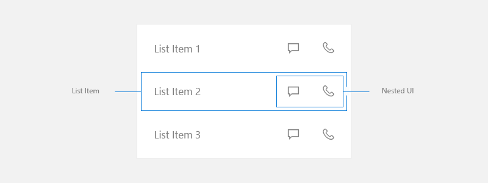
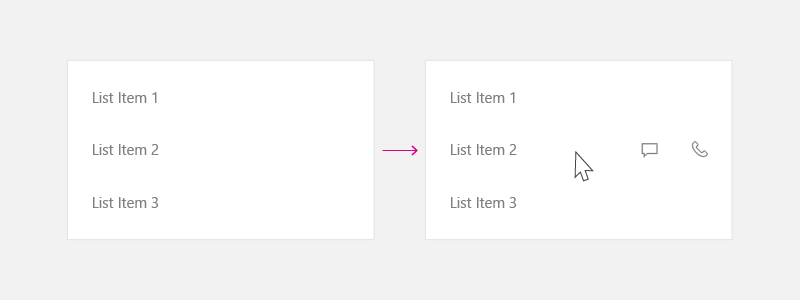
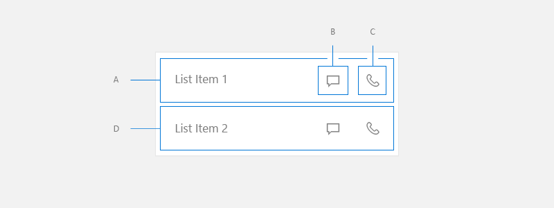
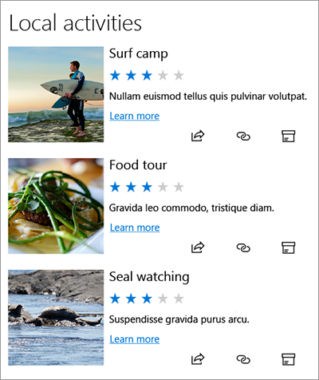

# Nested UI in list items

<link rel="stylesheet" href="https://az835927.vo.msecnd.net/sites/uwp/Resources/css/custom.css"> 

Nested UI is a user interface (UI) that exposes nested actionable controls enclosed inside a container that also can take independent focus.

You can use nested UI to present a user with additional options that help accelerate taking important actions. However, the more actions you expose, the more complicated your UI becomes. You need to take extra care when you choose to use this UI pattern. This article provides guidelines to help you determine the best course of action for your particular UI.

In this article, we discuss the creation of nested UI in [ListView](https://msdn.microsoft.com/library/windows/apps/windows.ui.xaml.controls.listview.aspx) and [GridView](https://msdn.microsoft.com/library/windows/apps/windows.ui.xaml.controls.gridview.aspx) items. While this section does not talk about other nested UI cases, these concepts are transferrable. Before you start, you should be familiar with the general guidance for using ListView or GridView controls in your UI, which is found in the [Lists](lists.md) and [List view and grid view](listview-and-gridview.md) articles.

In this article, we use the terms *list*, *list item*, and *nested UI* as defined here:
- *List* refers to a collection of items contained in a list view or grid view.
- *List item* refers to an individual item that a user can take action on in a list.
- *Nested UI* refers to UI elements within a list item that a user can take action on separate from taking action on the list item itself.



> NOTE&nbsp;&nbsp; ListView and GridView both derive from the [ListViewBase](https://msdn.microsoft.com/library/windows/apps/windows.ui.xaml.controls.listviewbase.aspx) class, so they have the same functionality, but display data differently. In this article, when we talk about lists, the info applies to both the ListView and GridView controls.

## Primary and secondary actions

When creating UI with a list, consider what actions the user might take from those list items.  

- Can a user click on the item to perform an action?
    - Typically, clicking a list item initiates an action, but it doesn't have too.
- Is there more than one action the user can take?
    - For example, tapping an email in a list opens that email. However, there might be other actions, like deleting the email, that the user would want to take without opening it first. It would benefit the user to access this action directly in the list.
- How should the actions be exposed to the user?
    - Consider all input types. Some forms of nested UI work great with one method of input, but might not work with other methods.  

The *primary action* is what the user expects to happen when they press the list item.

*Secondary actions* are typically accelerators associated with list items. These accelerators can be for list management or actions related to the list item.

## Options for secondary actions

When creating list UI, you first need to make sure you account for all input methods that UWP supports. For more info about different kinds of input, see [Input primer](../input-and-devices/input-primer.md).

After you have made sure that your app supports all inputs that UWP supports, you should decide if your app’s secondary actions are important enough to expose as accelerators in the main list. Remember that the more actions you expose, the more complicated your UI becomes. Do you really need to expose the secondary actions in the main list UI, or can you put them somewhere else?

You might consider exposing additional actions in the main list UI when those actions need to be accessible by any input at all times.

If you decide that putting secondary actions in the main list UI is not necessary, there are several other ways you can expose them to the user. Here are some options you can consider for where to place secondary actions.

### Put secondary actions on the detail page

Put the secondary actions on the page that the list item navigates to when it’s pressed. When you use the master/details pattern, the detail page is often a good place to put secondary actions.

For more info, see the [Master/detail pattern](master-details.md).

### Put secondary actions in a context menu

Put the secondary actions in a context menu that the user can access via right-click or press-and-hold. This provides the benefit of letting the user perform an action, such as deleting an email, without having to load the detail page. It's a good practice to also make these options available on the detail page, as context menus are intended to be accelerators rather than primary UI.

To expose secondary actions when input is from a gamepad or remote control, we recommend that you use a context menu.

For more info, see [Context menus and flyouts](menus.md).

### Put secondary actions in hover UI to optimize for pointer input

If you expect your app to be used frequently with pointer input such as mouse and pen, and want to make secondary actions readily available only to those inputs, then you can show the secondary actions only on hover. This accelerator is visible only when a pointer input is used, so be sure to use the other options to support other input types as well.




For more info, see [Mouse interactions](../input-and-devices/mouse-interactions.md).

## UI placement for primary and secondary actions

If you decide that secondary actions should be exposed in the main list UI, we recommend the following guidelines.

When you create a list item with primary and secondary actions, place the primary action to the left and secondary actions to the right. In left-to-right reading cultures, users associate actions on the left side of list item as the primary action.

In these examples, we talk about list UI where the item flows more horizontally (it is wider than its height). However, you might have list items that are more square in shape, or taller than their width. Typically, these are items used in a grid. For these items, if the list doesn't scroll vertically, you can place the secondary actions at the bottom of the list item rather than to the right side.

## Consider all inputs

When deciding to use nested UI, also evaluate the user experience with all input types. As mentioned earlier, nested UI works great for some input types. However, it does not always work great for some other. In particular, keyboard, controller, and remote inputs can have difficulty accessing nested UI elements. Be sure to follow the guidance below to ensure your UWP works with all input types.

## Nested UI handling

When you have more than one action nested in the list item, we recommend this guidance to handle navigation with a keyboard, gamepad, remote control, or other non-pointer input.

### Nested UI where list items perform an action

If your list UI with nested elements supports actions such as invoking, selection (single or multiple), or drag-and-drop operations, we recommend these arrowing techniques to navigate through your nested UI elements.



**Gamepad**

When input is from a gamepad, provide this user experience:

- From **A**, right directional key puts focus on **B**.
- From **B**, right directional key puts focus on **C**.
- From **C**, right directional key is either no op, or if there is a focusable UI element to the right of List, put the focus there.
- From **C**, left directional key puts focus on **B**.
- From **B**, left directional key puts focus on **A**.
- From **A**, left directional key is either no op, or if there is a focusable UI element to the right of List, put the focus there.
- From **A**, **B**, or **C**, down directional key puts focus on **D**.
- From UI element to the left of List Item, right directional key puts focus on **A**.
- From UI element to the right of List Item, left directional key puts focus on **A**.

**Keyboard**

When input is from a keyboard, this is the experience user gets:

- From **A**, tab key puts focus on **B**.
- From **B**, tab key puts focus on **C**.
- From **C**, tab key puts focus on next focusable UI element in the tab order.
- From **C**, shift+tab key puts focus on **B**.
- From **B**, shift+tab or left arrow key puts focus on **A**.
- From **A**, shift+tab key puts focus on next focusable UI element in the reverse tab order.
- From **A**, **B**, or **C**, down arrow key puts focus on **D**.
- From UI element to the left of List Item, tab key puts focus on **A**.
- From UI element to the right of List Item, shift tab key puts focus on **C**.

To achieve this UI, set [IsItemClickEnabled](https://msdn.microsoft.com/library/windows/apps/windows.ui.xaml.controls.listviewbase.isitemclickenabled.aspx) to **true** on your list. [SelectionMode](https://msdn.microsoft.com/library/windows/apps/windows.ui.xaml.controls.listviewbase.selectionmode.aspx) can be any value.

For the code to implement this, see the [Example](#example) section of this article.

### Nested UI where list items do not perform an action

You might use a list view because it provides virtualization and optimized scrolling behavior, but not have an action associated with a list item. These UIs typically use the list item only to group elements and ensure they scroll as a set.

This kind of UI tends to be much more complicated than the previous examples, with a lot of nested elements that the user can take action on.




To achieve this UI, set the following properties on your list:
- [SelectionMode](https://msdn.microsoft.com/library/windows/apps/windows.ui.xaml.controls.listviewbase.selectionmode.aspx) to **None**.
- [IsItemClickEnabled](https://msdn.microsoft.com/library/windows/apps/windows.ui.xaml.controls.listviewbase.isitemclickenabled.aspx) to **false**.
- [IsFocusEngagementEnabled](https://msdn.microsoft.com/library/windows/apps/windows.ui.xaml.controls.control.isfocusengagementenabled.aspx) to **true**.

```xaml
<ListView SelectionMode="None" IsItemClickEnabled="False" >
    <ListView.ItemContainerStyle>
         <Style TargetType="ListViewItem">
             <Setter Property="IsFocusEngagementEnabled" Value="True"/>
         </Style>
    </ListView.ItemContainerStyle>
</ListView>
```

When the list items do not perform an action, we recommend this guidance to handle navigation with a gamepad or keyboard.

**Gamepad**

When input is from a gamepad, provide this user experience:

- From List Item, down directional key puts focus on next List Item.
- From List Item, left/right key is either no op, or if there is a focusable UI element to the right of List, put the focus there.
- From List Item, 'A' button puts the focus on Nested UI in top/down left/right priority.
- While inside Nested UI, follow the XY Focus navigation model.  Focus can only navigate around Nested UI contained inside the current List Item until user presses 'B' button, which puts the focus back onto the List Item.

**Keyboard**

When input is from a keyboard, this is the experience user gets:

- From List Item, down arrow key puts focus on the next List Item.
- From List Item, pressing left/right key is no op.
- From List Item, pressing tab key puts focus on the next tab stop amongst the Nested UI item.
- From one of the Nested UI items, pressing tab traverses the nested UI items in tab order.  Once all the Nested UI items are traveled to, it puts the focus onto the next control in tab order after ListView.
- Shift+Tab behaves in reverse direction from tab behavior.

## Example

This example shows how to implement [nested UI where list items perform an action](#nested-ui-where-list-items-perform-an-action).

```xaml
<ListView SelectionMode="None" IsItemClickEnabled="True"
          ChoosingItemContainer="listview1_ChoosingItemContainer"/>
```

```csharp
private void OnListViewItemKeyDown(object sender, KeyRoutedEventArgs e)
{
    // Code to handle going in/out of nested UI with gamepad and remote only.
    if (e.Handled == true)
    {
        return;
    }

    var focusedElementAsListViewItem = FocusManager.GetFocusedElement() as ListViewItem;
    if (focusedElementAsListViewItem != null)
    {
        // Focus is on the ListViewItem.
        // Go in with Right arrow.
        Control candidate = null;

        switch (e.OriginalKey)
        {
            case Windows.System.VirtualKey.GamepadDPadRight:
            case Windows.System.VirtualKey.GamepadLeftThumbstickRight:
                var rawPixelsPerViewPixel = DisplayInformation.GetForCurrentView().RawPixelsPerViewPixel;
                GeneralTransform generalTransform = focusedElementAsListViewItem.TransformToVisual(null);
                Point startPoint = generalTransform.TransformPoint(new Point(0, 0));
                Rect hintRect = new Rect(startPoint.X * rawPixelsPerViewPixel, startPoint.Y * rawPixelsPerViewPixel, 1, focusedElementAsListViewItem.ActualHeight * rawPixelsPerViewPixel);
                candidate = FocusManager.FindNextFocusableElement(FocusNavigationDirection.Right, hintRect) as Control;
                break;
        }

        if (candidate != null)
        {
            candidate.Focus(FocusState.Keyboard);
            e.Handled = true;
        }
    }
    else
    {
        // Focus is inside the ListViewItem.
        FocusNavigationDirection direction = FocusNavigationDirection.None;
        switch (e.OriginalKey)
        {
            case Windows.System.VirtualKey.GamepadDPadUp:
            case Windows.System.VirtualKey.GamepadLeftThumbstickUp:
                direction = FocusNavigationDirection.Up;
                break;
            case Windows.System.VirtualKey.GamepadDPadDown:
            case Windows.System.VirtualKey.GamepadLeftThumbstickDown:
                direction = FocusNavigationDirection.Down;
                break;
            case Windows.System.VirtualKey.GamepadDPadLeft:
            case Windows.System.VirtualKey.GamepadLeftThumbstickLeft:
                direction = FocusNavigationDirection.Left;
                break;
            case Windows.System.VirtualKey.GamepadDPadRight:
            case Windows.System.VirtualKey.GamepadLeftThumbstickRight:
                direction = FocusNavigationDirection.Right;
                break;
            default:
                break;
        }

        if (direction != FocusNavigationDirection.None)
        {
            Control candidate = FocusManager.FindNextFocusableElement(direction) as Control;
            if (candidate != null)
            {
                ListViewItem listViewItem = sender as ListViewItem;

                // If the next focusable candidate to the left is outside of ListViewItem,
                // put the focus on ListViewItem.
                if (direction == FocusNavigationDirection.Left &&
                    !listViewItem.IsAncestorOf(candidate))
                {
                    listViewItem.Focus(FocusState.Keyboard);
                }
                else
                {
                    candidate.Focus(FocusState.Keyboard);
                }
            }

            e.Handled = true;
        }
    }
}

private void listview1_ChoosingItemContainer(ListViewBase sender, ChoosingItemContainerEventArgs args)
{
    if (args.ItemContainer == null)
    {
        args.ItemContainer = new ListViewItem();
        args.ItemContainer.KeyDown += OnListViewItemKeyDown;
    }
}
```

```csharp
// DependencyObjectExtensions.cs definition.
public static class DependencyObjectExtensions
{
    public static bool IsAncestorOf(this DependencyObject parent, DependencyObject child)
    {
        DependencyObject current = child;
        bool isAncestor = false;

        while (current != null && !isAncestor)
        {
            if (current == parent)
            {
                isAncestor = true;
            }

            current = VisualTreeHelper.GetParent(current);
        }

        return isAncestor;
    }
}
```
