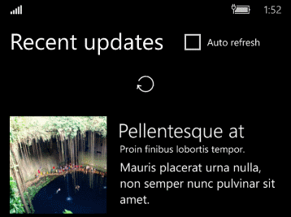
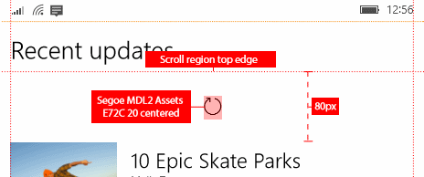

# Pull to refresh

<link rel="stylesheet" href="https://az835927.vo.msecnd.net/sites/uwp/Resources/css/custom.css"> 

The pull-to-refresh pattern lets a user pull down on a list of data using touch in order to retrieve more data. Pull-to-refresh is widely used on mobile apps, but is useful on any device with a touch screen. You can handle [manipulation events](../input-and-devices/touch-interactions.md#manipulation-events) to implement pull-to-refresh in your app.

> **Important APIs**: [ListView class](https://msdn.microsoft.com/library/windows/apps/windows.ui.xaml.controls.listview.aspx), [GridView class](https://msdn.microsoft.com/library/windows/apps/windows.ui.xaml.controls.gridview.aspx)

The [pull-to-refresh sample](http://go.microsoft.com/fwlink/p/?LinkId=620635) shows how to extend a [ListView](https://msdn.microsoft.com/library/windows/apps/windows.ui.xaml.controls.listview.aspx) control to support this pattern. In this article, we use this sample to explain the key points of implementing pull-to-refresh.



## Is this the right pattern?

Use the pull-to-refresh pattern when you have a list or grid of data that the user might want to refresh regularly, and your app is likely to be running on mobile, touch-first devices.

## Implement pull-to-refresh

To implement pull-to-refresh, you need to handle manipulation events to detect when a user has pulled the list down, provide visual feedback, and refresh the data. Here, we look at how this is done in the [pull-to-refresh sample](http://go.microsoft.com/fwlink/p/?LinkId=620635). We don't show all the code here, so you should download the sample or view the code on GitHub.

The pull-to-refresh sample creates a custom control called `RefreshableListView` that extends the **ListView** control. This control adds a refresh indicator to provide visual feedback and handles the manipulation events on the list view's internal scroll viewer. It also adds 2 events to notify you when the list is pulled and when the data should be refreshed. RefreshableListView only provides notification that the data should be refreshed. You need to handle the event in your app to update the data, and that code will be different for every app.

RefreshableListView provides an 'auto refresh' mode that determines when the refresh is requested and how the refresh indicator goes out of view. Auto refresh can be on or off.
- Off: A refresh is requested only if the list is released while the `PullThreshold` is exceded. The indicator animates out of view when the user releases the scroller. The status bar indicator is shown if it's available (on phone).
- On: A refresh is requested as soon as the `PullThreshold` is exceded, whether released or not. The indicator remains in view until the new data is retrieved, then animates out of view. A **Deferral** is used to notify the app when fetching the data is complete.

> **Note**&nbsp;&nbsp;The code in sample is also applicable to a [GridView](https://msdn.microsoft.com/library/windows/apps/windows.ui.xaml.controls.gridview.aspx). To modify a GridView, derive the custom class from GridView instead of ListView and modify the default GridView template.

## Add a refresh indicator

It's important to provide visual feedback to the user so they know that your app supports pull-to-refresh. RefreshableListView has a `RefreshIndicatorContent` property that lets you set the indicator visual in your XAML. It also includes a default text indicator that it falls back to if you don't set the `RefreshIndicatorContent`.

Here are recommended guidelines for the refresh indicator.



**Modify the list view template**

In the pull-to-refresh sample, the `RefreshableListView` control template modifies the standard **ListView** template by adding a refresh indicator. The refresh indicator is placed in a [Grid](https://msdn.microsoft.com/library/windows/apps/windows.ui.xaml.controls.grid.aspx) above the [ItemsPresenter](https://msdn.microsoft.com/library/windows/apps/windows.ui.xaml.controls.itemspresenter.aspx), which is the part that shows the list items.

> **Note**&nbsp;&nbsp;The `DefaultRefreshIndicatorContent` text box provides a text fallback indicator that is shown only if the `RefreshIndicatorContent` property is not set.

Here's the part of the control template that's modified from the default ListView template.

**XAML**
```xaml
<!-- Styles/Styles.xaml -->
<Grid x:Name="ScrollerContent" VerticalAlignment="Top">
    <Grid.RowDefinitions>
        <RowDefinition Height="Auto"/>
        <RowDefinition Height="*"/>
        <RowDefinition Height="Auto"/>
    </Grid.RowDefinitions>
    <Border x:Name="RefreshIndicator" VerticalAlignment="Top" Grid.Row="1">
        <Grid>
            <TextBlock x:Name="DefaultRefreshIndicatorContent" HorizontalAlignment="Center" 
                       Foreground="White" FontSize="20" Margin="20, 35, 20, 20"/>
            <ContentPresenter Content="{TemplateBinding RefreshIndicatorContent}"></ContentPresenter>
        </Grid>
    </Border>
    <ItemsPresenter FooterTransitions="{TemplateBinding FooterTransitions}" 
                    FooterTemplate="{TemplateBinding FooterTemplate}" 
                    Footer="{TemplateBinding Footer}" 
                    HeaderTemplate="{TemplateBinding HeaderTemplate}" 
                    Header="{TemplateBinding Header}" 
                    HeaderTransitions="{TemplateBinding HeaderTransitions}" 
                    Padding="{TemplateBinding Padding}"
                    Grid.Row="1"
                    x:Name="ItemsPresenter"/>
</Grid>
```

**Set the content in XAML**

You set the content of the refresh indicator in the XAML for your list view. The XAML content you set is displayed by the refresh indicator's [ContentPresenter](https://msdn.microsoft.com/library/windows/apps/windows.ui.xaml.controls.contentpresenter.aspx) (`<ContentPresenter Content="{TemplateBinding RefreshIndicatorContent}">`). If you don't set this content, the default text indicator is shown instead.

**XAML**
```xaml
<!-- MainPage.xaml -->
<c:RefreshableListView
    <!-- ... See sample for removed code. -->
    AutoRefresh="{x:Bind Path=UseAutoRefresh, Mode=OneWay}"
    ItemsSource="{x:Bind Items}"
    PullProgressChanged="listView_PullProgressChanged"
    RefreshRequested="listView_RefreshRequested">

    <c:RefreshableListView.RefreshIndicatorContent>
        <Grid Height="100" Background="Transparent">
            <FontIcon
                Margin="0,0,0,30"
                HorizontalAlignment="Center"
                VerticalAlignment="Bottom"
                FontFamily="Segoe MDL2 Assets"
                FontSize="20"
                Glyph="&#xE72C;"
                RenderTransformOrigin="0.5,0.5">
                <FontIcon.RenderTransform>
                    <RotateTransform x:Name="SpinnerTransform" Angle="0" />
                </FontIcon.RenderTransform>
            </FontIcon>
        </Grid>
    </c:RefreshableListView.RefreshIndicatorContent>
    
    <!-- ... See sample for removed code. -->

</c:RefreshableListView>
```

**Animate the spinner**

When the list is pulled down, RefreshableListView's `PullProgressChanged` event occurs. You handle this event in your app to control the refresh indicator. In the sample, this storyboard is started to animate the indicator's [RotateTransform](https://msdn.microsoft.com/library/windows/apps/windows.ui.xaml.media.rotatetransform.aspx) and spin the refresh indicator. 

**XAML**
```xaml
<!-- MainPage.xaml -->
<Storyboard x:Name="SpinnerStoryboard">
    <DoubleAnimation
        Duration="00:00:00.5"
        FillBehavior="HoldEnd"
        From="0"
        RepeatBehavior="Forever"
        Storyboard.TargetName="SpinnerTransform"
        Storyboard.TargetProperty="Angle"
        To="360" />
</Storyboard>
```

## Handle scroll viewer manipulation events

The list view control template includes a built-in [ScrollViewer](https://msdn.microsoft.com/library/windows/apps/windows.ui.xaml.controls.scrollviewer.aspx) that lets a user scroll through the list items. To implement pull-to-refresh, you have to handle the manipulation events on the built-in scroll viewer, as well as several related events. For more info about manipulation events, see [Touch interactions](../input-and-devices/touch-interactions.md).

** OnApplyTemplate**

To get access to the scroll viewer and other template parts so that you can add event handlers and call them later in your code, you must override the [OnApplyTemplate](https://msdn.microsoft.com/library/windows/apps/windows.ui.xaml.frameworkelement.onapplytemplate.aspx) method. In OnApplyTemplate, you call [GetTemplateChild](https://msdn.microsoft.com/library/windows/apps/windows.ui.xaml.controls.control.gettemplatechild.aspx) to get a reference to a named part in the control template, which you can save to use later in your code.

In the sample, the variables used to store the template parts are declared in the Private Variables region. After they are retrieved in the OnApplyTemplate method, event handlers are added for the [DirectManipulationStarted](https://msdn.microsoft.com/library/windows/apps/windows.ui.xaml.controls.scrollviewer.directmanipulationstarted.aspx), [DirectManipulationCompleted](https://msdn.microsoft.com/library/windows/apps/windows.ui.xaml.controls.scrollviewer.directmanipulationcompleted.aspx), [ViewChanged](https://msdn.microsoft.com/library/windows/apps/windows.ui.xaml.controls.scrollviewer.viewchanged.aspx), and [PointerPressed](https://msdn.microsoft.com/library/windows/apps/windows.ui.xaml.uielement.pointerpressed.aspx) events.

**DirectManipulationStarted**

In order to initiate a pull-to-refresh action, the content has to be scrolled to the top of the scroll viewer when the user starts to pull down. Otherwise, it's assumed that the user is pulling in order to pan up in the list. The code in this handler determines whether the manipulation started with the content at the top of the scroll viewer, and can result in the list being refreshed. The control's 'refreshable' status is set accordingly. 

If the control can be refreshed, event handlers for animations are also added.

**DirectManipulationCompleted**

When the user stops pulling the list down, the code in this handler checks whether a refresh was activated during the manipulation. If a refresh was activated, the `RefreshRequested` event is raised and the `RefreshCommand` command is executed.

The event handlers for animations are also removed.

Based on the value of the `AutoRefresh` property, the list can animate back up immediately, or wait until the refresh is complete and then animate back up. A [Deferral](https://msdn.microsoft.com/library/windows/apps/windows.foundation.deferral.aspx) object is used to to mark the completion of the refresh. At that point the refresh indicator UI is hidden.

This part of the DirectManipulationCompleted event handler raises the `RefreshRequested` event and get's the Deferral if needed.

**C#**
```csharp
if (this.RefreshRequested != null)
{
    RefreshRequestedEventArgs refreshRequestedEventArgs = new RefreshRequestedEventArgs(
        this.AutoRefresh ? new DeferralCompletedHandler(RefreshCompleted) : null);
    this.RefreshRequested(this, refreshRequestedEventArgs);
    if (this.AutoRefresh)
    {
        m_scrollerContent.ManipulationMode = ManipulationModes.None;
        if (!refreshRequestedEventArgs.WasDeferralRetrieved)
        {
            // The Deferral object was not retrieved in the event handler.
            // Animate the content up right away.
            this.RefreshCompleted();
        }
    }
}
```

**ViewChanged**

Two cases are handled in the ViewChanged event handler.

First, if the view changed due to the scroll viewer zooming, the control's 'refreshable' status is canceled.

Second, if the content finished animating up at the end of an auto refresh, the padding rectangles are hidden, touch interactions with the scroll viewer are re-anabled, the [VerticalOffset](https://msdn.microsoft.com/library/windows/apps/windows.ui.xaml.controls.scrollviewer.verticaloffset.aspx) is set to 0.

**PointerPressed**

Pull-to-refresh happens only when the list is pulled down by a touch manipulation. In the PointerPressed event handler, the code checks what kind of pointer caused the event and sets a variable (`m_pointerPressed`) to indicate whether it was a touch pointer. This variable is used in the DirectManipulationStarted handler. If the pointer is not a touch pointer, the DirectManipulationStarted handler returns without doing anything.

## Add pull and refresh events

'RefreshableListView' adds 2 events that you can handle in your app to refresh the data and manage the refresh indicator.

For more info about events, see [Events and routed events overview](https://msdn.microsoft.com/windows/uwp/xaml-platform/events-and-routed-events-overview).

**RefreshRequested**

The 'RefreshRequested' event notifies your app that the user has pulled the list to refresh it. You handle this event to fetch new data and update your list.

Here's the event handler from the sample. The important thing to notice is that it check's the list view's `AutoRefresh` property and get's a Deferral if it's **true**. With a Deferral, the refresh indicator is not stopped and hidden until the refresh is complete.

**C#**
```csharp
private async void listView_RefreshRequested(object sender, RefreshableListView.RefreshRequestedEventArgs e)
{
    using (Deferral deferral = listView.AutoRefresh ? e.GetDeferral() : null)
    {
        await FetchAndInsertItemsAsync(_rand.Next(1, 5));

        if (SpinnerStoryboard.GetCurrentState() != Windows.UI.Xaml.Media.Animation.ClockState.Stopped)
        {
            SpinnerStoryboard.Stop();
        }
    }
}
```

**PullProgressChanged**

In the sample, content for the refresh indicator is provided and controlled by the app. The 'PullProgressChanged' event notifies your app when the use is pulling the list so that you can start, stop, and reset the refresh indicator. 

## Composition animations

By default, content in a scroll viewer stops when the scrollbar reaches the top. To let the user continue to pull the list down, you need to access the visual layer and animate the list content. The sample uses [composition animations](https://msdn.microsoft.com/windows/uwp/composition/composition-animation) for this; specifically, [expression animations](https://msdn.microsoft.com/windows/uwp/composition/composition-animation#expression-animations).

In the sample, this work is done primarily in the `CompositionTarget_Rendering` event handler and the `UpdateCompositionAnimations` method.

## Related articles

- [Styling controls](styling-controls.md)
- [Touch interactions](../input-and-devices/touch-interactions.md)
- [List view and grid view](listview-and-gridview.md)
- [Item containers and templates](item-containers-templates.md)
- [Expression animations](../composition/composition-animation.md)