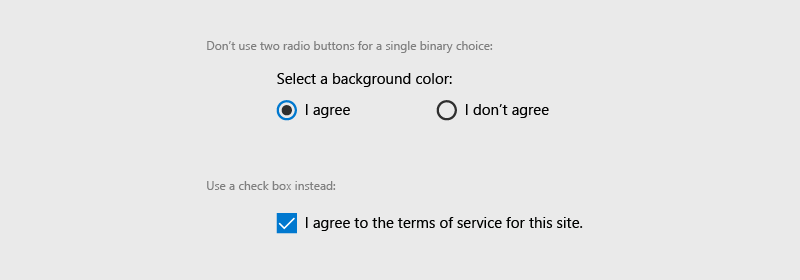
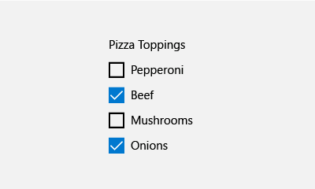
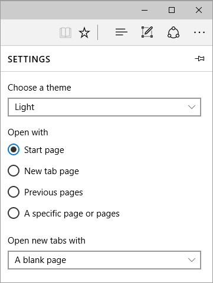
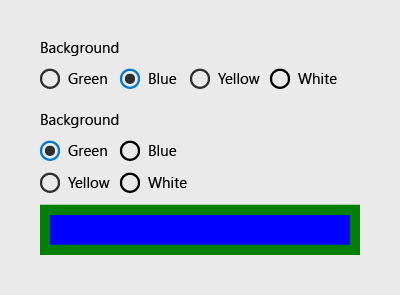
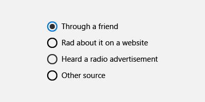

# Radio buttons

<link rel="stylesheet" href="https://az835927.vo.msecnd.net/sites/uwp/Resources/css/custom.css"> 

Radio buttons let users select one option from two or more choices. Each option is represented by one radio button; a user can select only one radio button in a radio button group.

> **Important APIs**: [RadioButton class](https://msdn.microsoft.com/library/windows/apps/br227544), [Checked event](https://msdn.microsoft.com/library/windows/apps/windows.ui.xaml.controls.primitives.togglebutton.checked.aspx), [IsChecked property](https://msdn.microsoft.com/library/windows/apps/windows.ui.xaml.controls.primitives.togglebutton.ischecked.aspx)

(If you're curious about the name, radio buttons are named for the channel preset buttons on a radio.)


## Is this the right control?

Use radio buttons to present users with two or more mutually exclusive options, as here.


Radio buttons add clarity and weight to very important options in your app. Use radio buttons when the options being presented are important enough to command more screen space and where the clarity of the choice demands very explicit options.

Radio buttons emphasize all options equally, and that may draw more attention to the options than necessary. Consider using other controls, unless the options deserve extra attention from the user. For example, if the default option is recommended for most users in most situations, use a [drop-down list](lists.md) instead.

If there are only two mutually exclusive options, combine them into a single [checkbox](checkbox.md) or [toggle switch](toggles.md). For example, use a checkbox for "I agree" instead of two radio buttons for "I agree" and "I don't agree."



When the user can select multiple options, use a [checkbox](checkbox.md) or [list box](lists.md) control instead.



Don't use radio buttons when the options are numbers that have fixed steps, like 10, 20, 30. Use a [slider](slider.md) control instead.

If there are more than 8 options, use a [drop-down list](lists.md), a single-select [list box](lists.md), or a [list box](lists.md) instead.

If the available options are based on the app’s current context, or can otherwise vary dynamically, use a single-select [list box](lists.md) instead.

## Example
Radio buttons in the Microsoft Edge browser settings.



## Create a radio button

Radio buttons work in groups. There are 2 ways you can group radio button controls:
- Put them inside the same parent container.
- Set the [GroupName](https://msdn.microsoft.com/library/windows/apps/windows.ui.xaml.controls.radiobutton.groupname.aspx) property on each radio button to the same value.

> **Note**&nbsp;&nbsp;A group of radio buttons behaves like a single control when accessed via the keyboard. Only the selected choice is accessible using the Tab key but users can cycle through the group using arrow keys.

In this example, the first group of radio buttons is implicitly grouped by being in the same stack panel. The second group is divided between 2 stack panels, so they're explicitly grouped by GroupName.

```xaml
<StackPanel>
    <StackPanel>
        <TextBlock Text="Background" Style="{ThemeResource BaseTextBlockStyle}"/>
        <StackPanel Orientation="Horizontal">
            <RadioButton Content="Green" Tag="Green" Checked="BGRadioButton_Checked"/>
            <RadioButton Content="Yellow" Tag="Yellow" Checked="BGRadioButton_Checked"/>
            <RadioButton Content="Blue" Tag="Blue" Checked="BGRadioButton_Checked"/>
            <RadioButton Content="White" Tag="White" Checked="BGRadioButton_Checked" IsChecked="True"/>
        </StackPanel>
    </StackPanel>
    <StackPanel>
        <TextBlock Text="BorderBrush" Style="{ThemeResource BaseTextBlockStyle}"/>
        <StackPanel Orientation="Horizontal">
            <StackPanel>
                <RadioButton Content="Green" GroupName="BorderBrush" Tag="Green" Checked="BorderRadioButton_Checked"/>
                <RadioButton Content="Yellow" GroupName="BorderBrush" Tag="Yellow" Checked="BorderRadioButton_Checked" IsChecked="True"/>
            </StackPanel>
            <StackPanel>
                <RadioButton Content="Blue" GroupName="BorderBrush" Tag="Blue" Checked="BorderRadioButton_Checked"/>
                <RadioButton Content="White" GroupName="BorderBrush" Tag="White"  Checked="BorderRadioButton_Checked"/>
            </StackPanel>
        </StackPanel>
    </StackPanel>
    <Border x:Name="BorderExample1" BorderThickness="10" BorderBrush="#FFFFD700" Background="#FFFFFFFF" Height="50" Margin="0,10,0,10"/>
</StackPanel>
```

```csharp
private void BGRadioButton_Checked(object sender, RoutedEventArgs e)
{
    RadioButton rb = sender as RadioButton;

    if (rb != null && BorderExample1 != null)
    {
        string colorName = rb.Tag.ToString();
        switch (colorName)
        {
            case "Yellow":
                BorderExample1.Background = new SolidColorBrush(Colors.Yellow);
                break;
            case "Green":
                BorderExample1.Background = new SolidColorBrush(Colors.Green);
                break;
            case "Blue":
                BorderExample1.Background = new SolidColorBrush(Colors.Blue);
                break;
            case "White":
                BorderExample1.Background = new SolidColorBrush(Colors.White);
                break;
        }
    }
}

private void BorderRadioButton_Checked(object sender, RoutedEventArgs e)
{
    RadioButton rb = sender as RadioButton;

    if (rb != null && BorderExample1 != null)
    {
        string colorName = rb.Tag.ToString();
        switch (colorName)
        {
            case "Yellow":
                BorderExample1.BorderBrush = new SolidColorBrush(Colors.Gold);
                break;
            case "Green":
                BorderExample1.BorderBrush = new SolidColorBrush(Colors.DarkGreen);
                break;
            case "Blue":
                BorderExample1.BorderBrush = new SolidColorBrush(Colors.DarkBlue);
                break;
            case "White":
                BorderExample1.BorderBrush = new SolidColorBrush(Colors.White);
                break;
        }
    }
}
```

The radio button groups look like this.



A radio button has two states: *selected* or *cleared*. When a radio button is selected, its [IsChecked](https://msdn.microsoft.com/library/windows/apps/windows.ui.xaml.controls.primitives.togglebutton.ischecked.aspx) property is **true**. When a radio button is cleared, its **IsChecked** property is **false**. A radio button can be cleared by clicking another radio button in the same group, but it cannot be cleared by clicking it again. However, you can clear a radio button programmatically by setting its IsChecked property to **false**.

## Recommendations

-   Make sure that the purpose and current state of a set of radio buttons is clear.
-   Always give visual feedback when the user taps a radio button.
-   Give visual feedback as the user interacts with radio buttons. Normal, pressed, checked, and disabled are examples of radio button states. A user taps a radio button to activate the related option. Tapping an activated option doesn’t deactivate it, but tapping another option transfers activation to that option.
-   Reserve visual effects and animations for touch feedback, and for the checked state; in the unchecked state, radio button controls should appear unused or inactive (but not disabled).
-   Limit the radio button’s text content to a single line. You can customize the radio button’s visuals to display a description of the option in smaller font size below the main line of text.
-   If the text content is dynamic, consider how the button will resize and what will happen to visuals around it.
-   Use the default font unless your brand guidelines tell you to use another.
-   Enclose the radio button in a label element so that tapping the label selects the radio button.
-   Place the label text after the radio button control, not before or above it.
-   Consider customizing your radio buttons. By default, a radio button consists of two concentric circles—the inner one filled (and shown when the radio button is checked), the outer one stroked—and some text content. But we encourage you to be creative. Users are comfortable interacting directly with the content of an app. So you may choose to show the actual content on offer, whether that’s presented with graphics or as subtle textual toggle buttons.
-   Don't put more than 8 options in a radio button group. When you need to present more options, use a [drop-down list](lists.md), [list box](lists.md), or a [list view](lists.md) instead.
-   Don't put two radio button groups next to each other. When two radio button groups are right next to each other, it's difficult to determine which buttons belong to which group. Use group labels to separate them.

## Additional usage guidance

This illustration shows the proper way to position and space radio buttons.


## Related topics

**For designers**
- [Guidelines for buttons](buttons.md)
- [Guidelines for toggle switches](toggles.md)
- [Guidelines for checkboxes](checkbox.md)
- [Guidelines for drop-down lists](lists.md)
- [Guidelines for list view and grid view controls](lists.md)
- [Guidelines for sliders](slider.md)
- [Guidelines for the select control](lists.md)


**For developers (XAML)**
- [Windows.UI.Xaml.Controls RadioButton class](https://msdn.microsoft.com/library/windows/apps/br227544)
