# Search and find-in-page

<link rel="stylesheet" href="https://az835927.vo.msecnd.net/sites/uwp/Resources/css/custom.css"> 

Search is one of the top ways users can find content in your app. The guidance in this article covers elements of the search experience, search scopes, implementation, and examples of search in context.

> **Important APIs**: [AutoSuggestBox class](https://msdn.microsoft.com/library/windows/apps/dn633874)

## Elements of the search experience

**Input.**  Text is the most common mode of search input and is the focus of this guidance. Other common input modes include voice and camera, but these typically require the ability to interface with device hardware and may require additional controls or custom UI within the app.

**Zero input.**  Once the user has activated the input field, but before the user has entered text, you can display what's called a "zero input canvas." The zero input canvas will commonly appear in the app canvas, so that [auto-suggest](auto-suggest-box.md) replaces this content when the user begins to input their query. Recent search history, trending searches, contextual search suggestions, hints and tips are all good candidates for the zero input state.

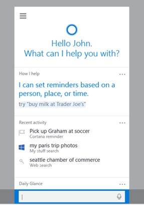

 

**Query formulation/auto-suggest.**  Query formulation replaces zero input content as soon as the user begins to enter input. As the user enters a query string, they are provided with a continuously updated set of query suggestions or disambiguation options to help them expedite the input process and formulate an effective query. This behavior of query suggestions is built into the [auto-suggest control](auto-suggest-box.md), and is also a way to show the icon inside the search (like a microphone or a commit icon). Any behavior outside of this falls to the app.

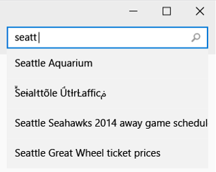

 

**Results set.**  Search results commonly appear directly under the search input field. While this isn't a requirement, the juxtaposition of input and results maintains context and provides the user with immediate access to edit the previous query or enter a new query. This connection can be further communicated by replacing the hint text with the query that created the results set.

One method to enable efficient access to both edit the previous query and enter a new query is to highlight the previous query when the field is reactivated. This way, any keystroke will replace the previous string, but the string is maintained so that the user can position a cursor to edit or append the previous string.

The results set can appear in any form that best communicates the content. A [list view](lists.md) provides a good deal of flexibility and is well-suited to most searches. A grid view works well for images or other media, and a map can be used to communicate spatial distribution.

## Search scopes

Search is a common feature, and users will encounter search UI in the shell and within many apps. Although search entry points tend to be similarly visualized, they can provide access to results that range from broad (web or device searches) to narrow (a user's contact list). The search entry point should be juxtaposed against the content being searched.

Some common search scopes include:

**Global** and **contextual/refine.**  Search across multiple sources of cloud and local content. Varied results include URLs, documents, media, actions, apps, and more.

**Web.**  Search a web index. Results include pages, entities, and answers.

**My stuff.**  Search across device(s), cloud, social graphs, and more. Results are varied, but are constrained by the connection to user account(s).

Use hint text to communicate search scope. Examples include:

"Search Windows and the Web"

"Search contacts list"

"Search mailbox"

"Search settings"

"Search for a place"

 

By effectively communicating the scope of a search input point, you can help to ensure that the user expectation will be met by the capabilities of the search you are performing and reduce the possibility of frustration.

## Implementation

For most apps, it's best to have a text input field as the search entry point, which provides a prominent visual footprint. In addition, hint text helps with discoverability and communicating the search scope. When search is a more secondary action, or when space is constrained, the search icon can serve as an entry point without the accompanying input field. When visualized as an icon, be sure that there's room for a modal search box, as seen in the below examples.

Before clicking search icon:

 

After clicking search icon:

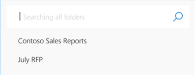

 

Search always uses a right-pointing magnifying glass glyph for the entry point. The glyph to use is Segoe UI Symbol, hex character code 0xE0094, and usually at 15 epx font size.

The search entry point can be placed in a number of different areas, and its placement communicates both search scope and context. Searches that gather results from across an experience or external to the app are typically located within top-level app chrome, such as global command bars or navigation.

As the search scope becomes more narrow or contextual, the placement will typically be more directly associated with the content to be searched, such as on a canvas, as a list header, or within contextual command bars. In all cases, the connection between search input and results or filtered content should be visually clear.

In the case of scrollable lists, it's helpful to always have search input be visible. We recommend making the search input sticky and have content scroll behind it.

Zero input and query formulation functionality is optional for contextual/refine searches in which the list will be filtered in real-time by user input. Exceptions include cases where query formatting suggestions may be available, such as inbox filtering options (to:&lt;input string&gt;, from: &lt;input string&gt;, subject: &lt;input string&gt;, and so on).

## Example

The examples in this section show search placed in context.

Search as an action in the Windows tool bar:

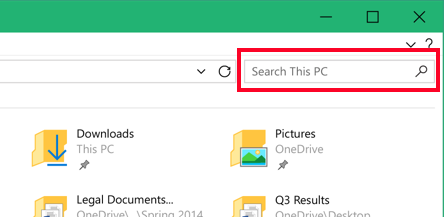

 

Search as an input on the app canvas:

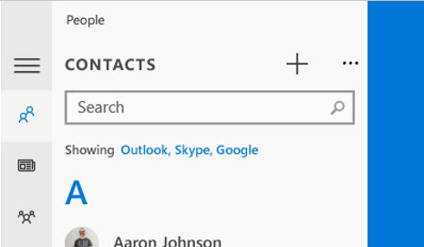

 

Search in a navigation pane:

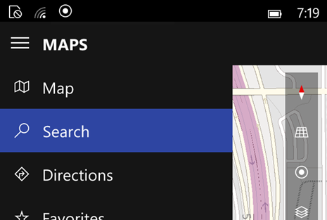

 

Inline search is best reserved for cases where search is infrequently accessed or is highly contextual:

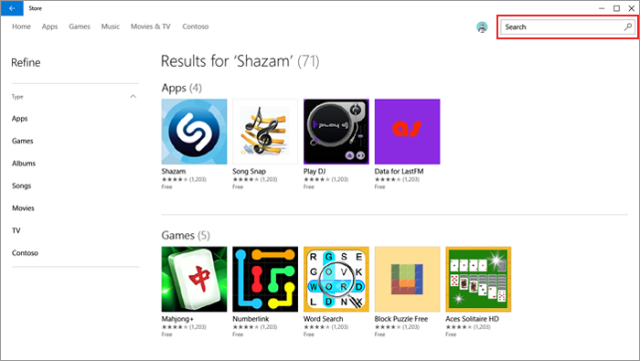

## Guidelines for find-in-page

Find-in-page enables users to find text matches in the current body of text. Document viewers, readers, and browsers are the most typical apps that provide find-in-page.

## Do's and don'ts

-   Place a command bar in your app with find-in-page functionality to let the user search for on-page text. For placement details, see the Examples section.

    -   Apps that provide find-in-page should have all necessary controls in a command bar.
    -   If your app includes a lot of functionality beyond find-in-page, you can provide a **Find** button in the top-level command bar as an entry point to another command bar that contains all of your find-in-page controls.
    -   The find-in-page command bar should remain visible when the user is interacting with the touch keyboard. The touch keyboard appears when a user taps the input box. The find-in-page command bar should move up, so it's not obscured by the touch keyboard.

    -   Find-in-page should remain available while the user interacts with the view. Users need to interact with the in-view text while using find-in-page. For example, users may want to zoom in or out of a document or pan the view to read the text. Once the user starts using find-in-page, the command bar should remain available with a **Close** button to exit find-in-page.

    -   Enable the keyboard shortcut (CTRL+F). Implement the keyboard shortcut CTRL+F to enable the user to invoke the find-in-page command bar quickly.

    -   Include the basics of find-in-page functionality. These are the UI elements that you need in order to implement find-in-page:

        -   Input box
        -   Previous and Next buttons
        -   A match count
        -   Close (desktop-only)
    -   The view should highlight matches and scroll to show the next match on screen. Users can move quickly through the document by using the **Previous** and **Next** buttons and by using scroll bars or direct manipulation with touch.

    -   Find-and-replace functionality should work alongside the basic find-in-page functionality. For apps that have find-and-replace, ensure that find-in-page doesn't interfere with find-and-replace functionality.

-   Include a match counter to indicate to the user the number of text matches there are on the page.
-   Enable the keyboard shortcut (CTRL+F).

## Examples

Provide an easy way to access the find-in-page feature. In this example on a mobile UI, "Find on page" appears after two "Add to..." commands in an expandable menu:

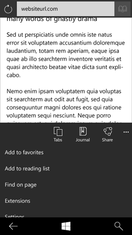

 

After selecting find-in-page, the user enters a search term. Text suggestions can appear when a search term is being entered:

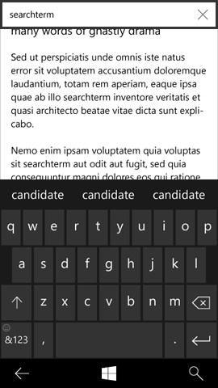

 

If there isn't a text match in the search, a "No results" text string should appear in the results box:

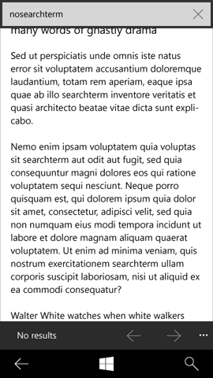

 

If there is a text match in the search, the first term should be highlighted in a distinct color, with succeeding matches in a more subtle tone of that same color palette, as seen in this example:

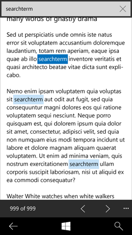

 

Find-in-page has a match counter:

## **Implementing find-in-page**

-   Document viewers, readers, and browsers are the likeliest app types to provide find-in-page, and enable the user to have a full screen viewing/reading experience.
-   Find-in-page functionality is secondary and should be located in a command bar.

For more info about adding commands to your command bar, see [Command bar](app-bars.md).

 

## Related articles

* [Auto-suggest box](auto-suggest-box.md)

 

 
