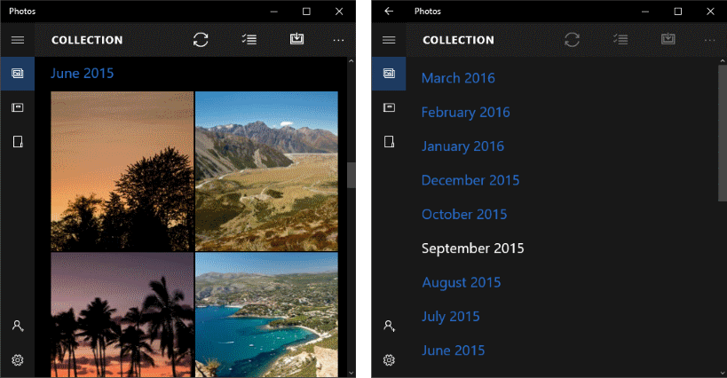
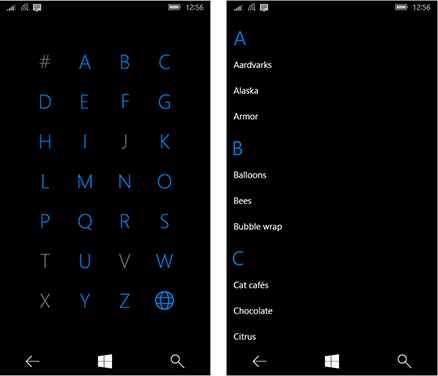

# Semantic zoom

<link rel="stylesheet" href="https://az835927.vo.msecnd.net/sites/uwp/Resources/css/custom.css"> 

Semantic zoom lets the user switch between two different views of the same content so that they can quickly navigate through a large set of grouped data.
 
- The zoomed-in view is the main view of the content. This is the main view where you show individual data items. 
- The zoomed-out view is a higher-level view of the same content. You typically show the group headers for a grouped data set in this view. 

For example, when viewing an address book, the user could zoom out to quickly jump to the letter "W", and zoom in on that letter to see the names associated with it. 

> **Important APIs**: [SemanticZoom class](https://msdn.microsoft.com/library/windows/apps/hh702601), [ListView class](https://msdn.microsoft.com/library/windows/apps/xaml/windows.ui.xaml.controls.listview.aspx), [GridView class](https://msdn.microsoft.com/library/windows/apps/xaml/windows.ui.xaml.controls.gridview.aspx)

**Features**:

-   The size of the zoomed-out view is constrained by the bounds of the semantic zoom control.
-   Tapping on a group header toggles views. Pinching as a way to toggle between views can be enabled.
-   Active headers switch between views.

## Is this the right control?

Use a **SemanticZoom** control when you need to show a grouped data set that's large enough that it can’t all be shown on one or two pages.

Don't confuse semantic zooming with optical zooming. While they share both the same interaction and basic behavior (displaying more or less detail based on a zoom factor), optical zoom refers to the adjustment of magnification for a content area or object such as a photograph. For info about a control that performs optical zooming, see the [ScrollViewer](https://msdn.microsoft.com/library/windows/apps/windows.ui.xaml.controls.scrollviewer.aspx) control.

## Examples

**Photos app**

Here's a semantic zoom used in the Photos app. Photos are grouped by month. Selecting a month header in the default grid view zooms out to the month list view for quicker navigation.



**Address book**

An address book is another example of a data set that can be much easier to navigate using semantic zoom. You can use the zoomed-out view to quickly jump to the letter you need (left image), while the zoomed-in view displays the individual data items (right image).



## Create a semantic zoom

The **SemanticZoom** control doesn’t have any visual representation of its own. It’s a host control that manages the transition between 2 other controls that provide the views of your content, typically **ListView** or **GridView** controls.  You set the view controls to the [ZoomedInView](https://msdn.microsoft.com/library/windows/apps/xaml/windows.ui.xaml.controls.semanticzoom.zoomedinview.aspx) and [ZoomedOutView](https://msdn.microsoft.com/library/windows/apps/xaml/windows.ui.xaml.controls.semanticzoom.zoomedoutview.aspx) properties of the SemanticZoom.

The 3 elements you need for a semantic zoom are:
- A grouped data source
- A zoomed-in view that shows the item-level data.
- A zoomed-out view that shows the group-level data.

Before you use a semantic zoom, you should understand how to use a list view with grouped data. For more info, see [List view and grid view](listview-and-gridview.md) and [Grouping items in a list](). 

> **Note**&nbsp;&nbsp;To define the zoomed-in view and the zoomed-out view of the SemanticZoom control, you can use any two controls that implement the [ISemanticZoomInformation](https://msdn.microsoft.com/library/windows/apps/xaml/windows.ui.xaml.controls.isemanticzoominformation.aspx) interface. The XAML framework provides 3 controls that implement this interface: ListView, GridView, and Hub.
 
 This XAML shows the structure of the SemanticZoom control. You assign other controls to the ZoomedInView and ZoomedOutView properties.
 
 ```xaml
<SemanticZoom>
    <SemanticZoom.ZoomedInView>
        <!-- Put the GridView for the zoomed in view here. -->   
    </SemanticZoom.ZoomedInView>

    <SemanticZoom.ZoomedOutView>
        <!-- Put the ListView for the zoomed out view here. -->       
    </SemanticZoom.ZoomedOutView>
</SemanticZoom>
 ```
 
The examples here are taken from the SemanticZoom page of the [XAML UI Basics sample](http://go.microsoft.com/fwlink/p/?LinkId=619992). You can download the sample to see the complete code including the data source. This semantic zoom uses a GridView to supply the zoomed-in view and a ListView for the zoomed-out view.
  
**Define the zoomed-in view**

Here's the GridView control for the zoomed-in view. The zoomed-in view should display the individual data items in groups. This example shows how to display the items in a grid with an image and text. 

```xaml
<SemanticZoom.ZoomedInView>
    <GridView ItemsSource="{x:Bind cvsGroups.View}" 
              ScrollViewer.IsHorizontalScrollChainingEnabled="False" 
              SelectionMode="None" 
              ItemTemplate="{StaticResource ZoomedInTemplate}">
        <GridView.GroupStyle>
            <GroupStyle HeaderTemplate="{StaticResource ZoomedInGroupHeaderTemplate}"/>
        </GridView.GroupStyle>
    </GridView>
</SemanticZoom.ZoomedInView>
```
 
The look of the group headers is defined in the `ZoomedInGroupHeaderTemplate` resource. The look of the items is defined in the `ZoomedInTemplate` resource. 

```xaml
<DataTemplate x:Key="" x:DataType="data:ControlInfoDataGroup">
    <TextBlock Text="{x:Bind Title}" 
               Foreground="{ThemeResource ApplicationForegroundThemeBrush}" 
               Style="{StaticResource SubtitleTextBlockStyle}"/>
</DataTemplate>

<DataTemplate x:Key="ZoomedInTemplate" x:DataType="data:ControlInfoDataItem">
    <StackPanel Orientation="Horizontal" MinWidth="200" Margin="12,6,0,6">
        <Image Source="{x:Bind ImagePath}" Height="80" Width="80"/>
        <StackPanel Margin="20,0,0,0">
            <TextBlock Text="{x:Bind Title}" 
                       Style="{StaticResource BaseTextBlockStyle}"/>
            <TextBlock Text="{x:Bind Subtitle}" 
                       TextWrapping="Wrap" HorizontalAlignment="Left" 
                       Width="300" Style="{StaticResource BodyTextBlockStyle}"/>
        </StackPanel>
    </StackPanel>
</DataTemplate>
```

**Define the zoomed-out view**

This XAML defines a ListView control for the zoomed-out view. This example shows how to display the group headers as text in a list.

```xaml
<SemanticZoom.ZoomedOutView>
    <ListView ItemsSource="{x:Bind cvsGroups.View.CollectionGroups}" 
              SelectionMode="None" 
              ItemTemplate="{StaticResource ZoomedOutTemplate}" />
</SemanticZoom.ZoomedOutView>
```

 The look is defined in the `ZoomedOutTemplate` resource.
 
```xaml    
<DataTemplate x:Key="ZoomedOutTemplate" x:DataType="wuxdata:ICollectionViewGroup">
    <TextBlock Text="{x:Bind Group.(data:ControlInfoDataGroup.Title)}" 
               Style="{StaticResource SubtitleTextBlockStyle}" TextWrapping="Wrap"/>
</DataTemplate>
```

**Synchronize the views**

The zoomed-in view and zoomed-out view should be synchronized, so if a user selects a group in the zoomed-out view, the details of that same group are shown in the zoomed-in view. You can use a [CollectionViewSource](https://msdn.microsoft.com/library/windows/apps/xaml/windows.ui.xaml.data.collectionviewsource.aspx) or add code to synchronize the views.

Any controls that you bind to the same CollectionViewSource always have the same current item. If both views use the same CollectionViewSource as their data source, the CollectionViewSource synchronizes the views automatically. For more info, see [CollectionViewSource](https://msdn.microsoft.com/library/windows/apps/xaml/windows.ui.xaml.data.collectionviewsource.aspx).

If you don't use a CollectionViewSource to synchronize the views, you should handle the [ViewChangeStarted](https://msdn.microsoft.com/library/windows/apps/xaml/windows.ui.xaml.controls.semanticzoom.viewchangestarted.aspx) event and synchronize the items in the event handler, as shown here.

```xaml
<SemanticZoom x:Name="semanticZoom" ViewChangeStarted="SemanticZoom_ViewChangeStarted">
```

```csharp
private void SemanticZoom_ViewChangeStarted(object sender, SemanticZoomViewChangedEventArgs e)
{
    if (e.IsSourceZoomedInView == false)
    {
        e.DestinationItem.Item = e.SourceItem.Item;
    }
}
```

## Recommendations

-   When using semantic zoom in your app, be sure that the item layout and panning direction don't change based on the zoom level. Layouts and panning interactions should be consistent and predictable across zoom levels.
-   Semantic zoom enables the user to jump quickly to content, so limit the number of pages/screens to three in the zoomed-out mode. Too much panning diminishes the practicality of semantic zoom.
-   Avoid using semantic zoom to change the scope of the content. For example, a photo album shouldn't switch to a folder view in File Explorer.
-   Use a structure and semantics that are essential to the view.
-   Use group names for items in a grouped collection.
-   Use sort ordering for a collection that is ungrouped but sorted, such as chronological for dates or alphabetical for a list of names.


## Get the sample code

- [XAML UI Basics sample](http://go.microsoft.com/fwlink/p/?LinkId=619992)


## Related articles

- [Navigation design basics](../layout/navigation-basics.md)
- [List view and grid view](listview-and-gridview.md)
- [List view item templates](listview-item-templates.md)


