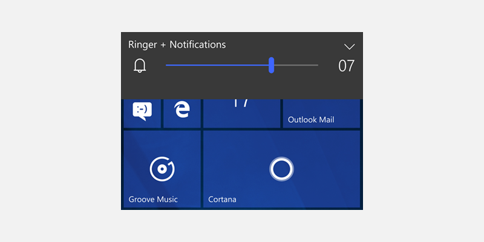
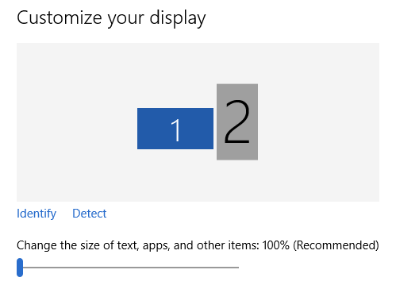

# Sliders

<link rel="stylesheet" href="https://az835927.vo.msecnd.net/sites/uwp/Resources/css/custom.css"> 

A slider is a control that lets the user select from a range of values by moving a thumb control along a track.

> **Important APIs**: [Slider class](https://msdn.microsoft.com/library/windows/apps/windows.ui.xaml.controls.slider.aspx), [Value property](https://msdn.microsoft.com/library/windows/apps/windows.ui.xaml.controls.primitives.rangebase.value.aspx), [ValueChanged event](https://msdn.microsoft.com/library/windows/apps/windows.ui.xaml.controls.primitives.rangebase.valuechanged.aspx)


## Is this the right control?

Use a slider when you want your users to be able to set defined, contiguous values (such as volume or brightness) or a range of discrete values (such as screen resolution settings).

A slider is a good choice when you know that users think of the value as a relative quantity, not a numeric value. For example, users think about setting their audio volume to low or medium—not about setting the value to 2 or 5.

Don't use a slider for binary settings. Use a [toggle switch](toggles.md) instead.

Here are some additional factors to consider when deciding whether to use a slider:

-   **Does the setting seem like a relative quantity?** If not, use [radio buttons](radio-button.md) or a [list box](lists.md).
-   **Is the setting an exact, known numeric value?** If so, use a numeric [text box](text-box.md).
-   **Would a user benefit from instant feedback on the effect of setting changes?** If so, use a slider. For example, users can choose a color more easily by immediately seeing the effect of changes to hue, saturation, or luminosity values.
-   **Does the setting have a range of four or more values?** If not, use [radio buttons](radio-button.md).
-   **Can the user change the value?** Sliders are for user interaction. If a user can't ever change the value, use read-only text instead.

If you are deciding between a slider and a numeric text box, use a numeric text box if:

-   Screen space is tight.
-   The user is likely to prefer using the keyboard.

Use a slider if:

-   Users will benefit from instant feedback.

## Examples

A slider to control the volume on Windows Phone.



A slider to change text size in Windows display settings.



## Create a slider

Here's how to create a slider in XAML.

```xaml
<Slider x:Name="volumeSlider" Header="Volume" Width="200"
        ValueChanged="Slider_ValueChanged"/>
```

Here's how to create a slider in code.

```csharp
Slider volumeSlider = new Slider();
volumeSlider.Header = "Volume";
volumeSlider.Width = 200;
volumeSlider.ValueChanged += Slider_ValueChanged;

// Add the slider to a parent container in the visual tree.
stackPanel1.Children.Add(volumeSlider);
```

You get and set the value of the slider from the [Value](https://msdn.microsoft.com/library/windows/apps/windows.ui.xaml.controls.primitives.rangebase.value.aspx) property. To respond to value changes, you can use data binding to bind to the Value property, or handle the [ValueChanged](https://msdn.microsoft.com/library/windows/apps/windows.ui.xaml.controls.primitives.rangebase.valuechanged.aspx) event.

```csharp
private void Slider_ValueChanged(object sender, RangeBaseValueChangedEventArgs e)
{
    Slider slider = sender as Slider;
    if (slider != null)
    {
        media.Volume = slider.Value;
    }
}
```

## Recommendations

-   Size the control so that users can easily set the value they want. For settings with discrete values, make sure the user can easily select any value using the mouse. Make sure the endpoints of the slider always fit within the bounds of a view.
-   Give immediate feedback while or after a user makes a selection (when practical). For example, the Windows volume control beeps to indicate the selected audio volume.
-   Use labels to show the range of values. Exception: If the slider is vertically oriented and the top label is Maximum, High, More, or equivalent, you can omit the other labels because the meaning is clear.
-   Disable all associated labels or feedback visuals when you disable the slider.
-   Consider the direction of text when setting the flow direction and/or orientation of your slider. Script flows from left to right in some languages, and from right to left in others.
-   Don't use a slider as a progress indicator.
-   Don't change the size of the slider thumb from the default size.
-   Don't create a continuous slider if the range of values is large and users will most likely select one of several representative values from the range. Instead, use those values as the only steps allowed. For example if time value might be up to 1 month but users only need to pick from 1 minute, 1 hour, 1 day or 1 month, then create a slider with only 4 step points.

## Additional usage guidance

### Choosing the right layout: horizontal or vertical

You can orient your slider horizontally or vertically. Use these guidelines to determine which layout to use.

-   Use a natural orientation. For example, if the slider represents a real-world value that is normally shown vertically (such as temperature), use a vertical orientation.
-   If the control is used to seek within media, like in a video app, use a horizontal orientation.
-   When using a slider in page that can be panned in one direction (horizontally or vertically), use a different orientation for the slider than the panning direction. Otherwise, users might swipe the slider and change its value accidentally when they try to pan the page.
-   If you're still not sure which orientation to use, use the one that best fits your page layout.

### Range direction

The range direction is the direction you move the slider when you slide it from its current value to its max value.

-   For vertical slider, put the largest value at the top of the slider, regardless of reading direction. For example, for a volume slider, always put the maximum volume setting at the top of the slider. For other types of values (such as days of the week), follow the reading direction of the page.
-   For horizontal styles, put the lower value on the left side of the slider for left-to-right page layout, and on the right for right-to-left page layout.
-   The one exception to the previous guideline is for media seek bars: always put the lower value on the left side of the slider.

### Steps and tick marks

-   Use step points if you don't want the slider to allow arbitrary values between min and max. For example, if you use a slider to specify the number of movie tickets to buy, don't allow floating point values. Give it a step value of 1.
-   If you specify steps (also known as snap points), make sure that the final step aligns to the slider's max value.
-   Use tick marks when you want to show users the location of major or significant values. For example, a slider that controls a zoom might have tick marks for 50%, 100%, and 200%.
-   Show tick marks when users need to know the approximate value of the setting.
-   Show tick marks and a value label when users need to know the exact value of the setting they choose, without interacting with the control. Otherwise, they can use the value tooltip to see the exact value.
-   Always show tick marks when step points aren't obvious. For example, if the slider is 200 pixels wide and has 200 snap points, you can hide the tick marks because users won't notice the snapping behavior. But if there are only 10 snap points, show tick marks.

### Labels

-   **Slider labels**

    The slider label indicates what the slider is used for.

    -   Use a label with no ending punctuation (this is the convention for all control labels).
    -   Position labels above the slider when the slider is in a form that places most of its labels above their controls.
    -   Position labels to the sides when the slider is in a form that places most of its labels to the side of their controls.
    -   Avoid placing labels below the slider because the user's finger might occlude the label when the user touches the slider.
-   **Range labels**

    The range, or fill, labels describe the slider's minimum and maximum values.

    -   Label the two ends of the slider range, unless a vertical orientation makes this unnecessary.
    -   Use only one word, if possible, for each label.
    -   Don't use ending punctuation.
    -   Make sure these labels are descriptive and parallel. Examples: Maximum/Minimum, More/Less, Low/High, Soft/Loud.
-   **Value labels**

    A value label displays the current value of the slider.

    -   If you need a value label, display it below the slider.
    -   Center the text relative to the control and include the units (such as pixels).
    -   Since the slider’s thumb is covered during scrubbing, consider showing the current value some other way, with a label or other visual. A slider setting text size could render some sample text of the right size beside the slider.

### Appearance and interaction

A slider is composed of a track and a thumb. The track is a bar (which can optionally show various styles of tick marks) representing the range of values that can be input. The thumb is a selector, which the user can position by either tapping the track or by scrubbing back and forth on it.

A slider has a large touch target. To maintain touch accessibility, a slider should be positioned far enough away from the edge of the display.

When you’re designing a custom slider, consider ways to present all the necessary info to the user with as little clutter as possible. Use a value label if a user needs to know the units in order to understand the setting; find creative ways to represent these values graphically. A slider that controls volume, for example, could display a speaker graphic without sound waves at the minimum end of the slider, and a speaker graphic with sound waves at the maximum end.

## Related topics
- [Toggle switches](toggles.md)
- [Slider class](https://msdn.microsoft.com/library/windows/apps/br209614)
