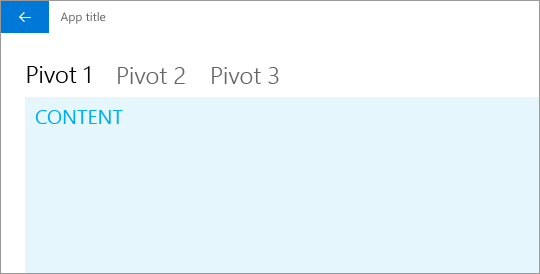
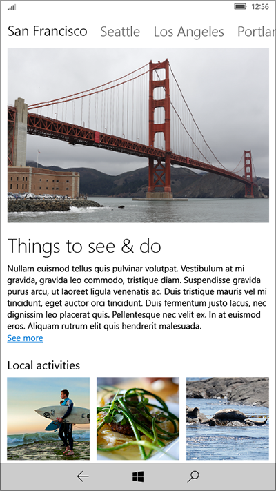
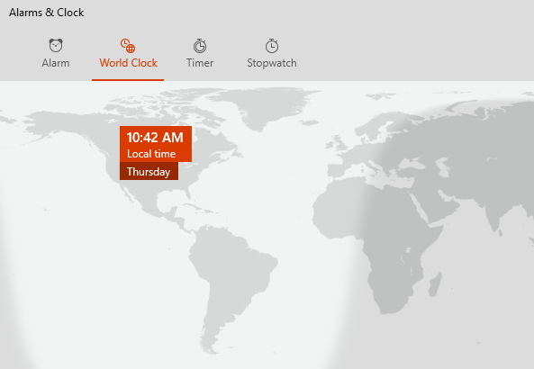
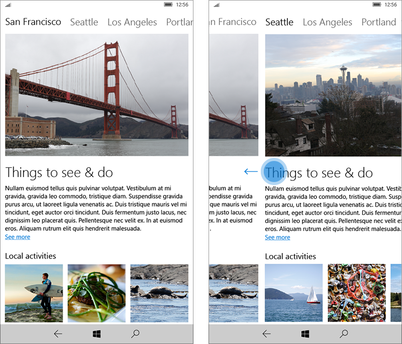

# Pivot and tabs

<link rel="stylesheet" href="https://az835927.vo.msecnd.net/sites/uwp/Resources/css/custom.css">

The Pivot control and related tabs pattern are used for navigating frequently accessed, distinct content categories. Pivots allow for navigation between two or more content panes and relies on text headers to articulate the different sections of content.



Tabs are a visual variant of Pivot that use a combination of icons and text or just icons to articulate section content. Tabs are built using the [**Pivot**](https://msdn.microsoft.com/library/windows/apps/xaml/windows.ui.xaml.controls.pivot.aspx) control. The [**Pivot sample**](http://go.microsoft.com/fwlink/p/?LinkId=619903) shows how to customize the Pivot control into the tabs pattern.

<div class="important-apis" >
<b>Important APIs</b><br/>
<ul>
<li>[**Pivot class**](https://msdn.microsoft.com/library/windows/apps/dn608241)</li>
</ul>
</div>


## The pivot pattern

When building an app with pivot, there are a few key design variables to consider.

- **Header labels.**  Headers can have an icon with text, icon only, or text only.
- **Header alignment.**  Headers can be left-justified or centered.
- **Top-level or sub-level navigation.**  Pivots can be used for either level of navigation. Optionally, [navigation pane](nav-pane.md) can serve as the primary level with pivot acting as secondary.
- **Touch gesture support.**  For devices that support touch gestures, you can use one of two interaction sets to navigate between content categories:
    1. Tap on a tab/pivot header to navigate to that category.
    2. Swipe left or right on the content area to navigate to the adjacent category.

## Examples

Pivot control on phone.



Tabs pattern in the Alarms & Clock app.



## Create a pivot control

The [**Pivot**](https://msdn.microsoft.com/library/windows/apps/xaml/windows.ui.xaml.controls.pivot.aspx) control comes with the basic functionality described in this section.

This XAML creates a basic pivot control with 3 sections of content.

```xaml
<Pivot x:Name="rootPivot" Title="Pivot Title">
    <PivotItem Header="Pivot Item 1">
        <!--Pivot content goes here-->
        <TextBlock Text="Content of pivot item 1."/>
    </PivotItem>
    <PivotItem Header="Pivot Item 2">
        <!--Pivot content goes here-->
        <TextBlock Text="Content of pivot item 2."/>
    </PivotItem>
    <PivotItem Header="Pivot Item 3">
        <!--Pivot content goes here-->
        <TextBlock Text="Content of pivot item 3."/>
    </PivotItem>
</Pivot>
```

### Pivot items

Pivot is an [**ItemsControl**](https://msdn.microsoft.com/library/windows/apps/xaml/windows.ui.xaml.controls.itemscontrol.aspx), so it can contain a collection of items of any type. Any item you add to the Pivot that is not explicitly a [**PivotItem**](https://msdn.microsoft.com/library/windows/apps/xaml/windows.ui.xaml.controls.pivotitem.aspx) is implicitly wrapped in a PivotItem. Because a Pivot is often used to navigate between pages of content, it's common to populate the [**Items**](https://msdn.microsoft.com/library/windows/apps/xaml/windows.ui.xaml.controls.itemscontrol.items.aspx) collection directly with XAML UI elements. Or, you can set the [**ItemsSource**](https://msdn.microsoft.com/library/windows/apps/xaml/windows.ui.xaml.controls.itemscontrol.itemssource.aspx) property to a data source. Items bound in the ItemsSource can be of any type, but if they aren't explicitly PivotItems, you must define an [**ItemTemplate**](https://msdn.microsoft.com/library/windows/apps/xaml/windows.ui.xaml.controls.itemscontrol.itemtemplate.aspx) and [**HeaderTemplate**](https://msdn.microsoft.com/library/windows/apps/xaml/windows.ui.xaml.controls.pivot.headertemplate.aspx) to specify how the items are displayed.

You can use the [**SelectedItem**](https://msdn.microsoft.com/library/windows/apps/xaml/windows.ui.xaml.controls.pivot.selecteditem.aspx) property to get or set the Pivot's active item. Use the [**SelectedIndex**](https://msdn.microsoft.com/library/windows/apps/xaml/windows.ui.xaml.controls.pivot.selectedindex.aspx) property to get or set the index of the active item.

### Pivot headers

You can use the [**LeftHeader**](https://msdn.microsoft.com/library/windows/apps/xaml/windows.ui.xaml.controls.pivot.leftheader.aspx) and [**RightHeader**](https://msdn.microsoft.com/library/windows/apps/xaml/windows.ui.xaml.controls.pivot.rightheader.aspx) properties to add other controls to the Pivot header.

### Pivot interaction

The control features these touch gesture interactions:

-   Tapping on a pivot item header navigates to that header's section content.
-   Swiping left or right on a pivot item header navigates to the adjacent section.
-   Swiping left or right on section content navigates to the adjacent section.


The control comes in two modes:

**Stationary**

-   Pivots are stationary when all pivot headers fit within the allowed space.
-   Tapping on a pivot label navigates to the corresponding page, though the pivot itself will not move. The active pivot is highlighted.

> Note&nbsp;&nbsp; Pivot headers should not carousel in a [10ft environment](../input-and-devices/designing-for-tv.md). Set the [**IsHeaderItemsCarouselEnabled**](https://docs.microsoft.com/uwp/api/Windows.UI.Xaml.Controls.Pivot#Windows_UI_Xaml_Controls_Pivot_IsHeaderItemsCarouselEnabled) property to **false** if your app will run on Xbox.


**Carousel**

-   Pivots carousel when all pivot headers don't fit within the allowed space.
-   Tapping a pivot label navigates to the corresponding page, and the active pivot label will carousel into the first position.
-   Pivot items in a carousel loop from last to first pivot section.

### Pivot focus

By default, keyboard focus on a pivot header is represented with an underline.


Apps that have customized Pivot and incorporate the underline into header selection visuals can use the [HeaderFocusVisualPlacement](https://docs.microsoft.com/uwp/api/windows.ui.xaml.controls.pivot#Windows_UI_Xaml_Controls_Pivot_HeaderFocusVisualPlacement) property to change the default. When `HeaderFocusVisualPlacement="ItemHeaders"`, focus will be drawn around the entire header panel.


## Recommendations

-   Base the alignment of tab/pivot headers on screen size. For screen widths below 720 epx, center-aligning usually works better, while left-aligning for screen widths above 720 epx is recommended in most cases.
-   Avoid using more than 5 headers when using carousel (round-trip) mode, as looping more than 5 can become confusing.
-   Use the tabs pattern only if your pivot items have distinct icons.
-   Include text in pivot item headers to help users understand the meaning of each pivot section. Icons are not necessarily self-explanatory to all users.

## Get the sample code
- [Pivot sample](http://go.microsoft.com/fwlink/p/?LinkId=619903)<br/>
    See how to customize the Pivot control into the tabs pattern.
- [XAML UI basics sample](https://github.com/Microsoft/Windows-universal-samples/blob/master/Samples/XamlUIBasics)<br/>
    See all of the XAML controls in an interactive format.

## Related topics
- [Navigation design basics](../layout/navigation-basics.md)
